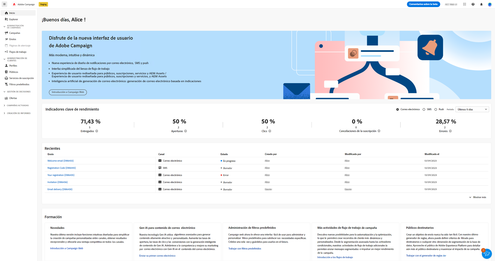
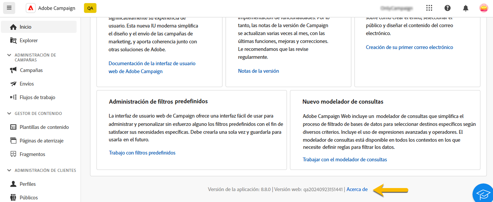
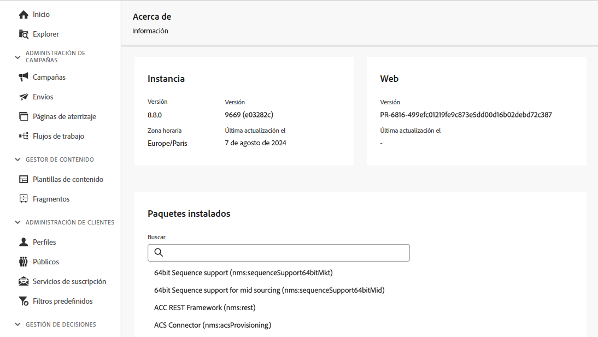
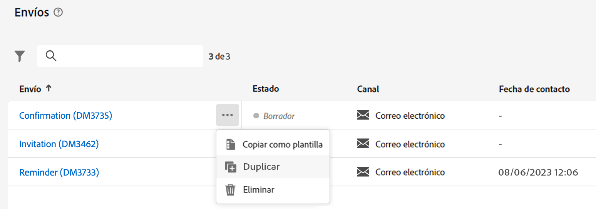

# Descubra la interfaz {#user-interface}

La nueva interfaz web de Adobe Campaign proporciona una experiencia de usuario moderna e intuitiva para simplificar el diseño y el envío de las campañas de marketing. Esta interfaz está integrada con las aplicaciones y soluciones de Adobe Experience Cloud.

Aprenda a conectarse a Adobe Campaign y explore los conceptos básicos de navegación de Experience Cloud [en este artículo](connect-to-campaign.md).

>[!NOTE]
>
>Esta documentación se actualiza frecuentemente para reflejar los cambios recientes en la interfaz de usuario del producto. Sin embargo, algunas capturas de pantalla pueden diferir ligeramente de la interfaz de usuario.

## Página de inicio de Campaign {#user-interface-home}

>[!CONTEXTUALHELP]
>id="acw_homepage_recent"
>title="Recientes"
>abstract="La lista **Recientes** proporciona accesos directos a los envíos creados y modificados recientemente. Esta lista muestra su canal, estado, propietario y fechas de creación y modificación."

La página de inicio de Campaign permite examinar rápida y fácilmente recursos, indicadores y componentes clave.

La sección superior de la página de inicio muestra detalles sobre las últimas actualizaciones y las nuevas funcionalidades disponibles en el producto, con vínculos a las Notas de la versión y documentación detallada. Utilice la flecha izquierda para desplazarse por las tarjetas de características.

{zoomable="yes"}

Los **indicadores clave de rendimiento** le permiten comprobar la eficacia de la plataforma mediante indicadores clave de rendimiento (KPI) frecuentes. Obtenga más información acerca de los indicadores clave de rendimiento (KPI) en [esta página](../reporting/kpis.md).

La lista **Recientes** proporciona accesos directos a los envíos creados y modificados recientemente. Esta lista muestra su canal, estado, propietario y fechas de creación y modificación. Haga clic en el vínculo **Mostrar más** para cargar más envíos.

Además, puede acceder a las páginas web de ayuda principales de Adobe Campaign desde la sección **Aprendizaje** de la página.

### Acerca del vínculo {#user-interface-about}

>[!CONTEXTUALHELP]
>id="acw_about"
>title="Página Acerca de"
>abstract="La página Acerca ofrece detalles sobre la instancia de Adobe Campaign"

>[!CONTEXTUALHELP]
>id="acw_about_instance"
>title="Acerca de Instancia"
>abstract="En la sección Instancia se ofrece información clave sobre el cliente de la consola, incluida la versión y el número de compilación asociado."

>[!CONTEXTUALHELP]
>id="acw_about_web"
>title="Acerca de Web"
>abstract="La sección Web muestra la versión de la interfaz de usuario web de Campaign, con la última fecha de actualización de la misma, si está disponible."

>[!CONTEXTUALHELP]
>id="acw_about_packages"
>title="Acerca de Paquetes instalados"
>abstract="La sección Paquetes instalados enumera todos los módulos, funciones e integraciones presentes en la instancia."

En la parte inferior de la página, el vínculo **[!UICONTROL Acerca de]** proporciona detalles acerca de su instancia de Adobe Campaign. Estos detalles están en modo de solo lectura.

{zoomable="yes"}

La sección **Instancia** suministra información clave sobre su cliente de consola, incluidos la **versión** y el número de **compilación** asociado.

* La **versión** hace referencia a la versión oficial que está utilizando.
* La **compilación** hace referencia a una iteración específica de esa versión.

Tanto los números de versión como los de compilación son esenciales para la resolución de problemas, ya que ayudan a determinar qué funciones y correcciones están presentes en su entorno.

La sección **web** muestra la versión de la interfaz de usuario web de Campaign, con la última fecha de actualización, si está disponible. Esto le ayuda a realizar un seguimiento de los cambios o mejoras realizados en la interfaz de usuario web de Campaign.

La sección **Paquetes instalados** muestra todos los módulos, características e integraciones presentes en su instancia. Estos paquetes amplían la funcionalidad de Adobe Campaign, lo que permite realizar tareas especializadas como la integración con otras soluciones de Adobe o la compatibilidad con flujos de trabajo específicos. Dado el gran número de paquetes, puede realizar una búsqueda dentro de esta sección para comprobar rápidamente si hay un módulo en particular instalado en la instancia.

{zoomable="yes"}

## Menú de navegación izquierdo {#user-interface-left-nav}

Examine los vínculos de la izquierda para acceder a las funcionalidades de Adobe Campaign Web. Varios vínculos muestran listas de objetos que se pueden ordenar y filtrar. También puede configurar columnas para que muestren toda la información que necesite. Consulte esta [sección](#list-screens). Algunas pantallas de lista son de solo lectura. Los elementos mostrados en el menú de navegación de la izquierda dependen de los permisos de usuario. Puede obtener más información sobre permisos en [esta sección](permissions.md).

### Explorer {#user-interface-explorer}

>[!CONTEXTUALHELP]
>id="acw_explorer"
>title="Explorer"
>abstract="El menú **Explorer** muestra todos los componentes y objetos de Campaign con la misma jerarquía de carpetas que la de la consola del cliente. Examine todos los componentes, carpetas y esquemas de la versión 8 de Campaign, compruebe los permisos asociados y cree carpetas y subcarpetas desde este menú."

El menú **Explorer** muestra todos los recursos y objetos de Campaign con la misma jerarquía de carpetas que la consola del cliente. Examine todos los componentes, carpetas y esquemas de la versión 8 de Campaign, y cree envíos, flujos de trabajo y campañas.

Los elementos mostrados en **Explorer** dependen de los permisos de usuario. También puede agregar carpetas y subcarpetas, si tiene los derechos adecuados. Puede obtener más información sobre permisos en [esta sección](permissions.md).

Puede configurar columnas para personalizar la visualización y ver toda la información que necesite. Consulte esta [sección](#list-screens). También puede agregar carpetas y subcarpetas, tal como se detalla en [esta sección](permissions.md#folders).

Para obtener más información sobre Campaign Explorer, la jerarquía de carpetas y los recursos, consulte la [documentación de la versión 8 de Campaign (consola)](https://experienceleague.adobe.com/docs/campaign/campaign-v8/new/campaign-ui.html?lang=es#ac-explorer-ui){target="_blank"}.

### Administración de campañas {#user-interface-campaign-management}

En la sección **Administración de campañas**, puede acceder a campañas de marketing, envíos y flujos de trabajo.

* **Campañas**: esta es la lista de sus campañas y plantillas de campaña. De forma predeterminada, para cada campaña se pueden ver las fechas de inicio, finalización, creación y última modificación, el estado actual y el nombre del operador de Campaign que la creó. Puede filtrar la lista por estado, fechas de inicio/finalización, carpeta o crear un filtro avanzado para definir sus propios criterios de filtrado. Obtenga más información acerca de las campañas de [en esta sección](../campaigns/gs-campaigns.md).

* **Envíos**: examine la lista de envíos. De forma predeterminada, puede ver su estado, la fecha de la última modificación y los KPI principales. Puede filtrar la lista por estado, fecha de contacto o canal. Haga clic en un envío de correo electrónico para abrir el panel de control y obtener una descripción general de los detalles del envío. Los envíos en otros canales son de solo lectura. Puede obtener más información sobre los envíos [en esta sección](../msg/gs-messages.md).

  Utilice el botón **Más acciones** para eliminar o duplicar un envío.

  {zoomable="yes"}{width="70%" align="left"}[Captura de pantalla que muestra botón de Más acciones con opciones para eliminar o duplicar un envío.]

* **Flujos de trabajo**: en esta pantalla, puede acceder a la lista completa de flujos de trabajo y plantillas de flujo de trabajo. Puede comprobar su estado, las fechas de última/siguiente ejecución y crear un nuevo flujo de trabajo o una nueva plantilla de flujo de trabajo. Puede filtrar la lista con los mismos criterios que para otros objetos. Además, puede filtrar los flujos de trabajo que pertenecen o no a una campaña. Puede obtener más información sobre los flujos de trabajo [en esta sección](../workflows/gs-workflows.md).

### Administración de contenido {#user-interface-content-management}

En la sección **Administración de contenido**, puede ver las plantillas y fragmentos de contenido.

* **Plantillas de contenido**: para un proceso de diseño acelerado y mejorado, puede crear plantillas independientes para reutilizar fácilmente el contenido personalizado en [!DNL Adobe Campaign]. Esta funcionalidad, que solo está disponible para correos electrónicos, permite a los usuarios orientados a contenido trabajar en plantillas independientes para que los usuarios de marketing puedan reutilizarlas y adaptarlas dentro de sus propias campañas de correo electrónico. Obtenga más información en [esta sección](../content/create-email-templates.md).

* **Fragmentos**: un fragmento es un componente reutilizable al que se puede hacer referencia en uno o varios envíos de distintas campañas. Al modificar un fragmento, se actualiza todo el contenido que lo utiliza. [Aprenda a trabajar con fragmentos](../content/fragments.md)

Esta funcionalidad se utiliza para la construcción previa de múltiples bloques de contenido personalizado que los usuarios de marketing pueden utilizar para combinar rápidamente los contenidos de correo electrónico en un proceso de diseño mejorado.

### Administración de clientes {#user-interface-customer-management}

En la sección **Administración de clientes**, puede ver los perfiles, los públicos y las suscripciones. Estas listas son de solo lectura.

* **Perfiles**: cree y administre perfiles, y acceda a la base de datos de destinatarios. De forma predeterminada, puede ver su dirección de correo electrónico, nombre y apellidos. Más información sobre perfiles en [esta sección](../audience/about-recipients.md).
* **Públicos**: esta es su lista de públicos. De forma predeterminada, puede ver su tipo, origen, creación, fechas de última modificación y etiqueta. Puede filtrar la lista por origen. Obtenga más información sobre públicos y listas en [esta sección](../audience/about-recipients.md).
* **Servicios de suscripciones**: examine las listas de suscripciones. De manera predeterminada, puede ver su tipo, modo y etiqueta. Obtenga información sobre cómo administrar suscripciones y bajas en [Documentación de la versión 8 de Adobe Campaign (consola)](https://experienceleague.adobe.com/docs/campaign/campaign-v8/campaigns/send/subscriptions.html?lang=es){target="_blank"}.
* **Filtros predefinidos**: los filtros predefinidos son filtros personalizados que se crean y guardan para que estén disponibles para su uso futuro. Se pueden utilizar como accesos directos durante cualquier operación de filtrado con el modelador de consultas, por ejemplo, al filtrar una lista de datos o crear el público de un envío. Obtenga más información en [esta sección](predefined-filters.md).

### Gestión de decisiones {#decision-management}

>[!CONTEXTUALHELP]
>id="acw_offers_list"
>title="Ofertas"
>abstract="Examine las listas de ofertas y las plantillas de ofertas que se han creado en la consola utilizando el módulo **Interacción**. Estas listas son de solo lectura."
>additional-url="https://experienceleague.adobe.com/docs/campaign-web/v8/msg/offers.html?lang=es" text="Adición de ofertas a un envío"

En la sección **Gestión de decisiones**, puede ver las ofertas y sus plantillas. Estas listas son de solo lectura.

* **Ofertas**: examine la lista de ofertas y sus plantillas que se han creado en la consola con el módulo **Interacción**. De forma predeterminada, puede ver su estado, fechas de inicio/finalización y entorno. Puede filtrar la lista por estado y fechas de inicio/finalización. También están disponibles las plantillas de oferta.

Obtenga información sobre cómo crear y enviar ofertas en correos electrónicos y SMS en [esta sección](../msg/offers.md).

### Creación de informes {#left-nav-reporting}

* **Informes**: la entrada **Informe** ofrece un resumen general consolidado de las métricas de tráfico y participación de cada canal dentro del entorno de Campaign. Estos informes constan de varios widgets, cada uno de los cuales ofrece una perspectiva distinta sobre el rendimiento de la campaña o del envío. Obtenga más información en [esta sección](../reporting/global-reports.md).

### Administración {#left-nav-admin}

* **Pista de auditoría**: la entrada **Pista de auditoría** ofrece a los usuarios una visibilidad completa de todas las modificaciones realizadas en entidades importantes dentro de la instancia, normalmente aquellas que tienen un impacto significativo en el buen funcionamiento de la instancia. [Más información](../reporting/audit-trail.md).

* **Cuentas externas**: cree nuevas cuentas externas usando la interfaz de usuario web para satisfacer sus necesidades específicas y garantizar transferencias de datos sin problemas. [Más información](../administration/external-account.md).

* **Esquemas**: los campos personalizados son atributos adicionales añadidos a los esquemas predeterminados a través de la consola de Adobe Campaign. [Más información](../administration/custom-fields.md).

<!--* **Delivery Alerting** - Delivery Alerting is an alert management system that enables groups of users to automatically receive email notifications with information on their delivery executions. [Learn more](../msg/delivery-alerting.md).-->

## Más información {#learn-more}

Obtenga información sobre cómo examinar, buscar y filtrar listas disponibles en su entorno de Campaign [en esta página](list-filters.md).

<!--CONTEXTUAL HELP TO DISPATCH IN DOCS ONCE FEATURE LIVE-->

>[!CONTEXTUALHELP]
>id="acw_orchestration_notification"
>title="Envío continuo"
>abstract="Envío continuo"
