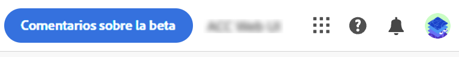
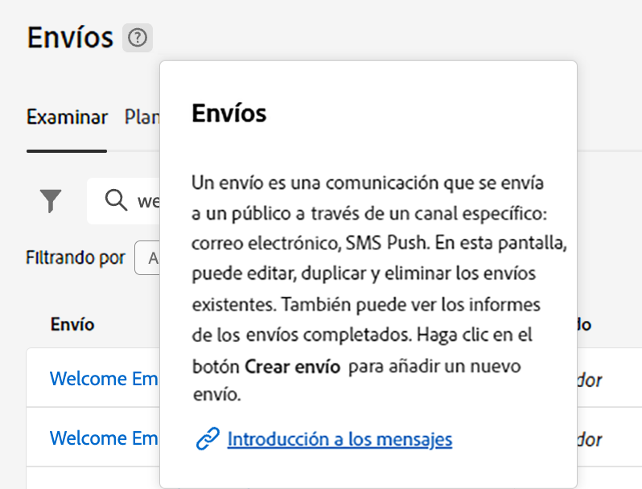

# Descubra la interfaz {#user-interface}

>[!CONTEXTUALHELP]
>id="acw_homepage_learnmore"
>title="Descubra la interfaz"
>abstract="La nueva interfaz web de Campaign v8 ofrece una experiencia del usuario integrada, intuitiva y coherente."

La nueva interfaz de la web de la versión 8 de Campaign ofrece una experiencia de usuario moderna e intuitiva para simplificar el diseño y el envío de las campañas de marketing. Esta nueva interfaz está integrada con las aplicaciones y soluciones de Adobe Experience Cloud.

>[!NOTE]
>
>Esta documentación se actualiza frecuentemente para reflejar los cambios recientes en la interfaz de usuario del producto. Sin embargo, algunas capturas de pantalla pueden diferir ligeramente de la interfaz de usuario.

## Menú de navegación izquierdo {#user-interface-left-nav}

Examine los vínculos de la izquierda para acceder a las funciones de la web de la versión 8 de Campaign. Varios vínculos muestran listas de objetos que se pueden ordenar y filtrar. También puede configurar columnas para que muestren toda la información que necesite. Consulte esta [sección](#list-screens). Algunas pantallas de lista son de solo lectura. Los elementos mostrados en el menú de navegación de la izquierda y en las listas dependen de los permisos de usuario. Más información sobre los permisos en [esta sección](permissions.md).

### Inicio {#user-interface-home}

Esta pantalla incluye vínculos y recursos clave para el acceso rápido a las funciones web principales de la versión 8 de Campaign.

La lista **Recientes** proporciona accesos directos a los envíos creados y modificados recientemente. Esta lista muestra sus fechas de canal, estado, propietario, creación y modificación.

Los **indicadores clave de rendimiento** le permiten comprobar la eficacia de la plataforma mediante indicadores clave de rendimiento (KPI) frecuentes. Obtenga más información acerca de estos KPI en [esta página](../reporting/kpis.md).

Acceda a las páginas de ayuda principales de la web de Campaign v8 Web desde la sección **Aprendizaje** de la página principal.

### Explorer {#user-interface-explorer}

>[!CONTEXTUALHELP]
>id="acw_explorer"
>title="Explorer"
>abstract="El menú **Explorer** muestra todos los componentes y objetos de Campaign con la misma jerarquía de carpetas que la de la consola del cliente. Examine todos los componentes, carpetas y esquemas de Campaign v8, compruebe los permisos asociados y cree carpetas y subcarpetas desde este menú."

El menú **Explorer** muestra todos los recursos y objetos de Campaign con la misma jerarquía de carpetas que la consola del cliente. Examine todos los componentes, carpetas y esquemas de Campaign v8 y cree envíos, flujos de trabajo y campañas.

Los elementos mostrados en la **Explorer** dependen de los permisos de usuario.  También puede agregar carpetas y subcarpetas, si tiene los permisos adecuados. Más información sobre los permisos en [esta sección](permissions.md).

Como en cualquier pantalla de lista, puede configurar columnas para personalizar la visualización y ver toda la información que necesite. Consulte esta [sección](#list-screens).

Para obtener más información sobre Campaign Explorer, la jerarquía de carpetas y los recursos, consulte esta sección [Documentación de Campaign v8 (consola)](https://experienceleague.adobe.com/docs/campaign/campaign-v8/new/campaign-ui.html?lang=es#ac-explorer-ui){target="_blank"}.

### Administración de campañas {#user-interface-campaign-management}

En la sección ADMINISTRACIÓN DE CAMPAÑAS, puede acceder a campañas de marketing, envíos y flujos de trabajo.

* **Campañas**: esta es la lista de sus campañas y plantillas de campaña. De forma predeterminada, para cada campaña se pueden ver las fechas de inicio, finalización, creación y última modificación, el estado actual y el nombre del operador de Campaign que la creó. Puede filtrar la lista por estado, fechas de inicio/finalización, carpeta o crear un filtro avanzado para definir sus propios criterios de filtrado. Obtenga más información acerca de las campañas de [en esta sección](../campaigns/gs-campaigns.md).

* **Envíos**: examine la lista de envíos. De forma predeterminada, puede ver su estado, la fecha de la última modificación y los KPI principales. Puede filtrar la lista por estado, fecha de contacto o canal. Haga clic en un envío de correo electrónico para abrir el panel y obtener una descripción general de los detalles del envío. Los envíos en otros canales son de solo lectura. Puede obtener más información sobre los envíos [en esta sección](../msg/gs-messages.md).

  Utilice el botón **Más acciones** para eliminar o duplicar un envío.

  {width="70%" align="left"}

* **Flujos de trabajo**: en esta pantalla, puede acceder a la lista completa de flujos de trabajo y plantillas de flujo de trabajo. Puede comprobar su estado, las fechas de última/siguiente ejecución y crear un nuevo flujo de trabajo o una nueva plantilla de flujo de trabajo. Puede filtrar la lista con los mismos criterios que para otros objetos. Además, puede filtrar los flujos de trabajo que pertenecen o no a una campaña. Puede obtener más información sobre los flujos de trabajo [en esta sección](../workflows/gs-workflows.md).

### Administración de clientes {#user-interface-customer-management}

En la sección ADMINISTRACIÓN DE CLIENTES, puede ver los destinatarios, los públicos destinatarios y las suscripciones. Estas listas son de solo lectura.

* **Destinatarios**: acceda a la base de datos de destinatarios. De forma predeterminada, puede ver su dirección de correo electrónico, nombre y apellidos. Más información sobre los destinatarios en [esta sección](../audience/about-recipients.md).
* **Audiencias**: esta es su lista de audiencias. De forma predeterminada, puede ver su tipo, origen, fechas de creación/última modificación y etiqueta. Puede filtrar la lista por origen. Obtenga más información acerca de audiencias y listas en [esta sección](../audience/about-audiences.md).
* **Suscripciones**: examine las listas de suscripciones. De manera predeterminada, puede ver su tipo, modo y etiqueta. Obtenga información sobre cómo administrar suscripciones y bajas en [Documentación de Adobe Campaign v8 (consola)](https://experienceleague.adobe.com/docs/campaign/campaign-v8/campaigns/send/subscriptions.html?lang=es){target="_blank"}.

### Gestión de decisiones

>[!CONTEXTUALHELP]
>id="acw_offers_list"
>title="Ofertas"
>abstract="Examine las listas de ofertas y las plantillas de ofertas que se han creado en la consola utilizando **Interacción** módulo. Estas listas son de solo lectura."
>additional-url="https://experienceleague.adobe.com/docs/campaign-web/v8/msg/offers.html" text="Adición de ofertas a una entrega"

En la sección CUSTOMER MANAGEMENT, puede ver las ofertas y las plantillas de ofertas. Estas listas son de solo lectura.

* **Ofertas** : Examine la lista de ofertas y las plantillas de ofertas que se han creado en la consola con el **Interacción** módulo. De forma predeterminada, puede ver su estado, fechas de inicio/finalización y entorno. Puede filtrar la lista por estado y fechas de inicio/finalización. También están disponibles las plantillas de oferta.

Obtenga información sobre cómo crear y enviar ofertas en correos electrónicos y SMS en [esta sección](../content/offers.md).

## Barra superior

Utilice la barra superior de la interfaz para lo siguiente:

* compartir sus comentarios como probador beta
* Cambiar entre organizaciones e instancias.
* Cambiar entre las aplicaciones de Adobe Experience Cloud.
* Acceder a páginas de ayuda, ponerse en contacto con el servicio de asistencia técnica y compartir comentarios. Puede buscar artículos de ayuda y vídeos desde el campo de búsqueda.

{width="50%" align="left"}
<!--
Org / Sub-org switcher to switch between instances. Only one for Alpha. Later: intermerdiate screen with Control Panel (beta). if v8 + ACS with one card per ACS instance. Maybe quickly explain the menu for Alpha?
-->

## Ayuda contextual {#user-interface-help}

Hay disponible una ayuda contextual en la interfaz. Cuando esté disponible, haga clic en el icono `?` para mostrar la información de ayuda y los vínculos de documentación relacionados.

{width="40%" align="left"}

Con la nueva versión beta, la **Asistente de conocimientos con Gen AI** la ayuda contextual integrada revoluciona la búsqueda de documentación y la respuesta a preguntas sobre procedimientos al examinar sin esfuerzo vastos repositorios de documentación y localizar al instante la información precisa que necesita.

Gracias a las capacidades de Campaign Gen AI, este asistente transforma su experiencia, lo que facilita la recuperación de información y la resolución de problemas. Tanto si busca orientación en una tarea compleja como si navega por documentos extensos, nuestro asistente de conocimientos con Gen AI es su mejor compañero, ya que proporciona una eficiencia y precisión inigualables en cada interacción.

Obtenga más información en [esta sección](using-ai.md).

## Navegadores admitidos {#browsers}

La web de la versión 8 de Campaign está diseñada para funcionar de forma óptima con la última versión de Google Chrome, Safari y Microsoft Edge. Es posible que tenga problemas al utilizar determinadas funciones en versiones anteriores u otros navegadores.

## Preferencias de idioma {#language-pref}

La web de la versión 8 de Campaign está disponible actualmente en los siguientes idiomas:

* Inglés (EE. UU.) - EN-US
* Francés - FR
* Alemán - DE
* Italiano - IT
* Español - ES
* Portugués (Brasil) - PTBR
* Japonés - JP
* Coreano - KR
* Chino simplificado - CHS
* Chino tradicional - CHT

El idioma predeterminado para Campaign Web viene determinado por el idioma preferido especificado en el perfil de usuario. No está relacionado con el idioma del servidor de Campaign y de la consola del cliente.

Para cambiar el idioma, haga lo siguiente:

1. Haga clic en el icono del perfil, en la parte superior derecha, y luego seleccione **Preferencias**.
1. A continuación, haga clic en el vínculo de idioma mostrado debajo de su dirección de correo electrónico.
1. Seleccione el idioma preferido y haga clic en **Guardar**. Puede seleccionar un segundo idioma en caso de que el componente que esté utilizando no esté localizado en su primer idioma.

## Tema oscuro {#dark-theme}

Puede cambiar al tema oscuro desde el icono de perfil. Utilice el **Tema oscuro** marque esta opción para habilitarla o deshabilitarla.

## Más información {#learn-more}

Obtenga información sobre cómo examinar, buscar y filtrar listas disponibles en su entorno de Campaign [en esta página](list-filters.md).

<!--
######## This part stores the contextualHelp definition for WebUI BETA ###########
######## These blocks should be dispatched in the appropriate pages when available ###########
######## PLEASE DO NOT DELETE ###########
REFER TO 
https://wiki.corp.adobe.com/pages/viewpage.action?spaceKey=neolane&title=v8+WebUI+Contextual+Help+%3CALPHA%3E-+Official+list
-->

>[!CONTEXTUALHELP]
>id="acw_targetdata_personalization_enrichmentdata"
>title="Datos de enriquecimiento"
>abstract="Por determinar"

>[!CONTEXTUALHELP]
>id="acw_push_permission_for_segment"
>title="Permiso obligatorio"
>abstract="El administrador debe concederle permiso para poder crear un segmento."

>[!CONTEXTUALHELP]
>id="acw_push_overview_edit"
>title="Permiso obligatorio"
>abstract="El administrador debe concederle permiso para poder crear un segmento."

<!-- Workflows-->

<!-- delivery template settings-->

>[!CONTEXTUALHELP]
>id="acw_reporting_email_exportation"
>title="Exportación"
>abstract="Solo puede exportar la página seleccionada."

>[!CONTEXTUALHELP]
>id="acw_global_reporting_sending"
>title="Envío de informes globales"
>abstract="Las métricas de informes de seguimiento se pueden ver en esta pantalla"

>[!CONTEXTUALHELP]
>id="acw_global_reporting_tracking"
>title="Seguimiento de informes globales"
>abstract="Las métricas de informes de seguimiento se pueden ver en esta pantalla"

>[!CONTEXTUALHELP]
>id="acw_campaign_workflow_list"
>title="Lista de flujos de trabajo de una campaña"
>abstract="Lista de flujos de trabajo de una campaña"

<!-- delivery settings-->

