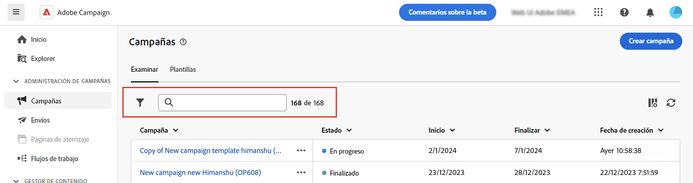

# Descubra la interfaz {#user-interface}

>[!CONTEXTUALHELP]
>id="acw_homepage_learnmore"
>title="Descubra la interfaz"
>abstract="La nueva interfaz web de Campaign v8 ofrece una experiencia de usuario integrada, intuitiva y coherente."

La nueva interfaz de la web de la versión 8 de Campaign ofrece una experiencia de usuario moderna e intuitiva para simplificar el diseño y el envío de las campañas de marketing. Esta nueva interfaz está integrada con Adobe Experience Platform.

<!--
Key concepts when browsing the user interface are common with Adobe Experience Platform. Refer to [Adobe Experience Platform documentation](https://experienceleague.adobe.com/docs/experience-platform/landing/platform-ui/ui-guide.html#adobe-experience-platform-ui-guide) for more details.
-->

>[!NOTE]
>
>Esta documentación se actualiza frecuentemente para reflejar los cambios recientes en la interfaz de usuario del producto. Sin embargo, algunas capturas de pantalla pueden diferir ligeramente de la interfaz de usuario.

<!--
* console + web interface (overview, why use each of them)
* web UI made up of read-only lists that can be configured, show how to add columns
-->

## Menú de navegación izquierdo

Examine los vínculos de la izquierda para acceder a las funciones de la web de la versión 8 de Campaign. Varios vínculos muestran listas de objetos que se pueden ordenar y filtrar. También puede configurar columnas para que muestren toda la información que necesite. Consulte esta [sección](#list-screens). Todas las pantallas de lista son de solo lectura, excepto la lista de envío de correo electrónico. Hacer clic en cualquier elemento de la lista para su edición o visualización no está disponible en alfa. Todas las listas se podrán editar en versiones futuras. Los elementos mostrados en el menú de navegación de la izquierda dependen de los permisos de usuario.

### Inicio

Esta pantalla incluye vínculos y recursos clave para el acceso rápido a las funciones web principales de la versión 8 de Campaign. La lista **Recientes** proporciona accesos directos a los envíos creados y modificados recientemente. Esta lista muestra las fechas de creación y modificación y su estado.

<!--
* Banner
* KPIs on email channel (cross-deliveries): open rate, delivery rate, etc
* Recent items
* Learning cards
-->

Acceda a las páginas de ayuda principales de la web de la versión 8 de Campaign desde la sección inferior de la página principal.

<!--
show global KPIs, recent items + left menu to access features)
CONTROL PANEL not alpha
Global report not alpha
-->

### Explorer

>[!CONTEXTUALHELP]
>id="acw_explorer"
>title="Explorer"
>abstract="El menú **Explorer** muestra la misma jerarquía de carpetas que la de la consola del cliente. Examine todos los componentes, las carpetas y los esquemas de Campaign v8. Todas las pantallas de lista son de solo lectura, excepto la lista de envío de correo electrónico."

El menú **Explorer** muestra la misma jerarquía de carpetas que la de la consola del cliente. Examine todos los componentes, las carpetas y los esquemas de Campaign v8.

Los elementos mostrados en el Explorador dependen de los permisos de usuario.

Como en cualquier pantalla de lista, puede configurar columnas para personalizar la visualización y ver toda la información que necesite. Consulte esta [sección](#list-screens).

Para obtener más información sobre el explorador de Campaign, consulte esta [documentación](https://experienceleague.adobe.com/docs/campaign/campaign-v8/new/ac-ui/campaign-ui.html?lang=es#ac-explorer-ui){target="_blank"}.
<!--
Explorer' menu in web UI to navigate through console content: console navtree second view in addition to the left menu lists with filters. The Explorer gives the real folder hierarchy from the console. Make sure you find your deliveries in sub-folders. All lists can be accessed in read-only. No Create/Edit. You can configure lists (colums). All schema fields, linked tables are available. 

If you need to view your lists of recipients (age, gender), transactions or live transactional messages. To view each/edit -> console.

Navtree view depends on permissions (same as console).
-->

### Administración de campañas

>[!CONTEXTUALHELP]
>id="acw_campaigns_list"
>title="Campañas"
>abstract="Esta es la lista de sus campañas. Puede ver información útil, como las fechas de inicio/finalización/última modificación, así como su estado. Puede filtrar la lista por estado o fechas de inicio/finalización. Haga clic en el botón Create campaign para añadir una nueva campaña. Seleccione una campaña para ver su contenido, envíos y detalles. Vaya a la pestaña &quot;Plantillas&quot; para ver y crear plantillas."

>[!CONTEXTUALHELP]
>id="acw_deliveries_list"
>title="Envíos"
>abstract="Examine la lista de envíos. Puede ver su estado, las fechas de contacto y modificación, y los indicadores clave de rendimiento (KPI). Puede filtrar la lista por estado, fecha de contacto o canal. Haga clic en el botón &quot;Crear entrega&quot; para añadir una nueva entrega. Seleccione una entrega para ver su contenido, audiencia y detalles."

En la sección CAMPAIGN MANAGEMENT, puede acceder a campañas de marketing, envíos y flujos de trabajo.

* **Campañas** : Esta es la lista de sus campañas y plantillas de campaña. De forma predeterminada, para cada campaña se pueden ver las fechas de inicio, finalización, creación y última modificación, el estado actual y el nombre del operador de Campaign que la creó. Puede filtrar la lista por estado, fechas de inicio/finalización, carpeta o crear un filtro avanzado para definir sus propios criterios de filtrado.

* **Envíos**: examine la lista de envíos. De forma predeterminada, puede ver su estado, la fecha de la última modificación y los KPI principales. Puede filtrar la lista por estado, fecha de contacto o canal. Haga clic en un envío de correo electrónico para abrir el panel y obtener una descripción general de los detalles del envío. Los envíos en otros canales son de solo lectura. Las plantillas de envío también están disponibles en modo de solo lectura. Puede utilizar la Consola de cliente para editarlas. Consulte esta [documentación](https://experienceleague.adobe.com/docs/campaign/campaign-v8/campaigns/send/create-templates.html?lang=es){target="_blank"}.

   Utilice el botón **Más acciones** para eliminar o duplicar un envío.

   {width="70%" align="left"}

* **Flujos de trabajo** : En esta pantalla, puede acceder a la lista completa de flujos de trabajo y plantillas de flujo de trabajo. Puede comprobar su estado, las fechas de última/siguiente ejecución y crear un nuevo flujo de trabajo o una nueva plantilla de flujo de trabajo. Puede filtrar la lista con los mismos criterios que para otros objetos. Además, puede filtrar los flujos de trabajo que pertenecen o no a una campaña.

### Administración de clientes

>[!CONTEXTUALHELP]
>id="acw_recipients_list"
>title="Destinatarios"
>abstract="Acceda a la base de datos de destinatarios. Puede ver información útil, como su dirección de correo electrónico, nombre y apellidos. Esta lista es de solo lectura."

>[!CONTEXTUALHELP]
>id="acw_audiences_list"
>title="Audiencias"
>abstract="Esta es su lista de audiencias. Puede ver su tipo, origen, fechas de creación/última modificación y etiqueta. Puede filtrar la lista por origen. Esta lista es de solo lectura."

>[!CONTEXTUALHELP]
>id="acw_subscriptions_list"
>title="Listas de suscripciones"
>abstract="Examine las listas de suscripciones. Puede ver su tipo, modo y etiqueta. Esta lista es de solo lectura."

* **Destinatarios**: acceda a la base de datos de destinatarios. De forma predeterminada, puede ver su dirección de correo electrónico, nombre y apellidos. Esta lista es de solo lectura.
* **Audiencias**: esta es su lista de audiencias. De forma predeterminada, puede ver su tipo, origen, fechas de creación/última modificación y etiqueta. Puede filtrar la lista por origen. Esta lista es de solo lectura.
* **Listas de suscripciones**: examine las listas de suscripciones. De manera predeterminada, puede ver su tipo, modo y etiqueta. Esta lista es de solo lectura.
* **Flujos de trabajo de segmentación**: acceda a su lista de flujos de trabajo de la campaña. De forma predeterminada, puede ver su estado, las fechas del último y próximo procesamiento y el entorno. Puede filtrar la lista por estado, fecha de último procesamiento y tipo de flujo de trabajo. Las plantillas de flujo de trabajo también están disponibles. Estas listas son de solo lectura.

### Gestión de decisiones

>[!CONTEXTUALHELP]
>id="acw_offers_list"
>title="Ofertas"
>abstract="Examine la lista de ofertas de interacción. De forma predeterminada, puede ver su estado, fechas de inicio/finalización y entorno. Puede filtrar la lista por estado y fechas de inicio/finalización. También están disponibles las plantillas de oferta. Estas listas son de solo lectura."

* **Ofertas**: examine la lista de ofertas de interacción. De forma predeterminada, puede ver su estado, fechas de inicio/finalización y entorno. Puede filtrar la lista por estado y fechas de inicio/finalización. También están disponibles las plantillas de oferta. Estas listas son de solo lectura.

## Barra superior

La barra superior de la interfaz le permite hacer lo siguiente:

* Compartir sus comentarios como evaluador de alfa.
* Cambiar entre organizaciones e instancias.
* Cambiar entre las aplicaciones de Adobe Experience Cloud.
* Acceder a páginas de ayuda, ponerse en contacto con el servicio de asistencia técnica y compartir comentarios. Puede buscar artículos de ayuda y vídeos desde el campo de búsqueda.

{width="70%" align="left"}
<!--
Org / Sub-org switcher to switch between instances. Only one for Alpha. Later: intermerdiate screen with Control Panel (beta). if v8 + ACS with one card per ACS instance. Maybe quickly explain the menu for Alpha?
-->

## Configurar pantallas de lista {#list-screens}

Varios vínculos del menú de navegación de la izquierda, por ejemplo **Envíos** o **Campañas**, mostrar listas de objetos. Todas las pantallas de lista son de solo lectura, excepto la lista de envío de correo electrónico.

Para buscar elementos más rápidamente, puede utilizar la barra de búsqueda o filtrar la lista según criterios contextuales.

{width="70%" align="left"}

Las listas se muestran en columnas. Puede mostrar información adicional cambiando la configuración de la columna. Para ello, haga clic en el icono situado en la esquina superior derecha de la lista. Puede añadir o eliminar columnas y cambiar el orden en que se muestran.

{width="70%" align="left"}

Para ordenar los elementos de la lista, haga clic en cualquier encabezado de columna. Se muestra una flecha (arriba o abajo) que indica que la lista está ordenada en esa columna. Para las columnas numéricas o de fecha, la flecha arriba indica que la lista se ordena en orden ascendente, mientras que la flecha abajo indica un orden descendente. Para las columnas de cadena o alfanuméricas, los valores aparecen en orden alfabético.

## Ayuda contextual y guía de incorporación

Hay disponible una ayuda contextual en la interfaz. Cuando esté disponible, haga clic en el icono **?** para mostrar información de ayuda y vínculos de documentación relacionados.

{width="70%" align="left"}

También hay disponible una guía de integración para ayudarle a empezar a utilizar la web de la versión 8 de Campaign. Haga clic en el icono en la esquina inferior derecha, elija uno de los escenarios paso a paso disponibles y simplemente siga las instrucciones.

{width="70%" align="left"}

## Navegadores admitidos {#browsers}

La web de la versión 8 de Campaign está diseñada para funcionar de forma óptima con la última versión de Google Chrome, Safari y Microsoft Edge. Es posible que tenga problemas al utilizar determinadas funciones en versiones anteriores u otros navegadores.

## Preferencias de idioma {#language-pref}

La web de la versión 8 de Campaign está disponible actualmente en los siguientes idiomas:

<table>
<tr>
<td>

Inglés (EE. UU.) - EN-US

Francés - FR

Alemán - DE

Italiano - IT

</td>
<td>

Español - ES

Portugués (Brasil) - PTBR

Japonés - JP

</td>
<td>

Coreano - KR

Chino simplificado - CHS

Chino tradicional - CHT

</td>
</tr>
</table>

El idioma predeterminado de la interfaz está determinado por el idioma preferido especificado en el perfil de usuario.

Para cambiar el idioma, haga lo siguiente:

1. Haga clic en el icono del perfil, en la parte superior derecha, y luego seleccione **Preferencias**.

   {width="70%" align="left"}

1. A continuación, haga clic en el idioma mostrado debajo de su dirección de correo electrónico.

   

1. Seleccione el idioma preferido y haga clic en **Guardar**. Puede seleccionar un segundo idioma en caso de que el componente que esté utilizando no esté localizado en su primer idioma.

   

<!--
## Supported browsers {#browsers}

Adobe Campaign interface is designed to work optimally in the latest version of Google Chrome. You might have trouble using certain features on older versions or other browsers.
-->

<!--
######## This part stores the contextualHelp definition for WebUI BETA ###########
######## These blocks should be dispatched in the appropriate pages when available ###########
######## PLEASE DO NOT DELETE ###########
REFER TO 
https://wiki.corp.adobe.com/pages/viewpage.action?spaceKey=neolane&title=v8+WebUI+Contextual+Help+%3CALPHA%3E-+Official+list
-->

>[!CONTEXTUALHELP]
>id="acw_deliveries_sms_audience"
>title="Definición de la audiencia del SMS"
>abstract="Seleccione la mejor audiencia para su mensaje SMS."

>[!CONTEXTUALHELP]
>id="acw_deliveries_push_audience"
>title="Definición de la audiencia push"
>abstract="Seleccione la mejor audiencia para su mensaje push."

>[!CONTEXTUALHELP]
>id="acw_sms_report_overview"
>title="Resumen del informe SMS"
>abstract="Descubra las métricas de informes para su envío de SMS."

>[!CONTEXTUALHELP]
>id="acw_push_report_overview"
>title="Resumen del informe push"
>abstract="Descubra las métricas de creación de informes de su envío push."

>[!CONTEXTUALHELP]
>id="acw_push_notification_template"
>title="Plantilla de notificaciones push"
>abstract="Seleccione una plantilla de notificación push para iniciar la entrega push."

>[!CONTEXTUALHELP]
>id="acw_rulebuilder_properties_advanced"
>title="Atributos avanzados del generador de reglas"
>abstract="Utilice atributos avanzados para definir la regla."

>[!CONTEXTUALHELP]
>id="acw_deliveries_email_metrics_sent"
>title="Métricas enviadas"
>abstract="Número de correos electrónicos enviados."

>[!CONTEXTUALHELP]
>id="acw_deliveries_email_metrics_errors"
>title="Métricas de errores"
>abstract="Número de correos electrónicos con el estado de error."

>[!CONTEXTUALHELP]
>id="acw_deliveries_push_android_content"
>title="Contenido push para Android"
>abstract="Defina el contenido push de Android."

>[!CONTEXTUALHELP]
>id="acw_deliveries_push_ios_content"
>title="Contenido push para iOS"
>abstract="Defina el contenido push de iOS."

>[!CONTEXTUALHELP]
>id="acw_sms_preview_option_app_target"
>title="Suscriptores de la aplicación"
>abstract="Obtenga una vista previa y pruebe el mensaje añadiendo suscriptores de la aplicación al destinatario principal. "

>[!CONTEXTUALHELP]
>id="acw_email_preview_option_test_target"
>title="Población de prueba"
>abstract="Seleccione un modo de población de prueba."

>[!CONTEXTUALHELP]
>id="acw_email_preview_mode"
>title="Modo de vista previa"
>abstract="Obtenga una vista previa y pruebe el mensaje incluyendo la población de prueba en el destinatario principal."

>[!CONTEXTUALHELP]
>id="acw_targetdata_personalization_enrichmentdata"
>title="Datos de enriquecimiento"
>abstract="Por determinar"

>[!CONTEXTUALHELP]
>id="acw_targetdata_personalization_dashboard"
>title="Personalización"
>abstract="Por determinar"

>[!CONTEXTUALHELP]
>id="acw_campaign_reporting_sending"
>title="Envío de creación de informes"
>abstract="Consulte los indicadores de envío para los informes de campaña."

>[!CONTEXTUALHELP]
>id="acw_campaign_reporting_tracking"
>title="Seguimiento de creación de informes"
>abstract="Consulte los indicadores de seguimiento para la creación de informes de campaña."

>[!CONTEXTUALHELP]
>id="acw_campaign_reporting_deliveries_overview"
>title="Información general sobre la creación de informes"
>abstract="Métricas clave para su envío."

>[!CONTEXTUALHELP]
>id="acw_campaign_reporting_deliveries_target"
>title="Estadísticas del destinatario de la creación de informes"
>abstract="Esta sección muestra métricas específicas según las audiencias."

>[!CONTEXTUALHELP]
>id="acw_campaign_reporting_deliveries_selection"
>title="Informes agregados para entregas"
>abstract="Seleccione al menos dos envíos para mostrar un informe de datos agregado."

>[!CONTEXTUALHELP]
>id="acw_orchestration_deduplication_fields"
>title="Campos de anulación de duplicación"
>abstract="Por determinar"

>[!CONTEXTUALHELP]
>id="acw_orchestration_deduplication_settings"
>title="Configuración de la anulación de duplicación"
>abstract="Por determinar"

>[!CONTEXTUALHELP]
>id="acw_orchestration_deduplication_complement"
>title="Complemento de anulación de duplicación"
>abstract="Por determinar"

>[!CONTEXTUALHELP]
>id="acw_orchestration_dimension_complement"
>title="Complemento de dimensión"
>abstract="Por determinar"

>[!CONTEXTUALHELP]
>id="acw_push_permission_for_segment"
>title="Permiso obligatorio"
>abstract="El administrador debe concederle permiso para poder crear un segmento."

>[!CONTEXTUALHELP]
>id="acw_push_overview_edit"
>title="Permiso obligatorio"
>abstract="El administrador debe concederle permiso para poder crear un segmento."

>[!CONTEXTUALHELP]
>id="acw_attributepicker_advancedfields"
>title="Campos avanzados del selector de atributos"
>abstract="Configure columnas con campos avanzados."

>[!CONTEXTUALHELP]
>id="acw_rulebuilder_advancedfields"
>title="Campos avanzados del generador de reglas"
>abstract="Configure columnas con campos avanzados."

>[!CONTEXTUALHELP]
>id="acw_deliveries_push_properties"
>title="Propiedades de la entrega push"
>abstract="Administrar las propiedades de la entrega push."

>[!CONTEXTUALHELP]
>id="acw_deliveries_metrics_newquarantines"
>title="Nueva métrica de cuarentenas"
>abstract="Nueva métrica de cuarentena."

>[!CONTEXTUALHELP]
>id="acw_deliveries_sms_template_selection"
>title="Selección de plantilla de SMS"
>abstract="Seleccione una plantilla predefinida para iniciar el envío de SMS."
