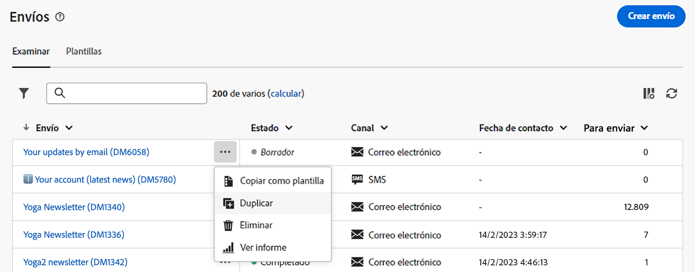

# Descubra la interfaz {#user-interface}

>[!CONTEXTUALHELP]
>id="acw_homepage_learnmore"
>title="Descubra la interfaz"
>abstract="La nueva interfaz web de Campaign v8 ofrece una experiencia de usuario integrada, intuitiva y coherente."

La nueva interfaz de la web de la versión 8 de Campaign ofrece una experiencia de usuario moderna e intuitiva para simplificar el diseño y el envío de las campañas de marketing. Esta nueva interfaz está integrada con Adobe Experience Platform.

>[!NOTE]
>
>Esta documentación se actualiza frecuentemente para reflejar los cambios recientes en la interfaz de usuario del producto. Sin embargo, algunas capturas de pantalla pueden diferir ligeramente de la interfaz de usuario.

## Menú de navegación izquierdo {#user-interface-left-nav}

Examine los vínculos de la izquierda para acceder a las funciones de la web de la versión 8 de Campaign. Varios vínculos muestran listas de objetos que se pueden ordenar y filtrar. También puede configurar columnas para que muestren toda la información que necesite. Consulte esta [sección](#list-screens). Todas las pantallas de lista son de solo lectura, excepto la lista de envío de correo electrónico. Hacer clic en cualquier elemento de la lista para su edición o visualización no está disponible en alfa. Todas las listas se podrán editar en versiones futuras. Los elementos mostrados en el menú de navegación de la izquierda dependen de los permisos de usuario.

### Inicio {#user-interface-home}

Esta pantalla incluye vínculos y recursos clave para el acceso rápido a las funciones web principales de la versión 8 de Campaign.

La lista **Recientes** proporciona accesos directos a los envíos creados y modificados recientemente. Esta lista muestra sus fechas de canal, estado, propietario, creación y modificación.

Acceda a las páginas de ayuda de claves web de Campaign v8 desde el **Aprendizaje** de la página de inicio.

### Explorer {#user-interface-explorer}

>[!CONTEXTUALHELP]
>id="acw_explorer"
>title="Explorer"
>abstract="El **Explorer** El menú muestra todos los componentes y objetos de Campaign con la misma jerarquía de carpetas que el de la consola del cliente. Examine todos los componentes, carpetas y esquemas de Campaign v8 y cree envíos, flujos de trabajo y campañas. Todas las demás listas son de solo lectura."

El **Explorer** El menú muestra todos los recursos y objetos de Campaign con la misma jerarquía de carpetas que la consola del cliente. Examine todos los componentes, carpetas y esquemas de Campaign v8 y cree envíos, flujos de trabajo y campañas. Todas las demás listas son de solo lectura.

Los elementos mostrados en el Explorador dependen de los permisos de usuario.

Como en cualquier pantalla de lista, puede configurar columnas para personalizar la visualización y ver toda la información que necesite. Consulte esta [sección](#list-screens).

Para obtener más información sobre el explorador de Campaign, la jerarquía de carpetas y los recursos, consulte esta sección [Documentación de Campaign v8 (consola)](https://experienceleague.adobe.com/docs/campaign/campaign-v8/new/campaign-ui.html?lang=es#ac-explorer-ui){target="_blank"}.

### Administración de campañas {#user-interface-campaign-management}

>[!CONTEXTUALHELP]
>id="acw_campaigns_list"
>title="Campañas"
>abstract="Esta es la lista de sus campañas. Puede ver información útil, como las fechas de inicio/finalización/última modificación, así como su estado. Puede filtrar la lista por estado o fechas de inicio/finalización. Haga clic en el botón “Crear campaña” para añadir una nueva campaña. Seleccione una campaña para ver su contenido, envíos y detalles. Vaya a la pestaña “Plantillas” para ver y crear plantillas."

>[!CONTEXTUALHELP]
>id="acw_deliveries_list"
>title="Envíos"
>abstract="Examine la lista de envíos. Puede ver su estado, las fechas de contacto y modificación, y los indicadores clave de rendimiento (KPI). Puede filtrar la lista por estado, fecha de contacto o canal. Haga clic en el botón “Crear envío” para añadir un nuevo envío. Seleccione un envío para ver su contenido, audiencia y detalles."

En la sección CAMPAIGN MANAGEMENT, puede acceder a campañas de marketing, envíos y flujos de trabajo.

* **Campañas**: esta es la lista de sus campañas y plantillas de campaña. De forma predeterminada, para cada campaña se pueden ver las fechas de inicio, finalización, creación y última modificación, el estado actual y el nombre del operador de Campaign que la creó. Puede filtrar la lista por estado, fechas de inicio/finalización, carpeta o crear un filtro avanzado para definir sus propios criterios de filtrado. Obtenga más información acerca de las campañas de [en esta sección](../campaigns/gs-campaigns.md).

* **Envíos**: examine la lista de envíos. De forma predeterminada, puede ver su estado, la fecha de la última modificación y los KPI principales. Puede filtrar la lista por estado, fecha de contacto o canal. Haga clic en un envío de correo electrónico para abrir el panel y obtener una descripción general de los detalles del envío. Los envíos en otros canales son de solo lectura. Puede obtener más información sobre los envíos [en esta sección](../msg/gs-messages.md).

  Utilice el botón **Más acciones** para eliminar o duplicar un envío.

  {width="70%" align="left"}

* **Flujos de trabajo**: en esta pantalla, puede acceder a la lista completa de flujos de trabajo y plantillas de flujo de trabajo. Puede comprobar su estado, las fechas de última/siguiente ejecución y crear un nuevo flujo de trabajo o una nueva plantilla de flujo de trabajo. Puede filtrar la lista con los mismos criterios que para otros objetos. Además, puede filtrar los flujos de trabajo que pertenecen o no a una campaña. Puede obtener más información sobre los flujos de trabajo [en esta sección](../workflows/gs-workflows.md).

### Administración de clientes {#user-interface-customer-management}

>[!CONTEXTUALHELP]
>id="acw_recipients_list"
>title="Destinatarios"
>abstract="Acceda a la base de datos de destinatarios. Puede ver información útil, como su dirección de correo electrónico, nombre y apellidos. Esta lista es de solo lectura."

>[!CONTEXTUALHELP]
>id="acw_audiences_list"
>title="Audiencias"
>abstract="Esta es su lista de audiencias. Puede ver su tipo, origen, fechas de creación/última modificación y etiqueta. Puede filtrar la lista por origen. Esta lista es de solo lectura."

>[!CONTEXTUALHELP]
>id="acw_subscriptions_list"
>title="Listas de suscripciones"
>abstract="Examine las listas de suscripciones. Puede ver su tipo, modo y etiqueta. Esta lista es de solo lectura."

En la sección CUSTOMER MANAGEMENT, puede ver los destinatarios, las audiencias y las suscripciones. Estas listas son de solo lectura.

* **Destinatarios**: acceda a la base de datos de destinatarios. De forma predeterminada, puede ver su dirección de correo electrónico, nombre y apellidos. Más información sobre los destinatarios en [Documentación de Adobe Campaign v8 (consola)](https://experienceleague.adobe.com/docs/campaign/campaign-v8/audience/gs-audiences.html){target="_blank"}.
* **Audiencias**: esta es su lista de audiencias. De forma predeterminada, puede ver su tipo, origen, fechas de creación/última modificación y etiqueta. Puede filtrar la lista por origen. Obtenga más información acerca de audiencias y listas en [Documentación de Adobe Campaign v8 (consola)](https://experienceleague.adobe.com/docs/campaign/campaign-v8/audience/create-audiences/create-audiences.html){target="_blank"}.
* **Suscripciones** - Navega por tus listas de suscripciones. De manera predeterminada, puede ver su tipo, modo y etiqueta. Obtenga información sobre cómo administrar suscripciones y bajas en [Documentación de Adobe Campaign v8 (consola)](https://experienceleague.adobe.com/docs/campaign/campaign-v8/campaigns/send/subscriptions.html){target="_blank"}.

### Gestión de decisiones

>[!CONTEXTUALHELP]
>id="acw_offers_list"
>title="Ofertas"
>abstract="Examine la lista de ofertas de interacción. De forma predeterminada, puede ver su estado, fechas de inicio/finalización y entorno. Puede filtrar la lista por estado y fechas de inicio/finalización. También están disponibles las plantillas de oferta. Estas listas son de solo lectura."

* **Ofertas**: examine la lista de ofertas de interacción. De forma predeterminada, puede ver su estado, fechas de inicio/finalización y entorno. Puede filtrar la lista por estado y fechas de inicio/finalización. También están disponibles las plantillas de oferta. Estas listas son de solo lectura.

Obtenga información sobre cómo crear y administrar ofertas en [Documentación de Adobe Campaign v8 (consola)](https://experienceleague.adobe.com/docs/campaign/campaign-v8/offers/interaction.html?lang=es){target="_blank"}.

## Barra superior

Utilice la barra superior de la interfaz para lo siguiente:

* Compartir sus comentarios como evaluador de alfa.
* Cambiar entre organizaciones e instancias.
* Cambiar entre las aplicaciones de Adobe Experience Cloud.
* Acceder a páginas de ayuda, ponerse en contacto con el servicio de asistencia técnica y compartir comentarios. Puede buscar artículos de ayuda y vídeos desde el campo de búsqueda.

{width="50%" align="left"}
<!--
Org / Sub-org switcher to switch between instances. Only one for Alpha. Later: intermerdiate screen with Control Panel (beta). if v8 + ACS with one card per ACS instance. Maybe quickly explain the menu for Alpha?
-->

## Ayuda contextual {#contextual-help}

Hay disponible una ayuda contextual en la interfaz. Cuando esté disponible, haga clic en `?` para mostrar la información de ayuda y los vínculos de documentación relacionados.

{width="40%" align="left"}

<!--An on-boarding guide is also available to help you get started with Campaign v8 Web. Click the icon in the bottom right corner, choose one of the available step-by-step scenarios, and simply follow the instructions.

{width="70%" align="left"}-->

## Navegadores admitidos {#browsers}

La web de la versión 8 de Campaign está diseñada para funcionar de forma óptima con la última versión de Google Chrome, Safari y Microsoft Edge. Es posible que tenga problemas al utilizar determinadas funciones en versiones anteriores u otros navegadores.

## Preferencias de idioma {#language-pref}

La web de la versión 8 de Campaign está disponible actualmente en los siguientes idiomas:

<table>
<tr>
<td>

Inglés (EE. UU.) - EN-US

Francés - FR

Alemán - DE

Italiano - IT

</td>
<td>

Español - ES

Portugués (Brasil) - PTBR

Japonés - JP

</td>
<td>

Coreano - KR

Chino simplificado - CHS

Chino tradicional - CHT

</td>
</tr>
</table>

El idioma predeterminado de la interfaz está determinado por el idioma preferido especificado en el perfil de usuario.

Para cambiar el idioma, haga lo siguiente:

1. Haga clic en el icono del perfil, en la parte superior derecha, y luego seleccione **Preferencias**.
1. A continuación, haga clic en el vínculo de idioma que aparece debajo de su dirección de correo electrónico.
1. Seleccione el idioma preferido y haga clic en **Guardar**. Puede seleccionar un segundo idioma en caso de que el componente que esté utilizando no esté localizado en su primer idioma.

<!--
######## This part stores the contextualHelp definition for WebUI BETA ###########
######## These blocks should be dispatched in the appropriate pages when available ###########
######## PLEASE DO NOT DELETE ###########
REFER TO 
https://wiki.corp.adobe.com/pages/viewpage.action?spaceKey=neolane&title=v8+WebUI+Contextual+Help+%3CALPHA%3E-+Official+list
-->

>[!CONTEXTUALHELP]
>id="acw_rulebuilder_advancedfields"
>title="Campos avanzados del generador de reglas"
>abstract="Configure columnas con campos avanzados."

>[!CONTEXTUALHELP]
>id="acw_rulebuilder_properties_advanced"
>title="Atributos avanzados del generador de reglas"
>abstract="Utilice atributos avanzados para definir la regla."

>[!CONTEXTUALHELP]
>id="acw_deliveries_email_metrics_sent"
>title="Métricas enviadas"
>abstract="Número de correos electrónicos enviados."

>[!CONTEXTUALHELP]
>id="acw_deliveries_email_metrics_errors"
>title="Métricas de errores"
>abstract="Número de correos electrónicos con el estado de error."

>[!CONTEXTUALHELP]
>id="acw_email_preview_option_test_target"
>title="Población de prueba"
>abstract="Seleccione un modo de población de prueba."

>[!CONTEXTUALHELP]
>id="acw_email_preview_mode"
>title="Modo de vista previa"
>abstract="Obtenga una vista previa y pruebe el mensaje incluyendo la población de prueba en el público destinatario principal."

>[!CONTEXTUALHELP]
>id="acw_targetdata_personalization_enrichmentdata"
>title="Datos de enriquecimiento"
>abstract="Por determinar"

>[!CONTEXTUALHELP]
>id="acw_campaign_reporting_sending"
>title="Envío de creación de informes"
>abstract="Consulte los indicadores de envío para la creación de informes de campaña."

>[!CONTEXTUALHELP]
>id="acw_campaign_reporting_tracking"
>title="Seguimiento de creación de informes"
>abstract="Consulte los indicadores de seguimiento para la creación de informes de campaña."

>[!CONTEXTUALHELP]
>id="acw_campaign_reporting_deliveries_overview"
>title="Información general sobre la creación de informes"
>abstract="Métricas clave para su envío."

>[!CONTEXTUALHELP]
>id="acw_campaign_reporting_deliveries_target"
>title="Estadísticas del destinatario de la creación de informes"
>abstract="Esta sección muestra métricas específicas según las audiencias."

>[!CONTEXTUALHELP]
>id="acw_campaign_reporting_deliveries_selection"
>title="Informes agregados para envíos"
>abstract="Seleccione al menos dos envíos para mostrar un informe de datos agregado."

>[!CONTEXTUALHELP]
>id="acw_orchestration_deduplication_fields"
>title="Campos de anulación de duplicación"
>abstract="Por determinar"

>[!CONTEXTUALHELP]
>id="acw_orchestration_deduplication_settings"
>title="Configuración de la anulación de duplicación"
>abstract="Por determinar"

>[!CONTEXTUALHELP]
>id="acw_orchestration_deduplication_complement"
>title="Complemento de anulación de duplicación"
>abstract="Por determinar"

>[!CONTEXTUALHELP]
>id="acw_orchestration_dimension_complement"
>title="Complemento de dimensión"
>abstract="Por determinar"

>[!CONTEXTUALHELP]
>id="acw_push_permission_for_segment"
>title="Permiso obligatorio"
>abstract="El administrador debe concederle permiso para poder crear un segmento."

>[!CONTEXTUALHELP]
>id="acw_push_overview_edit"
>title="Permiso obligatorio"
>abstract="El administrador debe concederle permiso para poder crear un segmento."

>[!CONTEXTUALHELP]
>id="acw_deliveries_metrics_newquarantines"
>title="Nueva métrica de cuarentenas"
>abstract="Nueva métrica de cuarentena."

>[!CONTEXTUALHELP]
>id="acw_keyindicators_delivered"
>title="Entregados"
>abstract="KPI entregado"

>[!CONTEXTUALHELP]
>id="acw_keyindicators_opens"
>title="Aperturas"
>abstract="Abre el KPI"

>[!CONTEXTUALHELP]
>id="acw_keyindicators_clicks"
>title="Clics"
>abstract="Clics de KPI"

>[!CONTEXTUALHELP]
>id="acw_keyindicators_unsubscriptions"
>title="Bajas"
>abstract="KPI de bajas"

>[!CONTEXTUALHELP]
>id="acw_keyindicators_spam"
>title="Spam"
>abstract="KPI de spam"

>[!CONTEXTUALHELP]
>id="acw_keyindicators_errors"
>title="Errores"
>abstract="KPI de errores"
