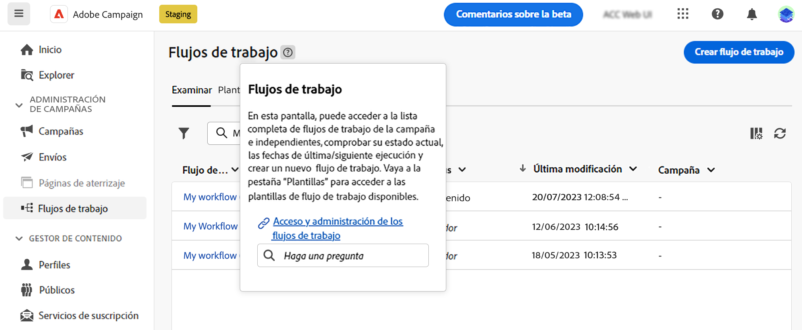

# Uso del asistente de conocimiento con tecnología de IA {#using-ai}

Obtenga respuestas rápidas y generadas por IA basadas en la documentación del producto y el contexto actual del producto, con el asistente de conocimiento con tecnología de IA disponible en los cuadros de ayuda contextual del producto.

>[!AVAILABILITY]
>
>Esta capacidad estará disponible a principios de octubre.

El **Asistente de conocimientos con Gen AI** la ayuda contextual integrada revoluciona la búsqueda de documentación y la respuesta a preguntas sobre procedimientos al examinar sin esfuerzo vastos repositorios de documentación y localizar al instante la información precisa que necesita.

Gracias a las capacidades de Campaign Gen AI, este asistente transforma su experiencia, lo que facilita la recuperación de información y la resolución de problemas. Tanto si busca orientación en una tarea compleja como si navega por documentos extensos, nuestro asistente de conocimientos con Gen AI es su mejor compañero, ya que proporciona una eficiencia y precisión inigualables en cada interacción.

{width="70%" align="left"}

<!--
## Consent {#consent-ai}

Campaign knowledge assistant embeeded in the contextual help boxes uses AI. Your use of this capability constitutes consent that the information you provide in your session will be collected, used, disclosed, and retained by Adobe in accordance with the terms of Adobe's Customer Feedback Program. Please do not provide any personal information about yourself or other parties (including your name or contact information) in the knowledge assistant.

## Privacy {#privacy-ai}

Your data is encrypted and private following our standard data protection practices. Learn more about [Adobe Privacy Policies](https://www.adobe.com/privacy/policy.html){target="_blank"}.

The knowledge assistant AI capability does not use your data to train our models. We do not allow any partners or 3rd parties to use your data for training their models or any other purpose.

For information specific to Adobe AI policies in Experience Cloud apps and solutions, refer to [this page](https://business.adobe.com/products/sensei/adobe-sensei.html){target="_blank"}.
-->

## Respuestas {#answers-ai}

Las respuestas pueden ser inexactas o engañosas. Como consecuencia, el asistente de conocimientos de Adobe puede generar información incorrecta. Asegúrese de comprobar la documentación del producto que está vinculada en cada cuadro de ayuda.

Los modelos de inteligencia artificial y aprendizaje automático mejoran con el tiempo para abordar mejor los casos de uso específicos. El asistente de conocimientos con tecnología de IA de Campaign seguirá mejorando en los próximos meses. Le recomendamos encarecidamente que utilice el ?? ?? botones cada vez que lea una respuesta, para marcar cualquier respuesta inapropiada a nuestros ingenieros.

## Recomendaciones  {#recommendations-ai}

Al hacer una pregunta en el asistente de conocimientos con tecnología de IA, se tiene en cuenta el contexto actual del producto, es decir, la pantalla de Campaign en la que se encuentra y el contenido del cuadro de ayuda actual.

Para obtener lo mejor del asistente de conocimiento con tecnología de IA, al hacer una pregunta, le recomendamos que:

* Sea lo más preciso y específico posible y evite la ambigüedad. La respuesta será más precisa y útil.
* Para ayudar al asistente de conocimiento con tecnología de IA a encontrar la información correcta, agregue tantos detalles como sea posible sobre lo que está intentando aprender.
* Reformule y perfeccione sus preguntas para obtener mejores respuestas. Si la respuesta no es precisa o útil, pruebe diferentes enfoques y agregue contexto para obtener mejores resultados.
* Utilice términos y palabras apropiados, con un tono neutro.
* Valore las respuestas y proporcione comentarios para que nuestros ingenieros puedan aprender de su experiencia y mejorar los resultados.

