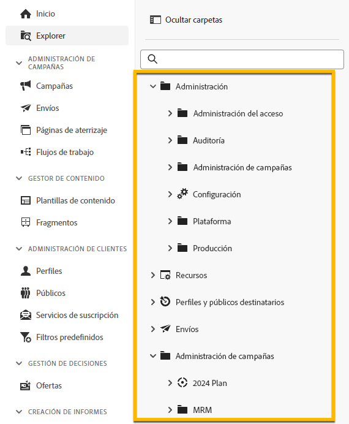
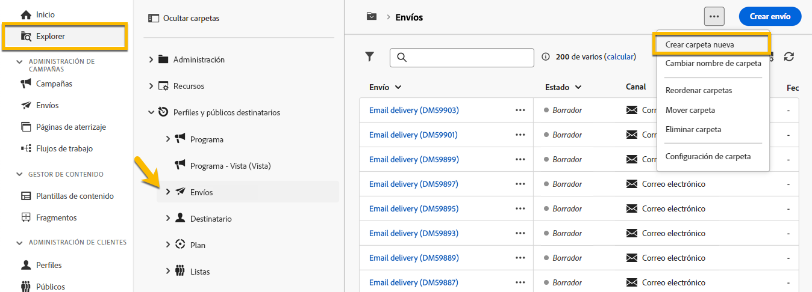
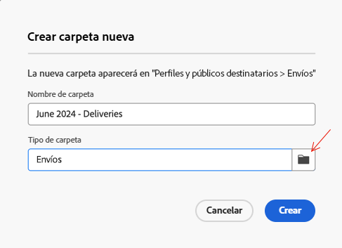
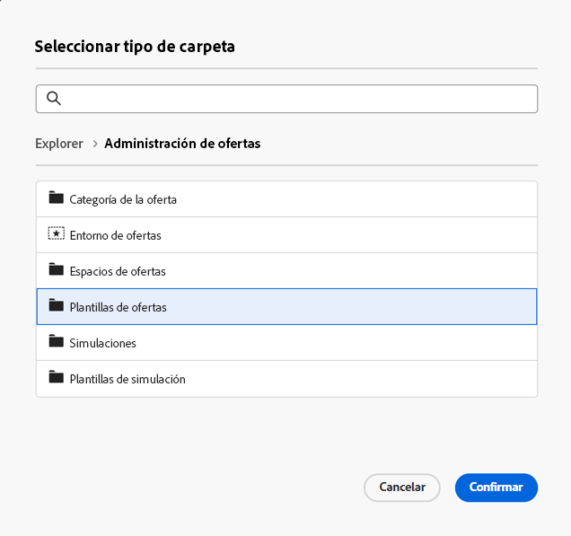
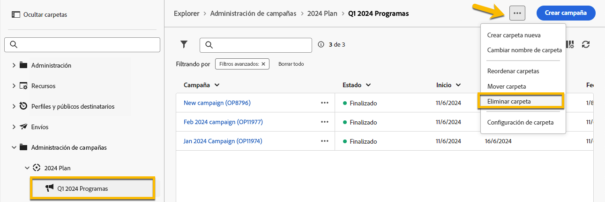
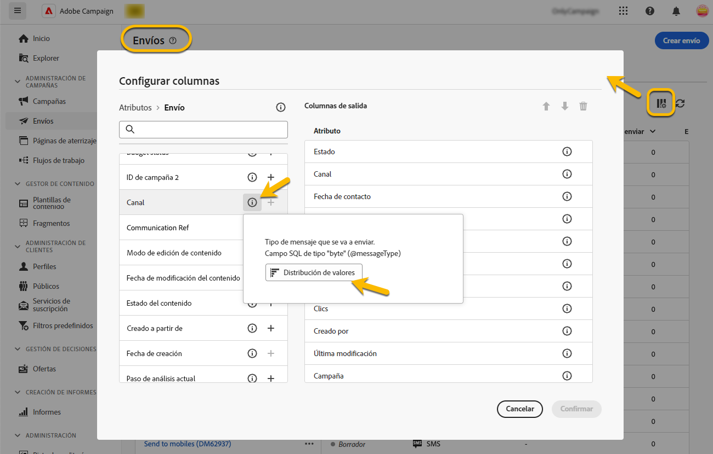
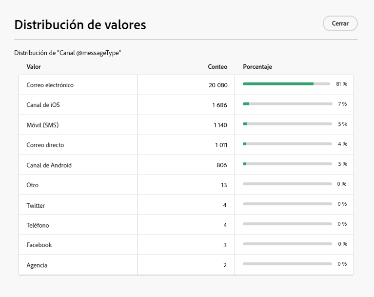
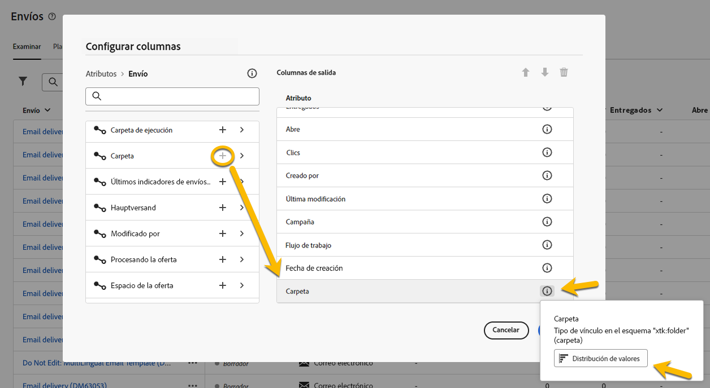
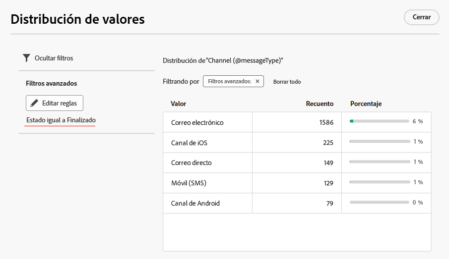

# Trabajo con carpetas {#folders}

>[!CONTEXTUALHELP]
>id="acw_folder_properties"
>title="Propiedades de carpetas"
>abstract="Propiedades de carpetas"

>[!CONTEXTUALHELP]
>id="acw_folder_security"
>title="Seguridad de carpetas"
>abstract="Seguridad de carpetas"

>[!CONTEXTUALHELP]
>id="acw_folder_restrictions"
>title="Restricciones de carpetas"
>abstract="Restricciones de carpetas"

>[!CONTEXTUALHELP]
>id="acw_folder_schedule"
>title="Programación de carpetas"
>abstract="Programación de carpetas"

## Acerca de las carpetas {#about-folders}

Las carpetas son objetos de Adobe Campaign que permiten organizar los componentes y los datos.

Puede crear, cambiar el nombre, reordenar y mover carpetas en el árbol de navegación. También puede eliminarlos según sus derechos.

{zoomable="yes"}

Puede configurar un tipo de carpeta. Por ejemplo: una carpeta de envíos.
El icono de la carpeta cambia según este tipo.

## Creación de una nueva carpeta {#create-a-folder}

Para crear una carpeta nueva en la interfaz de usuario de Adobe Campaign Web, siga estos pasos:

1. En **[!UICONTROL Explorer]**, vaya a la carpeta en la que desea crear una nueva.
En el menú **[!UICONTROL …]**, encontrará **[!UICONTROL Crear nueva carpeta]**

{zoomable="yes"}

Al crear una carpeta nueva, de forma predeterminada, el tipo de carpeta es el tipo de carpeta principal. En nuestro ejemplo, creamos una carpeta en la carpeta **[!UICONTROL Envíos]**.

{zoomable="yes"}

1. Cambie el tipo de su carpeta haciendo clic en el icono de Tipo de carpeta, si fuera necesario, y selecciónela en la lista que se muestra, como se indica a continuación:

{zoomable="yes"}

Configure el tipo de carpeta haciendo clic en el botón **[!UICONTROL Confirmar]**.

Si desea crear una carpeta sin un tipo específico, elija el tipo **[!UICONTROL Carpeta genérica]**.

También puede [crear y administrar carpetas en la consola de Adobe Campaign](https://experienceleague.adobe.com/es/docs/campaign/campaign-v8/config/configuration/folders-and-views).

## Eliminación de una carpeta {#delete-a-folder}

>[!CAUTION]
>
>Al eliminar una carpeta, también se eliminan todos los datos almacenados en ella.

Para eliminar una carpeta, selecciónela en el árbol del **[!UICONTROL Explorer]** y haga clic en el menú **[!UICONTROL …]**.
Elija **[!UICONTROL Eliminar carpeta]**.

{zoomable="yes"}

## Distribución de valores en una carpeta {#distribution-values-folder}

La distribución de valores ayuda a conocer el porcentaje de un valor en una columna dentro de una tabla.

Para conocer la distribución de valores en una carpeta, proceda como se indica a continuación:

Por ejemplo, entre los envíos, queremos conocer la distribución de valores de la columna **Canal**.

Para obtener esta información, vaya a la carpeta **[!UICONTROL Envíos]** y haga clic en el icono **[!UICONTROL Configurar columnas]**.

En la ventana **[!UICONTROL Configurar columnas]**, haga clic en el icono **[!UICONTROL Información]** de la columna de la que desee información. A continuación, haga clic en el botón **[!UICONTROL Distribución de valores]**.

{zoomable="yes"}

Obtendrá el porcentaje de los valores de la columna **[!UICONTROL Canal]**.

{zoomable="yes"}

>[!NOTE]
>
> Para las columnas con muchos valores, solo se mostrarán los primeros veinte valores. Una notificación **[!UICONTROL Carga parcial]** le avisará de esto.

También puede disponer de la distribución de valores de un vínculo.

En la lista de atributos, haga clic en el botón **+** situado junto al vínculo deseado, como se muestra a continuación. Esto añade el vínculo a las **[!UICONTROL Columnas de salida]**. Ahora puede disponer del icono **[!UICONTROL Información]**, que le permite ver la distribución de sus valores. Si no desea mantener el vínculo en las **[!UICONTROL Columnas de salida]**, asegúrese de hacer clic en el botón **[!UICONTROL Cancelar]**.

{zoomable="yes"}

También es posible disponer de la distribución de valores en un modelador de consultas. [Más información aquí](../query/build-query.md#distribution-of-values-in-a-query).

### Filtrado de valores {#filter-values}

Mediante los **[!UICONTROL filtros avanzados]** en la ventana de distribución de valores, puede filtrar los resultados según las condiciones especificadas.

En el ejemplo de la lista de envíos anterior, que muestra la distribución por canal, puede, por ejemplo, filtrarla para mostrar solo los envíos cuyo estado es **Finalizado**.

{zoomable="yes"}
