<?xml version="1.0" encoding="UTF-8"?>
<xliff xmlns="urn:oasis:names:tc:xliff:document:1.2" xmlns:okp="okapi-framework:xliff-extensions" xmlns:its="http://www.w3.org/2005/11/its" xmlns:itsxlf="http://www.w3.org/ns/its-xliff/" version="1.2" its:version="2.0">
<file original="help/v8/get-started/work-with-folders.md.mdsc" source-language="en-US" target-language="en-XX" datatype="x-text/markdown">
<body>
<trans-unit id="tu22" xml:space="preserve">
<source xml:lang="en-US">https://experienceleague.adobe.com/docs/campaign/campaign-v8/permissions/manage-permissions.html#use-named-rights</source>
<target xml:lang="en-XX">https://experienceleague.adobe.com/es/docs/campaign/campaign-v8/permissions/manage-permissions#use-named-rights</target>
</trans-unit>
<trans-unit id="tu34" xml:space="preserve">
<source xml:lang="en-US">https://experienceleague.adobe.com/en/docs/campaign/campaign-v8/config/configuration/folders-and-views</source>
<target xml:lang="en-XX">https://experienceleague.adobe.com/es/docs/campaign/campaign-v8/config/configuration/folders-and-views</target>
</trans-unit>
<trans-unit id="tu1" restype="x-YAML_METADATA_HEADER_VALUE" xml:space="preserve">
<source xml:lang="en-US">Work with Folders</source>
<target xml:lang="en-XX">Trabajar con carpetas</target>
</trans-unit>
<trans-unit id="tu2" restype="x-YAML_METADATA_HEADER_VALUE" xml:space="preserve">
<source xml:lang="en-US">Learn how to manage a folder in Adobe Campaign</source>
<target xml:lang="en-XX">Obtenga información sobre cómo administrar una carpeta en Adobe Campaign</target>
</trans-unit>
<trans-unit id="tu3" xml:space="preserve">
<source xml:lang="en-US">Work with folders</source>
<target xml:lang="en-XX">Trabajo con carpetas</target>
</trans-unit>
<trans-unit id="tu4" xml:space="preserve">
<source xml:lang="en-US">Folder properties</source>
<target xml:lang="en-XX">Propiedades de carpetas</target>
</trans-unit>
<trans-unit id="tu5" xml:space="preserve">
<source xml:lang="en-US">Folder properties</source>
<target xml:lang="en-XX">Propiedades de carpetas</target>
</trans-unit>
<trans-unit id="tu6" xml:space="preserve">
<source xml:lang="en-US">Folder security</source>
<target xml:lang="en-XX">Seguridad de carpetas</target>
</trans-unit>
<trans-unit id="tu7" xml:space="preserve">
<source xml:lang="en-US">Folder security</source>
<target xml:lang="en-XX">Seguridad de carpetas</target>
</trans-unit>
<trans-unit id="tu8" xml:space="preserve">
<source xml:lang="en-US">Folder schedule</source>
<target xml:lang="en-XX">Programación de carpetas</target>
</trans-unit>
<trans-unit id="tu9" xml:space="preserve">
<source xml:lang="en-US">Folder schedule</source>
<target xml:lang="en-XX">Programación de carpetas</target>
</trans-unit>
<trans-unit id="tu10" xml:space="preserve">
<source xml:lang="en-US">About folders</source>
<target xml:lang="en-XX">Acerca de las carpetas</target>
</trans-unit>
<trans-unit id="tu11" xml:space="preserve">
<source xml:lang="en-US">Folders are objects in Adobe Campaign that allow you to organize your components and data.</source>
<target xml:lang="en-XX">Las carpetas son objetos de Adobe Campaign que permiten organizar los componentes y los datos.</target>
</trans-unit>
<trans-unit id="tu12" xml:space="preserve">
<source xml:lang="en-US">You can create, rename, reorder, and move folders in the navigation tree. You can also delete them based on your rights.</source>
<target xml:lang="en-XX">Puede crear, cambiar el nombre, reordenar y mover carpetas en el árbol de navegación. También puede eliminarlos según sus derechos.</target>
</trans-unit>
<trans-unit id="tu13" xml:space="preserve">
<source xml:lang="en-US"><ph id="1" ctype="x-IMAGE">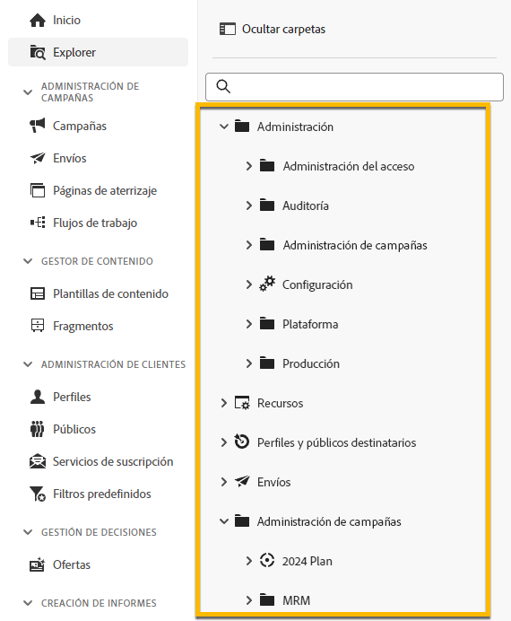{zoomable="yes"}</ph></source>
<target xml:lang="en-XX"><ph id="1" ctype="x-IMAGE">{zoomable="yes"}</ph></target>
</trans-unit>
<trans-unit id="tu14" xml:space="preserve">
<source xml:lang="en-US">You can set up a folder type. For example, a folder of deliveries. The folder icon changes according to its type.</source>
<target xml:lang="en-XX">Puede configurar un tipo de carpeta. Por ejemplo: una carpeta de envíos. El icono de carpeta cambia según su tipo.</target>
</trans-unit>
<trans-unit id="tu15" xml:space="preserve">
<source xml:lang="en-US">Folder restrictions</source>
<target xml:lang="en-XX">Restricciones de carpetas</target>
</trans-unit>
<trans-unit id="tu16" xml:space="preserve">
<source xml:lang="en-US">The folders Objects created automatically and Technical workflows are restricted, and cannot be viewed on the left side panel.</source>
<target xml:lang="en-XX">Las carpetas Objetos creados automáticamente y Flujos de trabajo técnicos están restringidas y no se pueden ver en el panel lateral izquierdo.</target>
</trans-unit>
<trans-unit id="tu17" xml:space="preserve">
<source xml:lang="en-US"><ph id="1" ctype="x-regxph" equiv-text="&lbrack;!IMPORTANT">[!IMPORTANT]</ph></source>
<target xml:lang="en-XX"><ph id="1" ctype="x-regxph" equiv-text="&lbrack;!IMPORTANT">[!IMPORTANT]</ph></target>
</trans-unit>
<trans-unit id="tu18" xml:space="preserve">
<source xml:lang="en-US">The folders <ph id="1" ctype="x-STRONG_EMPHASIS">**[!UICONTROL </ph>Objects created automatically<ph id="3" ctype="x-LINK_REF">]**</ph> and <ph id="5" ctype="x-STRONG_EMPHASIS">**[!UICONTROL </ph>Technical workflows<ph id="7" ctype="x-LINK_REF">]**</ph> are restricted, and cannot be viewed on the left side panel.</source>
<target xml:lang="en-XX">Las carpetas <ph id="1" ctype="x-STRONG_EMPHASIS">**[!UICONTROL </ph>Objetos creados automáticamente<ph id="3" ctype="x-LINK_REF">]**</ph> y <ph id="5" ctype="x-STRONG_EMPHASIS">**[!UICONTROL </ph>Flujos de trabajo técnicos<ph id="7" ctype="x-LINK_REF">]**</ph> están restringidas y no se pueden ver en el panel lateral izquierdo.</target>
</trans-unit>
<trans-unit id="tu19" xml:space="preserve">
<source xml:lang="en-US">The actions available to you on a folder depend on the rights you have been granted on it. The <ph id="1" ctype="x-STRONG_EMPHASIS">**[!UICONTROL </ph>Folder settings<ph id="3" ctype="x-LINK_REF">]**</ph> dialog may open in <ph id="5" ctype="x-STRONG_EMPHASIS">**</ph>read-only mode<ph id="6" ctype="x-STRONG_EMPHASIS">**</ph>, and some actions or sections may not be available, depending on your rights.</source>
<target xml:lang="en-XX">Las acciones que tiene disponibles sobre una carpeta dependen de los derechos que se le hayan concedido respecto a ella. Es posible que el cuadro de diálogo <ph id="1" ctype="x-STRONG_EMPHASIS">**[!UICONTROL </ph>Configuración de carpeta<ph id="3" ctype="x-LINK_REF">]**</ph> se abra en <ph id="5" ctype="x-STRONG_EMPHASIS">**</ph>modo de solo lectura<ph id="6" ctype="x-STRONG_EMPHASIS">**</ph> y que algunas acciones o secciones no estén disponibles en función de los derechos que tenga.</target>
</trans-unit>
<trans-unit id="tu20" xml:space="preserve">
<source xml:lang="en-US">Contact your administrator if you are missing rights on a folder. Refer to this <ph id="1" ctype="x-LINK">[</ph>section<ph id="2" ctype="x-LINK">](permissions.md#folder-permissions)</ph> to learn how folder permissions are managed.</source>
<target xml:lang="en-XX">Póngase en contacto con su administrador si le faltan derechos sobre una carpeta. Consulte esta <ph id="1" ctype="x-LINK">[</ph>sección<ph id="2" ctype="x-LINK">](permissions.md#folder-permissions)</ph> para obtener información sobre cómo se administran los permisos de carpeta.</target>
</trans-unit>
<trans-unit id="tu21" xml:space="preserve">
<source xml:lang="en-US">Named rights such as <ph id="1" ctype="x-STRONG_EMPHASIS">**[!UICONTROL </ph>Insert Folders<ph id="3" ctype="x-LINK_REF">]**</ph>, <ph id="5" ctype="x-STRONG_EMPHASIS">**[!UICONTROL </ph>Edit Folders<ph id="7" ctype="x-LINK_REF">]**</ph>, and <ph id="9" ctype="x-STRONG_EMPHASIS">**[!UICONTROL </ph>Delete Folder<ph id="11" ctype="x-LINK_REF">]**</ph> also determine which folder actions are available to an operator. Refer to the <ph id="13" ctype="x-LINK">&lbrack;</ph>Campaign v8 documentation<ph id="14" ctype="x-LINK">[#$tu22]{target="_blank"}</ph>.</source>
<target xml:lang="en-XX">Los derechos asignados como <ph id="1" ctype="x-STRONG_EMPHASIS">**[!UICONTROL </ph>Insertar carpetas<ph id="3" ctype="x-LINK_REF">]**</ph>, <ph id="5" ctype="x-STRONG_EMPHASIS">**[!UICONTROL </ph>Editar carpetas<ph id="7" ctype="x-LINK_REF">]**</ph> y <ph id="9" ctype="x-STRONG_EMPHASIS">**[!UICONTROL </ph>Eliminar carpeta<ph id="11" ctype="x-LINK_REF">]**</ph> también determinan qué acciones de carpeta están disponibles para un operador. Consulte la <ph id="13" ctype="x-LINK">&lbrack;</ph>documentación de Campaign v8<ph id="14" ctype="x-LINK">[#$tu22]{target="_blank"}</ph>.</target>
</trans-unit>
<trans-unit id="tu23" xml:space="preserve">
<source xml:lang="en-US">Create a new folder</source>
<target xml:lang="en-XX">Creación de una nueva carpeta</target>
</trans-unit>
<trans-unit id="tu24" xml:space="preserve">
<source xml:lang="en-US">To create a new folder in Adobe Campaign Web UI, follow these steps:</source>
<target xml:lang="en-XX">Para crear una carpeta nueva en la interfaz de usuario de Adobe Campaign Web, siga estos pasos:</target>
</trans-unit>
<trans-unit id="tu25" xml:space="preserve">
<source xml:lang="en-US">In <ph id="1" ctype="x-STRONG_EMPHASIS">**[!UICONTROL </ph>Explorer<ph id="3" ctype="x-LINK_REF">]**</ph>, go to the folder where you want to create your new folder. Under the <ph id="5" ctype="x-STRONG_EMPHASIS">**[!UICONTROL </ph>...<ph id="7" ctype="x-LINK_REF">]**</ph> menu, select <ph id="9" ctype="x-STRONG_EMPHASIS">**[!UICONTROL </ph>Create new folder<ph id="11" ctype="x-LINK_REF">]**</ph>.</source>
<target xml:lang="en-XX">En <ph id="1" ctype="x-STRONG_EMPHASIS">**[!UICONTROL </ph>Explorer<ph id="3" ctype="x-LINK_REF">]**</ph>, vaya a la carpeta en la que desea crear una nueva. En el menú <ph id="5" ctype="x-STRONG_EMPHASIS">**[!UICONTROL </ph>…<ph id="7" ctype="x-LINK_REF">]**</ph>, encontrará <ph id="9" ctype="x-STRONG_EMPHASIS">**[!UICONTROL </ph>Crear nueva carpeta<ph id="11" ctype="x-LINK_REF">]**</ph></target>
</trans-unit>
<trans-unit id="tu26" xml:space="preserve">
<source xml:lang="en-US"><ph id="1" ctype="x-IMAGE">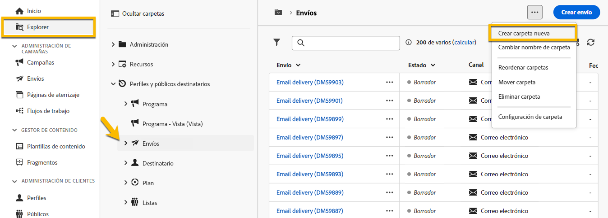{zoomable="yes"}</ph></source>
<target xml:lang="en-XX"><ph id="1" ctype="x-IMAGE">{zoomable="yes"}</ph></target>
</trans-unit>
<trans-unit id="tu27" xml:space="preserve">
<source xml:lang="en-US">When you create a new folder, the folder type defaults to the type of the parent folder. In this example, a folder is created in the <ph id="1" ctype="x-STRONG_EMPHASIS">**[!UICONTROL </ph>Deliveries<ph id="3" ctype="x-LINK_REF">]**</ph> folder.</source>
<target xml:lang="en-XX">Cuando crea una carpeta nueva, el tipo de carpeta predeterminado es el tipo de la carpeta principal. En este ejemplo, se crea una carpeta en la carpeta <ph id="1" ctype="x-STRONG_EMPHASIS">**[!UICONTROL </ph>Envíos<ph id="3" ctype="x-LINK_REF">]**</ph>.</target>
</trans-unit>
<trans-unit id="tu28" xml:space="preserve">
<source xml:lang="en-US"><ph id="1" ctype="x-IMAGE">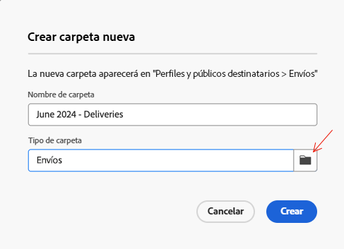{zoomable="yes"}</ph></source>
<target xml:lang="en-XX"><ph id="1" ctype="x-IMAGE">{zoomable="yes"}</ph></target>
</trans-unit>
<trans-unit id="tu29" xml:space="preserve">
<source xml:lang="en-US">Change the folder type by clicking on the folder type icon if needed, and select the desired type from the list presented, as shown below:</source>
<target xml:lang="en-XX">Cambie el tipo de carpeta haciendo clic en el icono de tipo de carpeta si es necesario, y seleccione el tipo deseado de la lista presentada, como se muestra a continuación:</target>
</trans-unit>
<trans-unit id="tu30" xml:space="preserve">
<source xml:lang="en-US"><ph id="1" ctype="x-IMAGE">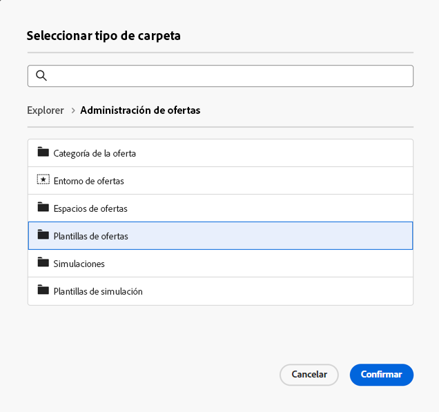{zoomable="yes"}</ph></source>
<target xml:lang="en-XX"><ph id="1" ctype="x-IMAGE">{zoomable="yes"}</ph></target>
</trans-unit>
<trans-unit id="tu31" xml:space="preserve">
<source xml:lang="en-US">Set up the folder type by clicking the <ph id="1" ctype="x-STRONG_EMPHASIS">**[!UICONTROL </ph>Confirm<ph id="3" ctype="x-LINK_REF">]**</ph> button.</source>
<target xml:lang="en-XX">Configure el tipo de carpeta haciendo clic en el botón <ph id="1" ctype="x-STRONG_EMPHASIS">**[!UICONTROL </ph>Confirmar<ph id="3" ctype="x-LINK_REF">]**</ph>.</target>
</trans-unit>
<trans-unit id="tu32" xml:space="preserve">
<source xml:lang="en-US">If you want to create a folder with no specific type, select the <ph id="1" ctype="x-STRONG_EMPHASIS">**[!UICONTROL </ph>Generic Folder<ph id="3" ctype="x-LINK_REF">]**</ph> type.</source>
<target xml:lang="en-XX">Si desea crear una carpeta sin un tipo específico, elija el tipo <ph id="1" ctype="x-STRONG_EMPHASIS">**[!UICONTROL </ph>Carpeta genérica<ph id="3" ctype="x-LINK_REF">]**</ph>.</target>
</trans-unit>
<trans-unit id="tu33" xml:space="preserve">
<source xml:lang="en-US">You can also <ph id="1" ctype="x-LINK">&lbrack;</ph>create and manage folders in Adobe Campaign console<ph id="2" ctype="x-LINK">[#$tu34]</ph>.</source>
<target xml:lang="en-XX">También puede <ph id="1" ctype="x-LINK">&lbrack;</ph>crear y administrar carpetas en la consola de Adobe Campaign<ph id="2" ctype="x-LINK">[#$tu34]</ph>.</target>
</trans-unit>
<trans-unit id="tu35" xml:space="preserve">
<source xml:lang="en-US">Reorder folders</source>
<target xml:lang="en-XX">Reordenar carpetas</target>
</trans-unit>
<trans-unit id="tu36" xml:space="preserve">
<source xml:lang="en-US">You can reorder folders based on your needs. To do so, click on <ph id="1" ctype="x-STRONG_EMPHASIS">**[!UICONTROL </ph>Reorder folders<ph id="3" ctype="x-LINK_REF">]**</ph>, as shown below.</source>
<target xml:lang="en-XX">Puede reordenar las carpetas según sus necesidades. Para ello, haga clic en <ph id="1" ctype="x-STRONG_EMPHASIS">**[!UICONTROL </ph>Reordenar carpetas<ph id="3" ctype="x-LINK_REF">]**</ph> como se muestra a continuación.</target>
</trans-unit>
<trans-unit id="tu37" xml:space="preserve">
<source xml:lang="en-US">In this example, the <ph id="1" ctype="x-STRONG_EMPHASIS">**</ph>Deliveries<ph id="2" ctype="x-STRONG_EMPHASIS">**</ph> folder contains four subfolders.</source>
<target xml:lang="en-XX">En este ejemplo, la carpeta <ph id="1" ctype="x-STRONG_EMPHASIS">**</ph>Envíos<ph id="2" ctype="x-STRONG_EMPHASIS">**</ph> contiene cuatro subcarpetas.</target>
</trans-unit>
<trans-unit id="tu38" xml:space="preserve">
<source xml:lang="en-US"><ph id="1" ctype="x-IMAGE">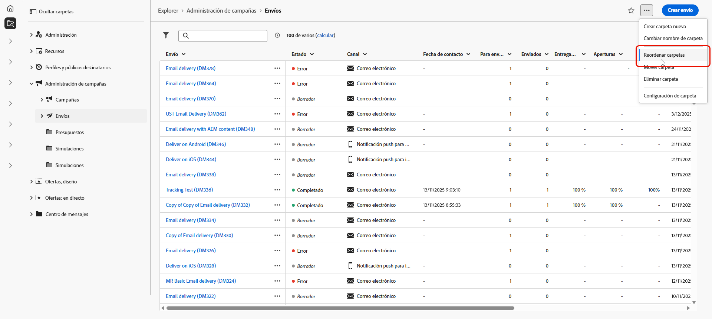{zoomable="yes"}</ph></source>
<target xml:lang="en-XX"><ph id="1" ctype="x-IMAGE">{zoomable="yes"}</ph></target>
</trans-unit>
<trans-unit id="tu39" xml:space="preserve">
<source xml:lang="en-US">You can change the order of folders either by <ph id="1" ctype="x-STRONG_EMPHASIS">**</ph>drag and drop<ph id="2" ctype="x-STRONG_EMPHASIS">**</ph> or by using <ph id="3" ctype="x-STRONG_EMPHASIS">**</ph>up and down arrows<ph id="4" ctype="x-STRONG_EMPHASIS">**</ph>.</source>
<target xml:lang="en-XX">Puede cambiar el orden de las carpetas mediante la acción de <ph id="1" ctype="x-STRONG_EMPHASIS">**</ph>arrastrar y soltar<ph id="2" ctype="x-STRONG_EMPHASIS">**</ph> o usando las <ph id="3" ctype="x-STRONG_EMPHASIS">**</ph>flechas arriba y abajo<ph id="4" ctype="x-STRONG_EMPHASIS">**</ph></target>
</trans-unit>
<trans-unit id="tu40" xml:space="preserve">
<source xml:lang="en-US"><ph id="1" ctype="x-IMAGE">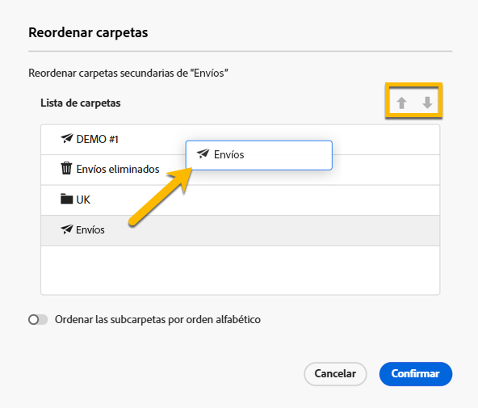{zoomable="yes"}</ph></source>
<target xml:lang="en-XX"><ph id="1" ctype="x-IMAGE">{zoomable="yes"}</ph></target>
</trans-unit>
<trans-unit id="tu41" xml:space="preserve">
<source xml:lang="en-US">Favorite folders</source>
<target xml:lang="en-XX">Carpetas favoritas</target>
</trans-unit>
<trans-unit id="tu42" xml:space="preserve">
<source xml:lang="en-US">Favorites</source>
<target xml:lang="en-XX">Favoritos</target>
</trans-unit>
<trans-unit id="tu43" xml:space="preserve">
<source xml:lang="en-US">Your favorite folders will be displayed at the top of the left tab.</source>
<target xml:lang="en-XX">Sus carpetas favoritas se mostrarán en la parte superior de la pestaña izquierda.</target>
</trans-unit>
<trans-unit id="tu44" xml:space="preserve">
<source xml:lang="en-US">The folders that have been marked as "Favorite" will always be shown at the top of the left tab.</source>
<target xml:lang="en-XX">Las carpetas que se han marcado como "Favoritas" siempre se mostrarán en la parte superior de la pestaña izquierda.</target>
</trans-unit>
<trans-unit id="tu45" xml:space="preserve">
<source xml:lang="en-US">You can add folders as favorite by clicking on the star button at the top-right corner when viewing a folder.</source>
<target xml:lang="en-XX">Puede añadir carpetas como favoritas haciendo clic en el botón con el símbolo estrella situado en la esquina superior derecha cuando visualice una carpeta.</target>
</trans-unit>
<trans-unit id="tu46" xml:space="preserve">
<source xml:lang="en-US"><ph id="1" ctype="x-IMAGE">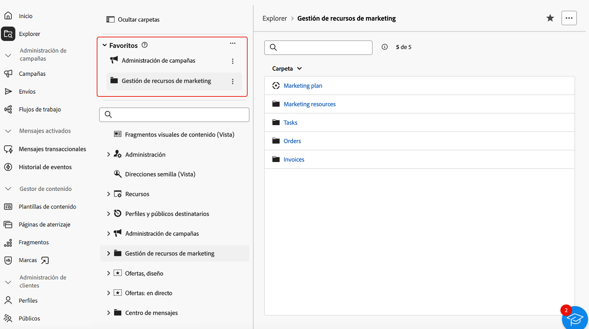{zoomable="yes"}</ph></source>
<target xml:lang="en-XX"><ph id="1" ctype="x-IMAGE">{zoomable="yes"}</ph></target>
</trans-unit>
<trans-unit id="tu47" xml:space="preserve">
<source xml:lang="en-US">Delete a folder</source>
<target xml:lang="en-XX">Eliminación de una carpeta</target>
</trans-unit>
<trans-unit id="tu48" xml:space="preserve">
<source xml:lang="en-US"><ph id="1" ctype="x-regxph" equiv-text="&lbrack;!CAUTION">[!CAUTION]</ph></source>
<target xml:lang="en-XX"><ph id="1" ctype="x-regxph" equiv-text="&lbrack;!CAUTION">[!CAUTION]</ph></target>
</trans-unit>
<trans-unit id="tu49" xml:space="preserve">
<source xml:lang="en-US">When deleting a folder, all data stored in the folder is also deleted.</source>
<target xml:lang="en-XX">Al eliminar una carpeta, también se eliminan todos los datos almacenados en ella.</target>
</trans-unit>
<trans-unit id="tu50" xml:space="preserve">
<source xml:lang="en-US">To delete a folder, select it in your <ph id="1" ctype="x-STRONG_EMPHASIS">**[!UICONTROL </ph>Explorer<ph id="3" ctype="x-LINK_REF">]**</ph> tree, and click on the <ph id="5" ctype="x-STRONG_EMPHASIS">**[!UICONTROL </ph>...<ph id="7" ctype="x-LINK_REF">]**</ph> menu. Choose <ph id="9" ctype="x-STRONG_EMPHASIS">**[!UICONTROL </ph>Delete folder<ph id="11" ctype="x-LINK_REF">]**</ph>.</source>
<target xml:lang="en-XX">Para eliminar una carpeta, selecciónela en el árbol de <ph id="1" ctype="x-STRONG_EMPHASIS">**[!UICONTROL </ph>Explorer<ph id="3" ctype="x-LINK_REF">]**</ph> y haga clic en el menú <ph id="5" ctype="x-STRONG_EMPHASIS">**[!UICONTROL </ph>…<ph id="7" ctype="x-LINK_REF">]**</ph>. Elija <ph id="9" ctype="x-STRONG_EMPHASIS">**[!UICONTROL </ph>Eliminar carpeta<ph id="11" ctype="x-LINK_REF">]**</ph>.</target>
</trans-unit>
<trans-unit id="tu51" xml:space="preserve">
<source xml:lang="en-US"><ph id="1" ctype="x-IMAGE">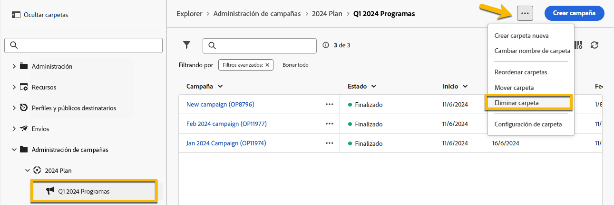{zoomable="yes"}</ph></source>
<target xml:lang="en-XX"><ph id="1" ctype="x-IMAGE">{zoomable="yes"}</ph></target>
</trans-unit>
<trans-unit id="tu52" xml:space="preserve">
<source xml:lang="en-US">Distribution of values in a folder</source>
<target xml:lang="en-XX">Distribución de valores en una carpeta</target>
</trans-unit>
<trans-unit id="tu53" xml:space="preserve">
<source xml:lang="en-US">The distribution of values helps you understand the percentage of a value in a column within a table.</source>
<target xml:lang="en-XX">La distribución de valores ayuda a comprender el porcentaje de un valor en una columna dentro de una tabla.</target>
</trans-unit>
<trans-unit id="tu54" xml:space="preserve">
<source xml:lang="en-US">To view the distribution of values in a folder, proceed as explained below.</source>
<target xml:lang="en-XX">Para ver la distribución de valores en una carpeta, proceda como se indica a continuación.</target>
</trans-unit>
<trans-unit id="tu55" xml:space="preserve">
<source xml:lang="en-US">For example, among the deliveries, you may want to know the distribution of values in the <ph id="1" ctype="x-STRONG_EMPHASIS">**</ph>Channel<ph id="2" ctype="x-STRONG_EMPHASIS">**</ph> column.</source>
<target xml:lang="en-XX">Por ejemplo, entre los envíos, se desea conocer la distribución de valores de la columna <ph id="1" ctype="x-STRONG_EMPHASIS">**</ph>Canal<ph id="2" ctype="x-STRONG_EMPHASIS">**</ph>.</target>
</trans-unit>
<trans-unit id="tu56" xml:space="preserve">
<source xml:lang="en-US">To get this information, go to the <ph id="1" ctype="x-STRONG_EMPHASIS">**[!UICONTROL </ph>Deliveries<ph id="3" ctype="x-LINK_REF">]**</ph> folder and click the <ph id="5" ctype="x-STRONG_EMPHASIS">**[!UICONTROL </ph>Configure columns<ph id="7" ctype="x-LINK_REF">]**</ph> icon.</source>
<target xml:lang="en-XX">Para obtener esta información, vaya a la carpeta <ph id="1" ctype="x-STRONG_EMPHASIS">**[!UICONTROL </ph>Envíos<ph id="3" ctype="x-LINK_REF">]**</ph> y haga clic en el icono <ph id="5" ctype="x-STRONG_EMPHASIS">**[!UICONTROL </ph>Configurar columnas<ph id="7" ctype="x-LINK_REF">]**</ph>.</target>
</trans-unit>
<trans-unit id="tu57" xml:space="preserve">
<source xml:lang="en-US">In the <ph id="1" ctype="x-STRONG_EMPHASIS">**[!UICONTROL </ph>Configure columns<ph id="3" ctype="x-LINK_REF">]**</ph> window, click the <ph id="5" ctype="x-STRONG_EMPHASIS">**[!UICONTROL </ph>Information<ph id="7" ctype="x-LINK_REF">]**</ph> icon related to the column you want to analyze. Then, click on the <ph id="9" ctype="x-STRONG_EMPHASIS">**[!UICONTROL </ph>Distribution of values<ph id="11" ctype="x-LINK_REF">]**</ph> button.</source>
<target xml:lang="en-XX">En la ventana <ph id="1" ctype="x-STRONG_EMPHASIS">**[!UICONTROL </ph>Configurar columnas<ph id="3" ctype="x-LINK_REF">]**</ph>, haga clic en el icono <ph id="5" ctype="x-STRONG_EMPHASIS">**[!UICONTROL </ph>Información<ph id="7" ctype="x-LINK_REF">]**</ph> de la columna de la que desee información. A continuación, haga clic en el botón <ph id="9" ctype="x-STRONG_EMPHASIS">**[!UICONTROL </ph>Distribución de valores<ph id="11" ctype="x-LINK_REF">]**</ph>.</target>
</trans-unit>
<trans-unit id="tu58" xml:space="preserve">
<source xml:lang="en-US"><ph id="1" ctype="x-IMAGE">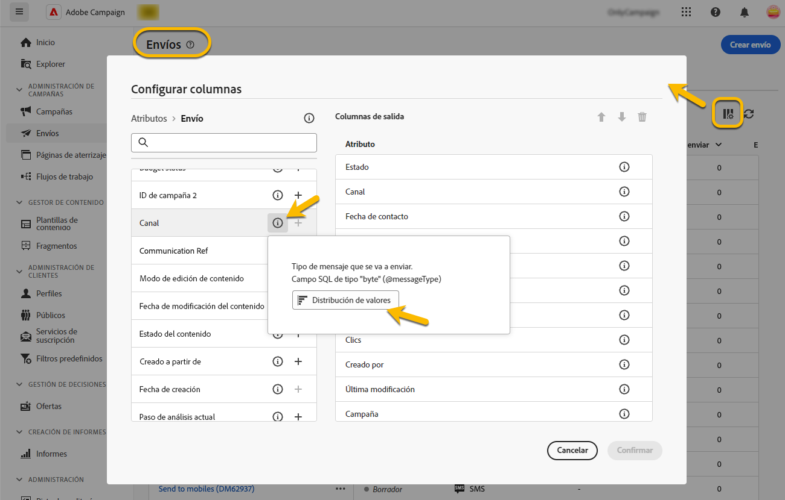{zoomable="yes"}</ph></source>
<target xml:lang="en-XX"><ph id="1" ctype="x-IMAGE">{zoomable="yes"}</ph></target>
</trans-unit>
<trans-unit id="tu59" xml:space="preserve">
<source xml:lang="en-US">You will see the percentage of values in the <ph id="1" ctype="x-STRONG_EMPHASIS">**[!UICONTROL </ph>Channel<ph id="3" ctype="x-LINK_REF">]**</ph> column.</source>
<target xml:lang="en-XX">Obtendrá el porcentaje de los valores de la columna <ph id="1" ctype="x-STRONG_EMPHASIS">**[!UICONTROL </ph>Canal<ph id="3" ctype="x-LINK_REF">]**</ph>.</target>
</trans-unit>
<trans-unit id="tu60" xml:space="preserve">
<source xml:lang="en-US"><ph id="1" ctype="x-IMAGE">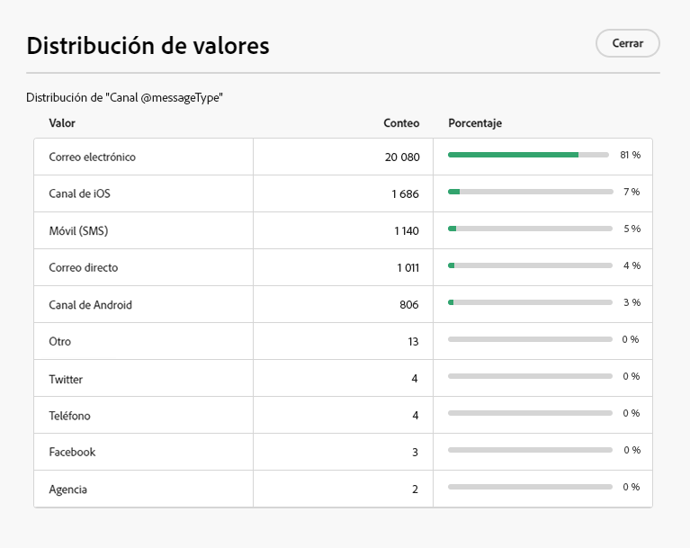{zoomable="yes"}</ph></source>
<target xml:lang="en-XX"><ph id="1" ctype="x-IMAGE">{zoomable="yes"}</ph></target>
</trans-unit>
<trans-unit id="tu61" xml:space="preserve">
<source xml:lang="en-US"><ph id="1" ctype="x-regxph" equiv-text="&lbrack;!NOTE">[!NOTE]</ph></source>
<target xml:lang="en-XX"><ph id="1" ctype="x-regxph" equiv-text="&lbrack;!NOTE">[!NOTE]</ph></target>
</trans-unit>
<trans-unit id="tu62" xml:space="preserve">
<source xml:lang="en-US">For columns with many values, only the first twenty values are displayed. A notification <ph id="1" ctype="x-STRONG_EMPHASIS">**[!UICONTROL </ph>Partial load<ph id="3" ctype="x-LINK_REF">]**</ph> warns you.</source>
<target xml:lang="en-XX">Para las columnas con muchos valores, solo se mostrarán los primeros veinte valores. Una notificación de <ph id="1" ctype="x-STRONG_EMPHASIS">**[!UICONTROL </ph>Carga parcial<ph id="3" ctype="x-LINK_REF">]**</ph> le avisa de esto.</target>
</trans-unit>
<trans-unit id="tu63" xml:space="preserve">
<source xml:lang="en-US">You can also view the distribution of values for a link.</source>
<target xml:lang="en-XX">También puede ver la distribución de valores de un vínculo.</target>
</trans-unit>
<trans-unit id="tu64" xml:space="preserve">
<source xml:lang="en-US">In the attributes list, click the <ph id="1" ctype="x-STRONG_EMPHASIS">**</ph>+<ph id="2" ctype="x-STRONG_EMPHASIS">**</ph> button next to the desired link, as shown below. This adds the link to the <ph id="3" ctype="x-STRONG_EMPHASIS">**[!UICONTROL </ph>Output columns<ph id="5" ctype="x-LINK_REF">]**</ph>. You can now access the <ph id="7" ctype="x-STRONG_EMPHASIS">**[!UICONTROL </ph>Information<ph id="9" ctype="x-LINK_REF">]**</ph> icon, allowing you to view the distribution of its values. If you do not want to keep the link in the <ph id="11" ctype="x-STRONG_EMPHASIS">**[!UICONTROL </ph>Output columns<ph id="13" ctype="x-LINK_REF">]**</ph>, click the <ph id="15" ctype="x-STRONG_EMPHASIS">**[!UICONTROL </ph>Cancel<ph id="17" ctype="x-LINK_REF">]**</ph> button.</source>
<target xml:lang="en-XX">En la lista de atributos, haga clic en el botón <ph id="1" ctype="x-STRONG_EMPHASIS">**</ph>+<ph id="2" ctype="x-STRONG_EMPHASIS">**</ph> situado junto al vínculo deseado, como se muestra a continuación. Esto añade el vínculo a las <ph id="3" ctype="x-STRONG_EMPHASIS">**[!UICONTROL </ph>Columnas de salida<ph id="5" ctype="x-LINK_REF">]**</ph>. Ahora puede acceder al icono <ph id="7" ctype="x-STRONG_EMPHASIS">**[!UICONTROL </ph>Información<ph id="9" ctype="x-LINK_REF">]**</ph>, que le permite ver la distribución de sus valores. Si no desea mantener el vínculo en las <ph id="11" ctype="x-STRONG_EMPHASIS">**[!UICONTROL </ph>Columnas de salida<ph id="13" ctype="x-LINK_REF">]**</ph>, haga clic en el botón <ph id="15" ctype="x-STRONG_EMPHASIS">**[!UICONTROL </ph>Cancelar<ph id="17" ctype="x-LINK_REF">]**</ph>.</target>
</trans-unit>
<trans-unit id="tu65" xml:space="preserve">
<source xml:lang="en-US"><ph id="1" ctype="x-IMAGE">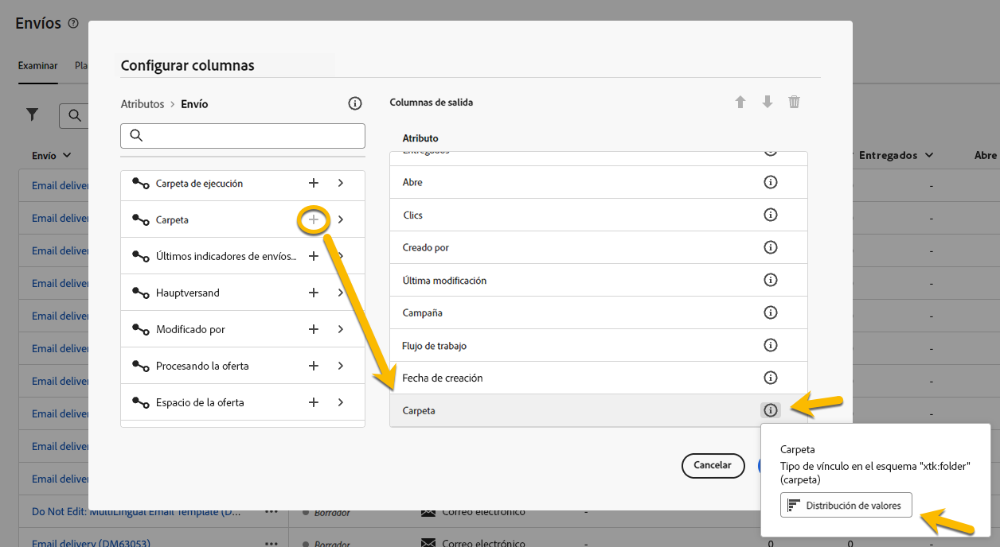{zoomable="yes"}</ph></source>
<target xml:lang="en-XX"><ph id="1" ctype="x-IMAGE">{zoomable="yes"}</ph></target>
</trans-unit>
<trans-unit id="tu66" xml:space="preserve">
<source xml:lang="en-US">It is also possible to view the distribution of values in a query modeler. <ph id="1" ctype="x-LINK">[</ph>Learn more here<ph id="2" ctype="x-LINK">](../query/build-query.md#distribution-of-values-in-a-query)</ph>.</source>
<target xml:lang="en-XX">También es posible visualizar la distribución de valores en un modelador de consultas. <ph id="1" ctype="x-LINK">[</ph>Más información aquí<ph id="2" ctype="x-LINK">](../query/build-query.md#distribution-of-values-in-a-query)</ph>.</target>
</trans-unit>
<trans-unit id="tu67" xml:space="preserve">
<source xml:lang="en-US">Filter the values</source>
<target xml:lang="en-XX">Filtro de los valores</target>
</trans-unit>
<trans-unit id="tu68" xml:space="preserve">
<source xml:lang="en-US">By using the <ph id="1" ctype="x-STRONG_EMPHASIS">**[!UICONTROL </ph>Advanced filters<ph id="3" ctype="x-LINK_REF">]**</ph> in the distribution of values window, you can filter results based on specified conditions.</source>
<target xml:lang="en-XX">Mediante los <ph id="1" ctype="x-STRONG_EMPHASIS">**[!UICONTROL </ph>filtros avanzados<ph id="3" ctype="x-LINK_REF">]**</ph> en la ventana de distribución de valores, puede filtrar los resultados según las condiciones especificadas.</target>
</trans-unit>
<trans-unit id="tu69" xml:space="preserve">
<source xml:lang="en-US">In the example of the delivery list above, which shows the distribution per channel, you can filter it to display only deliveries with a status of <ph id="1" ctype="x-STRONG_EMPHASIS">**</ph>Finished<ph id="2" ctype="x-STRONG_EMPHASIS">**</ph>.</source>
<target xml:lang="en-XX">En el ejemplo de la lista de envíos anterior, que muestra la distribución por canal, puede filtrarla para mostrar solo los envíos con el estado <ph id="1" ctype="x-STRONG_EMPHASIS">**</ph>Finalizado<ph id="2" ctype="x-STRONG_EMPHASIS">**</ph>.</target>
</trans-unit>
<trans-unit id="tu70" xml:space="preserve">
<source xml:lang="en-US"><ph id="1" ctype="x-IMAGE">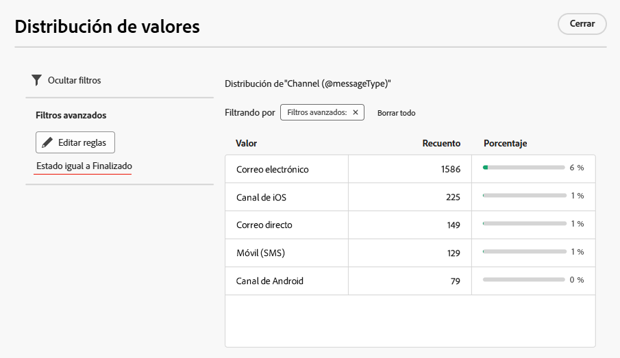{zoomable="yes"}</ph></source>
<target xml:lang="en-XX"><ph id="1" ctype="x-IMAGE">{zoomable="yes"}</ph></target>
</trans-unit>
</body>
</file>
</xliff>