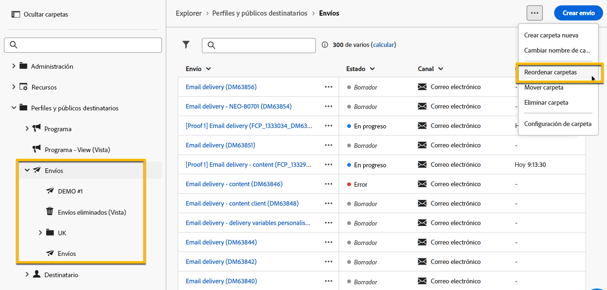
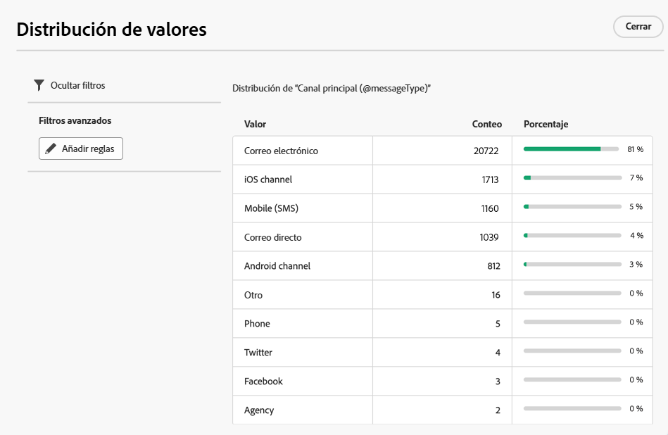
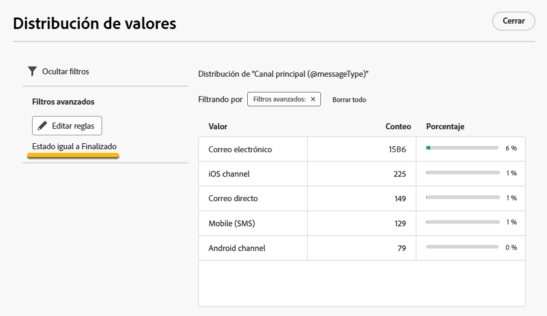

# Trabajo con carpetas {#folders}

>[!CONTEXTUALHELP]
>id="acw_folder_properties"
>title="Propiedades de carpetas"
>abstract="Propiedades de carpetas"

>[!CONTEXTUALHELP]
>id="acw_folder_security"
>title="Seguridad de carpetas"
>abstract="Seguridad de carpetas"

>[!CONTEXTUALHELP]
>id="acw_folder_restrictions"
>title="Restricciones de carpetas"
>abstract="Restricciones de carpetas"

>[!CONTEXTUALHELP]
>id="acw_folder_schedule"
>title="Programación de carpetas"
>abstract="Programación de carpetas"

## Acerca de las carpetas {#about-folders}

Las carpetas son objetos de Adobe Campaign que permiten organizar los componentes y los datos.

Puede crear, cambiar el nombre, reordenar y mover carpetas en el árbol de navegación. También puede eliminarlos en función de sus derechos.

{zoomable="yes"}

Puede configurar un tipo de carpeta. Por ejemplo, una carpeta de envíos. El icono de la carpeta cambia según su tipo.

## Creación de una nueva carpeta {#create-a-folder}

Para crear una carpeta nueva en la interfaz de usuario de Adobe Campaign Web, siga estos pasos:

1. En **[!UICONTROL Explorer]**, vaya a la carpeta donde desea crear la nueva carpeta. En el menú **[!UICONTROL ...]**, seleccione **[!UICONTROL Crear nueva carpeta]**.

{zoomable="yes"}

Al crear una carpeta nueva, el tipo de carpeta toma como valor predeterminado el tipo de carpeta principal. En este ejemplo, se crea una carpeta en la carpeta **[!UICONTROL Deliveries]**.

{zoomable="yes"}

1. Cambie el tipo de carpeta haciendo clic en el icono de tipo de carpeta si es necesario y seleccione el tipo deseado en la lista presentada, como se muestra a continuación:

{zoomable="yes"}

Configure el tipo de carpeta haciendo clic en el botón **[!UICONTROL Confirmar]**.

Si desea crear una carpeta sin un tipo específico, seleccione el tipo **[!UICONTROL Carpeta genérica]**.

También puede [crear y administrar carpetas en la consola de Adobe Campaign](https://experienceleague.adobe.com/es/docs/campaign/campaign-v8/config/configuration/folders-and-views).

## Reordenar carpetas {#reorder-folders}

Puede reordenar las carpetas según sus necesidades. Para ello, haga clic en **[!UICONTROL Reordenar carpetas]**, como se muestra a continuación.

En este ejemplo, la carpeta **Deliveries** contiene cuatro subcarpetas.

{zoomable="yes"}

Puede cambiar el orden de las carpetas arrastrando y soltando **o usando** flechas arriba y abajo **.**

{zoomable="yes"}

## Eliminación de una carpeta {#delete-a-folder}

>[!CAUTION]
>
>Al eliminar una carpeta, también se eliminan todos los datos almacenados en ella.

Para eliminar una carpeta, selecciónela en el árbol **[!UICONTROL Explorer]** y haga clic en el menú **[!UICONTROL ...]**. Elija **[!UICONTROL Eliminar carpeta]**.

{zoomable="yes"}

## Distribución de valores en una carpeta {#distribution-values-folder}

La distribución de valores ayuda a comprender el porcentaje de un valor en una columna dentro de una tabla.

Para ver la distribución de los valores en una carpeta, proceda como se explica a continuación.

Por ejemplo, entre las entregas, es posible que desee conocer la distribución de los valores en la columna **Canal**.

Para obtener esta información, vaya a la carpeta **[!UICONTROL Deliveries]** y haga clic en el icono **[!UICONTROL Configurar columnas]**.

En la ventana **[!UICONTROL Configurar columnas]**, haga clic en el icono **[!UICONTROL Información]** relacionado con la columna que desea analizar. A continuación, haga clic en el botón **[!UICONTROL Distribución de valores]**.

{zoomable="yes"}

Verá el porcentaje de valores en la columna **[!UICONTROL Canal]**.

{zoomable="yes"}

>[!NOTE]
>
>Para las columnas con muchos valores, solo se muestran los veinte primeros valores. Una notificación **[!UICONTROL Carga parcial]** le advierte.

También puede ver la distribución de los valores de un vínculo.

En la lista de atributos, haga clic en el botón **+** situado junto al vínculo deseado, como se muestra a continuación. Esto añade el vínculo a las **[!UICONTROL Columnas de salida]**. Ahora puede acceder al icono **[!UICONTROL Información]**, que le permite ver la distribución de sus valores. Si no desea mantener el vínculo en las **[!UICONTROL Columnas de salida]**, haga clic en el botón **[!UICONTROL Cancelar]**.

{zoomable="yes"}

También es posible ver la distribución de los valores en un modelador de consultas. [Más información aquí](../query/build-query.md#distribution-of-values-in-a-query).

### Filtro de los valores {#filter-values}

Mediante los **[!UICONTROL filtros avanzados]** en la ventana de distribución de valores, puede filtrar los resultados según las condiciones especificadas.

En el ejemplo de la lista de envíos anterior, que muestra la distribución por canal, puede filtrarla para mostrar solo los envíos con un estado de **Finalizado**.

{zoomable="yes"}