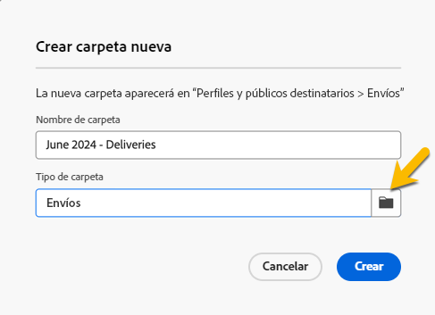

# Trabajar con carpetas {#folders}

>[!CONTEXTUALHELP]
>id="acw_folder_properties"
>title="Propiedades de carpetas"
>abstract="Propiedades de carpetas"

>[!CONTEXTUALHELP]
>id="acw_folder_security"
>title="Seguridad de carpetas"
>abstract="Seguridad de carpetas"

>[!CONTEXTUALHELP]
>id="acw_folder_restrictions"
>title="Restricciones de carpetas"
>abstract="Restricciones de carpetas"

>[!CONTEXTUALHELP]
>id="acw_folder_schedule"
>title="Programación de carpetas"
>abstract="Programación de carpetas"

## Acerca de las carpetas

Las carpetas son objetos de Adobe Campaign que permiten organizar los componentes y los datos.

Puede crear, cambiar el nombre, reordenar y mover carpetas en el árbol de navegación. También puede eliminarlos según sus derechos.

{zoomable="yes"}

Puede configurar un tipo de carpeta. Por ejemplo: una carpeta de envíos.
El icono de la carpeta cambia según este tipo.

## Crear una carpeta nueva

Para crear una carpeta nueva en la interfaz de usuario web de Adobe Campaign, siga estos pasos:

1. En **[!UICONTROL Explorer]**, vaya a la carpeta en la que desea crear la nueva carpeta.
En el menú **[!UICONTROL ...]**, tiene **[!UICONTROL Crear nueva carpeta]**

{zoomable="yes"}

Al crear una carpeta nueva, de forma predeterminada, el tipo de carpeta es el tipo de carpeta principal.
En nuestro ejemplo, creamos una carpeta en la carpeta **[!UICONTROL Deliveries]**.

{zoomable="yes"}

1. Cambie el tipo de su carpeta haciendo clic en el icono de Tipo de carpeta si es necesario y selecciónela en la lista presentada, como se muestra a continuación:

{zoomable="yes"}

Configure el tipo de carpeta haciendo clic en el botón **[!UICONTROL Confirmar]**.

Si desea crear una carpeta sin un tipo específico, elija **[!UICONTROL Carpeta genérica]** tipo.

También puede [crear y administrar carpetas en la consola de Adobe Campaign](https://experienceleague.adobe.com/en/docs/campaign/campaign-v8/config/configuration/folders-and-views).

## Eliminar una carpeta

>[!CAUTION]
>
>Al eliminar una carpeta, también se eliminan todos los datos almacenados en ella.

Para eliminar una carpeta, selecciónela en el árbol **[!UICONTROL Explorer]** y haga clic en el menú **[!UICONTROL ...]**.
Elija **[!UICONTROL Eliminar carpeta]**.

{zoomable="yes"}
