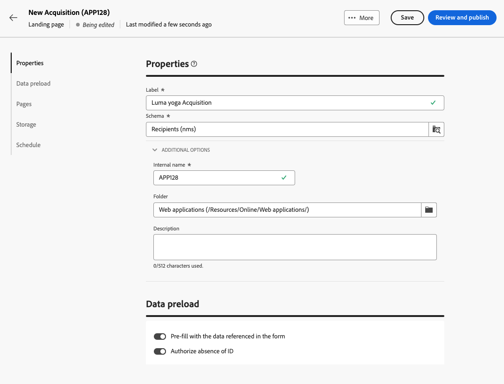
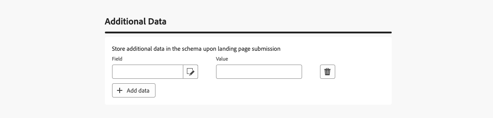
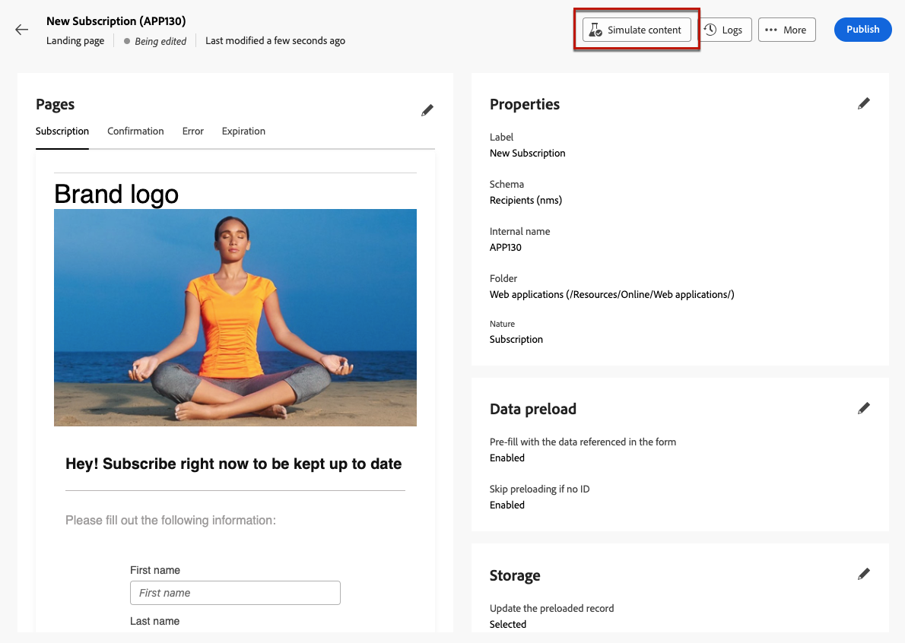
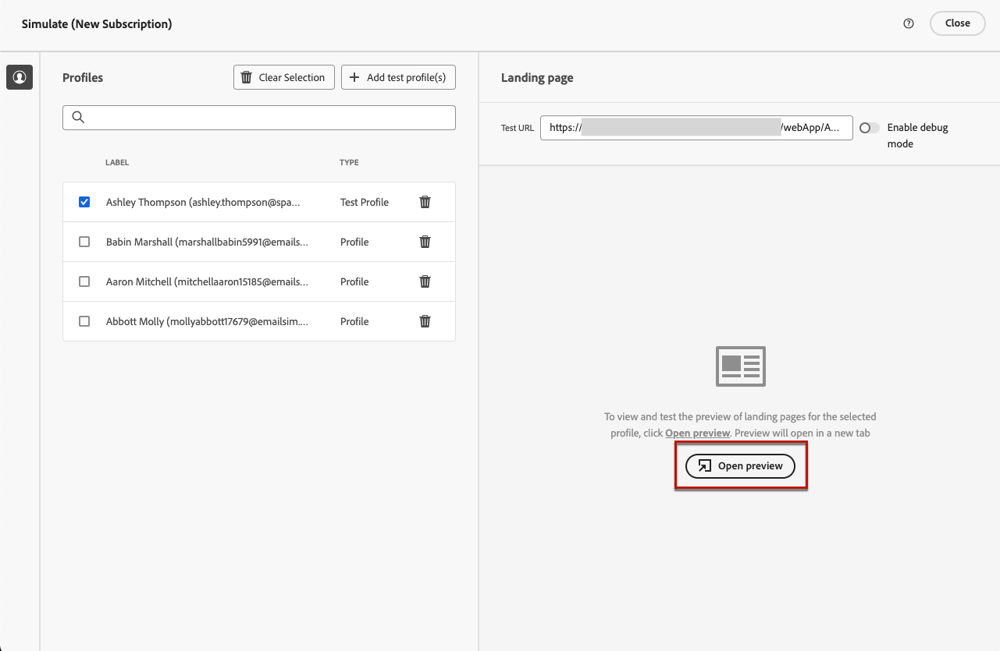
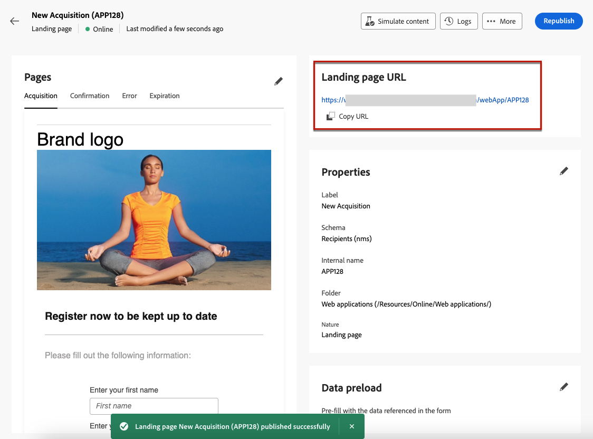

# Creación y publicación de páginas de destino {#create-lp}

>[!CONTEXTUALHELP]
>id="acw_landingpages_menu"
>title="Creación y administración de páginas de destino"
>abstract="Adobe Campaign le permite crear, diseñar y compartir páginas de destino para dirigir a los usuarios a las páginas web en línea en las que puede administrar la adquisición, suscribirse o darse de baja e incluir en la lista de bloqueados los casos de uso, en función de las plantillas integradas."

La interfaz de usuario web de Campaign permite crear, diseñar y publicar páginas de destino. Una vez publicado, puede insertar un vínculo al formulario en una entrega. Después de que los destinatarios hagan clic en ese vínculo, se les dirige a la página de aterrizaje correspondiente.

[!DNL Adobe Campaign] viene con cuatro plantillas para administrar los siguientes casos de uso: **acquisition**, **suscripción**, **baja**, y **lista de bloqueados de**. [Más información](lp-use-cases.md)

## Acceso a páginas de aterrizaje {#access-landing-pages}

Para acceder a la lista de página de aterrizaje, seleccione **[!UICONTROL Administración de campañas]** > **[!UICONTROL Páginas de aterrizaje]** en el menú de la izquierda.

{zoomable="yes"}

El **[!UICONTROL Páginas de aterrizaje]** inventory muestra todos los artículos creados. Puede filtrarlos con el **[!UICONTROL Mostrar filtros]** botón. Puede restringir los resultados a un específico [carpeta](../get-started/permissions.md#folders) mediante la lista desplegable o agregue reglas utilizando la variable [modelador de consultas](../query/query-modeler-overview.md).

{zoomable="yes"}

<!--From this list, you can access the [landing page Live report](../reports/lp-report-live.md) or [landing page Global report](../reports/lp-report-global.md) for published items.-->

>[!CAUTION]
>
>No puede mostrar ni editar páginas de destino creadas desde la consola del cliente (formularios web) en la interfaz de usuario web de Campaign. Obtenga más información en la [Documentación de la consola de Campaign](https://experienceleague.adobe.com/docs/campaign/campaign-v8/content/webapps.html?lang=es){target="_blank"}.

<!--If you unpublish a landing page which is referenced in a message, the link to the landing page will be broken and an error page will be displayed. You cannot delete a published landing page. To delete it, you must first unpublish it.-->

Puede duplicar o eliminar una página de aterrizaje. Haga clic en los puntos suspensivos junto a una página de aterrizaje para seleccionar la acción deseada.

## Creación de una página de aterrizaje {#create-landing-page}

>[!CONTEXTUALHELP]
>id="acw_landingpages_properties"
>title="Definición de las propiedades de la página de aterrizaje"
>abstract="Rellene los campos de propiedades como la etiqueta y modifique el esquema si es necesario. Además, puede editar el nombre interno, cambiar la carpeta donde se almacena la página de aterrizaje y proporcionar una descripción."

>[!CONTEXTUALHELP]
>id="acw_landingpages_pages_list"
>title="Defina el contenido de cada página"
>abstract="Ajuste el contenido de cada página que forma parte de esta página de aterrizaje, como el propio formulario, la página de confirmación que se muestra al enviar el formulario o la página a la que se dirige a los usuarios en caso de que se produzca un error."

>[!CONTEXTUALHELP]
>id="acw_landingpages_schedule"
>title="Programación de la página de aterrizaje"
>abstract="Puede definir una fecha de inicio y una fecha de finalización para la página de aterrizaje. Cuando la página llega al final del periodo de validez, el formulario ya no está disponible. En su lugar, se muestra la página **Caducidad**."

>[!CONTEXTUALHELP]
>id="acw_landingpages_preload"
>title="Definir opciones de precarga"
>abstract="Cuando la opción **Rellene previamente los datos a los que se hace referencia en el formulario** está seleccionada, si el visitante de la página de aterrizaje coincide con un perfil de la base de datos, la información del perfil se precarga automáticamente en el formulario. Con la opción **Autorizar ausencia de ID** seleccionada, cualquier visitante, incluidos los usuarios anónimos, puede acceder a la página de aterrizaje."

<!--With the **Skip preloading if no ID** option selected, each profile entered will be added to the database after approval of the form."-->

>[!CONTEXTUALHELP]
>id="acw_landingpages_storage"
>title="Definir opciones de almacenamiento"
>abstract="La sección de precarga le permite indicar cómo buscar el registro que se actualiza en la base de datos."

<!--The main steps to create landing pages are as follows:

{zoomable="yes"}-->

Para crear una página de aterrizaje, siga estos pasos:

1. Desde el **[!UICONTROL Páginas de aterrizaje]** inventario, haga clic en **[!UICONTROL Crear página de aterrizaje]**.

   {zoomable="yes"}

1. Seleccione una plantilla:
   * **[!UICONTROL Adquisición]**: Esta es la plantilla predeterminada para páginas de aterrizaje, que le permite capturar y actualizar datos de perfil.
   * **[!UICONTROL Suscripción]**: utilice esta plantilla para permitir a los usuarios suscribirse a un [servicio](../audience/manage-services.md).
   * **[!UICONTROL Baja]**: Esta plantilla se puede utilizar en una entrega enviado a los suscriptores de un servicio para permitirles cancelar su suscripción [servicio](../audience/manage-services.md).
   * **[!UICONTROL Lista de bloqueados de]**: Esta plantilla debe utilizarse cuando un perfil hace clic en un vínculo de no participación en una entrega y ya no desea que se le contacte.

   {zoomable="yes"}

   >[!NOTE]
   >
   >Aprenda a implementar los diferentes casos de uso correspondientes a cada plantilla en [esta página](lp-use-cases.md).

1. Haga clic en **[!UICONTROL Create]**.

1. Rellene el **[!UICONTROL Propiedades]** campos como la etiqueta.

   De forma predeterminada, las páginas de aterrizaje se almacenan en **[!UICONTROL Aplicaciones web]** carpeta. Puede cambiarlo navegando a la ubicación deseada en la **[!UICONTROL Opciones adicionales]**. [Aprenda a trabajar con carpetas](../get-started/permissions.md#folders)

   {zoomable="yes"}

1. En el **[!UICONTROL Precarga de datos]** , están disponibles las dos opciones siguientes:

   * Cuando la opción **[!UICONTROL Rellene previamente los datos a los que se hace referencia en el formulario]** está seleccionada, si el visitante de la página de aterrizaje coincide con un perfil de la base de datos, la información del perfil se precarga automáticamente en el formulario. El usuario solo tiene que rellenar los campos que faltan y actualizar los valores existentes si es necesario. Esto permite combinar datos para perfiles existentes en lugar de crear duplicados.

     >[!NOTE]
     >
     >Esta opción está seleccionada de forma predeterminada para todas las plantillas de página de aterrizaje.

   <!--* The **[!UICONTROL Skip preloading if no ID]** option must be selected if you do not wish to update profiles. In this case, each profile entered will be added to the database after approval of the form. This option is used, for example, when the form is posted on a website.-->

   * El **[!UICONTROL Autorizar ausencia de ID]** permite que cualquier visitante acceda a la página de aterrizaje. Si se anula la selección de esta opción, se impide que los visitantes anónimos la utilicen, lo que significa que solo los usuarios identificados pueden acceder al formulario y enviarlo.

     >[!AVAILABILITY]
     >
     >Esta capacidad se encuentra en disponibilidad limitada (LA). Está restringido a los clientes que migran **de Adobe Campaign Standard a la versión 8 de Adobe Campaign** y no se puede implementar en ningún otro entorno.

     Para el **[!UICONTROL Adquisición]** y **[!UICONTROL Suscripción]** plantillas, esta opción está seleccionada de forma predeterminada. Para el **[!UICONTROL Baja]** y **[!UICONTROL Lista de bloqueados de]** plantillas, esta opción no está seleccionada de forma predeterminada y no se puede modificar<!--as per ticket - TBC? in that case, is it greyed out or doesn't display?-->.

1. Una página de aterrizaje puede tener páginas posteriores. Para agregar páginas, examine la **[!UICONTROL Páginas]** y haga clic en la sección **[!UICONTROL Editar contenido]** para cada página que desee diseñar para esta página de aterrizaje. El contenido de cada página ya está rellenado previamente. Edítelos según sea necesario. [Más información](lp-content.md)

   {zoomable="yes"}

1. En el **[!UICONTROL Almacenamiento]** , la sección **[!UICONTROL Actualización del registro cargado previamente]** está seleccionada de forma predeterminada. Permite actualizar los perfiles almacenados en la base de datos a través de la página de aterrizaje. La casilla de precarga le permite indicar cómo buscar el registro que se actualiza en la base de datos.

   También puede elegir entre los campos del contexto actual de la página de aterrizaje, los que se utilizan para encontrar el perfil correspondiente en la base de datos. Para ello, anule la selección del **[!UICONTROL Actualización del registro cargado previamente]** y marque los campos deseados en **[!UICONTROL Opciones de reconciliación]**.

   {zoomable="yes"}

1. Crear **[!UICONTROL Datos adicionales]** para almacenar datos internos cuando se envía la página de aterrizaje. Estos datos no son visibles para los usuarios que visitan la página. Solo se tienen en cuenta los valores constantes.

   >[!AVAILABILITY]
   >
   >Esta capacidad se encuentra en disponibilidad limitada (LA). Está restringido a los clientes que migran **de Adobe Campaign Standard a la versión 8 de Adobe Campaign** y no se puede implementar en ningún otro entorno.

   {zoomable="yes"}

1. Puede definir una fecha de inicio y una fecha de finalización para la página de aterrizaje. Seleccionar **[!UICONTROL Habilitar programación]** y fije las fechas.

   {zoomable="yes"}

   * La página de aterrizaje se publica automáticamente en la fecha y la hora de inicio especificadas.

     >[!NOTE]
     >
     >Si no se define ninguna fecha de inicio, la página de aterrizaje se activa en cuanto se publica.

   * Cuando la página alcanza la fecha de finalización, <!--the landing page is automatically unpublished and -->el formulario ya no está disponible. En su lugar, se muestra la página **[!UICONTROL Caducidad]**.

     >[!NOTE]
     >
     >Por motivos de seguridad y el rendimiento de la plataforma, Adobe recomienda establecer una fecha de finalización.

1. Clic **[!UICONTROL Revisión y publicación]**.

Una vez definidos todos los ajustes y [concebido](lp-content.md) todas las páginas, puede [prueba](#test-landing-page) y [publicar](#publish-landing-page) su página de aterrizaje, tal y como se detalla a continuación.

## Prueba de la página de aterrizaje {#test-landing-page}

>[!CONTEXTUALHELP]
>id="acw_landingpages_simulate"
>title="Simulación de la página de aterrizaje"
>abstract="Puede ver una vista previa de la página de aterrizaje en la interfaz de usuario web de Campaign o abrirla en una nueva pestaña del explorador web."

>[!CONTEXTUALHELP]
>id="ac_preview_lp_profiles"
>title="Previsualizar y probar la página de aterrizaje"
>abstract="Una vez que haya definido la configuración y el contenido de la página de aterrizaje, puede utilizar perfiles de prueba para previsualizarlos."

Una vez definida la configuración y el contenido de la página de aterrizaje, puede utilizar perfiles de prueba para previsualizarlo. Si ha insertado [contenido personalizado](../personalization/gs-personalization.md), podrá comprobar cómo se muestra este contenido en la página de aterrizaje mediante los datos de perfil de prueba.

>[!CAUTION]
>
>Debe tener perfiles de prueba disponibles para poder previsualizar los mensajes y enviar pruebas. [Más información sobre los perfiles de prueba](../audience/test-profiles.md)

Para probar la página de aterrizaje, siga estos pasos:

1. Después de hacer clic en **[!UICONTROL Revisión y publicación]**, seleccione la **[!UICONTROL Simular contenido]** del panel de página de aterrizaje para acceder a la selección del perfil de prueba.

   {zoomable="yes"}

1. Desde el **[!UICONTROL Simular]** , seleccione uno o más perfiles de prueba.

   Los pasos para seleccionar perfiles de prueba son los mismos que al probar un mensaje. Se encuentran detalladas en la [Previsualización y prueba](../preview-test/preview-test.md) sección.

1. Al probar una página de aterrizaje dinámica (con la variable **[!UICONTROL Servicio desde URL]** opción seleccionada - [obtenga más información](../landing-pages/create-lp.md#define-actions-on-form-submission)

1. Seleccionar **[!UICONTROL Abrir vista previa]** para probar la página de aterrizaje.

   {zoomable="yes"}

1. La vista previa de la página de aterrizaje se abrirá en una nueva pestaña. Los elementos personalizados se sustituyen por los datos de perfil de prueba seleccionados.

   Si seleccionó la **[!UICONTROL Rellene previamente los datos a los que se hace referencia en el formulario]** opción en la configuración de la página de aterrizaje, los campos del formulario se rellenan automáticamente previamente con los datos del perfil de prueba correspondientes.<!--TBC-->

   {zoomable="yes"}

1. Seleccione otros perfiles de prueba para previsualizar el procesamiento de cada variante de la página de aterrizaje.

<!--Can you preview Confirmation/Error/Expiration pages?-->

## Publicar la página de aterrizaje {#publish-landing-page}

Una vez que la página de aterrizaje esté lista y validada, publíquela para que esté disponible para su uso en una entrega con el botón correspondiente.

Una vez publicado:

* La página de aterrizaje se agrega a la lista de página de aterrizaje con la variable **[!UICONTROL Publicado]** estado. Ahora está activo y listo para que se le haga referencia en su contenido.

* Puede copiar y pegar el **[!UICONTROL URL de página de aterrizaje]** que se muestra en la parte superior de la página en un explorador web para previsualizar la página de aterrizaje.

>[!CAUTION]
>
>Para probar o aprovechar al máximo la página de aterrizaje, no puede copiar y pegar este vínculo directamente en un explorador web o en los envíos. En su lugar, utilice el [Simular contenido](#test-landing-page) función para probarla y siga los pasos descritos en [esta sección](lp-use-cases.md) para utilizar correctamente su página de aterrizaje.

{zoomable="yes"}

Puede monitorizar el impacto de su página de aterrizaje mediante registros<!--and specific reports-->. Haga clic en **[!UICONTROL Registros]** botón.
