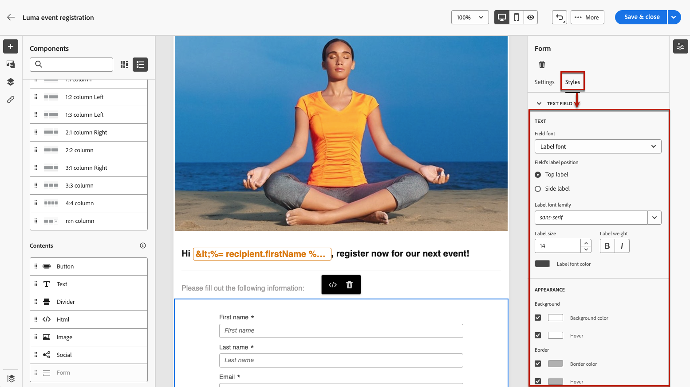

# Definición del contenido específico de la página de aterrizaje {#lp-content}

>[!CONTEXTUALHELP]
>id="ac_lp_components"
>title="Usar componentes de contenido"
>abstract="Los componentes de contenido son marcadores de posición de contenido vacíos que se pueden utilizar para crear el diseño de una página de aterrizaje. Para definir contenido específico que permita a los usuarios seleccionar y enviar sus opciones, utilice el componente de formulario."

Al editar el contenido de cualquier página de la página de aterrizaje, ya está rellenado previamente.

La primera página, que se muestra inmediatamente a los usuarios después de que hacen clic en el vínculo a la página de aterrizaje, ya está rellenada con el [componente de formulario específico de la página de aterrizaje](#use-form-component) para la plantilla seleccionada<!-- to enable users to select and submit their choices-->. También puede definir lo siguiente [estilos para la página de aterrizaje](#lp-form-styles).

Para diseñar aún más el contenido de la página de aterrizaje, puede utilizar los mismos componentes que para un correo electrónico. [Más información](../email/content-components.md#add-content-components)

El contenido del **[!UICONTROL Confirmación]**, **[!UICONTROL Error]** y **[!UICONTROL Caducidad]** páginas también está rellenado previamente. Edítelos según sea necesario.

## Uso del componente del formulario {#use-form-component}

>[!CONTEXTUALHELP]
>id="ac_lp_formfield"
>title="Definir los campos del componente de formulario"
>abstract="Defina cómo verán y enviarán sus opciones los destinatarios desde la página de aterrizaje."

>[!CONTEXTUALHELP]
>id="acw_landingpages_calltoaction"
>title="Qué sucede al hacer clic en el botón"
>abstract="Defina lo que sucederá cuando los usuarios envíen el formulario de página de aterrizaje."

Para definir contenido específico que permita a los usuarios seleccionar y enviar sus opciones desde la página de aterrizaje, utilice el **[!UICONTROL Form]** componente. Para ello, siga los pasos a continuación.

1. La página de aterrizaje específica **[!UICONTROL Form]** El componente ya se muestra en el lienzo de la plantilla seleccionada.

   >[!NOTE]
   >
   >El **[!UICONTROL Form]** El componente solo se puede utilizar una vez en la misma página.

1. Selecciónelo. El **[!UICONTROL Contenido de formulario]** La pestaña se muestra en la paleta derecha para permitirle editar los diferentes campos del formulario.

   

   >[!NOTE]
   >
   >Cambie a la **[!UICONTROL Estilos]** en cualquier momento para editar los estilos del contenido del componente del formulario. [Más información](#lp-form-styles)

1. Expanda el primer campo de texto, si lo hay, o agregue uno con la variable **[!UICONTROL Añadir]** botón. Desde el **[!UICONTROL Campo de texto 1]** , puede editar el tipo de campo, el campo de base de datos que desea actualizar, la etiqueta y el texto que se mostrará dentro del campo antes de que los usuarios introduzcan un valor.

   

1. Compruebe la **[!UICONTROL Definir campo de formulario como obligatorio]** si es necesario. En ese caso, la página de aterrizaje solo se puede enviar si el usuario ha rellenado este campo.

   >[!NOTE]
   >
   >Si no se rellena un campo obligatorio, aparece un mensaje de error cuando el usuario envía la página.

1. Expanda la casilla de verificación, si la hay, o agregue una usando la variable **[!UICONTROL Añadir]** botón. Seleccione si esa casilla de verificación debe actualizar un servicio o un campo de la base de datos.

   

   Si selecciona **[!UICONTROL Suscripción y servicios]**, seleccione un servicio de la lista y elija entre las dos opciones siguientes:

   * **[!UICONTROL Suscribirse si está marcado]**: los usuarios deben marcar la casilla de verificación para el consentimiento (inclusión).
   * **[!UICONTROL Cancelar suscripción si está marcado]**: los usuarios deben marcar la casilla para eliminar su consentimiento (exclusión).

   Si selecciona **[!UICONTROL Campo]**, seleccione un campo de la lista atributos y elija entre las dos opciones siguientes:

   * **[!UICONTROL Sí si está marcado]**<!--TBC-->

   * **[!UICONTROL No si está marcado]**<!--TBC-->

1. Puede eliminar y agregar tantos campos (como campos de texto, botones de opción, casillas de verificación, listas desplegables, etc.) según sea necesario.

1. Una vez añadidos o actualizados todos los campos, haga clic en **[!UICONTROL Llamada a la acción]** para expandir la sección correspondiente. Permite definir el comportamiento del botón en la variable **[!UICONTROL Form]** componente.

   

1. Defina lo que sucederá al hacer clic en el botón:

   * **[!UICONTROL Página de confirmación]**: se redirigirá al usuario al **[!UICONTROL Confirmación]** página establecida para la página de aterrizaje actual.

   * **[!UICONTROL URL de redireccionamiento]**: introduzca la dirección URL de la página a la que se redirigirá a los usuarios.

1. Si desea realizar actualizaciones adicionales al enviar el formulario, seleccione **[!UICONTROL Actualizaciones adicionales]** y seleccione el elemento que desee actualizar:
   * Un servicio de suscripción: en ese caso, defina si desea incluir o excluir a los usuarios al enviar el formulario.
   * La dirección de correo electrónico utilizada al rellenar el formulario.
   * Todos los canales: al enviar el formulario, los usuarios se incluyen o excluyen (según la plantilla seleccionada) de todas las comunicaciones de la marca en todos los canales
   * Un campo de la base de datos: seleccione un campo de la lista de atributos y defina si debe establecerse en True o False al enviar el formulario.

   

1. Guarde el contenido para volver al [propiedades de página de aterrizaje](create-lp.md#create-landing-page).

## Definir estilos de formulario de una página de aterrizaje {#lp-form-styles}

1. Para modificar los estilos del contenido del componente del formulario, cambie en cualquier momento al **[!UICONTROL Estilos]** pestaña.

1. El **[!UICONTROL Campo de texto]** se expande de forma predeterminada. Permite editar el aspecto de los campos de texto, como la fuente de la etiqueta, la posición de la etiqueta, el color de fondo del campo o el borde del campo.

   

1. Expanda el **[!UICONTROL Casilla]** para definir el aspecto de las casillas de verificación y el texto correspondiente. Por ejemplo, puede ajustar la familia y el tamaño de la fuente o el color del borde de la casilla de verificación.

   

1. Expanda y edite cualquier otra sección correspondiente a otros campos que haya agregado (botón de opción, lista desplegable, fecha y hora, etc.) a su formulario.

1. Expanda el **[!UICONTROL Llamada a la acción]** para modificar el aspecto del botón en el formulario de componentes. Por ejemplo, puede cambiar la fuente, agregar un borde, editar el color de la etiqueta al pasar el ratón por encima o ajustar la alineación del botón.

   

   Puede obtener una vista previa de algunos de los ajustes, como el color de la etiqueta del botón al pasar el ratón por encima, utilizando **[!UICONTROL Simular contenido]** botón. [Más información](create-lp.md#test-landing-page)

1. Guarde los cambios.
