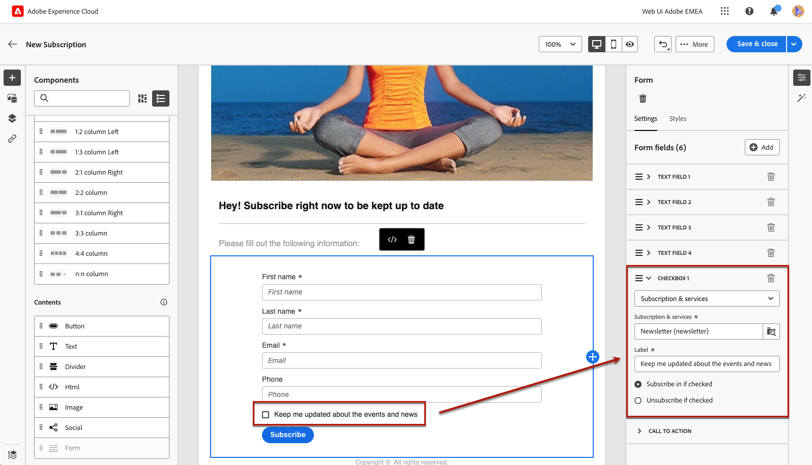

# Definición del contenido específico de la página de aterrizaje {#lp-content}

>[!CONTEXTUALHELP]
>id="ac_lp_components"
>title="Usar componentes de contenido"
>abstract="Los componentes de contenido son marcadores de posición de contenido vacíos que se pueden utilizar para crear el diseño de una página de aterrizaje. Para definir contenido específico que permita a los usuarios seleccionar y enviar sus opciones, utilice el componente de formulario."

Al editar el contenido de cualquier página de la página de aterrizaje, ya está rellenado previamente.

La primera página, que se muestra inmediatamente a los usuarios después de que hacen clic en el vínculo a la página de aterrizaje, ya está rellenada con el [componente de formulario específico de la página de aterrizaje](#use-form-component) para que la plantilla seleccionada permita a los usuarios seleccionar y enviar sus opciones. También puede definir lo siguiente [estilos específicos de páginas de aterrizaje](#lp-form-styles).

Para diseñar aún más el contenido de la página de aterrizaje, puede utilizar los mismos componentes que para un correo electrónico. [Más información](../email/content-components.md#add-content-components)

El contenido del **[!UICONTROL Confirmación]**, **[!UICONTROL Error]** y **[!UICONTROL Caducidad]** páginas también está rellenado previamente. Edítelos según sea necesario.

## Uso del componente del formulario {#use-form-component}

>[!CONTEXTUALHELP]
>id="ac_lp_formfield"
>title="Definir los campos del componente de formulario"
>abstract="Defina cómo verán y enviarán sus opciones los destinatarios desde la página de aterrizaje."

>[!CONTEXTUALHELP]
>id="acw_landingpages_calltoaction"
>title="Qué sucede al hacer clic en el botón"
>abstract="Defina lo que sucederá cuando los usuarios envíen el formulario de página de aterrizaje."

Para definir contenido específico que permita a los usuarios seleccionar y enviar sus opciones desde la página de aterrizaje, utilice el **[!UICONTROL Form]** componente. Para ello, siga los pasos a continuación.

1. La página de aterrizaje específica **[!UICONTROL Form]** El componente ya se muestra en el lienzo de la plantilla seleccionada.

   >[!NOTE]
   >
   >El **[!UICONTROL Form]** El componente solo se puede utilizar una vez en la misma página.

1. Selecciónelo. El **[!UICONTROL Contenido de formulario]** La pestaña se muestra en la paleta derecha para permitirle editar los diferentes campos del formulario.

   

   >[!NOTE]
   >
   >Cambie a la **[!UICONTROL Estilos]** en cualquier momento para editar los estilos del contenido del componente del formulario. [Más información](#lp-form-styles)

1. Expanda el primer campo de texto. Desde el **[!UICONTROL Campo de texto 1]** , puede editar el tipo de campo, el campo de la base de datos, la etiqueta y el texto que se mostrará dentro del campo antes de que el usuario rellene el campo.

   

1. Compruebe la **[!UICONTROL Definir campo de formulario como obligatorio]** si es necesario. En ese caso, la página de aterrizaje solo se puede enviar si el usuario ha rellenado este campo.

   >[!NOTE]
   >
   >Si no se rellena un campo obligatorio, aparece un mensaje de error cuando el usuario envía la página.

1. Agregue una casilla de verificación. Seleccione si esa casilla de verificación debe actualizar un servicio o un campo de la base de datos.

   

   Defina si esta casilla de verificación incluye o excluye a los usuarios. Seleccione entre las dos opciones siguientes:

   * **[!UICONTROL Suscribirse si está marcado]**: los usuarios deben marcar la casilla de verificación para el consentimiento (inclusión).
   * **[!UICONTROL Cancelar suscripción si está marcado]**: los usuarios deben marcar la casilla para eliminar su consentimiento (exclusión).

1. Puede eliminar y agregar tantos campos de texto o casillas de verificación como sea necesario.

1. Una vez añadidas todas las casillas de verificación o campos de texto deseados, haga clic en **[!UICONTROL Llamada a la acción]** para expandir la sección correspondiente. Permite definir el comportamiento del botón en la variable **[!UICONTROL Form]** componente.

   

1. Defina lo que sucederá al hacer clic en el botón:

   * **[!UICONTROL Página de confirmación]**: se redirigirá al usuario al **[!UICONTROL Confirmación]** página establecida para la página de aterrizaje actual.

   * **[!UICONTROL URL de redireccionamiento]**: introduzca la dirección URL de la página a la que se redirigirá a los usuarios.

1. Si desea realizar actualizaciones adicionales al enviar el formulario, seleccione **[!UICONTROL Actualizaciones adicionales]**, elija **[!UICONTROL Opt-in]** o **[!UICONTROL Opción de exclusión]** y defina si desea actualizar una lista de suscripción, el canal o solo la dirección de correo electrónico utilizada.

   

1. Guarde el contenido para volver al [propiedades de página de aterrizaje](create-lp.md).

## Definir estilos de formulario de una página de aterrizaje {#lp-form-styles}

1. Para modificar los estilos del contenido del componente del formulario, cambie en cualquier momento al **[!UICONTROL Estilo]** pestaña.

   

1. El **[!UICONTROL Campos]** se expande de forma predeterminada y permite editar el aspecto del campo de texto, como la fuente de la etiqueta y el marcador de posición, la posición de la etiqueta, el color de fondo del campo o el borde del campo.

   

1. Expanda el **[!UICONTROL Casillas]** para definir el aspecto de las casillas de verificación y el texto correspondiente. Por ejemplo, puede ajustar la familia o el tamaño de la fuente o el color del borde de la casilla de verificación.

   

1. Expanda el **[!UICONTROL Botones]** para modificar el aspecto del botón en el formulario de componentes. Por ejemplo, puede cambiar la fuente, agregar un borde, editar el color de la etiqueta al pasar el ratón por encima o ajustar la alineación del botón.

   

   Puede obtener una vista previa de algunos de los ajustes, como el color de la etiqueta del botón al pasar el ratón por encima, utilizando **[!UICONTROL Simular contenido]** botón. Más información sobre las páginas de aterrizaje de prueba [aquí](create-lp.md#test-landing-page).

1. Expanda el **[!UICONTROL Diseño del formulario]** para editar la configuración del diseño, como el color de fondo, el relleno o el margen.

   

<!--
1. Expand the **[!UICONTROL Form error]** section to adjust the display of the error message that displays in case a problem occurs. Check the corresponding option to preview the error text on the form.

    -->

