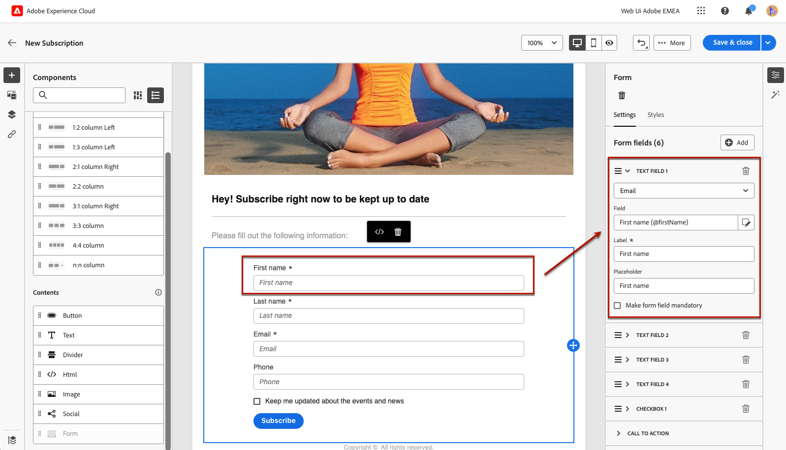
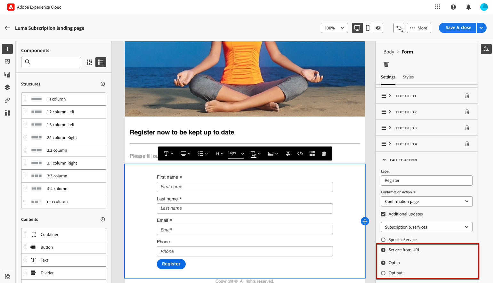

# Definición del contenido específico de la página de aterrizaje {#lp-content}

>[!CONTEXTUALHELP]
>id="ac_lp_components"
>title="Usar componentes de contenido"
>abstract="Los componentes de contenido son marcadores de posición de contenido vacíos que se pueden utilizar para crear el diseño de una página de aterrizaje. Para definir contenido específico que permita a los usuarios seleccionar y enviar sus opciones, utilice el componente de formulario."

>[!CONTEXTUALHELP]
>id="acw_landingpages_primarypage"
>title="Definición de la configuración de la página principal"
>abstract="La página principal se muestra inmediatamente a los usuarios después de hacer clic en el vínculo a la página de aterrizaje, por ejemplo, desde un correo electrónico o un sitio web."

Puede editar el contenido de cualquier página de la página de aterrizaje.

La primera página, que se muestra inmediatamente a los usuarios después de que hagan clic en el vínculo a la página de aterrizaje, ya se ha rellenado previamente con el [componente de formulario específico para la página de aterrizaje](#use-form-component) para la plantilla seleccionada<!-- to enable users to select and submit their choices-->.

El contenido de las páginas **[!UICONTROL Confirmación]**, **[!UICONTROL Error]** y **[!UICONTROL Caducidad]** también está rellenado previamente. Edítelos según sea necesario.

También puede definir [estilos para su página de aterrizaje](#lp-form-styles).

Para diseñar aún más el contenido de la página de aterrizaje:

* Utilice los mismos componentes que los utilizados para diseñar un correo electrónico. [Más información](../email/content-components.md#add-content-components)

* Añada contenido condicional a sus páginas de aterrizaje del mismo modo que para un correo electrónico. [Más información](../personalization/conditions.md#condition-condition-builder)

  >[!AVAILABILITY]
  >
  >Esta capacidad se encuentra en disponibilidad limitada (LA). Está restringido a los clientes que migran **de Adobe Campaign Standard a la versión 8 de Adobe Campaign** y no se puede implementar en ningún otro entorno.

## Uso del componente del formulario {#use-form-component}

>[!CONTEXTUALHELP]
>id="ac_lp_formfield"
>title="Definir los campos del componente de formulario"
>abstract="Defina cómo verán y enviarán sus opciones los destinatarios desde la página de aterrizaje."

>[!CONTEXTUALHELP]
>id="acw_landingpages_calltoaction"
>title="Qué sucede al hacer clic en el botón"
>abstract="Defina lo que sucederá cuando los usuarios envíen el formulario de página de aterrizaje."

Para definir contenido específico que permita a los usuarios seleccionar y enviar sus opciones desde la página de aterrizaje, edite el componente **[!UICONTROL Formulario]**. Siga los pasos a continuación.

1. El componente **[!UICONTROL Formulario]** específico para la página de aterrizaje ya se muestra en el lienzo de la plantilla seleccionada.

   >[!NOTE]
   >
   >El componente **[!UICONTROL Form]** solo se puede usar una vez en la misma página.

1. Selecciónelo. La pestaña **[!UICONTROL Contenido del formulario]** se muestra en la paleta derecha para permitirle editar los diferentes campos del formulario.

   {zoomable="yes"}

   >[!NOTE]
   >
   >Cambie a la pestaña **[!UICONTROL Estilos]** en cualquier momento para editar los estilos del contenido del componente del formulario. [Más información](#lp-form-styles)

1. Expanda el primer campo de texto, si lo hay, o agregue uno con el botón **[!UICONTROL Agregar]**. En la sección **[!UICONTROL Campo de texto 1]**, edite el tipo de campo, el campo de base de datos que desea actualizar, la etiqueta y el texto que se muestra dentro del campo antes de que los usuarios especifiquen un valor.

   {zoomable="yes"}

1. Marque la opción **[!UICONTROL Hacer que el campo de formulario sea obligatorio]** si es necesario. En ese caso, la página de aterrizaje solo se puede enviar si el usuario ha rellenado este campo.

   >[!NOTE]
   >
   >Si no se rellena un campo obligatorio, aparece un mensaje de error cuando el usuario envía la página.

1. Expanda la casilla de verificación si existe o agregue una con el botón **[!UICONTROL Agregar]**. Seleccione si esa casilla de verificación debe actualizar un servicio o un campo de la base de datos.

   {zoomable="yes"}

   Si seleccionas **[!UICONTROL Suscripción y servicios]**, selecciona un [servicio](../audience/manage-services.md) de la lista y elige entre las dos opciones siguientes:

   * **[!UICONTROL Suscribirse si está marcado]**: los usuarios deben marcar la casilla para dar su consentimiento (inclusión).
   * **[!UICONTROL Cancelar la suscripción si está marcada]**: los usuarios deben marcar la casilla para eliminar su consentimiento (exclusión).

   Si selecciona **[!UICONTROL Campo]**, seleccione un campo de la [lista de atributos](../get-started/attributes.md) y elija entre las dos opciones siguientes:

   * **[!UICONTROL Sí si está marcado]**.
   * **[!UICONTROL No si está marcado]**.

1. Elimine y agregue tantos campos (como campos de texto, botones de opción, casillas de verificación, listas desplegables, etc.) como sea necesario.

1. Una vez que se hayan agregado o actualizado todos los campos, haga clic en **[!UICONTROL Call to action]** para expandir la sección correspondiente. Permite definir el comportamiento del botón en el componente **[!UICONTROL Form]**. [Descubra cómo](#define-actions-on-form-submission)

   {zoomable="yes"}

1. Guarde el contenido para volver a las [propiedades de la página de aterrizaje](create-lp.md#create-landing-page).

### Definir acciones en el envío de formularios {#define-actions-on-form-submission}

1. Defina lo que sucede al hacer clic en el botón:

   * **[!UICONTROL Página de confirmación]**: de forma predeterminada, se redirige al usuario al conjunto de páginas **[!UICONTROL Confirmación]** para la página de aterrizaje actual.

   * **[!UICONTROL URL de redireccionamiento]**: escriba la dirección URL de la página a la que se redirigirá a los usuarios.

   * **[!UICONTROL Página de aterrizaje]**: seleccione otra página de aterrizaje a la que redirigir a los usuarios. Asegúrese de configurar la página de aterrizaje seleccionada en consecuencia.

1. Para realizar actualizaciones adicionales al enviar el formulario, seleccione **[!UICONTROL Actualizaciones adicionales]** y seleccione el elemento que desee actualizar:
   * Un [servicio](../audience/manage-services.md) de suscripción: defina si desea aceptar o rechazar usuarios al enviar el formulario. Al diseñar un correo electrónico, si define un vínculo de tipo **[!UICONTROL Página de aterrizaje]** a esta página de aterrizaje, el servicio seleccionado se utiliza automáticamente. [Más información sobre cómo insertar vínculos](../email/message-tracking.md)

     >[!NOTE]
     >
     >Si desea usar varios servicios con esta página de aterrizaje, use la opción **[!UICONTROL Servicio desde URL]** que se describe a continuación.

   * El canal: la dirección de correo electrónico utilizada al rellenar el formulario.
   * Todos los canales: al enviar el formulario, los usuarios se incluyen o excluyen (según la plantilla seleccionada) de todas las comunicaciones de la marca en todos los canales.
   * Un campo de la base de datos: seleccione un campo de la lista de atributos y defina si debe establecerse en True o False al enviar el formulario.

   {zoomable="yes"}

1. Seleccione la opción **[!UICONTROL Servicio de la URL]** para permitir que la página de aterrizaje se use en varios servicios, por lo que es dinámica. Defina si desea incluir o excluir usuarios al enviar el formulario.

   >[!AVAILABILITY]
   >
   >Esta capacidad se encuentra en disponibilidad limitada (LA). Está restringido a los clientes que migran **de Adobe Campaign Standard a la versión 8 de Adobe Campaign** y no se puede implementar en ningún otro entorno.

   {zoomable="yes"}

   Al diseñar un correo electrónico, si define un vínculo de tipo **[!UICONTROL Página de aterrizaje]** a esta página de aterrizaje, puede seleccionar cualquier servicio de la lista. A continuación, puede seleccionar otros servicios al definir otros vínculos a esta página de aterrizaje. [Más información sobre cómo insertar vínculos](../email/message-tracking.md)

   {zoomable="yes"}

1. Envíe un mensaje sobre el envío de su página de aterrizaje. [Obtenga más información aquí](#lp-message)

### Enviar un mensaje después del envío {#lp-message}

>[!AVAILABILITY]
>
>Esta capacidad se encuentra en disponibilidad limitada (LA). Está restringido a los clientes que migran **de Adobe Campaign Standard a la versión 8 de Adobe Campaign** y no se puede implementar en ningún otro entorno.

Para enviar un mensaje de confirmación automáticamente después del envío de una página de aterrizaje, siga estos pasos:

1. En la sección **[!UICONTROL CALL TO ACTION]**, marque la opción **[!UICONTROL Enviar correo electrónico de confirmación]**.

1. En la lista desplegable asociada, elija la plantilla de mensaje transaccional que debe enviarse.

{zoomable="yes"}

## Definir estilos de formulario de una página de aterrizaje {#lp-form-styles}

1. Para modificar los estilos del contenido del componente del formulario, cambie en cualquier momento a la pestaña **[!UICONTROL Estilos]**.

1. La sección **[!UICONTROL Campo de texto]** se expande de manera predeterminada. Permite editar el aspecto de los campos de texto, como la fuente de la etiqueta, la posición de la etiqueta, el color de fondo del campo o el borde del campo.

   {zoomable="yes"}

1. Expanda la sección **[!UICONTROL Casilla de verificación]** para definir el aspecto de las casillas de verificación y el texto correspondiente. Por ejemplo, ajuste la familia y el tamaño de la fuente o el color del borde de la casilla de verificación.

   {zoomable="yes"}

1. Expanda y edite cualquier otra sección correspondiente a otros campos que haya agregado (botón de opción, lista desplegable, fecha y hora, etc.) al formulario.

1. Expanda la sección **[!UICONTROL Call to action]** para modificar el aspecto del botón en el formulario de componente. Por ejemplo, cambie la fuente, agregue un borde, edite el color de la etiqueta al pasar el ratón por encima o ajuste la alineación del botón.

   {zoomable="yes"}

   Previsualice algunos de los ajustes, como el color de la etiqueta del botón al pasar el ratón por encima, usando el botón **[!UICONTROL Simular contenido]**. [Más información](create-lp.md#test-landing-page)

1. Guarde los cambios.