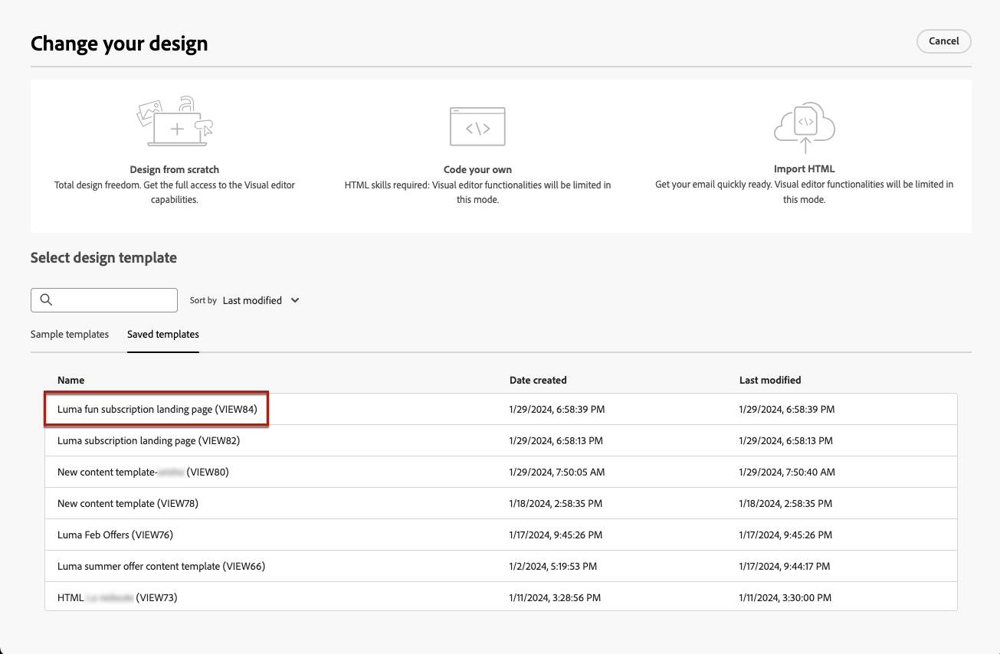

# Trabajo con plantillas de contenido de página de aterrizaje {#work-with-templates}

## Guardar una página como plantilla {#save-as-template}

Una vez que haya diseñado su [contenido de página de aterrizaje](lp-content.md), puede guardarlo para su reutilización futura. Para realizar esto, siga los pasos a continuación.

1. Haga clic en **[!UICONTROL Más]** en la parte superior derecha de la pantalla.

1. Seleccionar **[!UICONTROL Guardar como plantilla de contenido]** en el menú desplegable.

   

1. Añada un nombre para esta plantilla.

1. Haga clic en **[!UICONTROL Guardar]**.

La próxima vez que cree una página de aterrizaje, puede utilizar esta plantilla para crear su contenido. Aprenda a hacerlo en [sección](#use-saved-template) más abajo.

## Uso de una plantilla guardada {#use-saved-template}

<!--Not for GA?-->

1. Al editar el contenido de una página de aterrizaje, haga clic en **[!UICONTROL Más]** y seleccione **[!UICONTROL Cambiar el diseño]**.

   

1. Confirme la elección.

   >[!NOTE]
   >
   >Esta acción elimina y reemplaza el contenido actual por el de la nueva plantilla.

1. La lista de todas las plantillas guardadas anteriormente se muestra en la variable **[!UICONTROL Plantillas guardadas]** pestaña. Puede ordenarlas **[!UICONTROL Por nombre]**, **[!UICONTROL Última modificación]** y **[!UICONTROL Última creación]**.

   

1. Seleccione la plantilla que desee en la lista. Una vez seleccionadas, puede desplazarse entre todas las plantillas guardadas con las flechas derecha e izquierda.

   

1. Clic **[!UICONTROL Usar esta plantilla]**.

1. Edite el contenido como desee con el diseñador de páginas de aterrizaje.

<!--Primary page templates and subpage templates are managed separately, meaning that you cannot use a primary page template to create a subpage, and vice versa. TBC in Web user interface-->
