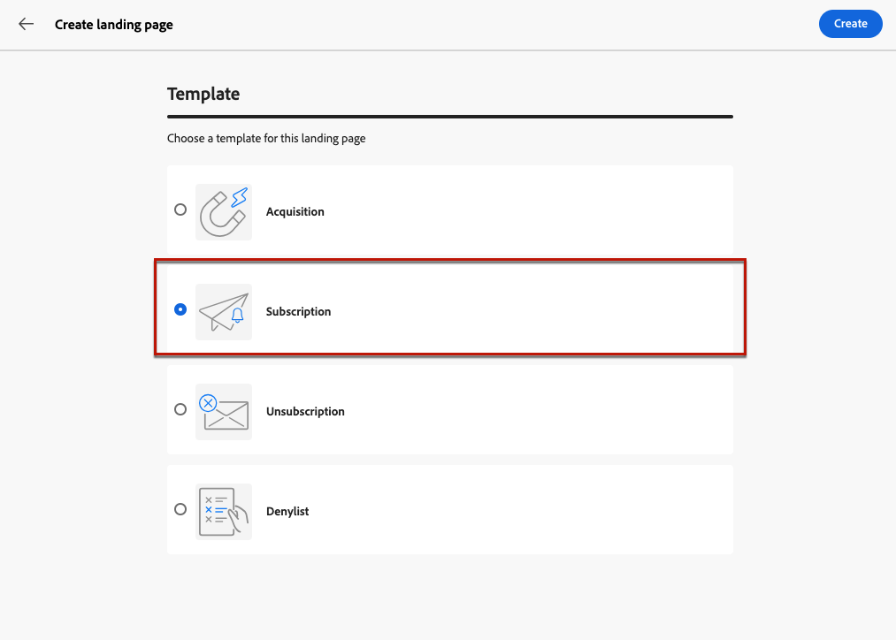
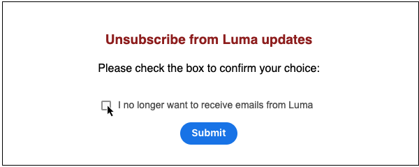

# Cómo utilizar una página de aterrizaje {#lp-use-cases}

>[!CONTEXTUALHELP]
>id="acw_landingpages_url"
>title="Copie la URL con precaución"
>abstract="Para probar o aprovechar al máximo la página de aterrizaje, no puede copiar y pegar este vínculo directamente en un explorador web o en las entregas. En su lugar, utilice el **Simular contenido** para probarla y siga los pasos descritos en la documentación para utilizar correctamente la página de aterrizaje."

Para utilizar correctamente la página de aterrizaje, debe hacer referencia a ella como un vínculo en una entrega con la opción dedicada.

>[!CAUTION]
>
>Para aprovechar al máximo la página de aterrizaje, no puede copiar y pegar el vínculo que se muestra en el panel de envío publicado directamente en las entregas o en una página web.

En el [!DNL Adobe Campaign Web] En primer lugar, cuatro plantillas predeterminadas le permiten implementar diferentes casos de uso. Sin embargo, los pasos principales siguen siendo los mismos y se detallan a continuación.

1. [Creación de una página de aterrizaje](create-lp.md#create-landing-page) y seleccione la plantilla que desee, según el caso de uso:

   * [Adquisición](#lp-acquisition)
   * [Suscripción](#lp-subscription)
   * [Baja](#lp-unsubscription)
   * [Lista de bloqueados](#lp-denylist)

1. Defina las propiedades y la configuración de la página de aterrizaje.

   

1. Según su caso, seleccione la opción **[!UICONTROL Adquisición]**, **[!UICONTROL Suscripción]**, **[!UICONTROL Baja]** o **[!UICONTROL Lista de bloqueados de]** página.

1. Se muestra el contenido de la página. Seleccione la parte correspondiente al formulario de página de aterrizaje.

   

1. Realice tantas actualizaciones de las etiquetas y los campos de la página de aterrizaje como sea necesario. Edite el resto del contenido como desee, guarde los cambios y cierre.

1. Siga los pasos detallados a continuación para cada caso de uso.

1. Edite el **[!UICONTROL Confirmación]** según sea necesario, así como la **[!UICONTROL Error]** y **[!UICONTROL Caducidad]** páginas. Se muestra a los destinatarios una vez que envíen el formulario de registro.

   

1. Prueba y [publicar](create-lp.md#publish-landing-page) su página de aterrizaje.

1. Crear un [email](../email/create-email.md) envío para dirigir el tráfico a la página de aterrizaje.

1. [Inserción de un vínculo](../email/message-tracking.md#insert-links) en el contenido del mensaje. Seleccionar **[!UICONTROL Página de aterrizaje]** como el **[!UICONTROL Tipo de vínculo]** y elija la [página de aterrizaje](create-lp.md#configure-primary-page) que ha creado.

   

   >[!NOTE]
   >
   >Para poder enviar el mensaje, asegúrese de que la página de aterrizaje seleccionada aún no haya caducado. Obtenga información sobre cómo actualizar la fecha de caducidad [en esta sección](create-lp.md#create-landing-page).

Una vez que reciban el correo electrónico, si los destinatarios hacen clic en el vínculo a la página de aterrizaje y envían el formulario de página de aterrizaje, se les dirigirá a la página de confirmación y se aplicará cualquier otra acción definida en la página de aterrizaje (por ejemplo, los usuarios se suscribirán a su servicio o no recibirán más comunicaciones de usted).

A continuación se muestran algunos ejemplos de cómo puede utilizar [!DNL Adobe Campaign] páginas de aterrizaje para que sus clientes se excluyan de la recepción de algunas o todas sus comunicaciones.

## Adquisición de perfil {#lp-acquisition}

1. [Creación de una página de aterrizaje](create-lp.md#create-landing-page). Seleccione el **[!UICONTROL Adquisición]** plantilla.

1. Defina las propiedades y la configuración de la página de aterrizaje.

   

1. Seleccione el **[!UICONTROL Adquisición]** para editar su contenido.

1. Se muestra el contenido de la página. Seleccione la parte correspondiente al formulario de página de aterrizaje.

## Suscripción a un servicio {#lp-subscription}

Uno de los casos de uso más comunes consiste en invitar a sus clientes a [suscripción a un servicio](../audience/manage-services.md) (como un boletín informativo o un evento) a través de una página de aterrizaje. Siga los pasos a continuación.

<!--For example, let's say you organize an event next month and you want to launch an event registration campaign. To do this, you're going to send an email including a link to a landing page that will enable your recipients to register for this event. The users who register will be added to the subscription list that you created for this purpose.-->

1. Comience creando una plantilla de confirmación para los usuarios que se suscriban a su evento, de modo que pueda seleccionarla fácilmente al crear el servicio. [Más información](../audience/manage-services.md#create-confirmation-message)

   

1. Cree un servicio de suscripción, que almacenará a los usuarios registrados en su evento. [Obtenga información sobre cómo crear un servicio](../audience/manage-services.md)

1. Seleccione la plantilla que creó como correo electrónico de confirmación que los usuarios recibirán tras la suscripción.

   

1. [Creación de una página de aterrizaje](create-lp.md#create-landing-page) para permitir que los destinatarios se registren en el evento. Seleccione el **[!UICONTROL Suscripción]** plantilla.

   <!---->

1. Defina las propiedades y la configuración de la página de aterrizaje.

   <!---->

1. Seleccione el **[!UICONTROL Suscripción]** para editar su contenido.

   

1. Se muestra el contenido de la página. Seleccione la parte correspondiente al formulario de la página de aterrizaje y expanda **[!UICONTROL Casilla 1]** sección.

   En el **[!UICONTROL Suscripciones y servicios]** , seleccione el servicio que creó para su evento. Deje el **[!UICONTROL Suscribirse si está marcado]** opción activada.

   

1. Puede añadir una casilla de verificación adicional para ofrecer suscripción a la newsletter, por ejemplo.

<!--

1. You can also update the profiles who register for your event for the email channel. Expand the **[!UICONTROL Call to action]** section and select Additional updates.

    -->

1. Realice tantas actualizaciones de las etiquetas y los campos de la página de aterrizaje como sea necesario. Edite el resto del contenido como desee, guarde los cambios y cierre.

1. Edite el **[!UICONTROL Confirmación]** según sea necesario, así como la **[!UICONTROL Error]** y **[!UICONTROL Caducidad]** páginas. Se muestra a los destinatarios una vez que envíen el formulario de registro.

   

1. Prueba y [publicar](create-lp.md#publish-landing-page) su página de aterrizaje.

1. Crear un **Correo electrónico** envío para dirigir el tráfico a la página de aterrizaje de registro. Diseñe el correo electrónico para anunciar que el registro está abierto para su evento.

1. [Inserción de un vínculo](../email/message-tracking.md#insert-links) en el contenido del mensaje. Seleccionar **[!UICONTROL Página de aterrizaje]** como el **[!UICONTROL Tipo de vínculo]** y elija la [página de aterrizaje](create-lp.md#configure-primary-page) que creó para el registro.

   

   >[!NOTE]
   >
   >Para poder enviar el mensaje, asegúrese de que la página de aterrizaje seleccionada aún no haya caducado. Obtenga información sobre cómo actualizar la fecha de caducidad [en esta sección](create-lp.md#create-landing-page).

Una vez recibido el correo electrónico, si los destinatarios hacen clic en el vínculo a la página de aterrizaje y envían el formulario de página de aterrizaje, se les dirige a la página de confirmación y se les añade a la lista de suscripción.

## Baja {#lp-unsubscription}

1. [Creación de una página de aterrizaje](create-lp.md#create-landing-page). Seleccione el **[!UICONTROL Baja]** plantilla.

1. Defina las propiedades y la configuración de la página de aterrizaje.

1. Seleccione el **[!UICONTROL Baja]** para editar su contenido.

1. Se muestra el contenido de la página. Seleccione la parte correspondiente al formulario de página de aterrizaje.

## Configuración de páginas de aterrizaje de exclusión {#lp-denylist}

Proporcionar a los destinatarios la capacidad de cancelar su suscripción a la recepción de comunicaciones de una marca es un requisito legal. Obtenga más información acerca de la legislación aplicable en la [Documentación del Experience Platform](https://experienceleague.adobe.com/docs/experience-platform/privacy/regulations/overview.html#regulations){target="_blank"}.

Por lo tanto, siempre debe incluir un **vínculo de cancelación de suscripción** en cada correo electrónico enviado a los destinatarios:

* Al hacer clic en este vínculo, los destinatarios se dirigen a una página de aterrizaje que incluye un botón para confirmar la exclusión.
* Al hacer clic en el botón de exclusión, los datos de perfil se actualizan con esta información.

Puede configurar un **[!UICONTROL Lista de bloqueados de]** página de aterrizaje que permite a los usuarios desactivar todas las entregas.

Para permitir que los usuarios puedan excluirse de todas las entregas, debe crear y publicar un **[!UICONTROL Lista de bloqueados de]** página de aterrizaje.

Una vez que un usuario hace clic en el vínculo de la página de aterrizaje, la variable **[!UICONTROL Ya no se puede contactar (por ningún canal)]** en el perfil se selecciona automáticamente.

definir un **[!UICONTROL Opción de exclusión]** y seleccione para actualizar **[!UICONTROL Canal (correo electrónico)]**: el perfil que marca la casilla de exclusión en la página de aterrizaje se excluirá de todas las comunicaciones.

Una vez recibido el mensaje, si un destinatario hace clic en el vínculo para cancelar la suscripción del correo electrónico, se muestra la página de aterrizaje.

Si el destinatario marca la casilla y envía el formulario:

* El destinatario excluido se redirige a la pantalla de mensaje de confirmación.

* Los datos del perfil se actualizan y no recibirán comunicaciones de su marca a menos que se vuelva a suscribir.

Para comprobar que se ha actualizado la opción del perfil correspondiente, vaya a Perfiles y seleccione el perfil.

