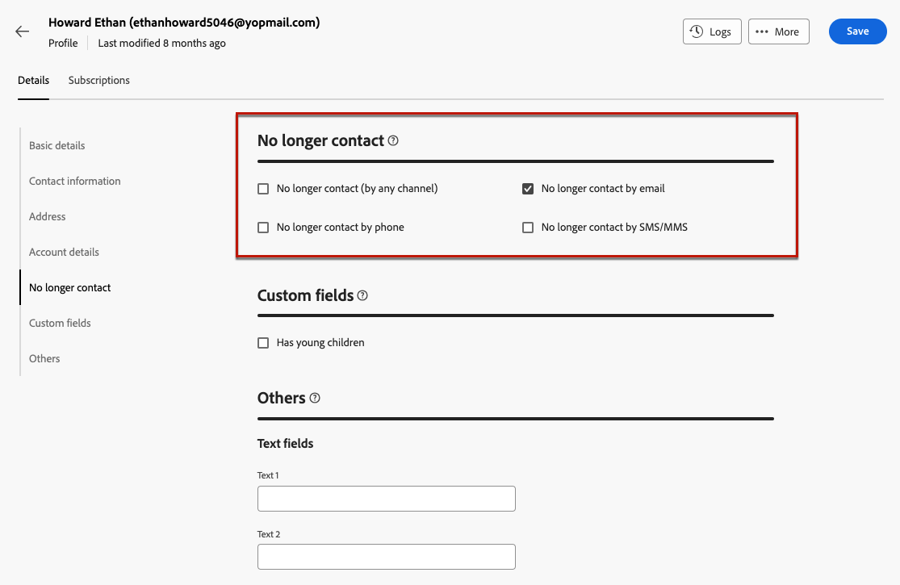

# Cómo utilizar una página de aterrizaje {#lp-use-cases}

>[!CONTEXTUALHELP]
>id="acw_landingpages_url"
>title="Copie la URL con cuidado"
>abstract="Para probar o aprovechar al máximo la página de aterrizaje, no puede copiar y pegar este vínculo directamente en un explorador web o en los envíos. En su lugar, utilice la función **Simular contenido** para probarla y siga los pasos que se describen en la documentación para utilizar correctamente la página de aterrizaje."

>[!CONTEXTUALHELP]
>id="acw_landingpages_templates"
>title="Copie la URL con cuidado"
>abstract="Al crear una página de aterrizaje, cuatro plantillas predeterminadas le permiten implementar diferentes casos de uso: añadir o actualizar un perfil en la base de datos de Campaign, suscribir a los clientes a un servicio, cancelar su suscripción a un servicio o excluir usuarios."
>additional-url="https://experienceleague.adobe.com/docs/campaign-web/v8/landing-pages/create-lp.html?lang=es#create-landing-page" text="Creación de una página de aterrizaje"

Para utilizar correctamente la página de aterrizaje, haga referencia a ella como vínculo en un mensaje con la opción dedicada. No puede copiar y pegar el vínculo mostrado en el panel de envío publicado directamente en las entregas o en una página web. En su lugar, use la capacidad **Simular contenido** para probarlo.

En la interfaz [!DNL Adobe Campaign Web], cuatro plantillas predeterminadas le permiten implementar diferentes casos de uso. Sin embargo, los pasos principales siguen siendo los mismos y se detallan a continuación.

1. [Cree una página de aterrizaje](create-lp.md#create-landing-page) y seleccione la plantilla que elija según su caso de uso.

1. Defina las propiedades y la configuración de la página de aterrizaje.

   {zoomable="yes"}

1. Según el caso, seleccione la página **[!UICONTROL Adquisición]**, **[!UICONTROL Suscripción]**, **[!UICONTROL Baja]** o **[!UICONTROL Lista de bloqueados de la suscripción]**.

1. Se muestra el contenido de la página. Seleccione la parte correspondiente al formulario de página de aterrizaje.

   {zoomable="yes"}

1. Edite el contenido según la plantilla seleccionada:

   * [Adquisición](#lp-acquisition)
   * [Suscripción](#lp-subscription)
   * [Baja](#lp-unsubscription)
   * [Lista de bloqueados](#lp-denylist)

1. Modifique el resto del contenido según sea necesario, guarde los cambios y cierre.

1. Edite la página **[!UICONTROL Confirmación]** según sea necesario, así como las páginas **[!UICONTROL Error]** y **[!UICONTROL Caducidad]**. La página **[!UICONTROL Confirmación]** se mostrará a los destinatarios cuando envíen el formulario.

   {zoomable="yes"}

1. [Probar](create-lp.md#test-landing-page) y [publicar](create-lp.md#publish-landing-page) su página de aterrizaje.

1. Cree un envío de [correo electrónico](../email/create-email.md) para dirigir el tráfico a la página de aterrizaje.

1. [Inserte un vínculo](../email/message-tracking.md#insert-links) en el contenido del mensaje. Seleccione **[!UICONTROL Página de aterrizaje]** como **[!UICONTROL Tipo de vínculo]** y elija la página de aterrizaje que ha creado.

   {zoomable="yes"}

   >[!NOTE]
   >
   >Para poder enviar el mensaje, asegúrese de que la página de aterrizaje seleccionada aún no haya caducado. [Más información](create-lp.md#create-landing-page)

Una vez recibido el correo electrónico, si los destinatarios hacen clic en el vínculo a la página de aterrizaje y envían el formulario:

* Se le redirigirá a la página de confirmación.
* Se aplicará cualquier otra acción definida en la página de aterrizaje. Por ejemplo: los usuarios se suscribirán a su servicio o no recibirán más comunicaciones de usted.

A continuación se muestran algunos ejemplos de cómo puede usar las páginas de aterrizaje [!DNL Adobe Campaign] en los diferentes casos de uso posibles.

## Adquisición de perfil {#lp-acquisition}

La primera plantilla permite agregar o actualizar un perfil a la base de datos de Campaign.

1. Al [crear su página de aterrizaje](create-lp.md#create-landing-page), seleccione la plantilla **[!UICONTROL Adquisición]**.

1. En las propiedades de la página de aterrizaje, seleccione la opción **[!UICONTROL Rellenar previamente con los datos a los que se hace referencia en el formulario]** para cargar previamente cualquier información existente del perfil y evitar la creación de duplicados.

1. Seleccione la página **[!UICONTROL Adquisición]** para editar su contenido.

1. Edite los campos de texto según sea necesario según la información que desee recopilar en los perfiles.

1. Agregue una casilla de verificación para invitar a sus clientes a suscribirse al servicio de newsletter. [Aprenda a crear un servicio](../audience/manage-services.md)

   {zoomable="yes"}

1. Ajuste el contenido según sea necesario y guarde los cambios.

1. Revisa y [publica](create-lp.md#publish-landing-page) tu página de aterrizaje.

1. Cree un [correo electrónico](../email/create-email.md) y [agregue un vínculo](../email/message-tracking.md#insert-links) a su página de aterrizaje.

Una vez recibido el correo electrónico, si los destinatarios hacen clic en el vínculo a la página de aterrizaje y envían el formulario, su perfil se añade a la base de datos de Campaign o se actualiza con la información que han proporcionado.

{zoomable="yes"}

Si optó por recibir su newsletter, se suscribirá al servicio correspondiente.

{zoomable="yes"}

## Suscripción a un servicio {#lp-subscription}

>[!CONTEXTUALHELP]
>id="acw_landingpages_subscription"
>title="Establecimiento de la página de aterrizaje de la suscripción"
>abstract="Una página de suscripción permite a los clientes suscribirse a un servicio."

Uno de los casos de uso más comunes consiste en invitar a tus clientes a [suscribirse a un servicio](../audience/manage-services.md) (como una newsletter o un evento) a través de una página de aterrizaje. Siga los pasos a continuación.

<!--For example, let's say you organize an event next month and you want to launch an event registration campaign. To do this, you're going to send an email including a link to a landing page that will enable your recipients to register for this event. The users who register will be added to the subscription list that you created for this purpose.-->

1. Cree una plantilla de confirmación para los usuarios que se suscriban a su evento, de modo que pueda seleccionarla fácilmente al crear el servicio. [Más información](../audience/manage-services.md#create-confirmation-message)

   {zoomable="yes"}

1. Cree un servicio de suscripción, que almacenará a los usuarios registrados para su evento. [Aprenda a crear un servicio](../audience/manage-services.md)

1. Seleccione la plantilla que creó como correo electrónico de confirmación que los usuarios recibirán tras la suscripción.

   {zoomable="yes"}

1. [Crea una página de aterrizaje](create-lp.md#create-landing-page) para permitir que tus destinatarios se registren en tu evento. Seleccione la plantilla **[!UICONTROL Subscription]**.

1. Seleccione la página **[!UICONTROL Suscripción]** para editar su contenido.

1. Se muestra el contenido de la página. Seleccione la parte correspondiente al formulario de la página de aterrizaje y expanda la sección **[!UICONTROL Casilla de verificación 1]**.

1. En el campo **[!UICONTROL Suscripciones y servicios]**, seleccione el servicio que creó para su evento. Deje activada la opción **[!UICONTROL Suscribirse si está marcada]**.

   {zoomable="yes"}
<!--
1. You can add an additional checkbox to offer subscription to your newsletter for example.-->

1. Ajuste el contenido según sea necesario y guarde los cambios.

1. Revisa y [publica](create-lp.md#publish-landing-page) tu página de aterrizaje.

1. Cree un [correo electrónico](../email/create-email.md) y [agregue un vínculo](../email/message-tracking.md#insert-links) para dirigir el tráfico a la página de aterrizaje de registro.

1. Diseñe el correo electrónico para anunciar que el registro está abierto para su evento.

Una vez recibido el correo electrónico, si los destinatarios hacen clic en el vínculo a la página de aterrizaje y envían el formulario, se les dirige a la página de confirmación y se les añade a la lista de suscripción.

## Baja {#lp-unsubscription}

Puede permitir a sus clientes cancelar la suscripción a un servicio mediante una página de aterrizaje.

1. Cree una plantilla de confirmación para los usuarios que cancelen su suscripción al servicio, de modo que pueda seleccionarla fácilmente al crearlo. [Más información](../audience/manage-services.md#create-confirmation-message)

1. En su [servicio de suscripción](../audience/manage-services.md), seleccione la plantilla que creó como el correo electrónico de confirmación que los usuarios recibirán al cancelar la suscripción.

1. [Crear una página de aterrizaje](create-lp.md#create-landing-page). Seleccione la plantilla **[!UICONTROL Baja]**.

1. Seleccione la página **[!UICONTROL Baja]** para editar su contenido.

1. Se muestra el contenido de la página. Seleccione la parte correspondiente al formulario de página de aterrizaje.

1. Agregue una sección **[!UICONTROL Casilla de verificación]**, seleccione el servicio y la opción **[!UICONTROL Cancelar la suscripción si está marcada]**.

   {zoomable="yes"}

1. Expanda la sección **[!UICONTROL Llamada a la acción]** y seleccione la opción **[!UICONTROL Actualizaciones adicionales]**. Seleccione el servicio y marque la opción **[!UICONTROL Opt out]**.

   {zoomable="yes"}

1. Ajuste el contenido según sea necesario y guarde los cambios.

1. Revisa y [publica](create-lp.md#publish-landing-page) tu página de aterrizaje.

1. Crear un [correo electrónico](../email/create-email.md) y [agregar un vínculo](../email/message-tracking.md#insert-links) a la página de aterrizaje.

Una vez recibido el correo electrónico, si los destinatarios hacen clic en el vínculo a la página de aterrizaje y envían el formulario, se les dirige a la página de confirmación de baja y se eliminan del servicio de suscripción correspondiente.

## Lista de bloqueados {#lp-denylist}

Proporcionar a los destinatarios la capacidad de cancelar su suscripción a la recepción de comunicaciones de una marca es un requisito legal. Por lo tanto, siempre debe incluir un **vínculo para cancelar la suscripción** en cada mensaje de correo electrónico enviado a los destinatarios. Al hacer clic en este vínculo, los destinatarios se dirigen a una página de aterrizaje que incluye un botón para confirmar la exclusión.

Puede configurar una página de aterrizaje de **[!UICONTROL Lista de bloqueados]** que permitirá a los usuarios desactivar todas las entregas.

1. Cuando [cree su página de aterrizaje](create-lp.md#create-landing-page), seleccione la plantilla **[!UICONTROL Incluir en la lista de bloqueados]** de la.

1. Incluir en la lista de bloqueados Seleccione la página **** para editar su contenido.

1. Expanda la sección **[!UICONTROL Llamada a la acción]** y seleccione la opción **[!UICONTROL Actualizaciones adicionales]**.

1. En la lista desplegable correspondiente, seleccione **[!UICONTROL Canal (correo electrónico)]** para permitir que sus destinatarios se excluyan únicamente de las comunicaciones por correo electrónico. También puedes seleccionar **[!UICONTROL Por todos los canales]** para excluirlos de todas las comunicaciones en todos los canales.

   {zoomable="yes"}

1. Ajuste el contenido según sea necesario y guarde los cambios.

1. Revisa y [publica](create-lp.md#publish-landing-page) tu página de aterrizaje.

1. Cree un [correo electrónico](../email/create-email.md) y [agregue un vínculo](../email/message-tracking.md#insert-links) a su página de aterrizaje para permitir que los usuarios no puedan recibir comunicaciones.

Una vez recibido el correo electrónico, si los destinatarios hacen clic en el vínculo a la página de aterrizaje y envían el formulario, se les dirigirá a la página de confirmación de la lista de bloqueados de la aplicación y su perfil se actualizará con la información que proporcionaron.

Para comprobar que se ha actualizado la opción del perfil correspondiente, vaya al menú **[!UICONTROL Perfiles]** y seleccione ese perfil.

Por ejemplo, si elige actualizar la opción **[!UICONTROL Canal (correo electrónico)]** en su página de aterrizaje, se comprobará la opción **[!UICONTROL Ya no contacte por correo electrónico]**.

{zoomable="yes"}

Este perfil no recibirá comunicaciones por correo electrónico de su marca a menos que se vuelva a suscribir.