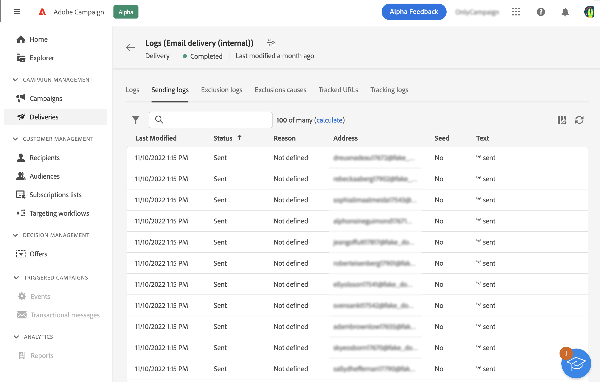
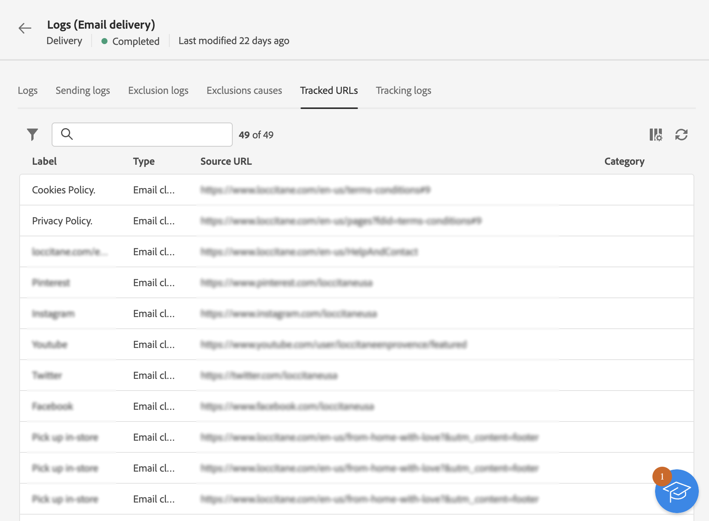

# Monitorización de registros de envío {#delivery-logs}

>[!CONTEXTUALHELP]
>id="acw_deliveries_email_preparation_logs"
>title="Registros de entregas"
>abstract="TBC"

Después de preparar y enviar un correo electrónico, los registros de envío le permiten verificar que no hay error. Se puede acceder a estos registros directamente desde el panel de mensajes. Muestran los detalles del envío, qué destinatario se ha excluido y por qué, así como la información de seguimiento como aperturas y clics.

Para ver los registros, acceda al panel de envío y haga clic en el botón **Registros** botón.

Hay varias pestañas disponibles:

## Registros

La variable **Registros** contiene todos los mensajes relacionados con la entrega y las pruebas. Los iconos específicos le permiten identificar errores o advertencias.

Se muestran todos los pasos, advertencias y errores de validación. Los iconos de color muestran el tipo de mensaje:

* El icono gris indica un mensaje informativo.
* El icono amarillo indica un error de procesamiento no crítico.
* El icono rojo indica un error crítico que impide realizar el envío.

## Entregas

La variable **Entregas** ofrece un historial de cada ocurrencia de este envío. La lista de los mensajes enviados y sus estados se almacena aquí. Permite ver el estado de envío de cada destinatario.

## Exclusiones

La variable **Registros de exclusión** lista todos los mensajes que se han excluido del destinatario al que se han enviado y especifica el motivo del error de envío.

## Causas de exclusión

La variable **Causas de exclusión** muestra el volumen (en número de mensajes) de mensajes que se excluyeron del envío de destino.

## URL seguidas

La variable **Direcciones URL rastreadas** reagrupa las direcciones URL incluidas en el mensaje enviado, incluido su tipo de dirección URL y su dirección URL de origen.

## Seguimiento

La pestaña **Tracking** enumera el historial de seguimiento de esta entrega. Esta pestaña muestra los datos de seguimiento de los mensajes enviados, es decir, todas las direcciones URL sobre las que Adobe Campaign realiza un seguimiento.

>[!NOTE]
>
>Si el seguimiento no está habilitado para una entrega, esta pestaña no se muestra.

