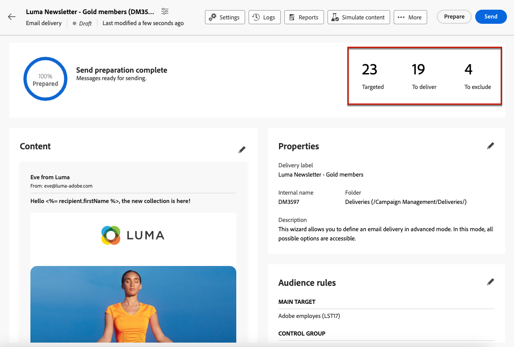

# Preparación y envío de su correo electrónico {#prepare-send}

## Preparación del envío {#prepare}

Cuando haya definido su [content](../content/edit-content.md), [audiencia](../audience/add-audience.md), y [programación](../msg/gs-messages.md#schedule-the-delivery-sending-gs-schedule), está listo para preparar su envío de correo electrónico.

Durante la preparación, la población objetivo se calcula y el contenido del mensaje se genera para cada perfil incluido en el objetivo. Una vez finalizada la preparación, los mensajes están listos para enviarse, ya sea inmediatamente o en la fecha y hora programadas.

Las reglas de validación utilizadas durante la preparación de la entrega se describen en la [Documentación de Campaign v8 (consola de cliente)](https://experienceleague.adobe.com/docs/campaign/campaign-v8/campaigns/send/validate/delivery-analysis.html){target="_blank"}.

A continuación se enumeran los pasos principales para preparar el envío.

1. En el panel de envío, haga clic en **[!UICONTROL Revisar y enviar]**.

   

1. Haga clic en **[!UICONTROL Preparar]** situado en la esquina superior derecha y confirme.

   

   >[!NOTE]
   >
   >Si programó su envío y deshabilitó la **[!UICONTROL Habilitar confirmación antes de enviar]** opción, los pasos de preparación y envío se agrupan en la variable **[!UICONTROL Preparar y enviar]** botón. [Más información sobre la programación](../msg/gs-messages.md#gs-schedule)

1. Se muestra el progreso de la preparación. En función del tamaño de la población de destinatarios, esta operación puede tardar algún tiempo.

   Puede detener la preparación en cualquier momento con el botón **[!UICONTROL Detener preparación.]**

   

   >[!NOTE]
   >Durante la fase de preparación, no se envían mensajes. Por lo tanto, puede iniciarla o detenerla sin riesgo alguno.

1. Cuando finalice la preparación, compruebe los indicadores claves de rendimiento (KPI). Si el número de mensajes que desea enviar no coincide con sus expectativas, modifique la audiencia y reinicie la preparación.

   

   Estos son los diferentes KPI mostrados:

   * **[!UICONTROL Objetivo]**: el número de destinatarios segmentados..
   * **[!UICONTROL Para enviar]**: el número de mensajes que se enviarán.
   * **[!UICONTROL Para excluir]**: el número de mensajes excluidos por un [reglas de tipología](../advanced-settings/delivery-settings.md#typology).

1. Haga clic en el botón **[!UICONTROL Registros]** y compruebe que no haya errores. El último mensaje de registro muestra los mensajes de error y los errores. [Más información](delivery-logs.md)

   

1. Si la preparación detecta un error crítico que impide que se realice el envío, el estado de preparación aparece como erróneo en el panel de envío.

   

1. Si realiza cambios en la entrega después de la preparación, debe reiniciar la preparación para que los cambios se tengan en cuenta.

Una vez finalizada la preparación sin errores, el mensaje está listo para enviarse.

## Envío del mensaje {#send}

Una vez que [preparación](#prepare) se ha completado. Ahora puede enviar su correo electrónico.

Si el mensaje está programado, se enviará en la fecha y la hora definidas. [Más información](../msg/gs-messages.md#gs-schedule)

### Enviar inmediatamente {#send-immediately}

Para enviar un correo electrónico inmediatamente, siga los pasos a continuación.

1. En el panel de envío, haga clic en **[!UICONTROL Enviar]** en la esquina superior derecha.

   

1. Confirme esta acción para enviar inmediatamente el mensaje al destinatario principal.

1. Se muestra el progreso del envío.

### Programe el envío {#schedule-the-send}

Si ha programado el correo electrónico para enviarlo en una fecha y hora posteriores, siga los pasos a continuación.

1. Antes de golpear el **[!UICONTROL Revisar y enviar]** , asegúrese de definir una programación para el correo electrónico. [Más información](../msg/gs-messages.md#gs-schedule)

1. En el panel de envío, haga clic en **[!UICONTROL Botón Enviar como programado]** en la esquina superior derecha.

   

1. Clic **[!UICONTROL Confirmar envío]**. La entrega se realiza en la fecha programada y se envía al destinatario principal.

   >[!NOTE]
   >
   >Si ha desactivado la variable **[!UICONTROL Habilitar confirmación antes de enviar]** opción, los pasos de preparación y envío se agrupan en la variable **[!UICONTROL Preparar y enviar]** botón. [Más información sobre la programación](../msg/gs-messages.md#gs-schedule)

## Pausar o detener el envío {#pause-stop-sending}

Independientemente de si la entrega está programado o no, se pueden realizar dos acciones en cualquier momento durante el proceso de entrega:

* Clic **[!UICONTROL Pausar envío]** para interrumpir el envío de los mensajes. Puede reanudar el envío en cualquier momento.

* Clic **[!UICONTROL Detener envío]** para interrumpir el envío inmediatamente. Ni la preparación ni el envío se pueden reanudar una vez detenidos.

## Compruebe los KPI mostrados. {#check-kpis}

>[!CONTEXTUALHELP]
>id="acw_deliveries_email_metrics_delivered"
>title="Entregados"
>abstract="Número de mensajes entregados correctamente. Este indicador se actualiza cada 5 minutos. El porcentaje mostrado se basa en el número total de mensajes enviados."
>additional-url="https://experienceleague.adobe.com/docs/campaign-web/v8/reports/kpis.html" text="Comprender los indicadores clave de rendimiento (KPI)"

>[!CONTEXTUALHELP]
>id="acw_deliveries_email_metrics_opens"
>title="Aperturas"
>abstract="Número de mensajes abiertos. Este indicador se actualiza cada 5 minutos. El porcentaje mostrado es la proporción del número de aperturas distintas comparado con el número de mensajes enviados."
>additional-url="https://experienceleague.adobe.com/docs/campaign-web/v8/reports/kpis.html" text="Comprender los indicadores clave de rendimiento (KPI)"

>[!CONTEXTUALHELP]
>id="acw_deliveries_email_metrics_clicks"
>title="Clics"
>abstract="El número de destinatarios que hicieron clic al menos una vez en el correo electrónico. Este indicador se actualiza cada 5 minutos. El porcentaje mostrado es la proporción del número de clics distintos en comparación con el número de mensajes entregados."
>additional-url="https://experienceleague.adobe.com/docs/campaign-web/v8/reports/kpis.html" text="Comprender los indicadores clave de rendimiento (KPI)"

>[!CONTEXTUALHELP]
>id="acw_deliveries_email_metrics_sent"
>title="Métricas enviadas"
>abstract="Número total de mensajes procesados durante el análisis de entregas."
>additional-url="https://experienceleague.adobe.com/docs/campaign-web/v8/reports/kpis.html" text="Comprender los indicadores clave de rendimiento (KPI)"

>[!CONTEXTUALHELP]
>id="acw_deliveries_email_metrics_errors"
>title="Métricas de errores"
>abstract="Total de errores acumulados durante el envío y el procesamiento automático de devoluciones en relación con el número total de mensajes enviados."
>additional-url="https://experienceleague.adobe.com/docs/campaign-web/v8/reports/kpis.html" text="Comprender los indicadores clave de rendimiento (KPI)"

Una vez completado el envío, puede comprobar los KPI mostrados:

* **[!UICONTROL Enviado]**: el número de mensajes enviados. El porcentaje mostrado se basa en el número total de mensajes que se van a enviar.

* **[!UICONTROL Entregados]**: el número de mensajes entregados correctamente. El porcentaje mostrado se basa en el número total de mensajes enviados.

* **[!UICONTROL Abiertos]**: el número de mensajes abiertos. El porcentaje mostrado es el número de aperturas distintas en comparación con el número de mensajes enviados.

* **[!UICONTROL Clics]**: el número de destinatarios que hicieron clic al menos una vez en el correo electrónico. El porcentaje mostrado es el número de clics distintos comparado con el número de mensajes enviados.

* **[!UICONTROL Errores]**: el número de correos electrónicos con el estado de error. El porcentaje mostrado se basa en el número total de mensajes enviados.

>[!NOTE]
>
>Todos los indicadores se actualizan cada cinco minutos después del inicio del envío. Los indicadores de preparación de envíos son en tiempo real.

Obtenga más información acerca de los KPI en [esta página](../reporting/kpis.md).

También puede comprobar los registros. [Más información](delivery-logs.md)