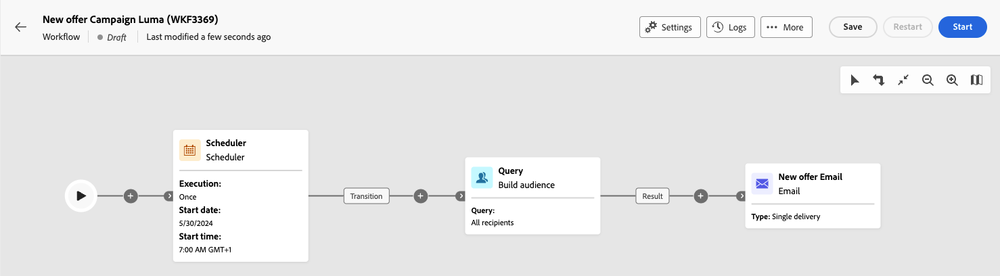

# Programar el envío de una entrega {#schedule-sending}

Puede programar el envío de una entrega. Los pasos dependen de si es una entrega independiente (única) o si está trabajando en el contexto de un flujo de trabajo de campaña.

## Envío independiente

Para las entregas independientes, programe la fecha y la hora directamente en la entrega. Consulte los ejemplos siguientes para cada tipo de entrega: correo electrónico, SMS y notificaciones push.

### Correo electrónico {#schedule-email-standalone}

Para programar el envío de un envío de correo electrónico, siga estos pasos:

1. En la sección **[!UICONTROL Programar]** de las propiedades de envío, active la opción **[!UICONTROL Habilitar programación]**.

1. Defina la fecha y la hora deseadas para el envío y haga clic en el botón **[!UICONTROL Revisar y enviar]**.

   {zoomable="yes"}

>[!NOTE]
>
>De forma predeterminada, está activada la opción **[!UICONTROL Habilitar confirmación antes de enviar]**. Esta opción requiere que confirme el envío antes de que el correo electrónico se envíe en la fecha y hora programadas. Si necesita realizar la entrega automáticamente en la fecha y hora programadas, desactive esta opción.
>

1. Compruebe que la programación es correcta y haga clic en el botón **[!UICONTROL Preparar]**.

{zoomable="yes"}

1. Una vez completada la preparación, los mensajes están listos para enviarse. Se muestran las métricas clave para la entrega, incluida la población total de destinatarios, el número de mensajes que se van a enviar y el número de destinatarios excluidos. Haga clic en el botón **[!UICONTROL Enviar como programado]** para confirmar que la entrega se enviará en la fecha y hora programadas al destino principal.

{zoomable="yes"}

### SMS

Para programar el envío de SMS para una fecha y hora específicas, siga los mismos pasos que para los envíos por correo electrónico. [Ver más arriba](#schedule-email-standalone).

{zoomable="yes"}

También puede comprobar que se aplica la programación:

{zoomable="yes"}

### Notificación push

Para programar una entrega push independiente para una fecha y hora específicas, siga los mismos pasos que para las entregas por correo electrónico. [Ver más arriba](#schedule-email-standalone).

{zoomable="yes"}

También puede comprobar que se aplica la programación:

{zoomable="yes"}

### Envío independiente en una campaña

Puede crear una entrega independiente dentro de una campaña sin utilizar un flujo de trabajo. Configure la fecha y la hora programadas para este envío como se explica más arriba. La campaña puede tener su propia programación, incluidas una fecha de inicio y una fecha de finalización. Esta programación no interfiere con su programación de entregas.

{zoomable="yes"}

## Programar una entrega en un flujo de trabajo de campaña

En el contexto de un flujo de trabajo de campaña, la práctica recomendada es utilizar la actividad **[!UICONTROL Scheduler]** para aplicar una fecha y una hora para iniciar el flujo de trabajo, lo que implica realizar la entrega. [Más información sobre el Planificador](../workflows/activities/scheduler.md).

{zoomable="yes"}

Configure la fecha y la hora en la actividad **[!UICONTROL Planificador]**.

{zoomable="yes"}

>[!NOTE]
>
>Cuando use la actividad **[!UICONTROL Programador]** para programar el envío de su envío en un flujo de trabajo, no active el botón de alternancia **[!UICONTROL Habilitar programación]** en la configuración de la actividad **[!UICONTROL Envío]**. Su envío se enviará automáticamente.
>

Si activa la opción **[!UICONTROL Habilitar programación]** en la configuración de la actividad **[!UICONTROL Envío]** y configura una fecha y una hora allí, la entrega esperará a enviarse en esta fecha y hora. Esto significa que si hay un retraso entre la fecha de inicio del flujo de trabajo y la fecha de envío, es posible que la audiencia no esté actualizada.