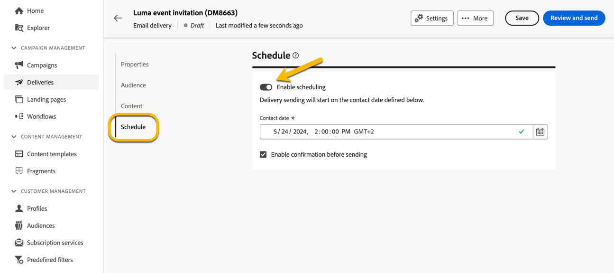

# Programar el envío de una entrega {#schedule-sending}

Puede programar el envío de una entrega. Los pasos dependerán de si se trata de una entrega independiente (única) o si está trabajando en el contexto de un flujo de trabajo de campaña.

## Envío independiente

Para las entregas independientes, puede programar directamente la fecha y la hora de la entrega.
Consulte los siguientes ejemplos para cada tipo de entrega: correo electrónico, SMS, notificación push.

### Correo electrónico {#schedule-email-standalone}

Para programar el envío de un envío de correo electrónico, siga los pasos a continuación:

1. En la sección **[!UICONTROL Programar]** de las propiedades de envío, active la opción **[!UICONTROL Habilitar programación]**

1. Establece la fecha y hora deseadas para el envío y haz clic en el botón **[!UICONTROL Revisar y enviar]**.

   {zoomable="yes"}

>[!NOTE]
>
>De forma predeterminada, está activada la opción **[!UICONTROL Habilitar confirmación antes de enviar]**. Esta opción requiere que confirme el envío antes de que el correo electrónico se envíe en la fecha y hora programadas. Si necesita **enviar la entrega automáticamente** en la fecha y hora programadas, debe deshabilitar esta opción.
>

1. Comprueba que la programación es correcta y haz clic en el botón **[!UICONTROL Preparar]**.

{zoomable="yes"}

1. Una vez completada la preparación, los mensajes están listos para enviarse. Se muestran las métricas clave para la entrega: población objetivo total, número de mensajes que desea enviar, número de destinatarios excluidos. Haga clic en el botón **[!UICONTROL Enviar como programado]** para confirmar que permite que la entrega se envíe en la fecha y hora programadas al destino principal.

{zoomable="yes"}

### Sms

Para programar la entrega de SMS a una fecha y hora específicas, los pasos son los mismos que para las entregas por correo electrónico, [ver arriba](#schedule-email-standalone).

{zoomable="yes"}

También puede comprobar que el programa se tiene en cuenta:

{zoomable="yes"}

### Notificación push

Para programar una entrega push independiente a una fecha y hora específicas, los pasos son los mismos que para las entregas por correo electrónico, [ver arriba](#schedule-email-standalone).

{zoomable="yes"}

También puede comprobar que el programa se tiene en cuenta:

{zoomable="yes"}

### Envío independiente en una campaña

Puede crear una entrega independiente dentro de una campaña sin utilizar un flujo de trabajo. Puede configurar la fecha y la hora programadas para este envío, tal como se explica más arriba.
La campaña puede tener su programación, con una fecha de inicio y una fecha de finalización. Esta programación no interferirá con su programación de entregas.

{zoomable="yes"}

## Programar una entrega en un flujo de trabajo de campaña

En el contexto de un flujo de trabajo de campaña, la **práctica recomendada** es utilizar la actividad **[!UICONTROL Programador]** para aplicar una fecha y hora que iniciará el flujo de trabajo, lo que implica la entrega de la entrega. [Más información sobre el Planificador](../workflows/activities/scheduler.md)

{zoomable="yes"}

Debe configurar la fecha y la hora en la actividad **[!UICONTROL Planificador]**.

{zoomable="yes"}

>[!NOTE]
>
>Cuando use la actividad **[!UICONTROL Programador]** para programar el envío de su envío en un flujo de trabajo, **no active** el botón de alternancia **[!UICONTROL Habilitar programación]** en la configuración de la actividad **[!UICONTROL Envío]**. Su envío se enviará automáticamente.
>

En caso de que active la opción **[!UICONTROL Habilitar programación]** en la configuración de la actividad **[!UICONTROL Envío]** y configure una fecha y una hora allí, la entrega esperará a enviarse en esta fecha y hora. Esto significa que si hay un retraso entre la fecha de inicio del flujo de trabajo y la fecha de envío, es posible que la audiencia no esté actualizada.
