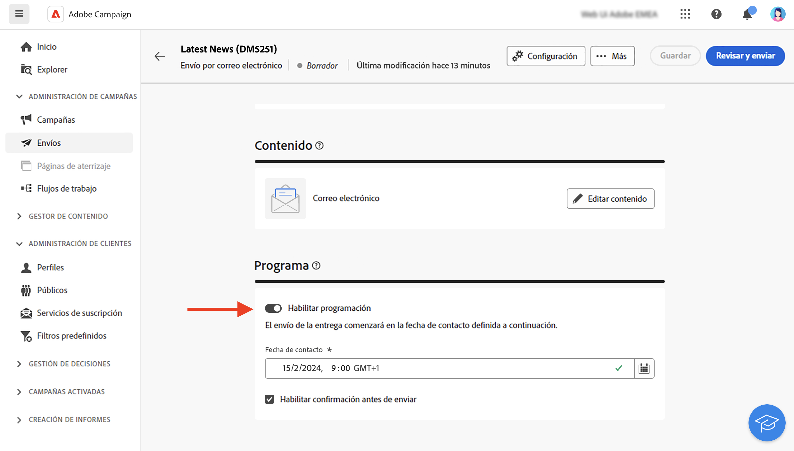

# Creación de un envío {#create-delivery}

<!-- /NEO-92684 / DOCAC-13767-->

>[!CONTEXTUALHELP]
>id="acw_deliveries_profile_enrichment_settings"
>title="Habilitar el enriquecimiento de perfiles"
>abstract="Seleccione los campos para el enriquecimiento de perfil."

Puede crear envíos independientes desde el menú de la izquierda **[!UICONTROL Envíos]** o crear envíos en el contexto de un flujo de trabajo, incluidos o no en una campaña.

Examine las pestañas siguientes para aprender a crear un envío:

>[!BEGINTABS]

>[!TAB Creación de un envío independiente]

Para crear un envío independiente, siga estos pasos:

1. Vaya al menú **[!UICONTROL Envíos]** en la navegación de la izquierda y haga clic en el botón **[!UICONTROL Creación de envíos]**.

   {zoomable="yes"}

1. Elija un canal para el envío.
1. Defina la audiencia de envío para el destinatario principal y el grupo de control. [Más información sobre las audiencias](../audience/about-recipients.md).

   {zoomable="yes"}{width="70%" align="left"}

1. Definición del contenido del mensaje. Obtenga más información sobre los canales de envío y cómo definir el contenido de envío en estas secciones:

   * [Canal de correo electrónico](../email/create-email.md)
   * [Canal de notificaciones push](../push/gs-push.md)
   * [Canal de SMS](../sms/create-sms.md)

1. (Opcional) Defina la entrega [schedule](#gs-schedule). Si no se define ninguna programación, los mensajes se envían inmediatamente después de hacer clic en el botón **[!UICONTROL Enviar]**.
1. Haz clic en el botón **[!UICONTROL Revisar y enviar]** para comprobar tu configuración.
1. Utilice el botón **[!UICONTROL Simular contenido]** para probar la configuración de envío y personalización. Puede obtener más información sobre la simulación de mensajes en [esta sección](../preview-test/preview-test.md).
1. Haga clic en el botón **[!UICONTROL Preparar]** para calcular la población de destinatarios y generar los mensajes. El paso de preparación puede tardar unos minutos. Cuando la preparación haya finalizado, los mensajes estarán listos para enviarse. En caso de error, vaya a **Registros** para comprobar las alertas y advertencias.
1. Compruebe los resultados y haga clic en el botón **[!UICONTROL Enviar]** para comenzar a enviar mensajes.
1. Una vez enviados los mensajes, vaya a la sección **Informes** para acceder a métricas clave. Obtenga más información sobre los informes de envíos en [esta sección](../reporting/delivery-reports.md).

>[!TAB Creación de un envío en un flujo de trabajo]

Para crear un envío en un flujo de trabajo, siga estos pasos:

1. Cree un flujo de trabajo o abra uno existente. [Más información sobre los flujos de trabajo](../workflows/gs-workflow-creation.md#gs-workflow-steps)
1. Agregue y configure una actividad [**[!UICONTROL Generar audiencia]**](../workflows/activities/build-audience.md).
1. Haga clic en el icono `+` y seleccione una actividad de entrega: **[!UICONTROL Correo electrónico]**, **[!UICONTROL SMS]**, **[!UICONTROL Notificación push (Android)]** o **[!UICONTROL Notificación push (iOS)]**. Obtenga más información acerca de las actividades del canal de envío en un flujo de trabajo y cómo definir el contenido de envío en [esta sección](../workflows/activities/channels.md).

   {zoomable="yes"}

1. Inicie el flujo de trabajo y compruebe los registros.

También puede añadir envíos en una campaña sin crear un flujo de trabajo. Para conseguirlo, vaya a la pestaña **[!UICONTROL Envíos]** de la campaña y haga clic en el botón **[!UICONTROL Creación de envíos]**.

{zoomable="yes"}

Los pasos de configuración son similares a los de los envíos independientes.

Para obtener más información sobre cómo configurar una campaña y administrar las entregas que pertenecen a una campaña, consulte [esta sección](../campaigns/gs-campaigns.md).

>[!ENDTABS]

## Adición de personalización {#personalization}

Los mensajes enviados por Adobe Campaign se pueden personalizar de varias formas. [Obtenga más información acerca las funcionalidades de personalización](../personalization/gs-personalization.md).

Utilice Campaign para crear contenido dinámico y enviar mensajes personalizados. Las funcionalidades de personalización se pueden combinar para mejorar sus mensajes y crear una experiencia de usuario personalizada.

Puede personalizar el contenido del mensaje haciendo lo siguiente:

* Inserción dinámica de **campos de personalización**

  Los campos de personalización se utilizan para la personalización de primer nivel de los mensajes. Puede seleccionar cualquier campo disponible en la base de datos desde el editor de personalización. Para una entrega, puede seleccionar cualquier campo relacionado con el destinatario, el mensaje o la entrega. Estos atributos de personalización se pueden insertar en la línea de asunto o en el cuerpo de los mensajes. [Más información](../personalization/personalize.md)

* Insertando **fragmentos de expresión** predefinidos

  Campaign viene con un conjunto de fragmentos de expresión que contienen procesamientos específicos que puede insertar en los envíos. Por ejemplo, puede añadir un logotipo, un mensaje de saludo o un enlace a la página espejo del mensaje. Los fragmentos de expresiones están disponibles en una entrada dedicada del editor de personalización. Además, puede crear sus propios fragmentos de expresiones para adaptarlos a sus necesidades. [Aprenda a utilizar fragmentos de expresiones](../content/use-expression-fragments.md)

* Creando **contenido condicional**

  Configure el contenido condicional para añadir personalización dinámica basada en el perfil del destinatario, por ejemplo. Los bloques de texto o las imágenes se insertan cuando se cumple una condición concreta. [Más información](../personalization/conditions.md)

* Agregando **ofertas personalizadas**

  Inserte ofertas personalizadas en el contenido del mensaje, según la ubicación del destinatario, el tiempo actual o la última orden de compra. [Más información](../msg/offers.md)

## Previsualizar y probar sus envíos

Una vez definido el contenido del mensaje, puede previsualizarlo para controlar la renderización de los mensajes y comprobar la configuración de personalización con perfiles de prueba. [Más información](../preview-test/preview-test.md)

## Programación de los envíos de entregas {#gs-schedule}

>[!CONTEXTUALHELP]
>id="acw_deliveries_email_schedule"
>title="Establecer una fecha y hora de contacto"
>abstract="Defina la fecha y la hora exacta de envío. Al elegir el momento más apropiado para el mensaje de marketing, puede maximizar las tasas de apertura."

Puede establecer la fecha y la hora exacta para enviar los mensajes. Al elegir el momento más apropiado para el mensaje de marketing, puede maximizar las tasas de apertura.

Para programar el envío de una entrega, abra su entrega y vaya a la sección **[!UICONTROL Programar]**. Utilice la opción **[!UICONTROL Habilitar programación]** para activarlo y establezca la fecha y hora deseadas para el envío. Una vez realizada la entrega, el envío real comienza en la fecha de contacto definida.

{zoomable="yes"}

De forma predeterminada, está activada la opción **[!UICONTROL Habilitar confirmación antes de enviar]**. Esta opción requiere que confirme el envío antes de que el correo electrónico se envíe en la fecha y hora programadas. Si necesita enviar el correo electrónico automáticamente en la fecha y hora programadas, puede deshabilitar esta opción.

Obtenga información sobre los pasos para realizar un envío programado en [esta sección](../monitor/prepare-send.md#schedule-the-send).

## Registros de seguimiento y monitorización {#gs-tracking-logs}

La monitorización de las entregas una vez enviadas es un paso clave para garantizar que las campañas de marketing sean eficientes y lleguen a los clientes.

Puede monitorizarlas después de enviar un envío, así como comprender cómo se administran los errores y las cuarentenas.

Obtenga más información acerca de las capacidades de informes y monitorización en [esta sección](../reporting/gs-reports.md).