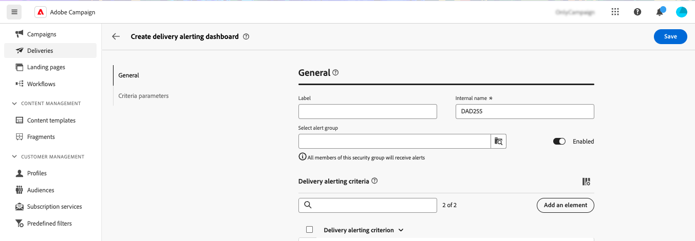

# Paneles de alertas de envío {#delivery-alerting-dashboards}

>[!CONTEXTUALHELP]
>id="acw_delivery_alerting_dashboards"
>title="Paneles de alertas de envío"
>abstract="Las alertas de envío son un sistema de administración de alertas que permite a grupos de usuarios recibir automáticamente notificaciones por correo electrónico con información sobre la ejecución de sus envíos. Los paneles de alertas de envío le permiten especificar quién recibirá alertas por correo electrónico, elegir y configurar los criterios de alerta que se utilizarán para enviar esas alertas y acceder al historial de todas las notificaciones enviadas."

Los paneles de alertas de entrega le permiten especificar quién recibirá alertas por correo electrónico, elegir y configurar los criterios de alerta que se utilizarán para enviar esas alertas y acceder al historial de todas las notificaciones enviadas. Se puede acceder a ellos desde el menú **Alerta de entrega** del panel de navegación izquierdo, en la pestaña **Paneles**.

>[!AVAILABILITY]
>
>Esta capacidad se encuentra en disponibilidad limitada (LA). Está restringido a los clientes que migran **de Adobe Campaign Standard a la versión 8 de Adobe Campaign** y no se puede implementar en ningún otro entorno.

## Crear un panel de envíos {#dashboards}

>[!CONTEXTUALHELP]
>id="acw_delery_alerting_dashboard_create"
>title="Crear panel de alertas de envío"
>abstract="La creación de un panel de alertas de envío permite especificar quién recibirá alertas por correo electrónico, elegir y configurar los criterios de alerta que se utilizarán para enviar esas alertas y acceder al historial de todas las notificaciones enviadas."

>[!CONTEXTUALHELP]
>id="acw_delivery_alerting_create_general"
>title="Parámetros generales de alertas de envío"
>abstract="Especifique las propiedades generales del panel de alertas de envío. El campo **Seleccionar grupo de alertas** permite especificar el **grupo de operadores** que recibirá las alertas enviadas por este panel."

>[!CONTEXTUALHELP]
>id="acw_delivery_alerting_create_criteria_add"
>title="Criterios de alertas de envío"
>abstract="En esta sección, añada los criterios que desee utilizar para enviar alertas desde este panel. Elija entre los criterios predefinidos o cree sus propios criterios para adaptarlos a necesidades específicas."

>[!CONTEXTUALHELP]
>id="acw_delivery_alerting_create_criteria_parameters"
>title="Parámetros de criterios"
>abstract="Los criterios tienen valores de parámetros predeterminados que definen cómo se deben aplicar. Puede cambiar estos valores para adaptarlos a sus necesidades desde esta sección."

Para crear un panel de envío, siga estos pasos:

1. Vaya al menú **Alerta de entrega** en el panel de navegación izquierdo y haga clic en **Crear panel de entrega**.

   

1. Asigne un nombre al tablero en el campo **Etiqueta**. El campo **Nombre interno** se rellena automáticamente y es de solo lectura.

1. En el campo **Seleccionar grupo de alertas**, especifique el **grupo de operadores** que recibirá las alertas enviadas por este panel. Todos los miembros del grupo de operadores seleccionado recibirán las alertas.

   Obtenga más información acerca de permisos y grupos de operadores en la [documentación de Adobe Campaign v8 (consola)](https://experienceleague.adobe.com/es/docs/campaign/campaign-v8/admin/permissions/gs-permissions){target="_blank"}

1. En la sección **Criterios de alerta de envío**, agregue los criterios que desee utilizar para enviar alertas. Elija entre criterios predefinidos o cree sus propios criterios para adaptarlos a necesidades específicas. [Aprenda a trabajar con criterios](../msg/delivery-alerting-criteria.md)

1. Los criterios tienen valores de parámetro predeterminados que definen cómo se deben aplicar. Puede cambiar estos valores para adaptarlos a sus necesidades desde la sección **Parámetros de criterios**.

   

   Por ejemplo, de forma predeterminada, el parámetro de criterio **Tamaño mínimo del destinatario del envío** está establecido en 50, lo que significa que un envío se incluirá en la alerta que envía este panel solo si se dirige al menos a 50 perfiles. Puede cambiar este parámetro si desea incluir envíos dirigidos a menos de 50 perfiles.

   Expanda la sección siguiente para obtener más información sobre cada parámetro de criterio:

   +++Parámetros de criterios disponibles

   * **Tamaño mínimo del destinatario del envío**: Por ejemplo, si escribe 100 en este campo, solo se envía una notificación para los envíos cuyo destino sea igual o mayor que 100 destinatarios. Este parámetro se aplica a todos los criterios.
   * **Período de supervisión antes y después de la fecha de contacto (en horas)**: Número de horas antes y después de la hora actual. Solo se tienen en cuenta las entregas que tienen una fecha de contacto en este intervalo de tiempo. Este parámetro se aplica a todos los criterios. De forma predeterminada, el valor de este campo se establece en 24 horas.
   * **Proporción máxima de errores de rechazos leves**: se envía una notificación para todos los envíos con una proporción de errores de rechazos leves mayor que el valor especificado. De forma predeterminada, el valor de este campo se establece en 0,05 (5 %).
   * **Proporción máxima de errores de rechazos graves**: se envía una notificación para todos los envíos con una proporción de errores de rechazos graves mayor que el valor especificado. De forma predeterminada, el valor de este campo se establece en 0,05 (5 %).
   * **Umbral de tiempo mínimo para la entrega en estado &#39;Start pending&#39; (en minutos)**: se envía una notificación para todas las entregas con un estado Start pending por más tiempo que la duración especificada en este campo, el estado Start pending significa que el sistema aún no ha tenido en cuenta los mensajes.
   * **Tiempo mínimo requerido para el cálculo del rendimiento (en minutos)**: En los envíos con criterio de rendimiento bajo solo se tienen en cuenta los envíos iniciados (con estado En curso) durante más tiempo del especificado.
   * **Porcentaje máximo de mensajes procesados para el cálculo del rendimiento**: Para los envíos con un criterio de rendimiento bajo solo se tienen en cuenta los envíos con un porcentaje de mensajes procesados inferior al porcentaje especificado.
   * **Rendimiento mínimo esperado (en mensajes enviados por hora)**: Para los envíos con un criterio de rendimiento bajo solo se tienen en cuenta los envíos con un rendimiento inferior al valor especificado.
   * **Proporción mínima procesada requerida para el criterio &quot;Envíos en curso&quot;**: solo se tienen en cuenta los envíos con un porcentaje de mensajes procesados superior al porcentaje especificado.

   +++

1. De forma predeterminada, los paneles de alertas están desactivados, lo que significa que las alertas de correo electrónico vinculadas a este panel no se envían. Para habilitar el panel inmediatamente, active la opción **Enabled** en la sección **General**, junto al campo de selección del grupo de alertas.

   También puede guardar el tablero y habilitarlo más adelante.

   

1. Para guardar el panel de alertas, haga clic en el botón **Guardar**.

El panel de alertas se abre con datos en blanco. Cuando esté listo para activarlo y enviar notificaciones, haga clic en el botón **Configuración** y active la opción **Habilitado** si no lo ha hecho anteriormente.

Ahora, cada vez que una entrega cumple los criterios definidos en este panel, se envía una notificación de alerta al grupo de operadores especificado.

## Administrar paneles de alertas

>[!CONTEXTUALHELP]
>id="acw_delivery_alerting_dashboard_alerts"
>title="Alertas de envío enviadas"
>abstract="Esta sección le permite visualizar información relacionada con las últimas alertas enviadas."

>[!CONTEXTUALHELP]
>id="acw_delivery_alerting_dashboard_history"
>title="Historial de alertas de envío"
>abstract="El panel **Historial** contiene todas las alertas enviadas desde este panel. Haga clic en un elemento para acceder a las alertas correspondientes enviadas en ese momento concreto."

Se puede acceder a todos los paneles de alertas creados desde el menú **Alerta de entrega**, en la pestaña **Paneles**.

Puede duplicar o eliminar un tablero usando el botón **Más acciones** ubicado junto a su nombre.

Para acceder a una vista detallada de un panel, haga clic en su nombre en la lista. Desde esta pantalla, puede visualizar la última alerta enviada. Todas las alertas enviadas se muestran en el panel izquierdo. Haga clic en un elemento para acceder a las alertas correspondientes enviadas en ese momento concreto.

Para editar el panel, haga clic en el botón **Configuración** en la esquina superior derecha y realice los cambios que desee.