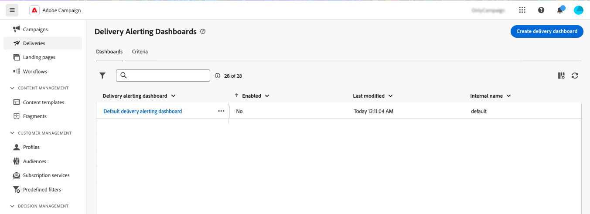

# Paneles de alertas de envío {#delivery-alerting-dashboards}

>[!CONTEXTUALHELP]
>id="acw_delivery_alerting_dashboards"
>title="Paneles de alertas de envío"
>abstract="Alerta de entrega es un sistema de administración de alertas que permite a grupos de usuarios recibir automáticamente notificaciones por correo electrónico con información sobre sus ejecuciones de entregas. Los paneles de alertas de entrega le permiten especificar quién recibirá alertas por correo electrónico, elegir y configurar los criterios de alerta que se utilizarán para enviar esas alertas y acceder al historial de todas las notificaciones enviadas."

Los paneles de alertas de entrega le permiten especificar quién recibirá alertas por correo electrónico, elegir y configurar los criterios de alerta que se utilizarán para enviar esas alertas y acceder al historial de todas las notificaciones enviadas. Se puede acceder a ellas desde **Alerta de envío** menú en el panel de navegación izquierdo, bajo el **Paneles** pestaña.

## Creación de un panel de envío {#dashboards}

>[!CONTEXTUALHELP]
>id="acw_delery_alerting_dashboard_create"
>title="Crear panel de alertas de envío"
>abstract="La creación de un panel de alertas de entrega permite especificar quién recibirá alertas por correo electrónico, elegir y configurar los criterios de alerta que se utilizarán para enviar esas alertas y acceder al historial de todas las notificaciones enviadas."

>[!CONTEXTUALHELP]
>id="acw_delivery_alerting_create_general"
>title="Parámetros generales de alertas de envío"
>abstract="Especifique las propiedades generales del panel de alertas de envío. El **Seleccionar grupo de alertas** permite especificar el campo **grupo de operadores** para recibir las alertas enviadas por este panel."

>[!CONTEXTUALHELP]
>id="acw_delivery_alerting_create_criteria_add"
>title="Criterios de alertas de envío"
>abstract="En esta sección, agregue los criterios que desee utilizar para enviar alertas desde este panel. Elija entre criterios predefinidos o cree sus propios criterios para adaptarlos a necesidades específicas."

>[!CONTEXTUALHELP]
>id="acw_delivery_alerting_create_criteria_parameters"
>title="Parámetros de criterio"
>abstract="Los criterios tienen valores de parámetros predeterminados que definen cómo se deben aplicar. Puede cambiar estos valores para adaptarlos a sus necesidades desde esta sección."

Para crear un panel de envío, siga estos pasos:

1. Vaya a **Alerta de envío** en el panel de navegación izquierdo y haga clic en **Crear panel de envío**.

   

1. Asigne un nombre al tablero en la **Etiqueta** field. El **Nombre interno** El campo se rellena automáticamente y es de solo lectura.

1. En el **Seleccionar grupo de alertas** , especifique el campo **grupo de operadores** para recibir las alertas enviadas por este panel. Todos los miembros del grupo de operadores seleccionado recibirán las alertas.

   Obtenga más información sobre permisos y grupos de operadores en la [Documentación de Adobe Campaign v8 (consola)](https://experienceleague.adobe.com/en/docs/campaign/campaign-v8/admin/permissions/gs-permissions){target="_blank"}

1. En el **Criterios de alerta de envío** , agregue los criterios que desee utilizar para enviar alertas. Elija entre criterios predefinidos o cree sus propios criterios para adaptarlos a necesidades específicas. [Aprenda a trabajar con criterios](../msg/delivery-alerting-criteria.md)

1. Los criterios tienen valores de parámetros predeterminados que definen cómo se deben aplicar. Puede cambiar estos valores para adaptarlos a sus necesidades desde el **Parámetros de criterio** sección.

   

   Por ejemplo, de forma predeterminada, la variable **Tamaño mínimo del destinatario del envío** el parámetro criteria se establece en 50, lo que significa que una entrega se incluirá en la alerta que envía este panel solo si se dirige al menos a 50 perfiles. Puede cambiar este parámetro si desea incluir envíos dirigidos a menos de 50 perfiles.

   Expanda la sección siguiente para obtener más información sobre cada parámetro de criterio:

   +++Parámetros de criterios disponibles

   * **Tamaño mínimo del destinatario del envío**: Por ejemplo, si introduce 100 en este campo, se envía una notificación solo para las entregas con un objetivo igual o superior a 100 destinatarios. Este parámetro se aplica a todos los criterios.
   * **Período de monitorización antes y después de la fecha de contacto (en horas)**: Número de horas antes y después de la hora actual. Solo se tienen en cuenta las entregas que tienen una fecha de contacto en este intervalo de tiempo. Este parámetro se aplica a todos los criterios. De forma predeterminada, el valor de este campo se establece en 24 horas.
   * **Proporción máxima de errores de rechazos leves**: se envía una notificación para todas las entregas con una proporción de errores de devolución suave mayor que el valor especificado. De forma predeterminada, el valor de este campo se establece en 0,05 (5 %).
   * **Proporción máxima de errores de rechazos graves**: se envía una notificación para todas las entregas con una proporción de errores de devolución dura mayor que el valor especificado. De forma predeterminada, el valor de este campo se establece en 0,05 (5 %).
   * **Umbral de tiempo mínimo para la entrega en estado &quot;Start pending&quot; (en minutos)**: se envía una notificación para todas las entregas con un estado Start pending más largo que la duración especificada en este campo, Start pending, lo que significa que el sistema aún no ha tenido en cuenta los mensajes.
   * **Tiempo mínimo necesario para el cálculo del rendimiento (en minutos)**: Solo se tienen en cuenta los envíos iniciados (con estado En curso) durante más tiempo del especificado para el criterio Envíos con bajo rendimiento.
   * **Porcentaje máximo de mensajes procesados para el cálculo del rendimiento**: Solo se tienen en cuenta las entregas con un porcentaje de mensajes procesados inferior al porcentaje especificado para el criterio Envíos con bajo rendimiento.
   * **Rendimiento mínimo esperado (en mensajes enviados por hora)**: Solo se tienen en cuenta los envíos con un rendimiento inferior al valor especificado para el criterio Envíos con un rendimiento bajo.
   * **Proporción procesada mínima requerida para el criterio &quot;Entregas en curso&quot;**: Solo se tienen en cuenta las entregas con un porcentaje de mensajes procesados superior al porcentaje especificado.

+++

1. De forma predeterminada, los paneles de alertas están desactivados, lo que significa que las alertas de correo electrónico vinculadas a este panel no se envían. Para habilitar el tablero inmediatamente, cambie el **Habilitado** en la opción **General** , junto al campo de selección del grupo de alertas.

   También puede guardar el tablero y habilitarlo más adelante.

   

1. Para guardar el tablero de alertas, haga clic en **Guardar** botón.

El panel de alertas se abre con datos en blanco. Cuando esté listo para activarlo y enviar notificaciones, haga clic en el **Configuración** y cambie el **Habilitado** opción si no lo ha hecho anteriormente.

Ahora, cada vez que una entrega cumple los criterios definidos en este panel, se envía una notificación de alerta al grupo de operadores especificado.

## Administración de paneles de alertas

>[!CONTEXTUALHELP]
>id="acw_delivery_alerting_dashboard_alerts"
>title="Alertas de envío enviadas"
>abstract="Esta sección le permite visualizar información relacionada con las últimas alertas enviadas."

>[!CONTEXTUALHELP]
>id="acw_delivery_alerting_dashboard_history"
>title="Historial de alertas de envío"
>abstract="El **Historial** Este panel contiene todas las alertas enviadas desde este panel. Haga clic en un elemento para acceder a las alertas correspondientes enviadas en ese momento concreto."

Se puede acceder a todos los paneles de alertas creados desde el **Alerta de envío** menú, en el **Paneles** pestaña.

Puede duplicar o eliminar un tablero mediante el **Más acciones** situado junto a su nombre.

Para acceder a una vista detallada de un panel, haga clic en su nombre en la lista. Desde esta pantalla, puede visualizar la última alerta enviada. Todas las alertas enviadas se muestran en el panel izquierdo. Haga clic en un elemento para acceder a las alertas correspondientes enviadas en ese momento concreto.

Para editar el tablero, haga clic en **Configuración** en la esquina superior derecha y realice los cambios que desee.
