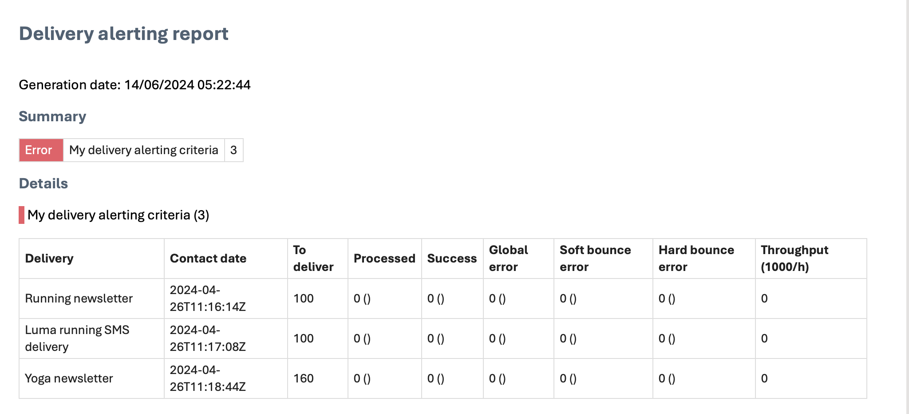

# Introducción a las alertas de envío {#gs-delivery-alerting}

Las alertas de envío son un sistema de administración de alertas que permite a grupos de usuarios recibir automáticamente notificaciones por correo electrónico con información sobre sus ejecuciones de envío. Los destinatarios monitorizan los envíos en curso procesados por Adobe Campaign y toman las medidas adecuadas si surgen problemas.

Las notificaciones se personalizan según criterios de alerta específicos definidos a través de la interfaz de usuario web de Adobe Campaign.

Para obtener más información sobre la administración de errores de entrega, consulte la [documentación de Adobe Campaign v8 (consola)](https://experienceleague.adobe.com/en/docs/campaign/campaign-v8/send/failures/delivery-failures#send){target="_blank"}.

## Contenido de notificación por correo electrónico {#content}

Las notificaciones por correo electrónico incluyen las siguientes secciones:

* **Resumen**: muestra el número de envíos que cumplen los criterios definidos, con etiquetas y colores para cada criterio.
* **Detalles**: enumera todos los criterios de entrega definidos para el panel y los envíos correspondientes para cada criterio.

## Configuración de alertas de envío {#set-up}

Para configurar estas alertas, la interfaz de usuario web de Campaign permite crear y administrar:

* **Paneles de alertas de entrega**: especifique destinatarios, establezca criterios de alerta para incluirlos en el panel y acceda a un historial de alertas enviadas. [Aprenda a trabajar con paneles](../msg/delivery-alerting-dashboards.md).
* **Criterios de alerta de envío**: La interfaz de usuario web de Campaign proporciona criterios de alerta predefinidos, como envíos con bajo rendimiento o envíos cuya preparación ha fallado. Puede agregar estos criterios a su tablero o crear los suyos propios que mejor se adapten a sus necesidades. [Aprenda a trabajar con criterios](../msg/delivery-alerting-criteria.md).

Por ejemplo, notifique a los usuarios con derechos de administración solo sobre los envíos fallidos y notifique a los usuarios de marketing sobre los envíos con una proporción de errores de rebote suave alta. Para conseguirlo, cree dos paneles independientes con los criterios adecuados para cada grupo de destinatarios.

>[!NOTE]
>
>Para acceder y configurar paneles y criterios de alerta, debe tener **derechos de administración** o formar parte del grupo de seguridad **Supervisores de entrega**. Los usuarios estándar no pueden acceder a los paneles de la interfaz de Adobe Campaign, pero pueden recibir notificaciones de alerta. [Más información sobre acceso y permisos](../get-started/permissions.md).