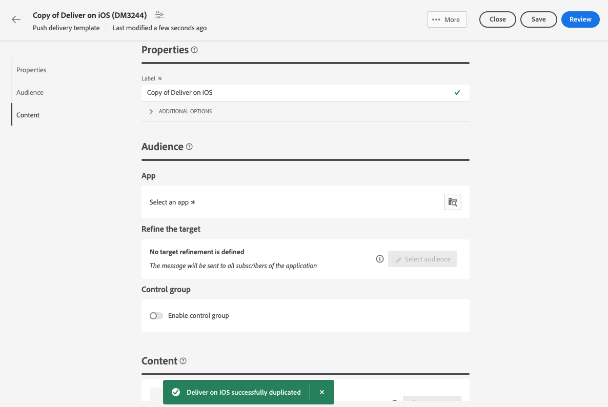
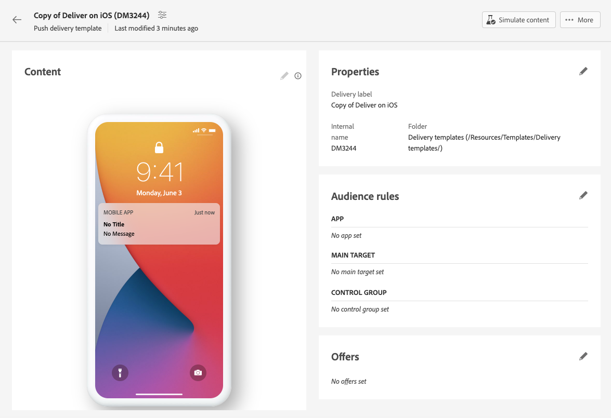

# Uso de plantillas de envío {#work-with-delivery-templates}

>[!CONTEXTUALHELP]
>id="acw_delivery_template_for_campaign"
>title="Plantillas de envíos"
>abstract="Para acelerar y mejorar el proceso de diseño, cree plantillas envío para reutilizar los contenido y la configuración personalizados en las campañas. Este funcionalidad estandariza el creativa apariencia, lo que permite una ejecución y iniciar más rápidas de las campañas."

Para acelerar y mejorar el proceso de diseño, cree plantillas envío para reutilizar los contenido y la configuración personalizados en las campañas. Este funcionalidad estandariza el creativa apariencia, lo que permite una ejecución y iniciar más rápidas de las campañas.

Un plantilla incluye:

* La **carpeta** y **la carpeta** de ejecución del plantilla. La carpeta es la ubicación donde se guarda el plantilla de envíos. La carpeta de ejecución es la carpeta donde se guardan los envíos creados a partir de este plantilla.
* [Tipologías](../advanced-settings/delivery-settings.md#typology),
* La dirección del remitente,
* Un [audiencia](../audience/about-recipients.md), incluidos [los grupos](../audience/control-group.md) de control,
* contenido](../email/edit-content.md) personalizados[,
* [Campos](../personalization/personalize.md) personalizados y [contenido](../personalization/conditions.md) condicional,
* Vínculos a [vínculos](../email/message-tracking.md) página espejo](../email/mirror-page.md) y baja[,
* Otras propiedades del envío, como la validez de los recursos, los parámetros de reintento o la configuración de cuarentena.

>[!NOTE]
>
>Las plantillas de entrega difieren de las plantillas](../email/create-email-templates.md) de [contenido, que le permiten reutilizar solo el contenido de sus correos electrónicos y inicio crear contenido con una de las plantillas de correo electrónico de muestra proporcionadas de fábrica.

## Acceso y administración de plantillas de envíos {#access-manage-templates}

>[!CONTEXTUALHELP]
>id="acw_delivery_templates"
>title="Trabajo con plantillas de envío"
>abstract="Utilice plantillas de envío para crear y guardar la configuración de envío para su uso futuro en todas las campañas. Crear envío plantillas desde cero, duplicado un plantilla existente o convertir un envío en un plantilla."

Para acceder al lista plantilla de contenido, seleccione **[!UICONTROL Administración Campaign]** > **[!UICONTROL entregas]** en el menú de la izquierda y vaya al **pestaña Plantillas** .

{zoomable="yes"}

Se muestran todas las plantillas creadas en el entorno actual.

Puede filtrar las plantillas de contenido por canales y carpetas. También puede establecer filtros avanzados generando una regla con atributos de entrega. [Más información acerca del modelador de consultas](../audience/../query/query-modeler-overview.md)

{zoomable="yes"}

Para editar un plantilla, haga clic en el elemento deseado del lista. A partir de ahí:

* Modifique su contenido, propiedades, audiencia y las ofertas asociadas a ella.
* Pon a prueba tu plantilla. [Más información](#test-template)

{zoomable="yes"}

Para eliminar o [duplicar](#copy-an-existing-template) una plantilla, seleccione la acción correspondiente en el menú **[!UICONTROL Más acciones]**, ya sea en la lista **[!UICONTROL Plantillas]** o en una pantalla de edición de plantilla.

{zoomable="yes"}

>[!NOTE]
>
>Cuando se edita o elimina un plantilla, los envíos creados con este plantilla no se ven afectados.

## Crear una plantilla de envíos {#create-a-delivery-template}

Para crear una plantilla de envíos, puede:

* Duplicar una plantilla existente: [Más información](#copy-an-existing-template)
* Convertir una entrega existente en una plantilla: [Más información](#convert-an-existing-delivery)
* Crear una plantilla de envíos desde cero: [Más información](#create-a-new-template)

### Duplicación de una plantilla de envíos existente {#copy-an-existing-template}

Campaign incluye plantillas integradas para cada canal: correo electrónico, push y SMS. La forma más sencilla de crear una plantilla de envíos es duplicar y personalizar una plantilla integrada.

>[!NOTE]
>
>También puede duplicado cualquier plantilla personalizado.

Para duplicado una plantilla de envíos, seguir estos pasos:

1. Examinar a la **pestaña Plantillas** desde el menú Entregas **a la** izquierda. [Más información](#access-manage-templates)
1. Haga clic en el **[!UICONTROL botón Más acciones]** a la derecha del nombre del plantilla deseado y seleccione **[!UICONTROL Duplicar]**.

   También puede seleccionar una plantilla del lista y elegir esta opción en la pantalla de edición plantilla.

1. Confirme la duplicación.

   {zoomable="yes"}

1. El nuevo panel de plantillas se abre en la pantalla central. Edite la configuración de la plantilla según sea necesario.

   {zoomable="yes"}

1. Haga clic en el botón **[!UICONTROL Revisar]** para guardar y revisar la plantilla. Puede seguir editando todos sus ajustes, eliminándolos y duplicándolos.

   {zoomable="yes"}

1. Pruebe el procesamiento de la plantilla si es necesario. [Más información](#test-template)

La nueva plantilla se agrega a la lista [**Plantillas**](#access-manage-templates). Ahora puede seleccionarlo al crear un nuevo envío.

### Conversión de un envío en una plantilla {#convert-an-existing-delivery}

Cualquier envío se puede convertir en un plantilla para futuras acciones repetidas envío.

Para guardar un envío como un plantilla, seguir estos pasos:

1. Examinar al **[!UICONTROL menú Administración]** de Campaign > **[!UICONTROL Envíos]** .
1. En el **[!UICONTROL pestaña Examinar]** , haga clic en el **[!UICONTROL botón Más acciones]** a la derecha del nombre del envío deseado y seleccione **[!UICONTROL Copiar como plantilla]**.

   {zoomable="yes"}

   También puede seleccionar una plantilla del lista y elegir esta opción en la pantalla de edición plantilla.

1. Confirme la duplicación.

1. La nueva panel plantilla se abre en la pantalla central. Editar la configuración de plantilla según sea necesario.

1. Haga clic en el **[!UICONTROL botón Revisar]** para guardar y revisar su plantilla. Aún puede editar todas sus configuraciones, eliminarlas y duplicado.

1. Pruebe la representación del plantilla si es necesario. [Más información](#test-template)

El nuevo plantilla se agrega al [**lista](#access-manage-templates) Plantillas**. Ahora puede seleccionarlo al crear un nuevo envío.

### Crear una nueva plantilla de envíos {#create-a-new-template}

>[!NOTE]
>
>Para evitar errores de configuración, Adobe Systems recomienda [duplicar una plantilla](#copy-an-existing-template) integrada y personalizar sus propiedades en lugar de crear una nueva plantilla.

Para configurar una plantilla de envíos desde cero, seguir estos pasos:

1. Examinar a la **pestaña Plantillas** desde el menú Entregas **a la** izquierda. [Más información](#access-manage-templates)
1. Haga clic en el botón de plantilla **** Crear.

   {zoomable="yes"}

1. Seleccione el canal que desee utilizar para su plantilla.
1. El plantilla de envíos integrado para ese canal se usa de manera predeterminada para ayudarle a versión su propio plantilla. Utilice el botón dedicado a la derecha del canal seleccionado para seleccionar otro plantilla si es necesario.

   {zoomable="yes"}

1. Haga clic de nuevo en la botón de **[!UICONTROL plantilla]** Crear.

1. Defina las propiedades, [el audiencia](../audience/add-audience.md) y el contenido plantilla en función del canal seleccionado.

   >[!NOTE]
   >
   >Obtenga más información acerca de los canales de envío y cómo diseñar los contenidos respectivos en las secciones siguientes:
   >
   > * [Canal de correo electrónico](../email/create-email.md)
   > * [Canal de notificaciones push](../push/gs-push.md)
   > * [Canal de SMS](../sms/create-sms.md)

1. Además, para correo electrónico plantillas, se puede acceder a la configuración avanzada, como las reglas de tipología y las asignaciones destino, a través de la botón de Configuración **** ubicada en la parte superior derecha de la pantalla. [Más información](../advanced-settings/delivery-settings.md)

1. Haga clic en el **[!UICONTROL botón Revisar]** para guardar y revisar su plantilla. Aún puede editar todas sus configuraciones, eliminarlas y duplicado.

1. Pruebe la representación del plantilla si es necesario. [Más información](#test-template)

La nueva plantilla se agrega a la lista [**Plantillas**](#access-manage-templates). Ahora puede seleccionarlo al crear un nuevo envío.

## Prueba de una plantilla de envíos {#test-template}

Puede prueba la representación de cualquier plantilla de envíos, ya sea que se haya creado desde cero o a partir de un contenido existente. Para ello, siga estos pasos:

1. Examinar al **menú Plantillas** pestaña a través del menú de administración ]**de**[!UICONTROL  Campaign > **[!UICONTROL Entregas]** y seleccione cualquier plantilla. [Más información](#access-manage-templates)

1. Haga clic en el botón **[!UICONTROL Simular contenido]** en la parte superior derecha de la pantalla.

   {zoomable="yes"}

1. Seleccione uno o varios perfiles prueba para comprobar la correo electrónico representación. También puede seleccionar perfiles reales de su base de datos. [Más información sobre prueba perfiles](../audience/test-profiles.md)

1. Alterne entre los diferentes perfiles para obtener una representación personalizada del mensaje según el perfil seleccionado. También puede ajustar el nivel de zoom y elegir la vista de escritorio o la vista móvil.

[Más información sobre la vista previa de contenido](../preview-test/preview-content.md)

   {zoomable="yes"}

1. Cerrar la ventana para volver a la pantalla de edición plantilla.

>[!NOTE]
>
>No se puede usar correo electrónico renderización ni enviar pruebas en una plantilla de envíos.