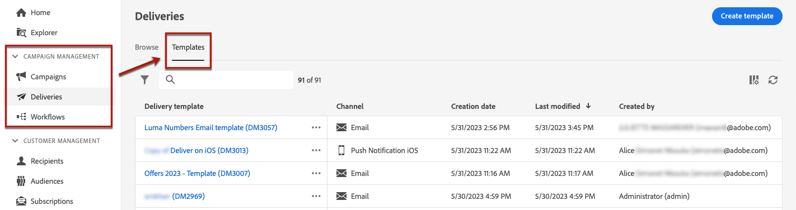

# Trabajo con plantillas de envío {#work-with-delivery-templates}

Para un proceso de diseño acelerado y mejorado, puede crear plantillas de envío para reutilizar fácilmente el contenido personalizado en sus campañas. Esta funcionalidad le permite estandarizar la apariencia creativa para ejecutar y lanzar las campañas con mayor rapidez.

Una plantilla puede incluir:

* [Tipologías](../advanced-settings/delivery-settings.md#typology)
* La dirección del remitente
* Un [audiencia](../audience/about-audiences.md), incluido [grupos de control](../audience/control-group.md)
* Personalizado [content](../content/edit-content.md)
* [Campos personalizados](../personalization/personalize.md) y [contenido condicional](../personalization/conditions.md)
* Vínculos a [página espejo](../content/mirror-page.md) y baja [vínculos](../content/message-tracking.md)
* Otras propiedades del envío, como la validez de los recursos, los parámetros de reintento o la configuración de cuarentena.

## Acceso y administración de plantillas {#access-manage-templates}

>[!CONTEXTUALHELP]
>id="acw_delivery_templates"
>title="Trabajo con plantillas de envío"
>abstract="Utilice plantillas de envío para crear y guardar sin esfuerzo los envíos existentes para uso futuro."
>additional-url="https://experienceleague.adobe.com/docs/campaign-web/v8/msg/delivery-template.html#copy-an-existing-template" text="Duplicación de una plantilla existente"
>additional-url="https://experienceleague.adobe.com/docs/campaign-web/v8/msg/delivery-template.html#convert-an-existing-delivery" text="Conversión de una entrega en una plantilla"

Para acceder a la lista de plantillas de contenido, seleccione **[!UICONTROL Campaign Management]** > **[!UICONTROL Envíos]** en el menú de la izquierda y vaya a **Plantillas** pestaña.

Todas las plantillas que se [created](#create-a-delivery-template) en el entorno actual.

Puede filtrar las plantillas de contenido por canales y carpetas. También puede establecer filtros avanzados generando una regla con atributos de entrega. [Más información sobre el Generador de reglas](../audience/segment-builder.md)

Para editar una plantilla, haga clic en el elemento que desee en la lista. A partir de ahí:

* Puede modificar su contenido, propiedades, audiencia y cualquier oferta adjunta a él.
* También puede probar la plantilla. [Más información](#test-template)

Para eliminar o [duplicado](#copy-an-existing-template) Para crear una plantilla, seleccione la acción correspondiente en la **[!UICONTROL Más acciones]** menú, ya sea desde el **[!UICONTROL Plantillas]** o desde una pantalla de edición de plantilla.

>[!NOTE]
>
>Cuando se edita o elimina una plantilla, los envíos creados con esta plantilla no se ven afectados.

## Creación de una plantilla {#create-a-delivery-template}

Para crear una plantilla de envíos, puede:
* Duplicación de una plantilla existente: [Más información](#copy-an-existing-template)
* Conversión de una entrega existente en una plantilla: [Más información](#convert-an-existing-delivery)
* Creación de una plantilla de envíos desde cero: [Más información](#create-a-new-template)

### Duplicación de una plantilla existente {#copy-an-existing-template}

Campaign viene con un conjunto de plantillas integradas para cada canal: correo electrónico, push, SMS. La forma más sencilla de crear una plantilla de envíos es duplicar y personalizar una plantilla integrada.

>[!NOTE]
>
>También puede duplicar cualquier plantilla personalizada.

Para duplicar una plantilla de envíos, siga estos pasos:

1. Vaya a la pestaña **Plantillas**, desde el menú izquierdo **Envíos.** [Más información](#access-manage-templates)
1. Haga clic en **[!UICONTROL Más acciones]** a la derecha del nombre de la plantilla deseada y seleccione  **[!UICONTROL Duplicar]**.

   También puede seleccionar una plantilla de la lista y seleccionar esta opción en la pantalla de edición de plantillas.

1. Confirme la duplicación.

   

1. El nuevo panel de plantillas se abre en la pantalla central. Edite la configuración de la plantilla según sea necesario.

   

1. Haga clic en **[!UICONTROL Revisar]** para guardar y revisar la plantilla. Puede seguir editando todos sus ajustes, eliminándolos y duplicándolos.

   

1. Pruebe el procesamiento de la plantilla si es necesario. [Más información](#test-template)

La nueva plantilla se agrega a [**Plantillas** lista](#access-manage-templates). Ahora puede seleccionarlo al crear un nuevo envío.

### Conversión de una entrega en una plantilla {#convert-an-existing-delivery}

Cualquier envío se puede convertir en una plantilla para futuras acciones de envío repetidas.

Para guardar una entrega como plantilla, siga los pasos a continuación:

1. Vaya a la **[!UICONTROL Administración de campañas]** > **[!UICONTROL Envíos]** menú.
1. Desde el **[!UICONTROL Examinar]** , haga clic en **[!UICONTROL Más acciones]** a la derecha del nombre de envío deseado y seleccione **[!UICONTROL Copiar como plantilla]**.

   

1. Confirme la duplicación.

1. El nuevo panel de plantillas se abre en la pantalla central. Edite la configuración de la plantilla según sea necesario.

1. Haga clic en **[!UICONTROL Revisar]** para guardar y revisar la plantilla. Puede seguir editando todos sus ajustes, eliminándolos y duplicándolos.

1. Pruebe el procesamiento de la plantilla si es necesario. [Más información](#test-template)

La nueva plantilla se agrega a [**Plantillas** lista](#access-manage-templates). Ahora puede seleccionarlo al crear un nuevo envío.

### Creación de una nueva plantilla {#create-a-new-template}

>[!NOTE]
>
>Para evitar errores de configuración, Adobe recomienda [duplicar una plantilla integrada](#copy-an-existing-template) y modificar sus propiedades en lugar de crear una nueva plantilla.

Para configurar una plantilla de envíos desde cero, siga los pasos a continuación:

1. Vaya a la pestaña **Plantillas**, desde el menú izquierdo **Envíos.** [Más información](#access-manage-templates)
1. Haga clic en el botón **[!UICONTROL Crear plantilla]**.

   

1. Seleccione el canal que desee utilizar para la plantilla.
1. La plantilla de envío integrada de ese canal se utiliza de forma predeterminada para ayudarle a crear su propia plantilla. Utilice el botón dedicado a la derecha del canal seleccionado para seleccionar otra plantilla si es necesario.

   

1. Haga clic en **[!UICONTROL Crear plantilla]** botón de nuevo.

1. Defina las propiedades de la plantilla, [audiencia](../audience/add-audience.md) y contenido según el canal seleccionado.

   >[!NOTE]
   >
   >Obtenga más información acerca de los canales de envío y cómo diseñar los contenidos respectivos en las secciones siguientes:
   >
   > * [Canal de correo electrónico](../email/create-email.md)
   > * [Canal de notificaciones push](../push/gs-push.md)
   > * [Canal de SMS](../sms/create-sms.md)

1. Haga clic en **[!UICONTROL Revisar]** para guardar y revisar la plantilla. Puede seguir editando todos sus ajustes, eliminándolos y duplicándolos.

1. Pruebe el procesamiento de la plantilla si es necesario. [Más información](#test-template)

La nueva plantilla se agrega a [**Plantillas** lista](#access-manage-templates). Ahora puede seleccionarlo al crear un nuevo envío.

## Prueba de una plantilla de envíos {#test-template}

Puede probar la renderización de cualquier plantilla de envío, ya se cree desde cero o a partir de un contenido existente. Para ello, siga los pasos a continuación.

1. Vaya a la **Plantillas** a través del **[!UICONTROL Administración de campañas]** > **[!UICONTROL Envíos]** y seleccione cualquier plantilla. [Más información](#access-manage-templates)

1. Haga clic en **[!UICONTROL Simular contenido]** en la parte superior derecha de la pantalla.

   

1. Seleccione uno o varios perfiles de prueba para comprobar el procesamiento del correo electrónico. También puede seleccionar perfiles reales de la base de datos.

1. Alterne entre los distintos perfiles para obtener una representación personalizada del mensaje según el perfil seleccionado.

   <!--[Learn moreon test profiles](../preview-test/proofs.md#recipients)-->

   También puede ajustar el nivel de zoom y elegir la vista de escritorio o la vista móvil.

   

1. Cierre la ventana para volver a la pantalla de edición de la plantilla.

>[!NOTE]
>
>No se puede utilizar el procesamiento de correo electrónico ni enviar pruebas en una plantilla de envíos.

* [Obtenga más información sobre la previsualización del contenido de correo electrónico](../preview-test/preview-content.md)

* [Más información sobre la previsualización del contenido de SMS](../sms/content-sms.md)

* [Más información sobre la previsualización del contenido push](../push/gs-push.md)

