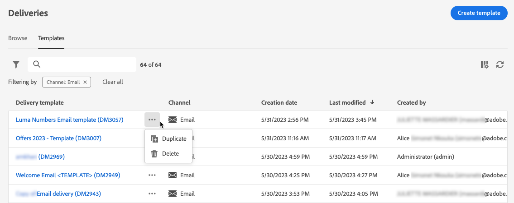

# Uso de plantillas de envío {#work-with-delivery-templates}

>[!CONTEXTUALHELP]
>id="acw_delivery_template_for_campaign"
>title="Plantillas de envíos"
>abstract="Para acelerar y mejorar el proceso de diseño, cree plantillas de envío para reutilizar el contenido y la configuración personalizados en las campañas. Esta funcionalidad estandariza la apariencia creativa, lo que permite una ejecución y un lanzamiento más rápidos de las campañas."

Para acelerar y mejorar el proceso de diseño, cree plantillas de envío para reutilizar el contenido y la configuración personalizados en las campañas. Esta funcionalidad estandariza la apariencia creativa, lo que permite una ejecución y un lanzamiento más rápidos de las campañas.

Una plantilla incluye:

* La **carpeta** y **carpeta de ejecución** de la plantilla. La carpeta es la ubicación donde se guarda la plantilla de envíos. La carpeta de ejecución es la carpeta en la que se guardan los envíos creados basándose en esta plantilla.
* [Tipologías](../advanced-settings/delivery-settings.md#typology),
* La dirección del remitente,
* Una [audiencia](../audience/about-recipients.md), incluidos [grupos de control](../audience/control-group.md),
* [contenido personalizado](../email/edit-content.md),
* [Campos personalizados](../personalization/personalize.md) y [contenido condicional](../personalization/conditions.md),
* Vínculos a [página espejo](../email/mirror-page.md) y [vínculos](../email/message-tracking.md) de baja,
* Otras propiedades del envío, como la validez de los recursos, los parámetros de reintento o la configuración de cuarentena.

>[!NOTE]
>
>Las plantillas de envío difieren de las [plantillas de contenido](../email/create-email-templates.md), lo que le permite reutilizar solamente el contenido de sus correos electrónicos y comenzar a crear contenido con una de las plantillas de correo electrónico de ejemplo que se proporcionan de forma predeterminada.

## Acceso y administración de plantillas de envíos {#access-manage-templates}

>[!CONTEXTUALHELP]
>id="acw_delivery_templates"
>title="Trabajo con plantillas de envío"
>abstract="Utilice plantillas de envío para crear y guardar la configuración de envío para su uso futuro en todas las campañas. Cree plantillas de envío desde cero, duplique una plantilla existente o convierta una entrega en una plantilla."

Para acceder a la lista de plantillas de contenido, seleccione **[!UICONTROL Administración de campañas]** > **[!UICONTROL Envíos]** en el menú de la izquierda y vaya a la pestaña **Plantillas**.

{zoomable="yes"}

Se muestran todas las plantillas creadas en el entorno actual.

Puede filtrar las plantillas de contenido por canales y carpetas. También puede establecer filtros avanzados generando una regla con atributos de entrega. [Más información acerca del modelador de consultas](../audience/../query/query-modeler-overview.md)

{zoomable="yes"}

Para editar una plantilla, haga clic en el elemento que desee en la lista. A partir de ahí:

* Modifique su contenido, propiedades, audiencia y cualquier oferta adjunta a él.
* Pruebe la plantilla. [Más información](#test-template)

{zoomable="yes"}

Para eliminar o [duplicar](#copy-an-existing-template) una plantilla, seleccione la acción correspondiente en el menú **[!UICONTROL Más acciones]**, ya sea en la lista **[!UICONTROL Plantillas]** o en una pantalla de edición de plantilla.

{zoomable="yes"}

>[!NOTE]
>
>Cuando se edita o elimina una plantilla, los envíos creados con esta plantilla no se ven afectados.

## Crear una plantilla de envíos {#create-a-delivery-template}

Para crear una plantilla de envíos, puede:

* Duplicar una plantilla existente: [Más información](#copy-an-existing-template)
* Convertir una entrega existente en una plantilla: [Más información](#convert-an-existing-delivery)
* Crear una plantilla de envíos desde cero: [Más información](#create-a-new-template)

### Duplicación de una plantilla de envíos existente {#copy-an-existing-template}

Campaign incluye plantillas integradas para cada canal: correo electrónico, push y SMS. La forma más sencilla de crear una plantilla de envíos es duplicar y personalizar una plantilla integrada.

>[!NOTE]
>
>También puede duplicar cualquier plantilla personalizada.

Para duplicar una plantilla de envíos, siga estos pasos:

1. Vaya a la pestaña **Plantillas** del menú de la izquierda **Envíos**. [Más información](#access-manage-templates)
1. Haga clic en el botón **[!UICONTROL Más acciones]** a la derecha del nombre de plantilla deseado y seleccione **[!UICONTROL Duplicar]**.

   También puede seleccionar una plantilla de la lista y elegir esta opción en la pantalla de edición de plantillas.

1. Confirme la duplicación.

   {zoomable="yes"}

1. El nuevo panel de plantillas se abre en la pantalla central. Edite la configuración de la plantilla según sea necesario.

   {zoomable="yes"}

1. Haga clic en el botón **[!UICONTROL Revisar]** para guardar y revisar la plantilla. Puede seguir editando todos sus ajustes, eliminándolos y duplicándolos.

   {zoomable="yes"}

1. Pruebe el procesamiento de la plantilla si es necesario. [Más información](#test-template)

La nueva plantilla se agrega a la lista [**Plantillas**](#access-manage-templates). Ahora puede seleccionarlo al crear un nuevo envío.

### Conversión de un envío en una plantilla {#convert-an-existing-delivery}

Cualquier envío se puede convertir en una plantilla para futuras acciones de envío repetidas.

Para guardar una entrega como plantilla, siga estos pasos:

1. Vaya al menú **[!UICONTROL Administración de campañas]** > **[!UICONTROL Envíos]**.
1. En la ficha **[!UICONTROL Examinar]**, haga clic en el botón **[!UICONTROL Más acciones]** que se encuentra a la derecha del nombre de entrega deseado y seleccione **[!UICONTROL Copiar como plantilla]**.

   {zoomable="yes"}

   También puede seleccionar una plantilla de la lista y elegir esta opción en la pantalla de edición de plantillas.

1. Confirme la duplicación.

1. El nuevo panel de plantillas se abre en la pantalla central. Edite la configuración de la plantilla según sea necesario.

1. Haga clic en el botón **[!UICONTROL Revisar]** para guardar y revisar la plantilla. Puede seguir editando todos sus ajustes, eliminándolos y duplicándolos.

1. Pruebe el procesamiento de la plantilla si es necesario. [Más información](#test-template)

La nueva plantilla se agrega a la lista [**Plantillas**](#access-manage-templates). Ahora puede seleccionarlo al crear un nuevo envío.

### Creación de una nueva plantilla de envíos {#create-a-new-template}

>[!NOTE]
>
>Para evitar errores de configuración, Adobe recomienda [duplicar una plantilla integrada](#copy-an-existing-template) y personalizar sus propiedades en lugar de crear una nueva plantilla.

Para configurar una plantilla de envíos desde cero, siga estos pasos:

1. Vaya a la pestaña **Plantillas** del menú de la izquierda **Envíos**. [Más información](#access-manage-templates)
1. Haga clic en el botón **[!UICONTROL Crear plantilla]**.

   {zoomable="yes"}

1. Seleccione el canal que desee utilizar para la plantilla.
1. La plantilla de envío integrada de ese canal se utiliza de forma predeterminada para ayudarle a crear su propia plantilla. Utilice el botón dedicado a la derecha del canal seleccionado para seleccionar otra plantilla si es necesario.

   {zoomable="yes"}

1. Vuelva a hacer clic en el botón **[!UICONTROL Crear plantilla]**.

1. Defina las propiedades de la plantilla, [audiencia](../audience/add-audience.md) y el contenido según el canal seleccionado.

   >[!NOTE]
   >
   >Obtenga más información acerca de los canales de envío y cómo diseñar los contenidos respectivos en las secciones siguientes:
   >
   > * [Canal de correo electrónico](../email/create-email.md)
   > * [Canal de notificaciones push](../push/gs-push.md)
   > * [Canal de SMS](../sms/create-sms.md)

1. Además, para las plantillas de correo electrónico, se puede acceder a la configuración avanzada, como las reglas de tipología y las asignaciones de destino, a través del botón **[!UICONTROL Settings]** ubicado en la parte superior derecha de la pantalla. [Más información](../advanced-settings/delivery-settings.md)

1. Haga clic en el botón **[!UICONTROL Revisar]** para guardar y revisar la plantilla. Puede seguir editando todos sus ajustes, eliminándolos y duplicándolos.

1. Pruebe el procesamiento de la plantilla si es necesario. [Más información](#test-template)

La nueva plantilla se agrega a la lista [**Plantillas**](#access-manage-templates). Ahora puede seleccionarlo al crear un nuevo envío.

## Prueba de una plantilla de envíos {#test-template}

Puede probar la renderización de cualquier plantilla de envío, ya se cree desde cero o a partir de un contenido existente. Para ello, siga estos pasos:

1. Vaya a la ficha **Plantillas** a través del menú **[!UICONTROL Administración de campañas]** > **[!UICONTROL Envíos]** y seleccione cualquier plantilla. [Más información](#access-manage-templates)

1. Haga clic en el botón **[!UICONTROL Simular contenido]** en la parte superior derecha de la pantalla.

   {zoomable="yes"}

1. Seleccione uno o varios perfiles de prueba para comprobar el procesamiento del correo electrónico. También puede seleccionar perfiles reales de la base de datos. [Más información sobre los perfiles de prueba](../audience/test-profiles.md)

1. Alterne entre los distintos perfiles para obtener una representación personalizada del mensaje según el perfil seleccionado. También puede ajustar el nivel de zoom y elegir la vista de escritorio o la vista móvil.

[Más información sobre la previsualización de contenido](../preview-test/preview-content.md)

   {zoomable="yes"}

1. Cierre la ventana para volver a la pantalla de edición de la plantilla.

>[!NOTE]
>
>No se puede utilizar el procesamiento de correo electrónico ni enviar pruebas en una plantilla de envíos.