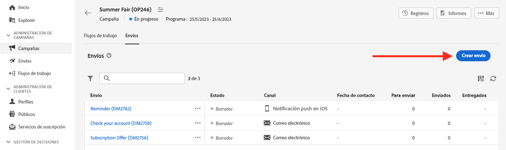
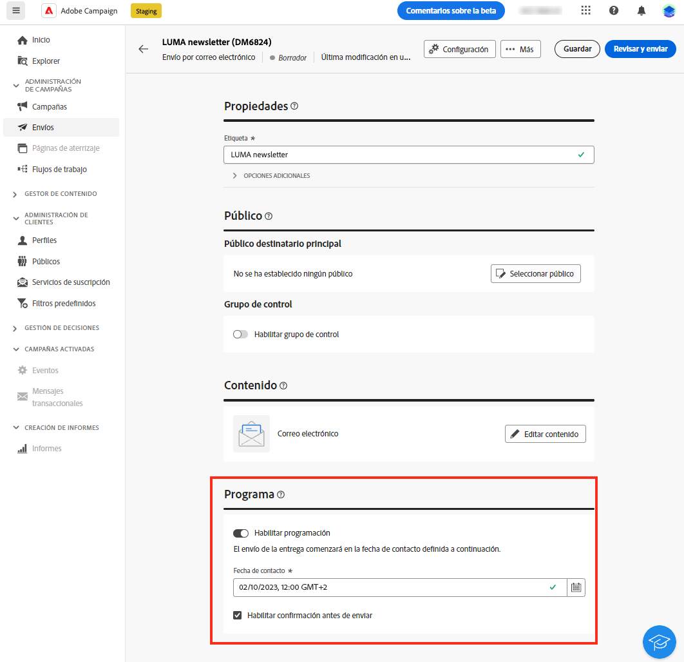
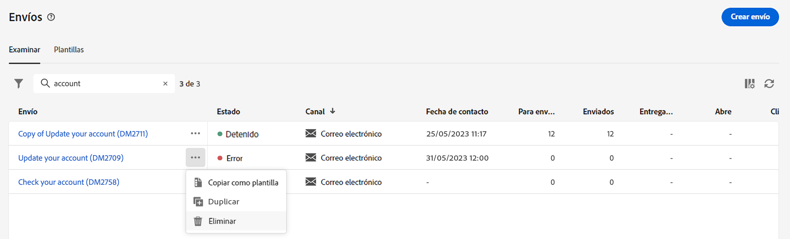

# Trabajar con envíos {#work-with-deliveries}

>[!CONTEXTUALHELP]
>id="acw_deliveries_list"
>title="Envíos"
>abstract="Un envío es una comunicación que se envía a un público a través de un canal específico: correo electrónico, SMS o Push. En esta pantalla, puede editar, duplicar y eliminar los envíos existentes. También puede ver los informes de los envíos completados. Haga clic en el botón **Crear envío** para añadir un nuevo envío."

## Creación de un envío {#create-delivery}

Puede crear envíos independientes desde el menú de la izquierda **[!UICONTROL Envíos]** o crear envíos en el contexto de un flujo de trabajo, incluidos o no en una campaña.

Examine las pestañas siguientes para aprender a crear un envío:

>[!BEGINTABS]

>[!TAB Creación de un envío independiente]

Para crear un envío independiente, siga estos pasos:

1. Vaya al menú **[!UICONTROL Envíos]** en la navegación de la izquierda y haga clic en el botón **[!UICONTROL Creación de envíos]**.

   

1. Elija un canal para el envío.
1. Defina el público del envío para el público destinatario principal y el grupo de control. Puede obtener más información sobre los públicos en [esta sección](../audience/about-recipients.md).

   {width="70%" align="left"}

1. Definición del contenido del mensaje. Obtenga más información acerca de los canales de envío y cómo definir un contenido de envío en estas secciones:

   * [Canal de correo electrónico](../email/create-email.md)
   * [Canal de notificaciones push](../push/gs-push.md)
   * [Canal de SMS](../sms/create-sms.md)

1. (opcional) Defina la [programación](#gs-schedule) de envíos. Si no se define ninguna programación, los mensajes se envían inmediatamente después de hacer clic en el botón **[!UICONTROL Enviar]**.
1. Haga clic en el botón **[!UICONTROL Revisar y enviar]** para comprobar su configuración.
1. Utilice el botón **[!UICONTROL Simular contenido]** para probar el envío y la configuración de personalización. Puede obtener más información sobre la simulación de mensajes en [esta sección](../preview-test/preview-test.md).
1. Haga clic en el botón **[!UICONTROL Preparar]** para calcular el público destinatario y generar los mensajes. El paso de preparación puede tardar unos minutos. Cuando la preparación haya finalizado, los mensajes estarán listos para enviarse. En caso de error, vaya a los **Registros** para comprobar las alertas y advertencias.
1. Compruebe los resultados y haga clic en el botón **[!UICONTROL Enviar]** para empezar a enviar mensajes.
1. Una vez enviados los mensajes, vaya a la sección **Informes** para acceder a métricas clave. Obtenga más información sobre los informes de envíos en [esta sección](../reporting/delivery-reports.md).

>[!TAB Creación de un envío en un flujo de trabajo]

Para crear un envío en un flujo de trabajo, siga estos pasos:

1. Cree un flujo de trabajo o abra uno existente. Obtenga más información acerca de los permisos en [esta página](../workflows/gs-workflow-creation.md#gs-workflow-steps).
1. Añadir y configurar una actividad **[!UICONTROL Generar público]**. Obtenga más información acerca de la actividad **[!UICONTROL Generar público]** en [esta sección](../workflows/activities/build-audience.md).
1. Haga clic en el icono `+` y seleccione una actividad de envío: **[!UICONTROL Correo electrónico]**, **[!UICONTROL SMS]**, **[!UICONTROL Notificación push (Android)]** o **[!UICONTROL Notificación push (iOS)]**. Obtenga más información sobre las actividades del canal de envíos en un flujo de trabajo y cómo definir un contenido de envío en esta [sección](../workflows/activities/channels.md).

   

1. Inicie el flujo de trabajo y compruebe los registros.

También puede añadir envíos en una campaña sin crear un flujo de trabajo. Para conseguirlo, vaya a la pestaña **[!UICONTROL Envíos]** de la campaña y haga clic en el botón **[!UICONTROL Creación de envíos]**.

Los pasos de configuración son similares a los de los envíos independientes.

Para obtener más información sobre cómo configurar una campaña y administrar los envíos que pertenecen a una campaña, consulte [esta sección](../campaigns/gs-campaigns.md).

>[!ENDTABS]

## Adición de personalización {#personalization}

Los mensajes enviados por Adobe Campaign se pueden personalizar de varias formas. [Obtenga más información acerca las funcionalidades de personalización](../personalization/gs-personalization.md).

Utilice Campaign para crear contenido dinámico y enviar mensajes personalizados. Las funcionalidades de personalización se pueden combinar para mejorar sus mensajes y crear una experiencia de usuario personalizada.

Puede personalizar el contenido del mensaje haciendo lo siguiente:

* Inserción dinámica de **campos de personalización**

  Los campos de personalización se utilizan para la personalización de primer nivel de los mensajes. Puede seleccionar cualquier campo disponible en la base de datos desde el editor de personalización. Para un envío, se puede seleccionar cualquier campo relacionado con el destinatario, el mensaje o el envío. Estos atributos de personalización se pueden insertar en la línea de asunto o en el cuerpo de los mensajes. [Más información](../personalization/personalize.md)

* Inserción predefinida de los **bloques de contenido**

  Campaign incluye un conjunto de bloques de personalización que contienen una renderización específica que puede insertar en los envíos. Por ejemplo, puede añadir un logotipo, un mensaje de saludo o un enlace a la página espejo del mensaje. Los bloques de contenido están disponibles en la entrada del editor de personalización. [Más información](../personalization/personalize.md#ootb-content-blocks)

* Cree **contenido condicional**

  Configure el contenido condicional para añadir una personalización dinámica basada en el perfil del destinatario, por ejemplo. Los bloques de texto o las imágenes se insertan cuando se cumple una condición concreta. [Más información](../personalization/conditions.md)

* Añadir **ofertas personalizadas**

  Inserte ofertas personalizadas en el contenido del mensaje, según la ubicación del destinatario, el tiempo actual o la última orden de compra. [Más información](../msg/offers.md)

## Previsualizar y probar sus envíos

Una vez definido el contenido del mensaje, puede obtener una vista previa para controlar la renderización de los mensajes y comprobar la configuración de personalización con perfiles de prueba. [Más información](../preview-test/preview-test.md)

## Programación de los envíos de entregas {#gs-schedule}

>[!CONTEXTUALHELP]
>id="acw_deliveries_email_schedule"
>title="Establecer una fecha y hora de contacto"
>abstract="Defina la fecha y la hora exacta de envío. Al elegir el momento más apropiado para el mensaje de marketing, puede maximizar las tasas de apertura."

Puede establecer la fecha y la hora exacta para enviar los mensajes. Al elegir el momento más apropiado para el mensaje de marketing, puede maximizar las tasas de apertura.

Para programar el envío del correo electrónico, abra el correo electrónico a enviar y busque la sección **[!UICONTROL Programación]**. Utilice la opción **[!UICONTROL Habilitar programación]** para activarlo y establezca la fecha y hora deseadas para el envío. Una vez que realice esto, el envío real comenzará en la fecha de contacto que haya definido.

De forma predeterminada, está activada la opción **[!UICONTROL Habilitar confirmación antes de enviar]**. Esta opción requiere que confirme el envío antes de que el correo electrónico se envíe en la fecha y hora programadas. Si necesita enviar el correo electrónico automáticamente en la fecha y hora programadas, puede deshabilitar esta opción.

Obtenga información sobre los pasos para realizar un envío programado en [esta sección](../monitor/prepare-send.md#schedule-the-send).

## Registros de seguimiento y monitorización {#gs-tracking-logs}

La monitorización de los envíos una vez enviados es un paso clave para garantizar que las campañas de marketing sean eficientes y lleguen a los clientes.

Puede monitorizarlas después de enviar un envío, así como comprender cómo se administran los errores y las cuarentenas.

Obtenga más información acerca de las capacidades de informes y monitorización en [esta sección](../reporting/gs-reports.md).

## Duplicación de un envío {#delivery-duplicate}

Puede crear una copia de un envío existente, ya sea desde la lista de envíos o desde el panel de envíos.

Para duplicar un envío de la lista de envíos, siga estos pasos:

1. Haga clic en el botón de tres puntos de la derecha, junto al nombre del envío que desea duplicar.
1. Seleccione **[!UICONTROL Duplicar]**.
1. Confirmar duplicación: el nuevo panel de envío se abre en la pantalla central.

Para duplicar un envío desde su panel, siga estos pasos:

1. Abra el envío y haga clic en el botón **[!UICONTROL ...Más]** en la sección superior de la pantalla.
1. Seleccione **[!UICONTROL Duplicar]**.
1. Confirmar duplicación: el nuevo envío reemplaza el envío actual en la pantalla central.

## Eliminación de un envío {#delivery-delete}

Los envíos se eliminan de la lista de envíos, ya sea de la entrada de envío principal en el carril izquierdo o de la lista de envíos de una campaña.

Para eliminar un envío de la lista de envíos, siga estos pasos:

1. Haga clic en el botón de tres puntos de la derecha, junto al nombre del envío que desea duplicar.
1. Seleccione **[!UICONTROL Eliminar]**.
1. Confirme la eliminación.

Todas los envíos están disponibles en estas listas, pero los envíos creados en un flujo de trabajo no se pueden eliminar de allí. Para eliminar un envío creada en el contexto de un flujo de trabajo, se debe eliminar la actividad de entrega del flujo de trabajo.

Para eliminar un envío de un flujo de trabajo, siga estos pasos:

1. Selección de la actividad de envío.
1. Haga clic en el icono **[!UICONTROL Eliminar]** en el panel derecho.
1. Confirme la eliminación. Si el envío tiene nodos secundarios, puede elegir eliminarlos también o conservarlos.

