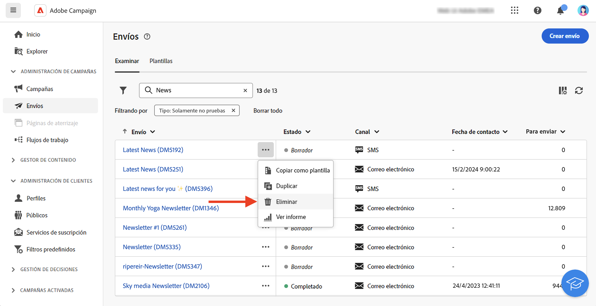

# Acceso a los envíos {#work-with-deliveries}

>[!CONTEXTUALHELP]
>id="acw_deliveries_list"
>title="Envíos"
>abstract="Un envío es una comunicación que se envía a un público a través de un canal específico: correo electrónico, SMS o Push. En esta pantalla, puede editar, duplicar y eliminar los envíos existentes. También puede ver los informes de los envíos completados. Haga clic en el botón **Crear envío** para añadir un nuevo envío."

## Acceso a los envíos {#access}

>[!CONTEXTUALHELP]
>id="acw_deliveries_additional_target"
>title="Público destinatario adicional"
>abstract="Estas reglas solo se pueden cambiar en la consola del cliente."

Se puede acceder a los envíos desde el menú **[!UICONTROL Envíos]** del panel de navegación izquierdo. En esta lista se muestran todos los envíos creados desde la consola del cliente o desde la interfaz de usuario web. Desde esta pantalla, puede monitorizar todas las entregas existentes, duplicarlas o eliminarlas, o crear otras nuevas.

Para abrir una entrega, haga clic en su nombre en la lista. La entrega se abre, lo que le permite realizar varias acciones, como editar sus parámetros, comprobar su ejecución o monitorizar su rendimiento mediante informes dedicados.

>[!NOTE]
>
>Si abre una entrega creada en la consola del cliente, puede que se muestre la sección **[!UICONTROL Destino adicional]** para la audiencia. Esto significa que se han configurado varios objetivos para este envío. Estos parámetros solo se pueden modificar en la consola.
>
>{zoomable="yes"}

## Duplicación de un envío {#delivery-duplicate}

Puede crear una copia de un envío existente, ya sea desde la lista de envíos o desde el panel de envíos.

Para duplicar un envío de la lista de envíos, siga estos pasos:

1. Haga clic en el botón de tres puntos de la derecha, junto al nombre del envío que desea duplicar.
1. Seleccione **[!UICONTROL Duplicar]**.
1. Confirmar duplicación: el nuevo panel de envío se abre en la pantalla central.

Para duplicar un envío desde su panel, siga estos pasos:

1. Abra el envío y haga clic en el botón **[!UICONTROL ...Más]** en la sección superior de la pantalla.
1. Seleccione **[!UICONTROL Duplicar]**.
1. Confirmar duplicación: el nuevo envío reemplaza el envío actual en la pantalla central.

## Eliminación de un envío {#delivery-delete}

Los envíos se eliminan de la lista de envíos, ya sea de la entrada de envío principal en el carril izquierdo o de la lista de envíos de una campaña.

Para eliminar un envío de la lista de envíos, siga estos pasos:

1. Haga clic en el botón de tres puntos de la derecha, junto al nombre del envío que desea duplicar.
1. Seleccione **[!UICONTROL Eliminar]**.
1. Confirme la eliminación.

Todas los envíos están disponibles en estas listas, pero los envíos creados en un flujo de trabajo no se pueden eliminar de allí. Para eliminar un envío creada en el contexto de un flujo de trabajo, se debe eliminar la actividad de entrega del flujo de trabajo.

Para eliminar un envío de un flujo de trabajo, siga estos pasos:

1. Selección de la actividad de envío.
1. Haga clic en el icono **[!UICONTROL Eliminar]** en el panel derecho.
1. Confirme la eliminación. Si el envío tiene nodos secundarios, puede elegir eliminarlos también o conservarlos.

