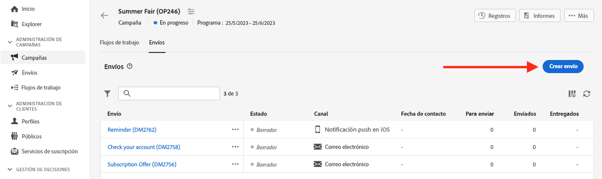

# Introducción a los mensajes{#gs-messages}

Con Adobe Campaign, puede enviar campañas de canales múltiples, incluidos correos electrónicos, SMS, notificaciones push, y medir su eficacia mediante varios informes dedicados. Estos mensajes están diseñados y enviados por medio de envíos y pueden personalizarse para cada destinatario. Estos envíos pueden ser independientes o incluirse en el contexto de una campaña de marketing.

Adobe Campaign v8 incluye los siguientes canales de envío:

* **Canal de correo electrónico**: los envíos de correo electrónico le permiten enviar correos electrónicos personalizados a la población objetivo. Obtenga información sobre cómo crear y enviar un correo electrónico en [esta página](../email/create-email.md).

* **Canal SMS**: los envíos en canales móviles permiten enviar mensajes SMS personalizados a la población de público destinatario.  Aprenda a crear y enviar SMS en [esta página](../sms/create-sms.md).

* **Canal de aplicación móvil**: los envíos de aplicaciones móviles permiten enviar notificaciones a sistemas iOS y Android.  Obtenga información sobre cómo crear y enviar notificaciones push en [esta página](../push/gs-push.md).

## Creación de un envío {#create-delivery}

Puede crear envíos independientes desde el menú de la izquierda **[!UICONTROL Envíos]**, o cree envíos en el contexto de una campaña de marketing, desde el menú de la izquierda **[!UICONTROL Campañas]**.

Examine las pestañas siguientes para aprender a crear una entrega:

>[!BEGINTABS]

>[!TAB Creación de un envío independiente]

Para crear un envío independiente, siga estos pasos:

1. Vaya al menú **[!UICONTROL Envíos]** en la navegación de la izquierda y haga clic en el botón **[!UICONTROL Creación de envíos]**.

   

1. Elija un canal para el envío. Obtenga más información acerca de los canales de envío y cómo definir un contenido de envío en estas secciones:

   * [Canal de correo electrónico](../email/create-email.md)
   * [Canal de notificaciones push](../push/gs-push.md)
   * [Canal de SMS](../sms/create-sms.md)

1. Defina la audiencia del envío para el público destinatario principal y el grupo de control. Puede obtener más información sobre las audiencias en [esta sección](../audience/about-audiences.md).
1. Definición del contenido del mensaje.
1. (opcional) Defina la programación de envíos. Si no se define ninguna programación, los mensajes se envían inmediatamente después de hacer clic en el botón **[!UICONTROL Enviar]**.
1. Haga clic en el botón **[!UICONTROL Revisar y enviar]** para comprobar su configuración.
1. Utilice el botón **[!UICONTROL Simular contenido]** para probar el envío y la configuración de personalización. Puede obtener más información sobre la simulación de mensajes en [esta sección](../preview-test/preview-test.md).
1. Haga clic en el botón **[!UICONTROL Preparar]** para calcular el público destinatario y generar los mensajes. El paso de preparación puede tardar unos minutos. Cuando la preparación haya finalizado, los mensajes estarán listos para enviarse. En caso de error, vaya a los **Registros** para comprobar las alertas y advertencias.
1. Compruebe los resultados y haga clic en el botón **[!UICONTROL Enviar]** para empezar a enviar mensajes.
1. Una vez enviados los mensajes, vaya a la sección **Informes** para acceder a métricas clave. Obtenga más información sobre los informes de envíos en [esta sección](../reporting/delivery-reports.md).

>[!TAB Creación de un envío en una campaña]

Para crear un envío en una campaña, siga estos pasos:

1. Cree una nueva campaña o acceda a una campaña existente. Más información sobre las [campañas de marketing](../campaigns/gs-campaigns.md).
1. Cree un flujo de trabajo o abra uno existente.
1. Adición y configuración de una actividad **[!UICONTROL Crear audiencia]** y haga clic en el botón `+`.

   

   La actividad **[!UICONTROL Crear audiencia]** se detalla en [esta sección](../workflows/activities/build-audience.md).

1. Seleccione una actividad de envío: **[!UICONTROL Correo electrónico]**, **[!UICONTROL SMS]**, **[!UICONTROL Notificación push (Android)]** o **[!UICONTROL Notificación push (iOS)]**. Obtenga más información sobre las actividades del canal de envíos en un flujo de trabajo y cómo definir un contenido de envío en esta [sección](../workflows/activities/about-activities.md#channel).
1. Inicie el flujo de trabajo y compruebe los registros.

También puede añadir envíos en una campaña sin crear un flujo de trabajo. Para conseguirlo, vaya a la pestaña **[!UICONTROL Envíos]** de la campaña y haga clic en el botón **[!UICONTROL Creación de envíos]**.

Los pasos de configuración son similares a los de los envíos independientes.

Para obtener más información sobre cómo configurar una campaña y administrar los envíos que pertenecen a una campaña, consulte [esta sección](../campaigns/gs-campaigns.md).

>[!ENDTABS]

## Adición de personalización{#personalization}

Los mensajes enviados por Adobe Campaign se pueden personalizar de varias formas. [Obtenga más información acerca las funcionalidades de personalización](../personalization/personalize.md).

Utilice Campaign para crear contenido dinámico y enviar mensajes personalizados. Las funcionalidades de personalización se pueden combinar para mejorar sus mensajes y crear una experiencia de usuario personalizada.

Puede personalizar el contenido del mensaje haciendo lo siguiente:

* Inserción dinámica de **campos de personalización**

   Los campos de personalización se utilizan para la personalización de primer nivel de los mensajes. Puede seleccionar cualquier campo disponible en la base de datos desde el editor de personalización. Para un envío, se puede seleccionar cualquier campo relacionado con el destinatario, el mensaje o el envío. Estos atributos de personalización se pueden insertar en la línea de asunto o en el cuerpo de los mensajes. [Más información](../personalization/personalize.md)

* Inserción predefinida de los **bloques de contenido**

   Campaign incluye un conjunto de bloques de personalización que contienen una renderización específica que puede insertar en los envíos. Por ejemplo, puede añadir un logotipo, un mensaje de saludo o un enlace a la página espejo del mensaje. Los bloques de contenido están disponibles en la entrada del editor de personalización. [Más información](../personalization/personalize.md#ootb-content-blocks)

* Cree **contenido condicional**

   Configure el contenido condicional para añadir una personalización dinámica basada en el perfil del destinatario, por ejemplo. Los bloques de texto o las imágenes se insertan cuando se cumple una condición concreta. [Más información](../personalization/conditions.md)

* Añadir **ofertas personalizadas**

   Inserte ofertas personalizadas en el contenido del mensaje, según la ubicación del destinatario, el tiempo actual o la última orden de compra.

## Previsualizar y probar sus envíos

Una vez definido el contenido del mensaje, puede obtener una vista previa para controlar la renderización de los mensajes y comprobar la configuración de personalización con perfiles de prueba. [Más información](../preview-test/preview-test.md)

## Registros de seguimiento y envío{#gs-tracking-logs}

La monitorización de los envíos una vez enviados es un paso clave para garantizar que las campañas de marketing sean eficientes y lleguen a los clientes. Puede monitorizarlas después de enviar un envío, así como comprender cómo se administran los errores y las cuarentenas.

## Duplicación de un envío {#delivery-duplicate}

Puede crear una copia de un envío existente, ya sea desde la lista de envíos o desde el panel de envíos.

Para duplicar una entrega de la lista de envíos, siga estos pasos:

1. Haga clic en el botón de tres puntos de la derecha, junto al nombre del envío que desea duplicar.
1. Seleccione **[!UICONTROL Duplicar]**.
1. Confirmar duplicación: el nuevo panel de envío se abre en la pantalla central.

Para duplicar un envío desde su panel, siga estos pasos:

1. Abra el envío y haga clic en el botón **[!UICONTROL ...Más]** en la sección superior de la pantalla.
1. Seleccione **[!UICONTROL Duplicar]**.
1. Confirmar duplicación: el nuevo envío reemplaza el envío actual en la pantalla central.

