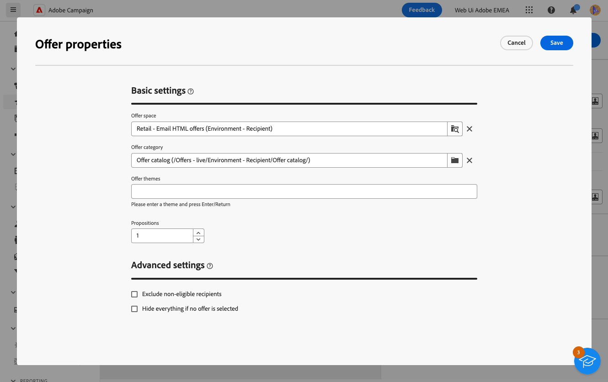
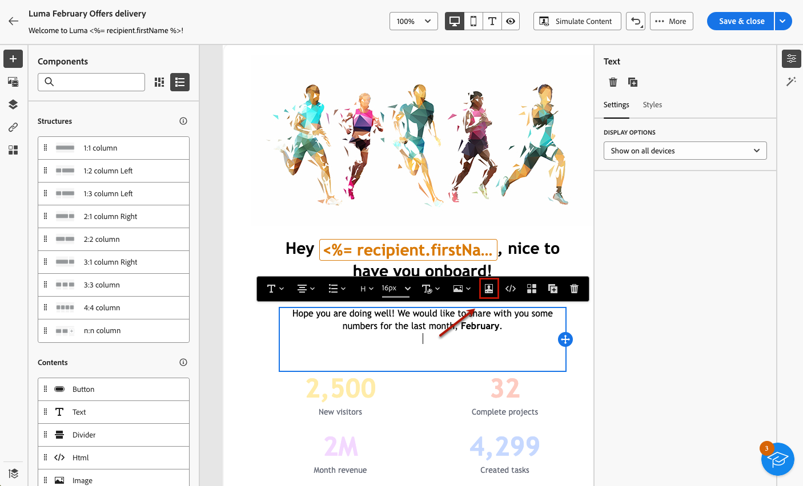
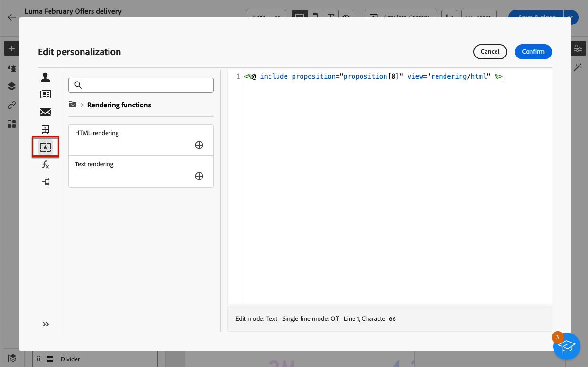

# Añadir ofertas a los mensajes {#offers-content}

Puede añadir ofertas a los envíos en la interfaz de usuario web de Adobe Campaign. Estas ofertas están disponibles en **Ofertas** menú de la izquierda que permite acceder a la lista de ofertas. Todas estas ofertas son de solo lectura y deben haberse creado en la consola del cliente de Campaign, utilizando **[!UICONTROL Interacción]** módulo. Para obtener más información sobre la interacción y cómo administrar un catálogo de ofertas en la consola, consulte la [Documentación de Campaign v8 (consola de cliente)](https://experienceleague.adobe.com/docs/campaign/campaign-v8/offers/interaction.html?lang=es){target="_blank"}.

Los pasos para enviar ofertas con una entrega son los siguientes:

1. [Configurar las ofertas que se van a proponer](#configure)
1. [Inserción de las ofertas en la entrega](#insert)

## Configurar las ofertas que se van a proponer {#configure}

>[!CONTEXTUALHELP]
>id="acw_deliveries_email_offers_settings"
>title="Definir los parámetros de las ofertas"
>abstract="Configure qué ofertas deben proponerse a los destinatarios, definiendo un espacio de ofertas, opcionalmente una categoría y un tema, y especifique el número de ofertas que desea insertar en el envío."

>[!CONTEXTUALHELP]
>id="acw_deliveries_email_offers_advanced_settings"
>title="Configuración avanzada de ofertas"
>abstract="Puede activar la exclusión de destinatarios para los que no haya suficientes ofertas aptas y elegir cómo se procesa el mensaje en caso de que una de las propuestas no exista."

Adobe Campaign le permite responder en tiempo real durante una interacción con un contacto determinado proponiéndole una o varias ofertas específicas. Estas ofertas pueden ser mensajes de comunicación sencillos, ofertas especiales sobre uno o varios productos o un servicio.

Para seleccionar las ofertas que desea añadir a la entrega, siga los pasos a continuación.

1. Haga clic en **[!UICONTROL Configuración de ofertas]** en la pantalla de edición de contenido del envío.

   {zoomable="yes"}

1. Configurar qué ofertas se deben proponer a los destinatarios.

   Seleccione primero la **[!UICONTROL Espacio de ofertas]** que coincide con el entorno de la oferta. Obtenga información sobre cómo crear un espacio de oferta en la [Documentación de Campaign v8 (consola de cliente)](https://experienceleague.adobe.com/docs/campaign/campaign-v8/offers/interaction-settings/interaction-offer-spaces.html){target="_blank"}.

   {zoomable="yes"}

1. Para restringir la selección de ofertas del motor, seleccione la **[!UICONTROL Categoría de oferta]** específica en la que se ordenan las ofertas.

   Al seleccionar una carpeta, todas las subcarpetas se incluyen automáticamente y no se pueden eliminar. Tenga en cuenta que la variable [!DNL Campaign] La interfaz de no refleja este comportamiento.

   >[!NOTE]
   >
   >Si no se especifica ninguna categoría, el motor de ofertas tendrá en cuenta todas las ofertas contenidas en el entorno, a menos que se seleccione un **[!UICONTROL Tema de oferta]**.

1. (opcional) Introduzca una temática para filtrar las categorías. Las temáticas son palabras clave definidas en sentido ascendente en las categorías. Estos actúan como un filtro y permiten refinar la cantidad de ofertas que se presentarán seleccionándolas de un conjunto de categorías.

1. Utilice el **[!UICONTROL Propuestas]** para especificar el número de ofertas que desea insertar en la entrega.

1. Seleccione la opción **[!UICONTROL Excluir destinatarios no elegibles]** si es necesario.

   Esta opción permite activar o desactivar la exclusión de destinatarios para los que no haya suficientes ofertas aptas:

   * Si la opción está habilitada, los destinatarios que no tengan suficientes propuestas se excluyen del envío.
   * Si la opción está deshabilitada, estos destinatarios no se excluyen, pero no pueden tener el número solicitado de propuestas.

1. Si es necesario, seleccione la opción **[!UICONTROL Ocultar todo si no se selecciona ninguna oferta]**.

   Esta opción le permite elegir cómo se procesa el mensaje en caso de que una de las propuestas no exista:

   * Cuando se habilita esta casilla, no se muestra la representación de la propuesta que falta, y no aparecerá ningún contenido en el mensaje para esta propuesta.
   * Si la opción está deshabilitada, el mensaje en sí se cancela durante el envío y los destinatarios ya no recibirán ningún mensaje.

Una vez configuradas las ofertas que desea proponer en la entrega, puede insertarlas en el contenido de la entrega.

## Inserción de ofertas en la entrega {#insert}

Las ofertas se pueden añadir a la entrega utilizando [editor de expresiones](../personalization/gs-personalization.md#access). Se pueden insertar en la línea de asunto o en el cuerpo del envío.

>[!CAUTION]
>
>Antes de insertar una oferta en una entrega, asegúrese de que tiene lo siguiente [ha configurado qué ofertas proponer con ese envío](#configure).

Para insertar una oferta mediante el editor de expresiones, siga los pasos a continuación.

1. Acceda a la línea de asunto o al contenido de cualquier entrega.

1. Coloque el cursor del ratón donde desee insertar la oferta y abra el editor de expresiones utilizando el icono de personalización.

   {zoomable="yes"}

1. Seleccione el **[!UICONTROL Propuestas]** menú. Las propuestas disponibles se muestran en la lista.

   >[!NOTE]
   >
   >El número de propuestas se define al [configuración de ofertas](#configure) para el envío actual.

1. Defina cada propuesta utilizando los campos de personalización, las funciones de renderización o los atributos de oferta disponibles.

   {zoomable="yes"}

   >[!NOTE]
   >
   >El número de propuestas disponibles depende del modo en que se configura la visualización del motor y su orden depende de la prioridad de las ofertas. Obtenga más información en la [Documentación de Campaign v8 (consola de cliente)](https://experienceleague.adobe.com/docs/campaign/campaign-v8/offers/interaction-best-practices.html){target="_blank"}.

1. Guarde los cambios.

1. Finalice el contenido, pruebe y realice la entrega. [Más información](gs-messages.md)

Ahora, cuando un destinatario recibe la entrega, se muestra la oferta correcta a ese perfil específico.
