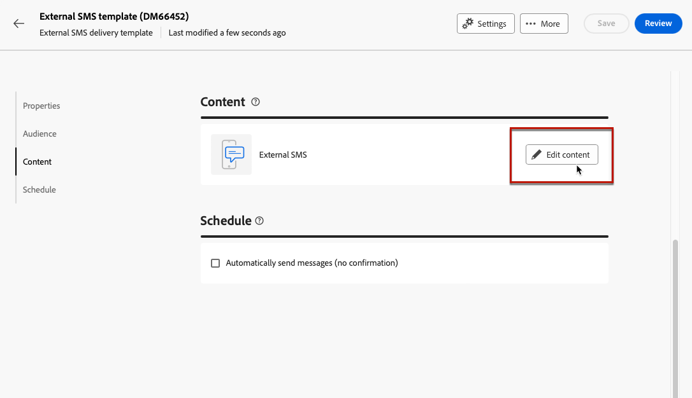

# Envíos externos {#gs-direct-mail}

Adobe Campaign le permite gestionar envíos creados fuera de Campaign para enviar correos electrónicos personalizados en masa, mensajes SMS o notificaciones push (iOS y Android) a través de un sistema externo.

<!--The supported channels are Email, Mobile (SMS), and Push (iOs and Android).-->

Al crear un envío externo, Adobe Campaign genera automáticamente un archivo de extracción que contiene todos los perfiles de destino y los datos seleccionados. Este archivo se envía al servidor de su elección, que se encargará del proceso de envío.

## Crear una cuenta externa dedicada {#routing-external-account}

Primero debe configurar una cuenta externa específica que se utilizará en los envíos externos. Debe ser del tipo **[!UICONTROL Routing]**.

>[!NOTE]
>
>Aprenda a crear una cuenta externa de tipo enrutamiento en [esta sección](../administration/external-account.md#routing).

Por ejemplo, seleccione el canal **[!UICONTROL Móvil (SMS)]** para la cuenta externa. **[!UICONTROL Externo]** está seleccionado de manera predeterminada como **[!UICONTROL Modo de envío]**.

{zoomable="yes"}

## Creación y envío de la entrega externa {#create-external-delivery}

Una vez configurada la cuenta externa específica, cree la entrega externa. Siga los pasos a continuación.

1. Cree una entrega. [Descubra cómo](create-deliveries.md)

   Tiene tres opciones:

   * **En un flujo de trabajo**: agrega una actividad de canal externo (correo electrónico, SMS o push) al flujo de trabajo. Para obtener instrucciones detalladas sobre cómo configurar el flujo de trabajo, consulte [esta página](../workflows/gs-workflow-creation.md).
   * **En una campaña**: Una vez que haya creado una campaña, puede crear un envío externo de correo electrónico, SMS o canal push. Para obtener más información sobre la configuración de la campaña, consulte [esta página](../campaigns/gs-campaigns.md).
   * **Envío independiente**: Capte clientes de forma directa e instantánea con un envío externo individual. [Aprenda a crear una entrega](../msg/gs-deliveries.md)

1. En la entrega o plantilla de entrega [settings](../advanced-settings/delivery-settings.md), seleccione la cuenta externa que creó para el canal de su elección (en este ejemplo, el canal SMS) y guarde.

   {zoomable="yes"}

   >[!NOTE]
   >
   >Si está creando una entrega, asegúrese de haber seleccionado una [plantilla de entrega](delivery-template.md) con una cuenta externa del tipo **[!UICONTROL Enrutamiento]**; de lo contrario, no podrá seleccionar la cuenta dedicada que ha creado [arriba](#routing-external-account).

1. En la sección de la entrega **[!UICONTROL Contenido]**, haga clic en **[!UICONTROL Editar contenido]**.

   {zoomable="yes"}

1. A diferencia de una entrega estándar, no está diseñando el contenido del mensaje en sí. En su lugar, debe definir las propiedades y columnas del archivo que se enviarán al sistema externo.

   {zoomable="yes"}

   Siga los mismos pasos que al diseñar el contenido del archivo de extracción generado por [envíos de correo directo](../direct-mail/content-direct-mail.md):

   * Defina las propiedades del archivo de extracción. [Más información](../direct-mail/content-direct-mail.md#properties)
   * Seleccione las columnas que contienen la información que se va a exportar a ese archivo. [Más información](../direct-mail/content-direct-mail.md#content)

1. Puede obtener una vista previa del archivo y enviar pruebas <!--not in UI right now - to check-->. [Descubra cómo](../direct-mail/send-direct-mail.md#preview-dm)

   {zoomable="yes"}

1. Realice la entrega para generar el archivo de extracción. [Descubra cómo](../direct-mail/send-direct-mail.md#send-dm)

Una vez entregado el envío, el archivo de extracción se genera automáticamente y se exporta a la ubicación especificada en la [cuenta externa](../administration/external-account.md#create-ext-account) seleccionada en la configuración de la plantilla de envío.

Puede realizar un seguimiento de los KPI desde la página de envío y de los datos desde el menú **[!UICONTROL Registros]**.
