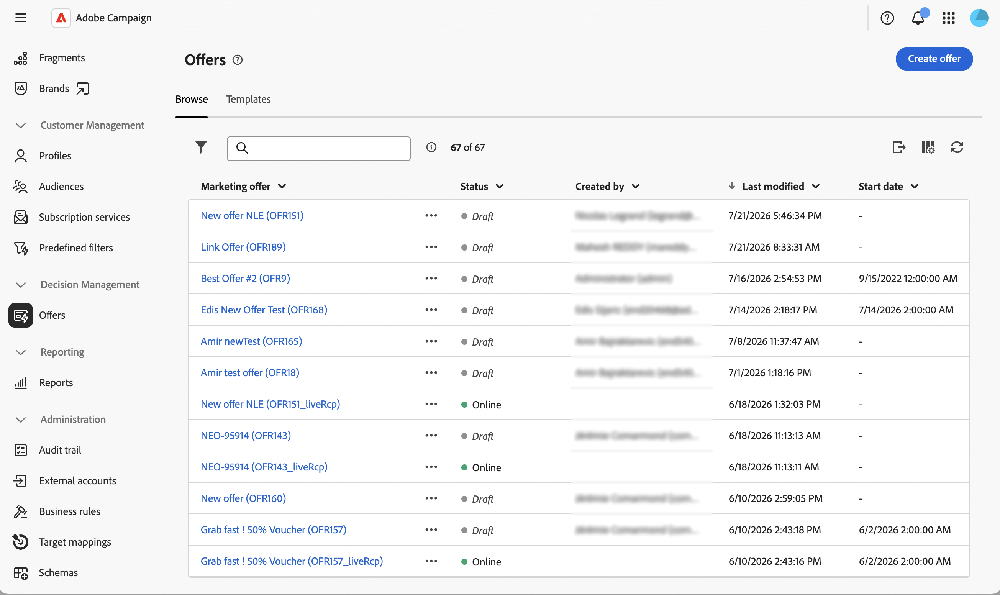

# Introducción a la administración de ofertas {#gs-offer-management}

Esta capacidad permite añadir ofertas personalizadas a las entregas y presentar la más relevante para cada perfil en un contexto determinado. Las ofertas pueden ser un mensaje de comunicación simple o promociones de uno o varios productos. En función de las reglas de idoneidad y las ponderaciones de prioridad, el motor de oferta selecciona la mejor propuesta para presentarla.

La interfaz de usuario web de Campaign permite administrar las ofertas de extremo a extremo. Puede crear y configurar entornos de oferta, diseñar espacios de oferta, crear el catálogo de ofertas, establecer reglas de idoneidad, editar contenido de oferta y publicar ofertas.

Las ofertas se presentan a los destinatarios a través de envíos basados en **reglas de elegibilidad** y **pesos de prioridad**, de modo que se seleccione la mejor oferta para cada perfil en un contexto determinado.

>[!NOTE]
>
>La interfaz de usuario web de Campaign se centra en el uso más común de la administración de ofertas. Las configuraciones avanzadas siguen estando disponibles en la consola del cliente de Campaign. Consulte la [documentación de Campaign v8](https://experienceleague.adobe.com/docs/campaign/campaign-v8/offers/interaction.html?lang=es){target="_blank"}

<!--
and check the [Campaign Web and client console capability matrix](../get-started/capability-matrix.md#offer-capabilities) for the current scope.
-->

## Conceptos clave {#concepts}

Antes de empezar a trabajar con ofertas, familiarícese con los objetos principales implicados.

* **Entorno de oferta** — Contenedor que contiene un catálogo de ofertas y los espacios de ofertas relacionados. Existen dos tipos: el entorno **Design**, donde crea y configura ofertas, y el entorno de solo lectura **[!UICONTROL Live]**, que contiene los objetos aprobados e implementados disponibles para su entrega. [Más información](offer-environment.md)

* **Espacio de ofertas**: Define dónde y cómo se expone una oferta (correo electrónico, correo directo, SMS, web entrante, etc.). El espacio enumera los campos de contenido que se pueden utilizar en la oferta, la función de renderización que crea la representación de la oferta y la configuración de almacenamiento que controla el estado de la propuesta. [Más información](offer-space.md)

* **Catálogo de ofertas y categorías**: las ofertas se organizan en un catálogo jerárquico de **categorías** y subcategorías. Cada categoría puede compartir reglas de elegibilidad, fechas de validez y **temas de aplicación**. Se proporciona una categoría predeterminada en el entorno de diseño para recibir todas las ofertas.

<!--
To configure categories in depth — including sub-categories, fallback categories, and theme management — refer to the [Campaign v8 (client console) documentation](https://experienceleague.adobe.com/docs/campaign/campaign-v8/offers/interaction-catalog/interaction-offer-catalog.html){target="_blank"}.
-->

* **Oferta**: una oferta individual con su propio período de elegibilidad, filtro de destinatario, peso y contenido. Las ofertas se aprueban e implementan antes de poder presentarse a los destinatarios. [Más información](create-offer.md)

* **Propuesta de oferta** — Resultado de presentar una oferta a un contacto en un espacio determinado (un banner en un sitio web, un correo electrónico, un SMS, etc.). El número de propuestas por envío se configura al [configurar ofertas en una entrega](../msg/offers.md).

* **Arbitrage**: principio según el cual el motor de oferta clasifica las ofertas elegibles por prioridad para seleccionar cuáles presentar. Arbitrage utiliza los criterios definidos en las categorías, las ofertas y las ofertas de contexto.

## Flujo de gestión de ofertas {#workflow}

El flujo completo típico en la interfaz de usuario web de Campaign es el siguiente:

1. **Revisar la configuración del entorno de ofertas**: compruebe la configuración de diseño/asignación en directo, elegibilidad y control de peso. [Más información](offer-environment.md)

1. **Crear un espacio de oferta**: defina los campos de contenido, la función de procesamiento y los parámetros avanzados que coincidan con su canal. [Más información](offer-space.md)

1. **Crear ofertas en el catálogo**: establezca el período de idoneidad, el filtro de destino, el peso y el contenido de cada oferta. [Más información](create-offer.md)

1. **Aprobar e implementar**: envíe la oferta para su aprobación, apruebe su contenido y los requisitos, y deje que el proceso de implementación la publique en el entorno en vivo. [Más información](create-offer.md#approve-deploy)

1. **Agregar la oferta a una entrega**: haga referencia al espacio de oferta y a las propuestas de su entrega de correo electrónico, SMS, push o correo directo. [Más información](../msg/offers.md)

## Acceso a ofertas en la interfaz de usuario web {#access}

Las ofertas están disponibles en el menú de la izquierda **[!UICONTROL Ofertas]**. Desde aquí puede examinar el catálogo, abrir una oferta para su edición y monitorizar su aprobación y estado de implementación.

{zoomable="yes"}

A través de **[!UICONTROL Explorer]**, se accede a los entornos de ofertas y a los espacios de ofertas navegando a la carpeta correspondiente.

## Complementos solo de consola {#console-complements}

Algunas funciones de oferta aún no se exponen en la interfaz de usuario web y deben configurarse desde la consola del cliente:

* **Simulación de oferta** — El módulo **Simulación** que le permite probar la distribución de ofertas antes de enviarlas. Ver [simulación de oferta](https://experienceleague.adobe.com/docs/campaign/campaign-v8/offers/interaction-offer.html#offer-simulation){target="_blank"}.

* Administración de **filtros predefinidos**: reglas de filtro reutilizables a las que se puede hacer referencia desde cualquier oferta. Consulte [Administrar filtros predefinidos](https://experienceleague.adobe.com/docs/campaign/campaign-v8/offers/interaction-predefined-filters.html){target="_blank"}.

* **Seguimiento de ofertas** — Configurando el seguimiento para las propuestas de ofertas para alimentar el historial de propuestas. Ver [Seguimiento de propuestas de ofertas](https://experienceleague.adobe.com/docs/campaign/campaign-v8/offers/interaction-tracking.html){target="_blank"}.

* **Funciones de operador** — Asignación de derechos de administrador de ofertas / administrador de entregas. Consulte [Operadores del módulo de interacción](https://experienceleague.adobe.com/docs/campaign/campaign-v8/offers/interaction-operators.html){target="_blank"}.

* **Prácticas recomendadas de interacción y reglas de arbitraje**. Consulte [Prácticas recomendadas de interacción de Campaign](https://experienceleague.adobe.com/docs/campaign/campaign-v8/offers/interaction-best-practices.html){target="_blank"}.

* **Informes**: los informes de ofertas y propuestas dedicados aún no están disponibles en la interfaz de usuario web.