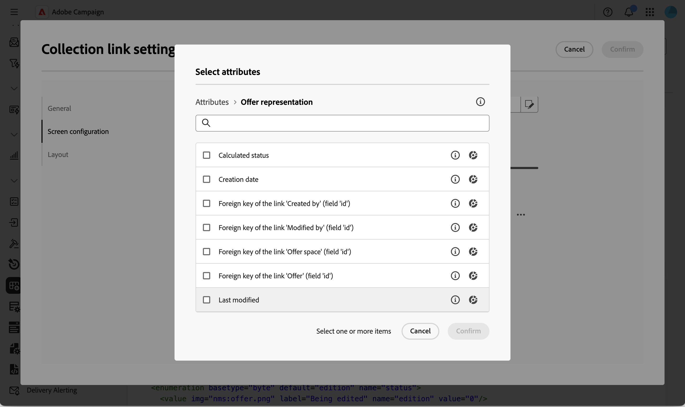
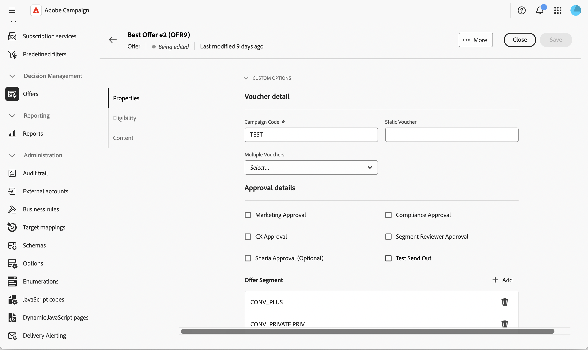

# Añadir una lista editable al esquema de oferta {#offer-editable-list}

Al [ampliar el  [!DNL nms:offer] esquema](../administration/schemas.md) con un vínculo de colección personalizado, como un conjunto de segmentos vinculados a una oferta, puede exponerlo como una lista editable directamente en la sección **[!UICONTROL Opciones personalizadas]** de la oferta. En lugar de administrar los registros relacionados a través de una pantalla independiente, la colección se procesa como una lista en el detalle de la oferta y puede crear nuevos registros relacionados en línea a través de un cuadro de diálogo dedicado.

>[!NOTE]
>
>Actualmente, esta capacidad solo está disponible para el esquema de oferta.

## Agregar un campo de vínculo de colección {#add-field}

1. Amplíe el esquema [!DNL nms:offer] con su colección personalizada, luego vaya al menú **[!UICONTROL Esquemas]**, abra el esquema **[!UICONTROL Ofertas de marketing]** y haga clic en **[!UICONTROL Edición de pantalla]**. [Más información](../administration/schemas-browse-access.md#screen-def).

   {zoomable="yes"}

1. En la sección **[!UICONTROL Configuración de pantalla detallada]**, haga clic en el icono de puntos suspensivos sobre la tabla **[!UICONTROL Lista de campos personalizados]** y elija **[!UICONTROL Seleccionar atributos]**. [Más información](../administration/schemas-custom-fields.md).

   {zoomable="yes"}

1. Examine los atributos y seleccione el vínculo de colección personalizado, identificado por su icono de colección.

   {zoomable="yes"}

   >[!NOTE]
   >
   >Los campos de vínculo de recopilación no pueden ser obligatorios y no admiten subatributos. De forma predeterminada, abarcan dos columnas en el formulario.

1. Confirme la selección. El vínculo de colección se agrega a la tabla **[!UICONTROL Lista de campos personalizados]**, con **[!UICONTROL colección]** como tipo.

   {zoomable="yes"}

## Configurar la lista editable de la colección {#configure-list}

1. Haga clic en el icono de puntos suspensivos en la fila del campo de colección y elija **[!UICONTROL Editar]** para abrir el cuadro de diálogo **[!UICONTROL Configuración del vínculo de colección]**.

   {zoomable="yes"}

1. En la ficha **[!UICONTROL General]**, establezca de forma opcional una condición **[!UICONTROL Visible si]** o habilite **[!UICONTROL Solo lectura]**.

   {zoomable="yes"}

1. En la ficha **[!UICONTROL Configuración de pantalla]**, haga clic en **[!UICONTROL Seleccionar atributos]** y seleccione los atributos que desea utilizar al agregar un nuevo elemento a la lista; por ejemplo, un nombre de segmento y un campo personalizado.

   {zoomable="yes"}

1. En la ficha **[!UICONTROL Diseño]**, mantenga o desactive **[!UICONTROL Abarcar dos columnas]**.

1. Haga clic en **[!UICONTROL Confirmar]** y, a continuación, **[!UICONTROL Guardar]** la definición de pantalla.

## Uso de la lista editable en una oferta {#use-list}

1. En el menú de la izquierda, haga clic en **Ofertas** y abra una oferta. [Más información](create-offer.md#create)

   {zoomable="yes"}

1. Acceda a las propiedades de la oferta. La colección se representa como una lista en la sección **Opciones personalizadas**.

   {zoomable="yes"}

1. Haz clic en **[!UICONTROL Agregar]** para mostrar los atributos que configuraste, rellénalos y haz clic en **[!UICONTROL Confirmar]**. El nuevo elemento se agrega a la lista.

   Se pueden añadir varios elementos a la misma lista y los detalles de la oferta pueden contener más de una lista editable.

1. Haga clic en **[!UICONTROL Save]**.

<!--
Each element added through the editable list creates a new related record. For instance, adding a segment to an offer generates the following payload:

```xml
<offer ...>
  <offerSegment segmentName="..." _operation="insert"/>
</offer>
```
-->