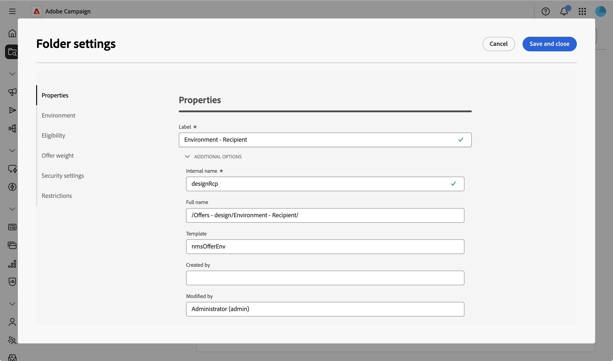
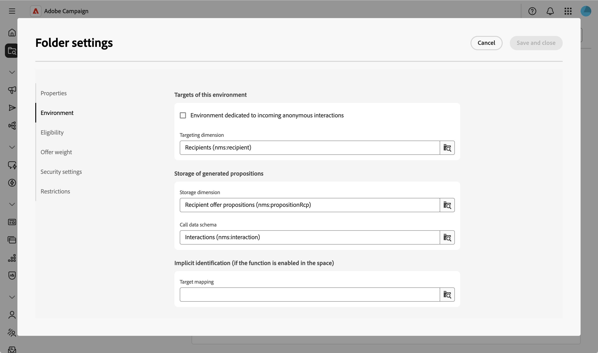

# Revisar configuración del entorno de ofertas {#offer-environment}

Un **entorno de ofertas** es el contenedor en el que se organiza el catálogo de ofertas y los espacios de ofertas relacionados. Hay dos tipos de entornos:

* un entorno **Design**, donde las ofertas se crean, configuran y aprueban,
* un entorno **Live** de solo lectura, donde las ofertas aprobadas e implementadas están disponibles para la selección de envíos.

Cada entorno **Design** está vinculado a un entorno **Live**. Cuando una oferta se completa y aprueba, se implementa automáticamente en el entorno **Live** y está disponible para su envío.

{zoomable="yes"}

De manera predeterminada, Campaign viene con dos entornos **Design** y **Live** preconfigurados para dirigirse a la tabla de destinatarios integrada (ofertas identificadas).

Para dirigirse a otra tabla, como perfiles anónimos que visitan el sitio web para interacciones entrantes, debe crear entornos adicionales (uno por dimensión de segmentación). Consulte la [documentación de Campaign v8](https://experienceleague.adobe.com/es/docs/campaign/campaign-v8/offers/interaction-settings/interaction-env#create-an-offer-environment){target="_blank"}.

## Acceso a entornos de oferta {#offer-environment-settings}

Los entornos de oferta se almacenan como carpetas. Para acceder y revisar la configuración del entorno (idoneidad, control de peso, seguridad), siga estos pasos:

>[!CAUTION]
>
>Esta configuración se puede modificar, pero debe tener cuidado, ya que los cambios podrían romper la implementación existente.

1. En el menú de navegación de la izquierda, abra **[!UICONTROL Explorer]** y busque la carpeta del entorno de ofertas en el nodo **Design environment**.

1. Haga clic en el botón ... y seleccione **[!UICONTROL Configuración de carpeta]** para mostrar la configuración del entorno.

   {zoomable="yes"}

1. Revise las diferentes secciones. La configuración de carpeta de un entorno de oferta agrupa opciones específicas de la oferta.

   {zoomable="yes"}

   La mayoría de las opciones reflejan la configuración del entorno de ofertas disponible en la consola del cliente. Para obtener más información, consulte la [documentación de la versión 8 de Campaign](https://experienceleague.adobe.com/docs/campaign/campaign-v8/offers/interaction-env.html){target="_blank"}.

<!--
## Create a new offer environment {#create}

If you need to manage a separate offer catalog — for example, for a different targeting dimension — you can create a new **Design** environment directly from the Web UI.

1. From the left navigation menu, open the **[!UICONTROL Explorer]** and locate the **Offers - design** folder.

1. Create a new folder from this location, then open its properties and fill in the environment-specific settings described below.

The **[!UICONTROL Linked live environment]** field is set automatically when the environment is created — see [Type of environment](#type).

## Access the offer environment settings {#access}

Offer environments are stored as folders. To access an environment and modify its properties, follow these steps. 

1. From the left navigation menu, open the **[!UICONTROL Explorer]** and locate the offer environment folder under the **Design environment** node.

1. Click on the ... button, and select **[!UICONTROL Folder settings]** to display the environment settings.

  {zoomable="yes"}

The folder settings of an offer environment group offer-specific options into several sections. 

-->
<!-- 
Most settings mirror the offer environment configuration available in the Adobe Campaign client console.
-->
<!-- 

## Properties {#properties}

This section is common to all folders. It allows you to define the **Label** of the folder and modify the technical folder properties.  

{zoomable="yes"}

-->
<!--

* **[!UICONTROL Label]** — Display name of the environment.

Expand **[!UICONTROL Additional options]** to access the technical properties of the folder:

* **[!UICONTROL Internal name]** — Unique identifier of the folder. Used to reference the environment from schemas, workflows, and API calls. The internal name is set at creation and should not be changed afterwards.

* **[!UICONTROL Full name]** — Read-only path of the folder in the Explorer tree (for example, `/Offers - design/Environment - Recipient/`).

* **[!UICONTROL Template]** — Read-only name of the folder template the environment is based on (for example, **[!DNL nmsOfferEnv]** for an offer environment).

* **[!UICONTROL Created by]** / **[!UICONTROL Modified by]** — Audit fields populated automatically with the operator that created and last modified the folder.

This section gathers the offer-specific settings of the folder.

-->
<!--

## Environment {#env-section}

  {zoomable="yes"}

### Type of environment {#type}

* **[!UICONTROL Type of environment]** — Switches the folder between **[!UICONTROL Design]** and **[!UICONTROL Live]**. The type is set when the environment is created. Changing it later is not recommended.

 **[!UICONTROL Linked live environment]** — Displays the read-only **[!UICONTROL Live]** environment that receives the deployed offers. Set automatically when the environment is created.

### Execution instances {#execution-instances}

* **[!UICONTROL Display execution instances]** — Opens the list of execution instances mapped to the environment. This section is only displayed when the multi-instance execution option is activated. Refer to the [Campaign v8 documentation](https://experienceleague.adobe.com/docs/campaign/campaign-v8/offers/interaction-architecture.html?lang=es#distributed-architecture){target="_blank"}.

### Targets of this environment {#targets}

  {zoomable="yes"}

* **[!UICONTROL Environment dedicated to incoming anonymous interactions]** — Activates anonymous interaction features on the environment. This relies on a target mapping for the visitor targeting dimension, which you can now create directly from the Web UI — see [Manage target mappings](../administration/target-mappings.md). Refer to the [Campaign v8 documentation](https://experienceleague.adobe.com/docs/campaign/campaign-v8/offers/interaction-env.html#create-an-offer-environment){target="_blank"} for the full anonymous interaction setup.

-->
<!--
and [Anonymous interactions](https://experienceleague.adobe.com/docs/campaign/campaign-v8/offers/anonymous-interactions.html){target="_blank"}.
-->
<!--

* **[!UICONTROL Targeting dimension]** — Schema and table of the contacts targeted by the offers contained in this environment (for example, **[!DNL Recipients (nms:recipient)]**). The targeting dimension is reused by every offer and offer space of the environment.

### Storage of generated propositions {#storage}

* **[!UICONTROL Storage dimension]** — Schema and table where the propositions generated through this environment are stored (for example, **[!DNL Recipient offer propositions (nms:propositionRcp)]**).

* **[!UICONTROL Call data schema]** — Schema used to capture the data of each call to the Offer engine (for example, **[!DNL Interactions (nms:interaction)]**). For details on this schema, refer to the [Campaign v8 data model documentation](https://experienceleague.adobe.com/docs/campaign/campaign-v8/dev/datamodel.html){target="_blank"}.

### Implicit identification (if the function is enabled in the space) {#implicit-identification}

* **[!UICONTROL Target mapping]** — Used to configure the **changeover process**, which lets the Offer engine switch between an identified and an anonymous environment depending on whether the contact can be identified during an inbound interaction. Leave this field empty when implicit identification is not used. Learn how to create and manage target mappings directly from the Web UI in [Manage target mappings](../administration/target-mappings.md). For the offer-specific changeover process configuration, refer to [Campaign v8 documentation](https://experienceleague.adobe.com/docs/campaign/campaign-v8/offers/anonymous-interactions.html){target="_blank"}.

-->
<!--
## Eligibility {#eligibility}

  {zoomable="yes"}

* **[!UICONTROL Presentation typology]** — Typology rule of type **[!UICONTROL Offer presentation]** referenced by the environment. Presentation typologies exclude offers based on the proposition history of a recipient. You can edit these rules directly from the Web UI's **[!UICONTROL Business rules]** screen — see [Work with business rules (typologies)](../administration/typologies.md). Refer to the [Campaign v8 documentation](https://experienceleague.adobe.com/docs/campaign/campaign-v8/offers/interaction-offer.html?lang=es#offer-presentation){target="_blank"} for the full rule reference.

* **[!UICONTROL Filters on the target]** — Filter rules that apply to every offer in the environment. Use **[!UICONTROL Add rules]** to open the rule builder and restrict the audience targeted by all offers contained in this environment.

## Offer weight {#offer-weight}

* **[!UICONTROL Display offer weight]** — Click the **Display offer weight** button to open the read-only list of offer weights included in the environment folder. Weights themselves are configured at the offer space and the offer levels — refer to [Create and publish an offer](create-offer.md#eligibility).

## Security settings and Restrictions {#security}

These two sections are generic Campaign folder controls. They are not specific to offer management.

* **[!UICONTROL Security settings]** — The **[!UICONTROL Group or operator]** table defines the operators and operator groups allowed to read, write, or delete the environment and its contents. For Interaction-specific operator roles (Offer manager, Delivery manager), refer to [Operators of the Interaction module](https://experienceleague.adobe.com/docs/campaign/campaign-v8/offers/interaction-operators.html){target="_blank"}.

* **[!UICONTROL System folder]** — When enabled, marks the folder as a system folder.

* **[!UICONTROL Restrictions]** — Lets you turn the folder into a view by enabling **[!UICONTROL This folder is a view]** and clicking **[!UICONTROL Edit restrictions]** to define a filter on the records displayed in the folder.
-->
A continuación, [cree un espacio de ofertas](offer-space.md) para definir dónde y cómo se exponen las ofertas.
