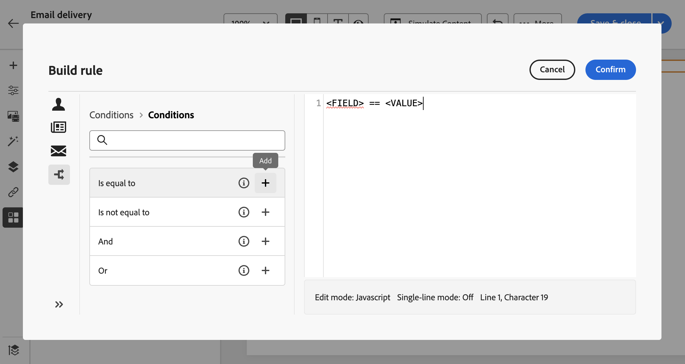

# Generación de contenido condicional{#add-conditions}

>[!CONTEXTUALHELP]
>id="acw_conditional_content"
>title="Añadir contenido condicional"
>abstract="Configure campos de contenido condicional para crear una personalización dinámica avanzada basada en el perfil del destinatario. Los bloques de texto, los vínculos, la línea de asunto o las imágenes se sustituyen en el contenido del mensaje cuando se cumple una condición en concreto."

## Introducción al contenido condicional {#gs}

El contenido condicional es una práctica funcionalidad que permite crear una personalización dinámica basada en el perfil del destinatario y reemplazar automáticamente bloques de texto e imágenes cuando se cumplen determinadas condiciones. Esta función puede llevar las campañas a otro nivel y ofrecer experiencias personalizadas y enfocadas al público.

Al configurar los campos de contenido condicional, se puede crear una personalización dinámica avanzada basada en el perfil del destinatario, por ejemplo. Los bloques de texto, los vínculos, la línea de asunto o las imágenes se sustituyen en el contenido del mensaje cuando se cumple una condición concreta. Por ejemplo, puede mostrar &quot;Sr.&quot; o &quot;Sra.&quot; según el valor del campo Género en la base de datos de Adobe Campaign, o incluir un vínculo diferente basado en el idioma preferido del destinatario.

Para crear contenido condicional, debe crear condiciones en la variable **editor de expresiones** uso de funciones de ayuda específicas. Este método está disponible para todos los canales de envío en cualquier campo en el que pueda acceder al editor de expresiones, como la línea de asunto o los vínculos de correo electrónico y los componentes de contenido de texto/botón. [Obtenga información sobre cómo acceder al editor de expresiones](gs-personalization.md/#access)

Además del editor de expresiones, puede aprovechar un dedicado **generador de contenido condicional** al diseñar un correo electrónico que le permita crear varias variantes para un elemento del cuerpo del correo electrónico. [Aprenda a crear contenido condicional en correos electrónicos](#condition-condition-builder)

## Creación de condiciones en el editor de expresiones {#condition-perso-editor}

Para definir contenido condicional para una entrega mediante el editor de expresiones, siga los pasos a continuación. En este ejemplo, deseamos crear contenido condicional basado en el idioma de los destinatarios (francés o inglés).

1. Abra una entrega y vaya a la sección de edición de contenido.

1. Busque el campo donde desea agregar contenido condicional. Por ejemplo, puede añadir contenido condicional a un mensaje SMS.

1. Haga clic en **[!UICONTROL Abrir diálogo de personalización]** junto al campo para abrir el editor de expresiones.

   

1. En el editor de personalización, vaya a **[!UICONTROL Funciones de ayuda]** menú de la izquierda.

1. Para empezar a crear la condición, haga clic en el icono &quot;+&quot; junto a **If** función. Se añade la siguiente línea a la pantalla central:`<% if (<FIELD>==<VALUE>) { %>Insert content here<% } %>`

   * Reemplazar `<FIELD>` con un campo de personalización, como el idioma del destinatario: `recipient.language`.
   * Reemplazar `<VALUE>` con el valor que se va a satisfacer. Por ejemplo, `'French'`.
   * Reemplazar `Ìnsert content here` con el contenido que desea mostrar a los perfiles que cumplen la condición especificada.

     {width="800" align="center"}

1. Especifique el contenido que se debe mostrar si los destinatarios no cumplen la condición. Para ello, utilice una **else** función de ayuda:

   1. Coloque el cursor antes de la etiqueta de cierre de expresión `%>` y haga clic en `+` junto al **Else** función.

   1. Reemplazar `Ìnsert content here` con el contenido que desea mostrar a los perfiles que no cumplen la condición de la función if.

   {width="800" align="center"}

   También puede utilizar la variable **else if** función de ayuda para crear condiciones con varias variantes de contenido. Por ejemplo, la expresión siguiente muestra tres variantes de un mensaje según el idioma de los destinatarios:

   {width="800" align="center"}

   >[!NOTE]
   >
   >Cada vez que se añade una función de ayuda, se abre (`<%`) y cierre (`%>`) las etiquetas se añaden automáticamente antes y después de la función.
   >
   >Ejemplo después de agregar una función de ayuda &quot;Else&quot; dentro de una expresión: >
   >
   >`<% if (<FIELD>==<VALUE>) { %>Insert content here<% } <% else { %> Insert content here<% } %>%>`
   >
   >Asegúrese de quitar estas etiquetas para evitar errores de sintaxis. En este ejemplo, la expresión corregida después de quitar la variable **else** etiquetas de función es:
   >
   >`<% if (<FIELD>==<VALUE>) { %>Insert content here<% } else { %> Insert content here<% } %>`

1. Una vez que la condición esté lista, puede guardar el contenido y comprobar su renderización simulando el contenido.

## Creación de contenido condicional en correos electrónicos {#condition-condition-builder}

El contenido condicional de los correos electrónicos se puede crear de dos formas:
* En el editor de expresiones creando una condición con funciones de ayuda,
* En un generador de contenido condicional específico al que se puede acceder al diseñar un correo electrónico.

En la siguiente sección se proporcionan instrucciones paso a paso sobre cómo crear condiciones utilizando la capacidad de contenido condicional del diseñador de correo electrónico. Encontrará información detallada sobre cómo crear condiciones con el editor de expresiones [aquí](#condition-perso-editor).

En este ejemplo, deseamos crear un mensaje de correo electrónico con varias variantes basadas en el idioma de los destinatarios. Siga estos pasos:

1. Cree o abra una entrega de correo electrónico, edite su contenido y haga clic en **[!UICONTROL Editar cuerpo del correo electrónico]** para abrir el espacio de trabajo de diseño de correo electrónico.

1. Seleccione un componente de contenido y haga clic en **[!UICONTROL Habilitar contenido condicional]** icono.

   {width="800" align="center"}

1. El **[!UICONTROL Contenido condicional]** Este panel se abre en el lado izquierdo de la pantalla. En este panel, puede crear varias variantes del componente de contenido seleccionado mediante condiciones.

1. Configure su primera variante. Pase el ratón sobre **[!UICONTROL Variante - 1]** en el **[!UICONTROL Contenido condicional]** y haga clic en el **[!UICONTROL Añadir condición]** botón.

   {width="800" align="center"}

1. Aparecerá un generador de reglas. Proporciona lo siguiente **Perfil**, **Mensaje**, y **Envío** atributos que puede aprovechar para crear su condición.

   Además, la variable **Condiciones** proporciona condiciones generadas previamente que puede agregar al lienzo para generar fácilmente su variante. Para utilizarlos, haga clic en el **Añadir** luego reemplace los elementos entre `<` y `>`por los elementos deseados. Asegúrese de que el valor especificado para `<value>` el objeto está entre comillas.

   {width="800" align="center"}

1. Una vez que la condición de la primera variante del mensaje esté lista, haga clic en **[!UICONTROL Confirmar]**. En este ejemplo, se crea una regla para destinatarios cuyo idioma es &quot;francés&quot;.

   {width="800" align="center"}

1. La regla ahora está asociada a la variante. Para mejorar la legibilidad, se recomienda cambiar el nombre de la variante haciendo clic en el menú de los tres puntos.

1. Configure cómo debe mostrarse el componente si se cumple la regla al enviar el mensaje. En este ejemplo, deseamos mostrar el texto en francés si es el idioma preferido del destinatario.

   {width="800" align="center"}

1. Añada tantas variantes como sea necesario para el componente de contenido. Puede cambiar entre las variantes en cualquier momento para comprobar cómo se mostrará el componente de contenido en función de sus reglas condicionales.

   >[!NOTE]
   >Si ninguna de las reglas definidas en las variantes se cumple al enviar el mensaje, el componente de contenido mostrará el contenido definido en la variable **[!UICONTROL Variante predeterminada]** desde el **[!UICONTROL Contenido condicional]** panel.
