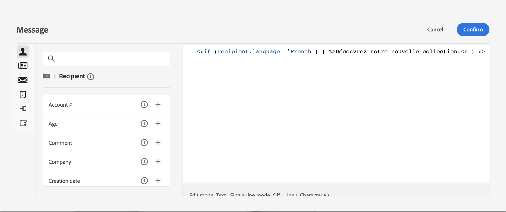

# Generación de contenido condicional{#add-conditions}

>[!CONTEXTUALHELP]
>id="acw_conditional_content"
>title="Añadir contenido condicional"
>abstract="Configure campos de contenido condicional para crear una personalización dinámica avanzada basada en el perfil del destinatario. Los bloques de texto, los vínculos, la línea de asunto o las imágenes se sustituyen en el contenido del mensaje cuando se cumple una condición en concreto."

## Introducción al contenido condicional {#gs}

El contenido condicional es una práctica funcionalidad que permite crear una personalización dinámica basada en el perfil del destinatario y reemplazar automáticamente bloques de texto e imágenes cuando se cumplen determinadas condiciones. Esta función puede llevar las campañas a otro nivel y ofrecer experiencias personalizadas y enfocadas al público.

Al configurar los campos de contenido condicional, se puede crear una personalización dinámica avanzada basada en el perfil del destinatario, por ejemplo. Los bloques de texto, los vínculos, la línea de asunto o las imágenes se sustituyen en el contenido del mensaje cuando se cumple una condición concreta. Por ejemplo, puede mostrar &quot;Sr.&quot; o &quot;Sra.&quot; según el valor del campo Género en la base de datos de Adobe Campaign, o incluir un vínculo diferente basado en el idioma preferido del destinatario.

Para crear contenido condicional, debe crear condiciones en la variable **editor de expresiones** uso de funciones de ayuda específicas. Este método está disponible para todos los canales de envío en cualquier campo en el que pueda acceder al editor de expresiones, como la línea de asunto o los vínculos de correo electrónico y los componentes de contenido de texto/botón. [Obtenga información sobre cómo acceder al editor de expresiones](gs-personalization.md/#access)

<!--In addition to the expression editor, you can leverage a dedicated **conditional content builder** when designing an email that allows you to build conditions using profile attributes only. [Learn how to create conditional content in emails](#condition-condition-builder)-->

## Creación de condiciones en el editor de expresiones {#condition-perso-editor}

Para definir contenido condicional para una entrega mediante el editor de expresiones, siga los pasos a continuación. En este ejemplo, deseamos crear contenido condicional basado en el idioma de los destinatarios (francés o inglés).

1. Abra una entrega y vaya a la sección de edición de contenido.

1. Busque el campo donde desea agregar contenido condicional. Por ejemplo, puede añadir contenido condicional a un mensaje SMS.

1. Haga clic en **[!UICONTROL Abrir diálogo de personalización]** junto al campo para abrir el editor de expresiones.

   

1. En el editor de personalización, vaya a **[!UICONTROL Funciones de ayuda]** menú de la izquierda.

1. Para empezar a crear la condición, haga clic en el icono &quot;+&quot; junto a **If** función. Se añade la siguiente línea a la pantalla central:`<% if (<FIELD>==<VALUE>) { %>Insert content here<% } %>`

   * Reemplazar `<FIELD>` con un campo de personalización, como el idioma del destinatario: `recipient.language`.
   * Reemplazar `<VALUE>` con el valor que se va a satisfacer. Por ejemplo, `'French'`.
   * Reemplazar `Ìnsert content here` con el contenido que desea mostrar a los perfiles que cumplen la condición especificada.

     {width="800" align="center"}

1. Especifique el contenido que se debe mostrar si los destinatarios no cumplen la condición. Para ello, utilice una **else** función de ayuda:

   1. Coloque el cursor antes de la etiqueta de cierre de expresión `%>` y haga clic en `+` junto al **Else** función.

   1. Reemplazar `Ìnsert content here` con el contenido que desea mostrar a los perfiles que no cumplen la condición de la función if.

   {width="800" align="center"}

   También puede utilizar la variable **else if** función de ayuda para crear condiciones con varias variantes de contenido. Por ejemplo, la expresión siguiente muestra tres variantes de un mensaje según el idioma de los destinatarios:

   {width="800" align="center"}

   >[!NOTE]
   >
   >Cada vez que se añade una función de ayuda, se abre (`<%`) y cierre (`%>`) las etiquetas se añaden automáticamente antes y después de la función.
   >
   >Ejemplo después de agregar una función de ayuda &quot;Else&quot; dentro de una expresión: >
   >
   >`<% if (<FIELD>==<VALUE>) { %>Insert content here<% } <% else { %> Insert content here<% } %>%>`
   >
   >Asegúrese de quitar estas etiquetas para evitar errores de sintaxis. En este ejemplo, la expresión corregida después de quitar la variable **else** etiquetas de función es:
   >
   >`<% if (<FIELD>==<VALUE>) { %>Insert content here<% } else { %> Insert content here<% } %>`

1. Una vez que la condición esté lista, puede guardar el contenido y comprobar su renderización simulando el contenido.

<!--SECTION REMOVED FOR LA > CONDITIONAL CONTENT NOT AVAILABLE ANYMORE FROM THE DEDICATED MENU IN THE EMAIL DESIGNER. ONLY THE EXPRESSION EDITOR IS AVAILABLE FOR NOW

## Create conditional content in emails {#condition-condition-builder}

Conditional content in emails can be created in two ways:
* In the expression editor by building a condition with helper functions,
* In a dedicated conditional content builder that is accessible when designing an email.

Detailed information on how to create conditions using the expression editor is available [here](#condition-perso-editor). The following section provides step-by-step instructions on how to create conditions using the email designer's conditional content capability. In this example, we want to create an email message with multiple variants based on the recipients' language. Follow these steps:

1. Create or open an email delivery, edit its content, and click the **[!UICONTROL Edit email body]** button to open the email designing workspace.

1. Select a content component and click the **[!UICONTROL Enable conditional content]** icon.

    {width="800" align="center"}

1. The **[!UICONTROL Conditional Content]** pane opens on the left-hand side of the screen. In this pane, you can create multiple variants of the selected content component using conditions.

1. Configure your first variant. Hover over **[!UICONTROL Variant - 1]** in the **[!UICONTROL Conditional Content]** pane and click the **[!UICONTROL Add condition]** icon.

1. A query modeler appears. Use profile attributes to create the condition for the first variant of the message and click **[!UICONTROL Confirm]**. In this example, we are creating a rule targeting recipients whose language is 'French'.

    {width="800" align="center"}

1. The rule is now associated to the variant. For better readability, we recommend renaming the variant by clicking the ellipsis menu.

1. Configure how the component should display if the rule is met when sending the message. In this example, we want to display the text in French if it is the recipient's preferred language.

    {width="800" align="center"}

1. Add as many variants as needed for the content component. You can switch between the variants at any time to check how the content component will display based on their conditional rules.

    >[!NOTE]
    >If none of the rules defined in the variants are met when sending the message, the content component will display the content defined in the **[!UICONTROL Default variant]** from the **[!UICONTROL Conditional Content]** pane.
-->