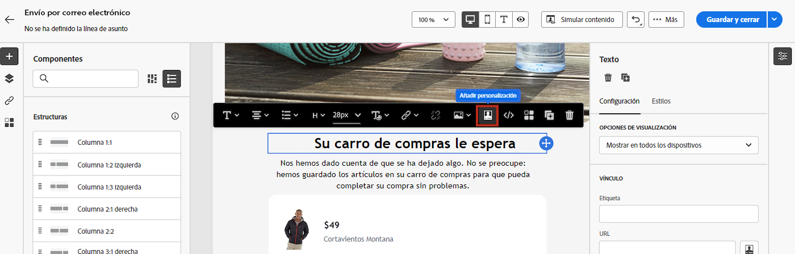

# Introducción al contenido dinámico {#gs-dynamic-content}

>[!CONTEXTUALHELP]
>id="acw_targetdata_personalization_dashboard"
>title="Personalización"
>abstract="El editor de expresiones permite seleccionar, organizar, personalizar y validar todos los datos para crear una experiencia ajustada del contenido. Puede personalizar los mensajes para cada destinatario aprovechando los datos de perfil y crear contenido condicional para adaptar el mensaje a cada destinatario y mostrar solo el contenido relevante. Además, hay bloques de personalización disponibles para añadir contenido personalizado predefinido a los envíos."

Como experto en marketing, es crucial dirigirse a los clientes que están genuinamente interesados en sus ofertas y comprometerse con ellas proporcionando contenido efectivo y relevante. Dada la amplia gama de destinatarios que encuentra, crear varios fragmentos de contenido de marketing para atraer a diferentes personas puede consumir tiempo y ser un derroche. Aquí es donde el contenido dinámico entra en juego.

Las funcionalidades de contenido dinámico de Adobe Campaign Web le permiten personalizar el contenido en función de la información que haya recopilado sobre los destinatarios. Al utilizar contenido dinámico, se asegura de que sus esfuerzos de marketing sean más relevantes, lo que evita la comercialización de productos o servicios no deseados o innecesarios. Este método hace que el contenido sea más atractivo y aumenta la probabilidad de que se lea. Además, le permite personalizar el contenido, lo que hace que los destinatarios sientan que están recibiendo información de una persona, en lugar de una máquina.

## ¿Cómo hacer que su contenido sea dinámico? {#make-content-dyn}

Puede hacer que el contenido del mensaje sea dinámico insertando construcciones JavaScript en el editor de expresiones de Campaign Web. Al enviar mensajes, Adobe Campaign interpreta estas expresiones para entregar el contenido correcto a cada uno de los destinatarios:

* **Personalizar los mensajes** a cada destinatario específico aprovechando los datos de perfil como su nombre, intereses, dónde viven, qué compraron y mucho más. Puede seleccionar cualquier campo disponible en la base de datos desde el editor de personalización relacionado con el destinatario, el mensaje o el envío. Estos atributos de personalización se pueden insertar en la línea de asunto o en el cuerpo de los mensajes. La siguiente sintaxis inserta la ciudad del destinatario en el contenido: &lt;%= recipient.location.city %>.

  {zoomable=&quot;yes&quot;}{width="800" align="center"}

* **Creación de contenido condicional** para adaptar los envíos a cada destinatario y mostrar únicamente el contenido relevante para un cliente determinado en función de la información que tenga sobre él. Esto le permite mostrar bloques de texto o imágenes específicos basados en condiciones. Por ejemplo, adapte un banner de correo electrónico en función de la suscripción de los destinatarios a un servicio específico.

  {zoomable=&quot;yes&quot;}{width="800" align="center"}

* **Uso de bloques de personalización** para ahorrar tiempo y aprovechar el contenido personalizado fácilmente reutilizable en sus mensajes. Campaign incluye un conjunto de bloques de personalización que contienen una renderización específica que puede insertar en los envíos. Por ejemplo, puede añadir un logotipo, un mensaje de saludo o un vínculo a la página espejo del mensaje de correo electrónico. Los bloques de contenido están disponibles en una entrada específica del editor de personalización.

  {zoomable=&quot;yes&quot;}{width="800" align="center"}

## Acceso al editor de expresiones {#access}

Adobe Campaign Web proporciona un editor de expresiones en el que puede seleccionar, organizar, personalizar y validar todos los datos para crear una experiencia personalizada para el contenido. El editor de expresiones está disponible para todos los canales en todos los campos con el **[!UICONTROL cuadro de diálogo Abrir personalización]**, como el campo de línea de asunto o los vínculos de correo electrónico y los componentes de contenido de texto/botón.

A continuación se muestran algunos ejemplos sobre cómo acceder al editor de expresiones en función del contenido que desee hacer dinámico:

* *Acceso al editor de expresiones desde el campo Nombre del remitente*

  {zoomable=&quot;yes&quot;}{width="800" align="center"}

* *Acceso al editor de expresiones desde un componente de texto de correo electrónico*

  {zoomable=&quot;yes&quot;}{width="800" align="center"}

* *Acceso al editor de expresiones desde un vínculo en un correo electrónico*

  {zoomable=&quot;yes&quot;}{width="800" align="center"}

>[!NOTE]
>
>Además del editor de expresiones, también puede aprovechar un generador de contenido condicional dedicado al diseñar un correo electrónico. [Aprenda a crear contenido condicional en correos electrónicos](conditions.md)

## Vamos a profundizar {#dive-deeper}

Ahora que comprende cómo hacer que el contenido sea dinámico, es hora de profundizar en estas secciones de documentación para empezar a trabajar con la función.

<table style="table-layout:fixed"><tr style="border: 0;">
<td>

<a href="personalize.md"><strong>Adición de personalización</strong></a>

</td>
<td>

<a href="conditions.md"><strong>Adición de contenido condicional</strong>

</td>
<td>

<a href="content-blocks.md"><strong>Adición de bloques de contenido integrados</strong></a>

</td>
</tr></table>
