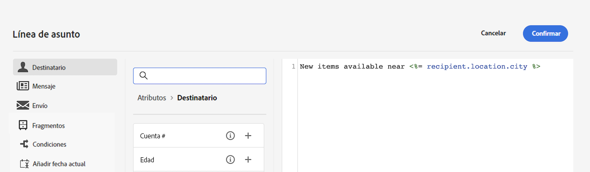

# Introducción al contenido dinámico

Para sacar el máximo partido a cada campaña de marketing, Adobe Campaign le ofrece una forma de ofrecer contenido dinámico personalizado que hable con los clientes de su nivel. En función de los datos de perfil, utilice funcionalidades de personalización para crear una experiencia personalizada para diferentes grupos e individuos: puede adaptar los mensajes a cada destinatario específico aprovechando los datos y la información que tiene sobre ellos. Puede ser su nombre, intereses, dónde viven, qué compraron y mucho más.

Utilice Campaign para crear contenido dinámico y enviar mensajes personalizados. Las funcionalidades de personalización se pueden combinar para mejorar sus mensajes y crear una experiencia de usuario personalizada.

Puede hacer que el contenido del mensaje sea dinámico insertando:

* **Campos personalizados**

   Los campos de personalización se utilizan para la personalización de primer nivel de los mensajes. Puede seleccionar cualquier campo disponible en la base de datos desde el editor de personalización. Para un envío, se puede seleccionar cualquier campo relacionado con el destinatario, el mensaje o el envío. Estos atributos de personalización se pueden insertar en la línea de asunto o en el cuerpo de los mensajes.

   

   La siguiente sintaxis inserta la ciudad del destinatario en el contenido: &lt;%= recipient.location.city %>.

* **Contenido condicional**

   Configure el contenido condicional para añadir una personalización dinámica basada en el perfil del destinatario, por ejemplo. Los bloques de texto o las imágenes se insertan cuando se cumple una condición concreta. Puede definir la versión alternativa del contenido cuando la condición no sea verdadera.

* **Descripción de los bloques de contenido integrados**

   Campaign incluye un conjunto de bloques de personalización que contienen una renderización específica que puede insertar en los envíos. Por ejemplo, puede agregar un logotipo, un mensaje de saludo o un vínculo a la página espejo de un mensaje de correo electrónico. Los bloques de contenido están disponibles en una entrada dedicada del editor de personalización.

   

## ¿Dónde puedo añadir contenido dinámico?

Adobe Campaign V8 Web proporciona un editor de expresiones en el que puede seleccionar, organizar, personalizar y validar todos los datos para crear una experiencia personalizada para el contenido.

El editor de expresiones está disponible para todos los canales y en todos los campos con el icono de cuadro de diálogo Abrir personalización, como el campo de línea de asunto o los componentes de contenido de texto y botones de los correos electrónicos.

Además, se puede acceder a un generador de contenido condicional dedicado al diseñar un correo electrónico. [Aprenda a crear contenido condicional en correos electrónicos](conditions.md)

## Vamos a profundizar

Ahora que comprende cómo hacer que el contenido sea dinámico, es hora de profundizar en estas secciones de documentación para empezar a trabajar con la función.

<table style="table-layout:fixed"><tr style="border: 0;">
<td>

<a href="personalize.md"><strong>Adición de personalización</strong></a>

</td>
<td>

<a href="conditions.md"><strong>Añadir contenido condicional</strong>

</td>
<td>

<a href="content-blocks.md"><strong>Añadir bloques de contenido integrados</strong></a>

</td>
</tr></table>
