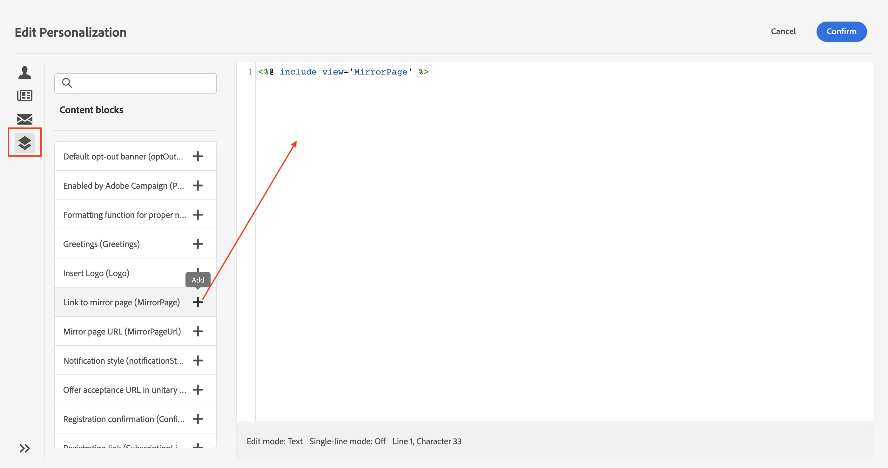

# Personalización de su contenido{#add-personalization}

Puede personalizar el contenido del mensaje haciendo lo siguiente:

* Inserción dinámica de **campos de personalización**

   Los campos de personalización se utilizan para la personalización de primer nivel de los mensajes. Puede seleccionar cualquier campo disponible en la base de datos desde el editor de personalización. Para un envío, se puede seleccionar cualquier campo relacionado con el destinatario, el mensaje o el envío. Estos atributos de personalización se pueden insertar en la línea de asunto o en el cuerpo de los mensajes.

   

   La siguiente sintaxis inserta la ciudad del destinatario en el contenido: &lt;%= recipient.location.city %>.

* Inserción predefinida de los **bloques de contenido**

   Campaign incluye un conjunto de bloques de personalización que contienen una renderización específica que puede insertar en los envíos. Por ejemplo, puede añadir un logotipo, un mensaje de saludo o un enlace a la página espejo del mensaje. Los bloques de contenido están disponibles en la entrada del editor de personalización.

   

* Crear **contenido condicional**

   Configure el contenido condicional para añadir personalización dinámica basada en el perfil del destinatario, por ejemplo. Los bloques de texto o las imágenes se insertan cuando una condición en particular es verdadera.

## Personalización de la línea de asunto del correo electrónico {#personalize-subject-line}

Para añadir la personalización en el campo **[!UICONTROL Línea de asunto]** del mensaje, siga los pasos a continuación:

1. Haga clic en el icono **[!UICONTROL Abrir cuadro de diálogo de personalización]** a la derecha del campo **[!UICONTROL Línea de asunto]**.

   {width="600"}

1. Escriba el contenido de la línea de asunto y seleccione los atributos de personalización que desea añadir.

1. Clic **[!UICONTROL Confirmar]**** para validar. Los atributos de personalización se añaden a la línea de asunto.

## Personalización del contenido del correo electrónico {#personalize-emails}

Para personalizar el contenido del correo electrónico, abra el mensaje en el Diseñador de correo electrónico y realice lo siguiente:

1. Haga clic dentro del bloque de texto.
1. En la barra de herramientas contextual, seleccione **[!UICONTROL Añadir personalización]**.

   

1. Escriba el nombre del destinatario en el editor de personalización y confírmelo.

   

   El atributo de personalización se añade al contenido del correo electrónico.

   Puede simular el contenido para comprobar la renderización. [Más información](../preview-test/preview-content.md)

   

1. Para añadir un bloque de contenido al correo electrónico, siga los mismos pasos y seleccione un bloque de contenido del último icono.

   

1. Una vez insertado, el bloque de contenido se añade al contenido del correo electrónico. Se adapta automáticamente al perfil de destinatario cuando se genera la personalización, en el paso de preparación de la entrega.

   

## Personalización de vínculos en correos electrónicos {#personalize-links}

Para personalizar un **vínculo**:

1. Seleccione un bloque de texto o una imagen.
1. En la barra de herramientas contextual, seleccione **Insertar vínculo**.

   

1. Introduzca la etiqueta del vínculo y utilice el botón **Insertar vínculo** para personalizar el vínculo.

   

1. Utilice el editor de personalización para definir y personalizar el vínculo; confírmelo.

   

## Personalización de las ofertas {#personalize-offers}

También puede acceder al editor de personalización cuando añada contenido de texto a las representaciones de sus ofertas. Obtenga más información en [esta sección](../content/offers.md).

## Bloques de contenido integrados {#ootb-content-blocks}

Descripción de los bloques de contenido integrados:

* **[!UICONTROL Habilitado por Adobe Campaign]**: inserta el logotipo “Habilitado por Adobe Campaign”.
* **[!UICONTROL Función de formateo para nombres propios]**: genera la función JavaScript **[!UICONTROL toSmartCase]**, que cambia la primera letra de cada palabra a mayúscula.
* **[!UICONTROL Saludos]**: inserta los saludos con el nombre completo del destinatario, seguidos de una coma. Ejemplo: “Hola, John Doe”.
* **[!UICONTROL Insertar logotipo]**: inserta un logotipo que se define en la configuración de la instancia.
* **[!UICONTROL Enlace a página espejo]**: inserta un enlace a la [página espejo](../content/mirror-page.md). El formato predeterminado es: “Si no puede ver este mensaje correctamente, haga clic aquí”.
* **[!UICONTROL URL de la página espejo]**: inserta la dirección URL de la página espejo, permite que los diseñadores de envío comprueben el vínculo.
* **[!UICONTROL URL de aceptación de la oferta en modo unitario]**: inserta una URL que permite establecer una oferta como **[!UICONTROL Aceptada]**. (Este bloque está disponible si el módulo Interacción está habilitado)
* **[!UICONTROL Confirmación del registro]**: inserta un vínculo que permite confirmar la suscripción.
* **[!UICONTROL Vínculo de registro]**: inserta un vínculo de suscripción. Este vínculo se define en la configuración de la instancia. El contenido predeterminado es: “Para registrarse, haga clic aquí”.
* **[!UICONTROL Vínculo de registro (con referencia)]**: inserta un vínculo de suscripción que permite identificar el visitante y el envío. Este vínculo se define en la configuración de la instancia.
* **[!UICONTROL URL de la página de registro]**: inserta una URL de suscripción.
* **[!UICONTROL Estilo de los correos electrónicos de contenido]** y **[!UICONTROL Estilo de las notificaciones]**: generan un código que da formato a un correo electrónico con estilos HTML predefinidos.
* **[!UICONTROL Vínculo de baja]**: inserta un vínculo que permite cancelar la suscripción a todos los envíos (lista de bloqueados). El contenido asociado predeterminado es el siguiente: “Usted recibe este mensaje porque ha estado en contacto con ***nombre de la organización*** o un afiliado. Para dejar de recibir mensajes de ***nombre de la organización*** haga clic aquí”.
