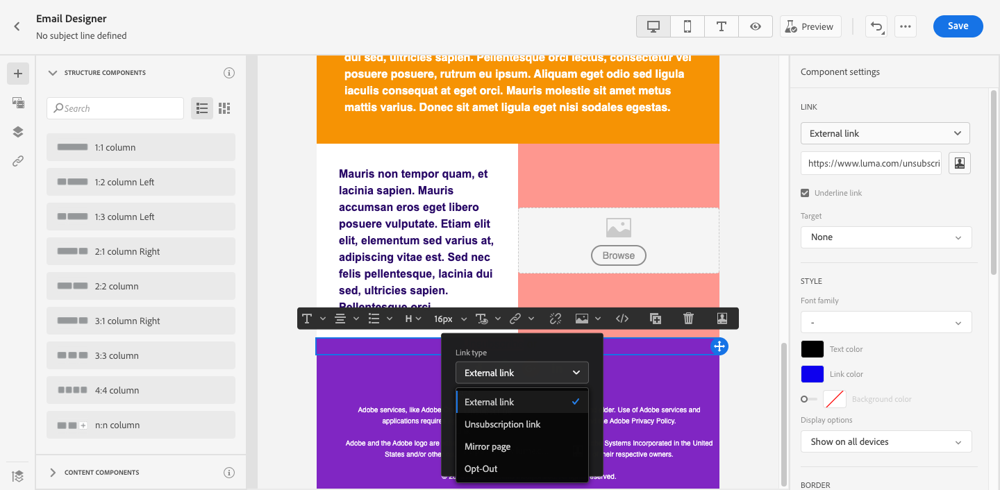
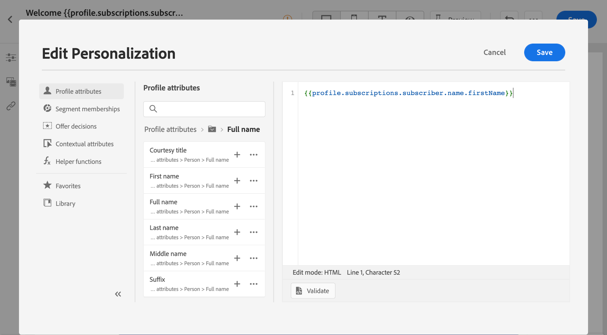

# Introducción a la personalización{#add-personalization}

>[!NOTE]
>
>Esta documentación está en construcción y se actualiza con frecuencia. La versión final de este contenido estará lista en enero de 2023.

>[!NOTE]
>
>Las capturas de pantalla no están actualizadas.

## Personalización de los correos electrónicos {#personalize-emails}

Al crear un correo electrónico, puede añadir personalización en la variable **[!UICONTROL Línea de asunto]** del mensaje.

En el Diseñador de correo electrónico, puede personalizar el contenido:

* En el **message**: haga clic dentro de un bloque de texto y haga clic en el botón **Personalizar** en la barra de herramientas contextual y seleccione **Insertar personalización** campo .

   

* Para un **vínculo**: seleccione texto o imagen dentro de un bloque de texto, haga clic en el botón **Insertar vínculo** de la barra de herramientas contextual. En la ventana , puede añadir un bloque personalizado haciendo clic en el botón **Añadir personalización** icono.

   

En ambos casos, se accede al editor de personalización.

## Personalización de las ofertas {#personalize-offers}

También puede acceder al editor de personalización cuando añada contenido de tipo texto a las representaciones de sus ofertas.

