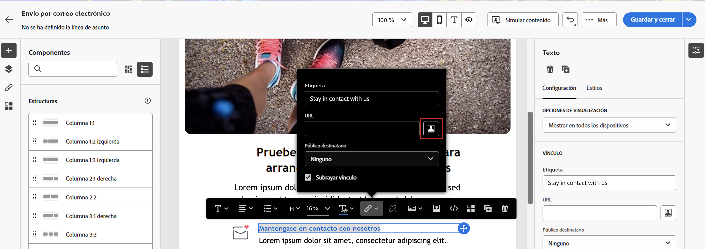

# Personalización del contenido{#add-personalization}

Puede personalizar el contenido del mensaje:

* Inserción dinámica **campos personalizados**

   Los campos personalizados se utilizan para la personalización de primer nivel de los mensajes. Puede seleccionar cualquier campo disponible en la base de datos desde el editor de personalización. Para una entrega, se puede seleccionar cualquier campo relacionado con el destinatario, el mensaje o la entrega. Estos atributos de personalización se pueden insertar en la línea de asunto o en el cuerpo de los mensajes.

   

   La siguiente sintaxis inserta la ciudad del destinatario en el contenido: &lt;%= recipient.location.city %>.

* Inserción predefinida **bloques de contenido**

   Campaign viene con un conjunto de bloques personalizados que contienen una renderización específica que puede insertar en los envíos. Por ejemplo, puede añadir un logotipo, un mensaje de saludo o un vínculo a la página espejo del mensaje. Los bloques de contenido están disponibles desde una entrada dedicada en el editor de personalización.

   
<!--
* Create **conditional content**

    Configure conditional content to add dynamic personalization based on the recipient’s profile for example. Text blocks and/or images are inserted when a particular condition is true.
-->

## Personalización de la línea de asunto del correo electrónico {#personalize-subject-line}

Para añadir personalización en la variable **[!UICONTROL Línea de asunto]** del mensaje, siga los pasos a continuación:

1. Haga clic en el **Abrir cuadro de diálogo de personalización** a la derecha del **Línea de asunto** campo .
1. Introduzca el contenido de la línea de asunto y seleccione los atributos de personalización que desea añadir.
1. Haga clic en **Confirmar** para validar. Los atributos de personalización se añaden a la línea de asunto.

## Personalización del contenido del correo electrónico {#personalize-emails}

Para personalizar el contenido del correo electrónico, abra el mensaje en el Diseñador de correo electrónico y:

1. Haga clic dentro de un bloque de texto.
1. En la barra de herramientas contextual, seleccione **Añadir personalización**.

   

1. Inserte el nombre del destinatario en el editor de personalización y confirme.

   

   El atributo de personalización se añade al contenido del correo electrónico.

   Puede simular el contenido para comprobar la renderización. [Más información](../preview-test/preview-content.md)

   

Para añadir un bloque de contenido al correo electrónico, aplique los mismos pasos y seleccione un bloque de contenido del último icono:

Una vez insertado, el bloque de contenido se añade al contenido del correo electrónico, como se muestra a continuación. Se adapta automáticamente al perfil de destinatario cuando se genera la personalización, en el paso de preparación de la entrega.

Los bloques de contenido integrados son:

* **[!UICONTROL Habilitado por Adobe Campaign]**: inserta el logotipo &quot;Enabled by Adobe Campaign&quot;.
* **[!UICONTROL Formatting function for proper nouns]**: genera la función JavaScript **[!UICONTROL toSmartCase]**, que cambia la primera letra de cada palabra a mayúscula.
* **[!UICONTROL Saludos]**: inserta los saludos con el nombre completo del destinatario, seguidos de una coma. Ejemplo: &quot;Hola John Doe&quot;.
* **[!UICONTROL Insertar logotipo]**: inserta un logotipo que se define en la configuración de la instancia.
* **[!UICONTROL Vínculo a página espejo]**: inserta un vínculo al [página espejo](../content/mirror-page.md). El formato predeterminado es: &quot;Si no puede ver este mensaje correctamente, haga clic aquí&quot;.
* **[!UICONTROL Mirror page URL]**: inserta la dirección URL de la página espejo, permitiendo que los diseñadores de envío comprueben el vínculo.
* **[!UICONTROL URL de aceptación de oferta en modo unitario]**: inserta una dirección URL que permite establecer una oferta en **[!UICONTROL Aceptado]**. (Este bloque está disponible si el módulo Interaction está habilitado)
* **[!UICONTROL Registration confirmation]**: inserta un vínculo que permite confirmar la suscripción.
* **[!UICONTROL Registration link]**: inserta un vínculo de suscripción. Este vínculo se define en la configuración de la instancia. El contenido predeterminado es: &quot;Para registrarse, haga clic aquí.&quot;
* **[!UICONTROL Registration link (with referrer)]**: inserta un vínculo de suscripción que permite identificar el visitante y la entrega. Este vínculo se define en la configuración de la instancia.
* **[!UICONTROL URL de la página de registro]**: inserta una URL de suscripción
* **[!UICONTROL Estilo de los correos electrónicos de contenido]** y **[!UICONTROL Estilo de notificación]**: genere código que dé formato a un correo electrónico con estilos de HTML predefinidos.
* **[!UICONTROL Vínculo de baja]**: inserta un vínculo que permite cancelar la suscripción a todas las entregas (lista de bloqueados de ). El contenido asociado predeterminado es: &quot;Recibe este mensaje porque ha estado en contacto con ***su nombre de organización*** o un afiliado. Para dejar de recibir mensajes de ***su nombre de organización*** haga clic aquí&quot;.

## Personalización de vínculos en correos electrónicos {#personalize-links}

Para personalizar un **vínculo**:

1. Seleccione un bloque de texto o una imagen.
1. En la barra de herramientas contextual, seleccione **Insertar vínculo**.

   

1. Introduzca la etiqueta del vínculo y utilice el **Insertar vínculo** para personalizar el vínculo.

   

1. Utilice el editor de personalización para definir y personalizar el vínculo y confirmar.

   

## Personalización de las ofertas {#personalize-offers}

También puede acceder al editor de personalización cuando añada contenido de tipo texto a las representaciones de sus ofertas. Obtenga más información en [esta sección](../content/offers.md).
