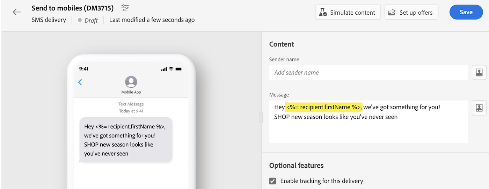

# Personalización de su contenido {#add-personalization}

Puede personalizar cualquier entrega mediante el editor de expresiones, al que se puede acceder en los campos con la variable **[!UICONTROL Abrir diálogo de personalización]** , como la línea de asunto, los vínculos de correo electrónico y los componentes de contenido de texto/botón. [Obtenga información sobre cómo acceder al editor de expresiones](gs-personalization.md/#access)

## Sintaxis de personalización {#syntax}

Las etiquetas de personalización siguen una sintaxis específica: `<%= table.field %>`. Por ejemplo, para insertar el apellido del destinatario de la tabla de destinatarios, utilice el `<%= recipient.lastName %>` sintaxis.

Durante el proceso de preparación de la entrega, Adobe Campaign interpreta automáticamente estas etiquetas y las sustituye por los valores de campo correspondientes para cada destinatario. Puede ver el reemplazo real simulando el contenido.

Al cargar contactos desde un archivo externo para una entrega de correo electrónico independiente, todos los campos del archivo de entrada están disponibles para la personalización. La sintaxis es la siguiente: `<%= dataSource.field %>`.

## Añadir etiquetas de personalización {#add}

Para añadir etiquetas de personalización a un envío, siga estos pasos:

1. Abra el editor de expresiones utilizando **[!UICONTROL Abrir diálogo de personalización]** que es accesible desde los campos de edición de tipo texto, como la línea de asunto o el cuerpo del SMS. [Obtenga información sobre cómo acceder al editor de expresiones](gs-personalization.md/#access)

   {width="800" align="center"}

1. Se abre el editor de expresiones. Los campos personalizados disponibles en la base de datos de Adobe Campaign están organizados en varios menús a la izquierda de la pantalla:

   {width="800" align="center"}

   | Menú | Descripción |
   |-----|------------|
   |  | El **[!UICONTROL Aplicación de suscriptores]** Este menú enumera los campos relacionados con los suscriptores de una aplicación, como el terminal utilizado o el sistema operativo. *Este menú solo está disponible para notificaciones push* |
   |  | El **[!UICONTROL Destinatario]** El menú enumera los campos definidos en la tabla de destinatarios como, por ejemplo, los nombres de los destinatarios, las edades o las direcciones. Cuándo [carga de contactos desde un archivo externo](../audience/file-audience.md) para una entrega de correo electrónico independiente, este menú enumera todos los campos disponibles en el archivo de entrada. |
   |  | El **[!UICONTROL Mensaje]** El menú enumera los campos relacionados con los &quot;logs&quot; de entrega, incluidos todos los mensajes enviados a los destinatarios o dispositivos en todos los canales, como la fecha del último evento con un destinatario determinado |
   |  | El **[!UICONTROL Envío]** El menú enumera campos relacionados con los parámetros necesarios para realizar entregas, como el canal o la etiqueta de entrega. |

   >[!NOTE]
   >
   >De forma predeterminada, cada menú enumera todos los campos de la tabla seleccionada (Destinatarios, / Mensaje / Envío). Si desea incluir campos de tablas vinculadas a la tabla seleccionada, habilite la opción **[!UICONTROL Mostrar atributos avanzados]** opción situada debajo de la lista.

1. Para añadir un campo de personalización, coloque el cursor en la ubicación deseada dentro del contenido y haga clic en `+` para insertarlo.

1. Una vez que el contenido esté listo, puede guardarlo y probar la renderización de la personalización simulando el contenido. El ejemplo siguiente muestra la personalización de un mensaje SMS con los nombres de los destinatarios.

   {width="800" align="center"}

   {width="800" align="center"}
