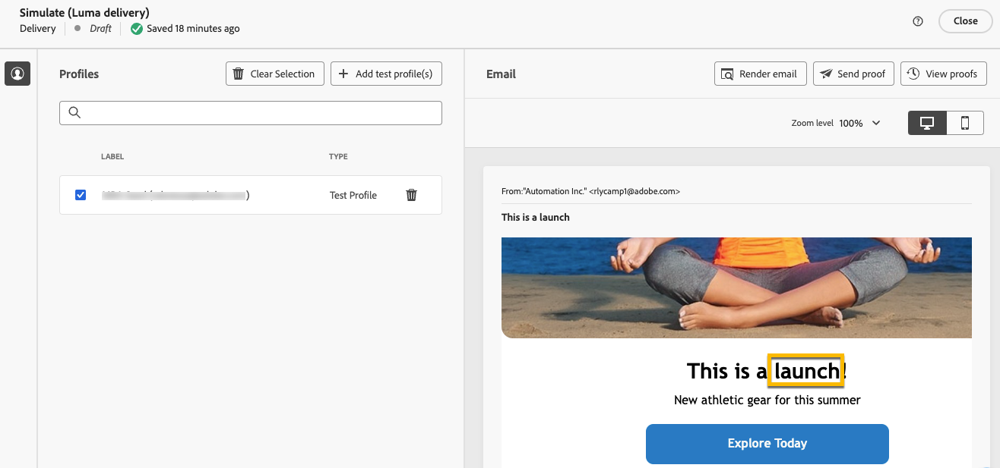

# Personalización de su contenido {#add-personalization}

>[!CONTEXTUALHELP]
>id="acw_personalization_editor_add_current_date"
>title="Añadir fecha actual"
>abstract="Este menú proporciona funciones relacionadas con el formato de fecha que puede aprovechar para personalizar el contenido."

El Personalization del contenido de la entrega es una función clave que le permite adaptar los mensajes a destinatarios individuales, lo que hace que la comunicación sea más relevante y atractiva.

En Adobe Campaign, al usar [datos de perfil](#data-personalization), como el nombre, la ubicación o las interacciones anteriores del perfil, y [variables específicas de la entrega](#variables-personalization), se personalizan dinámicamente elementos como texto, imágenes y ofertas en la comunicación.

La personalización de la entrega mejora la experiencia del usuario y las tasas de participación, lo que produce una mayor conversión y satisfacción del cliente.

## Uso de datos de perfil para la personalización {#data-personalization}

Puede personalizar cualquier envío con datos de perfil mediante el editor de expresiones, al que se puede acceder desde los campos con el icono **[!UICONTROL Abrir cuadro de diálogo de personalización]**, como la línea de asunto, los vínculos de correo electrónico y los componentes de contenido de texto/botón. [Obtenga información sobre cómo acceder al editor de expresiones](gs-personalization.md/#access).

### Sintaxis de Personalization {#syntax}

Las etiquetas de personalización seguir una sintaxis específica: `<%= table.field %>`. Por ejemplo, para insertar el apellido del destinatario desde la tabla de destinatario, utilice la `<%= recipient.lastName %>` sintaxis.

Durante el proceso de preparación del envío, Adobe Campaign interpreta estas etiquetas y las reemplaza con los valores de campo correspondientes para cada destinatario. Se vista el reemplazo real simulando su contenido.

Al cargar contactos desde un archivo externo para un envío correo electrónico independiente, todos los campos del archivo de entrada están disponibles para personalización. La sintaxis es la siguiente: `<%= dataSource.field %>`.

### Añadir etiquetas de personalización {#add}

Para añadir etiquetas de personalización a un envío, siga estos pasos:

1. Abra el editor de expresiones mediante el icono **[!UICONTROL Abrir cuadro de diálogo de personalización]**, al que se puede acceder desde campos de edición de tipo texto, como la línea de asunto o el cuerpo del SMS. [Obtenga información sobre cómo acceder al editor de expresiones](gs-personalization.md/#access).

   {zoomable="yes"}{width="800" align="center"}

1. Se abre el editor de expresiones. Los campos personalizados disponibles en la base de datos de Adobe Campaign se organizan en varios menús a la izquierda de la pantalla:

   {zoomable="yes"}{width="800" align="center"}

   | Menú | Descripción |
   |------|-------------|
   | {zoomable="yes"} | El **[!UICONTROL menú de aplicación]** de suscriptores enumera los campos relacionados con los suscriptores de una aplicación, como el terminal utilizado o el sistema operativo. *Este menú solo está disponible para notificaciones push.* |
   | {zoomable="yes"} | El menú **[!UICONTROL Destinatario]** enumera los campos definidos en la tabla de destinatarios, como los nombres de los destinatarios, las edades o las direcciones. Cuando [se cargan contactos desde un archivo externo](../audience/file-audience.md) para una entrega de correo electrónico independiente, este menú enumera todos los campos disponibles en el archivo de entrada. |
   | {zoomable="yes"} | El menú **[!UICONTROL Mensaje]** enumera los campos relacionados con los registros de envío, incluidos todos los mensajes enviados a los destinatarios o dispositivos en todos los canales, como la fecha del último evento con un destinatario determinado. |
   | {zoomable="yes"} | El **[!UICONTROL menú Envío]** muestra campos relacionados con los parámetros necesarios para realizar envíos, como la canal o etiqueta envío. |

   >[!NOTE]
   >
   >De forma predeterminada, cada menú enumera todos los campos dentro de la tabla seleccionada (Destinatarios, / Enviar mensaje / Entrega). Si desea incluir campos de tablas vinculadas a la tabla seleccionada, habilite la **[!UICONTROL opción Mostrar atributos]** avanzados situada debajo del lista.

1. Para agregar un campo personalización, coloque el cursor en la ubicación deseada dentro de su contenido y haga clic en el `+` botón para insertarlo.

1. Una vez que el contenido esté listo, guárdelo y prueba la representación de la personalización simulando su contenido. El siguiente ejemplo muestra los personalización de un mensaje SMS con los nombres de los destinatarios.

   {zoomable="yes"}{width="800" align="center"}

   {zoomable="yes"}{width="800" align="center"}

## Uso de variables para la personalización {#variables-personalization}

También se utilizan variables para personalizar el envío. Más información sobre [agregar variables a un envío](../advanced-settings/delivery-settings.md#variables-delivery).

Por ejemplo, la variable `deliveryType` se define como se muestra a continuación.

{zoomable="yes"}

Este variable se utiliza en la contenido de la envío mediante el **[!UICONTROL icono de Personalización]** de añadir y la expresión `<%= variables.deliveryType %>` de este ejemplo.

{zoomable="yes"}

Compruebe el uso de su variable con el **[!UICONTROL botón Simular contenido]** .

{zoomable="yes"}