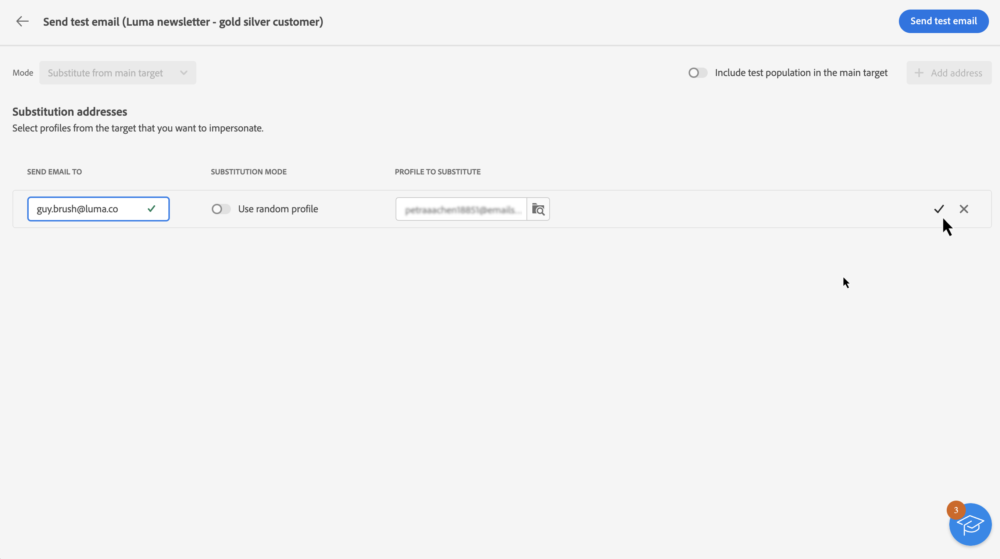

# Envío de correos electrónicos de prueba {#send-proofs}

El envío de correos electrónicos de prueba es un paso importante para validar la campaña de correo electrónico e identificar posibles problemas. Al enviar correos electrónicos de prueba, puede comprobar varios elementos, como vínculos, vínculos de exclusión, imágenes y páginas espejo, así como detectar cualquier error.

Los correos electrónicos de prueba se pueden enviar a dos tipos de destinatarios.

* **Perfiles de prueba**: envíe correos electrónicos de prueba a las direcciones semilla, que son destinatarios adicionales y ficticios de la base de datos. Pueden crearse en la consola de Adobe Campaign en la carpeta **[!UICONTROL Recursos]**/**[!UICONTROL administración de campañas]**/**[!UICONTROL direcciones semilla]**.

* **Sustitución del destinatario principal**: envíe correos electrónicos de prueba a una dirección de correo electrónico específica al suplantar un perfil existente. Esto le permite experimentar el correo electrónico como lo harían los destinatarios, lo que le ofrece una representación precisa del mensaje que recibe el perfil.

## Seleccione los destinatarios de la prueba {#recipients}

1. Acceda a la pantalla de simulación de contenido de correo electrónico y haga clic en el botón **[!UICONTROL Prueba]**.

   

1. Utilice la lista desplegable **[!UICONTROL Modo]** para elegir el tipo de destinatarios que reciben el correo electrónico de prueba:

   * **Perfiles de prueba**: enviar el correo electrónico de prueba a las direcciones semilla, que son destinatarios adicionales y ficticios de la base de datos.

   * **Sustitución desde el destino principal**: envíe el correo electrónico de prueba a una dirección de correo electrónico específica al suplantar un perfil existente. Esto le permite experimentar el correo electrónico como lo harían los destinatarios, lo que le ofrece una representación precisa del mensaje que recibirá el perfil.

   

   >[!NOTE]
   >
   >De forma predeterminada, el modo **[!UICONTROL Perfiles de prueba]** está seleccionado. Si ya ha seleccionado los perfiles para previsualizar el correo electrónico en la pantalla de simulación de contenido, dichos perfiles se preseleccionan como destinatarios de prueba. Puede borrar la selección o añadir destinatarios adicionales.

1. Para enviar correos electrónicos de prueba a perfiles de sustitución, seleccione el modo **[!UICONTROL Sustitución de destinatario]**, y a continuación, siga estos pasos:

   1. Haga clic en el botón **[!UICONTROL Añadir dirección]** y especifique la dirección de correo electrónico que recibirá el correo electrónico de prueba.

      Puede escribir cualquier dirección de correo electrónico. Esto le permite enviar correos electrónicos de prueba a cualquier usuario, incluso si no es usuario de la versión 8 de Adobe Campaign.

   1. Seleccione el perfil del destinatario que desea utilizar para enviar el correo electrónico de prueba. También puede permitir que Adobe Campaign seleccione un perfil aleatorio de destinatario.

   1. Confirme el destinatario y repita la operación para agregar tantas direcciones como sea necesario.

      

1. Una vez seleccionados los destinatarios de la prueba, puede enviar el correo electrónico de prueba. [Obtenga información sobre cómo enviar correos electrónicos de prueba](#send)

   >[!NOTE]
   >
   >Si desea enviar el mensaje de correo electrónico final a los destinatarios del correo electrónico de prueba, habilite la opción **[!UICONTROL Incluir población de prueba en el destinatario principal]**.

## Envío del correo electrónico de prueba {#send}

Para enviar el correo electrónico de prueba a los destinatarios seleccionados, haga clic en **[!UICONTROL Enviar correo electrónico de prueba]**, y a continuación, confirme el envío.

Envíe tantos correos electrónicos de prueba como sea necesario hasta que haya finalizado el contenido de su envío. Una vez hecho esto, puede enviar el correo electrónico al destinatario principal. [Aprenda a preparar y enviar su correo electrónico](../monitor/prepare-send.md)

## Acceso a los correos electrónicos de prueba enviados {#access-proofs}

Una vez enviados los correos electrónicos de prueba, puede acceder a los registros específicos desde el botón **[!UICONTROL Ver registros de los correos electrónicos de prueba]**.

Estos registros le permiten acceder a todos los correos electrónicos de prueba enviados para el envío seleccionado y visualizar las estadísticas específicas relacionadas con el envío. [Obtenga información sobre cómo monitorizar los registros de envío](../monitor/delivery-logs.md)

También puede acceder a los correos electrónicos de prueba enviados desde la lista de envíos, como cualquier envío.

