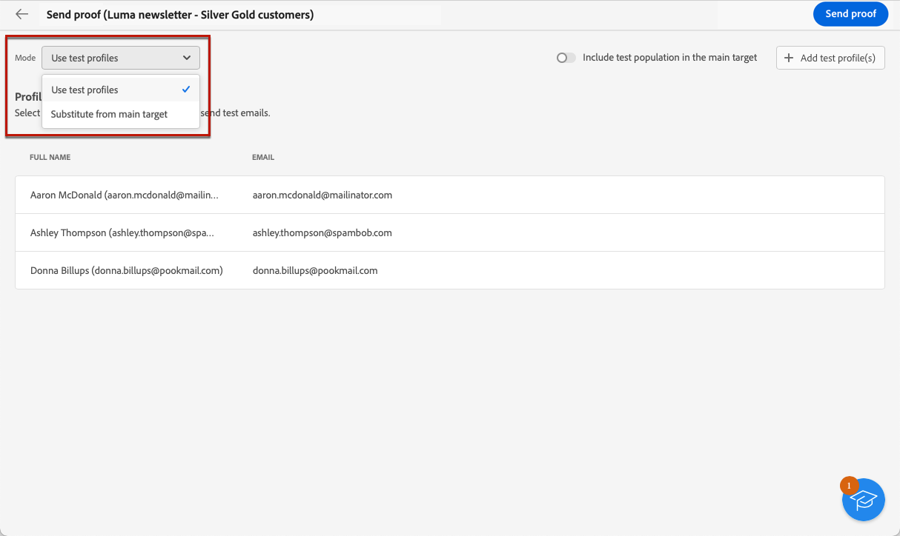

# Envío de correos electrónicos de prueba {#send-test-emails}

**[!UICONTROL Adobe Campaign]** permite probar un mensaje antes de enviarlo a la audiencia principal.

El envío de correos electrónicos de prueba es un paso importante para validar la campaña de correo electrónico e identificar posibles problemas.

Los destinatarios de una prueba pueden comprobar varios elementos, como vínculos, vínculos de exclusión, imágenes y páginas espejo, así como detectar cualquier error en la renderización, el contenido, la configuración de personalización y el correo electrónico.

## Seleccione los destinatarios de la prueba {#test-recipients}

Los correos electrónicos de prueba se pueden enviar a dos tipos de destinatarios.

* **Perfiles de prueba** : envíe correos electrónicos de prueba a las direcciones semilla, que son destinatarios adicionales y ficticios de la base de datos. Se pueden crear en la variable [!DNL Campaign] consola en la **[!UICONTROL Recursos]** > **[!UICONTROL Campaign Management]** > **[!UICONTROL Direcciones semilla]** carpeta. [Más información](https://experienceleague.adobe.com/docs/campaign-classic/using/sending-messages/using-seed-addresses/creating-seed-addresses.html){target="_blank"}

* **Sustituir del destinatario principal** : envíe correos electrónicos de prueba a una dirección de correo electrónico específica al suplantar un perfil existente. Esto le permite experimentar el correo electrónico como lo harían los destinatarios, lo que le ofrece una representación precisa del mensaje que recibirá el perfil.

Para seleccionar los destinatarios de la prueba de correo electrónico, siga los pasos a continuación.

1. Acceso al correo electrónico [Editar contenido](../content/edit-content.md) o a la [Diseñador de correo electrónico](../content/get-started-email-designer.md), luego haga clic en **[!UICONTROL Simular contenido]** botón.

1. Haga clic en **[!UICONTROL Prueba]** botón.

   

1. Utilice la lista desplegable **[!UICONTROL Modo]** para elegir el tipo de destinatarios que reciben el correo electrónico de prueba:

   * **Perfiles de prueba** para dirigirse a destinatarios ficticios

   * **Sustituir del destinatario principal** para enviar una prueba a una dirección de correo electrónico específica mientras se muestran los datos de un perfil existente.

   

   >[!NOTE]
   >
   >De forma predeterminada, la variable **[!UICONTROL Uso de perfiles de prueba]** El modo está seleccionado. Si ya ha seleccionado los perfiles para previsualizar el correo electrónico en la pantalla de simulación de contenido, dichos perfiles se preseleccionan como destinatarios de prueba. Puede borrar la selección o añadir destinatarios adicionales.

1. Para enviar correos electrónicos de prueba a perfiles de sustitución, elija el **[!UICONTROL Sustituir del destino]** modo y, a continuación, siga estos pasos:

   1. Haga clic en el botón **[!UICONTROL Añadir dirección]** y especifique la dirección de correo electrónico que recibirá el correo electrónico de prueba.

      Puede escribir cualquier dirección de correo electrónico. Esto le permite enviar correos electrónicos de prueba a cualquier usuario, aunque no sea usuario de [!DNL Adobe Campaign].

   1. Seleccione el perfil de destinatario para utilizarlo como sustituto. También puede permitir que [!DNL Adobe Campaign] seleccione un perfil aleatorio del destinatario. Los datos de perfil del perfil seleccionado se mostrarán en el correo electrónico de prueba.

   1. Confirme el destinatario y repita la operación para agregar tantas direcciones como sea necesario.

      

1. Una vez seleccionados los destinatarios de la prueba, puede [enviar el correo electrónico de prueba](#send-test).

   >[!NOTE]
   >
   >Para enviar también el mensaje de correo electrónico final a los destinatarios del correo electrónico de prueba, seleccione la **[!UICONTROL Incluir la población de prueba en el destinatario principal]** opción.

## Envío del correo electrónico de prueba {#send-test}

Para enviar el correo electrónico de prueba a los destinatarios seleccionados, siga los pasos a continuación.

1. Clic **[!UICONTROL Enviar correo electrónico de prueba]**.

1. Confirme el envío.

   

1. Envíe tantos correos electrónicos de prueba como sea necesario hasta que haya finalizado el contenido de su envío.

Una vez hecho esto, puede [preparar y enviar el correo electrónico](../monitor/prepare-send.md) al objetivo principal.

## Acceso a los correos electrónicos de prueba enviados {#access-proofs}

Una vez enviados los correos electrónicos de prueba, puede acceder a los registros específicos desde el botón **[!UICONTROL Ver registros de los correos electrónicos de prueba]**.

Estos registros le permiten acceder a todos los correos electrónicos de prueba enviados para el envío seleccionado y visualizar las estadísticas específicas relacionadas con el envío. [Obtenga información sobre cómo monitorizar los registros de envío](../monitor/delivery-logs.md)

También puede acceder a los correos electrónicos de prueba enviados desde el [lista de envíos](../msg/gs-messages.md), como cualquier envío.

