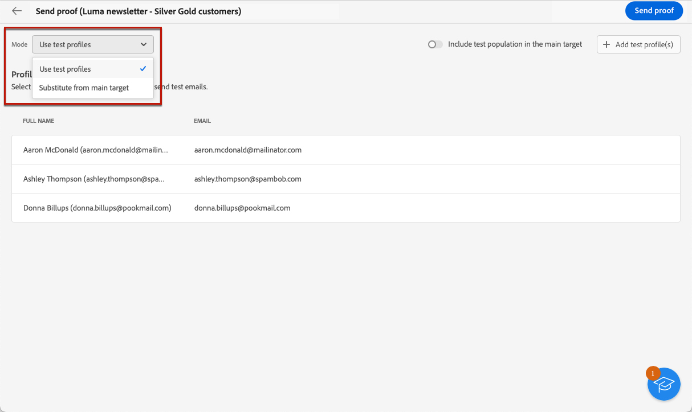
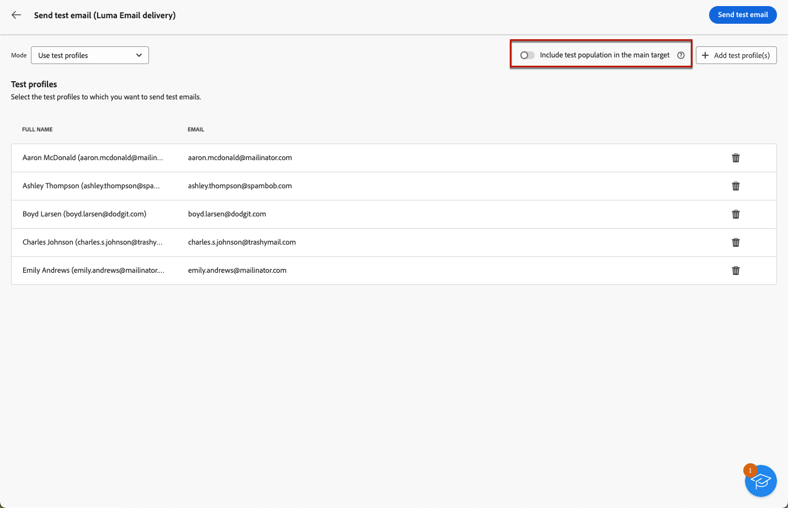
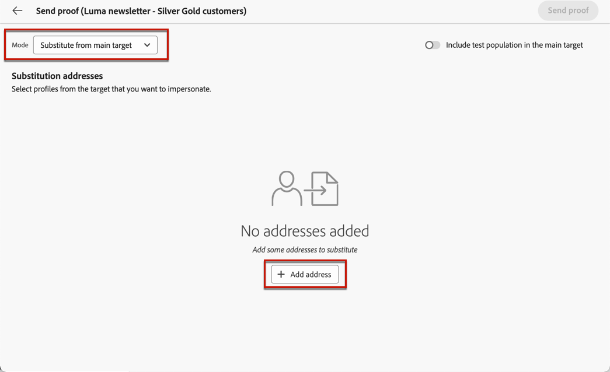

# Envío de pruebas {#send-test-deliveries}

>[!CONTEXTUALHELP]
>id="acw_email_preview_mode"
>title="Modo de vista previa"
>abstract="Obtenga una vista previa y pruebe el mensaje incluyendo la población de prueba en el público destinatario principal."

Una vez definido el contenido del mensaje, puede previsualizarlo y probarlo enviando pruebas a los perfiles de prueba. Si ha insertado contenido personalizado, puede comprobar cómo se muestra este en el mensaje con los datos del perfil de prueba.

Para detectar posibles errores en el contenido del mensaje o en la configuración de personalización, envíe pruebas a perfiles de prueba antes de enviarlas a la audiencia de destino. Se debe enviar una prueba cada vez que se realiza un cambio para validar el contenido más reciente. El envío de pruebas es un paso importante para validar la campaña e identificar posibles problemas. Los destinatarios de la prueba pueden comprobar varios elementos, como vínculos, vínculos de exclusión, imágenes o páginas espejo, así como detectar cualquier error en la renderización, el contenido, la configuración de personalización y la configuración de envío.

## Simulación del contenido con perfiles de prueba {#simulate-content-test-deliveries}

>[!CONTEXTUALHELP]
>id="acw_email_preview_option_test_target"
>title="Población de prueba"
>abstract="Seleccione un modo de población de prueba."

Antes de enviar un prueba, asegúrese de definir un audiencia de destino para su envío. [Más información](../audience/add-audience.md)

Para probar inicio el contenido del mensaje:

1. Edite el contenido del envío.
1. Haga clic en el botón **[!UICONTROL Simular contenido]**.
1. Haga clic en el **[!UICONTROL botón Enviar prueba]** para enviar pruebas.

   {zoomable="yes"}

1. Seleccione los destinatarios prueba.

   Según el mensaje canal, las pruebas se pueden enviar a los siguientes tipos de destinatarios:

   * Para SMS y correos electrónicos, puedes usar [perfiles de prueba](#test-profiles), que son destinatarios adicionales específicos en la base de datos. También puede usar el modo [substitution from main target](#substitution-profiles), que envía la prueba a una dirección de prueba de correo electrónico o a un número de teléfono, y usa datos de personalización de un perfil existente. Esto le permite experimentar el mensaje como lo harían los destinatarios, lo que le ofrece una representación precisa del contenido que recibirá el perfil.

   * Para los mensajes push, puede usar [suscriptores](#subscribers), que son suscriptores ficticios agregados a la base de datos. Se crean en la consola [!DNL Campaign]. Obtenga más información en la [documentación de Campaign v8 (consola de cliente)](https://experienceleague.adobe.com/docs/campaign/campaign-v8/audience/add-profiles/test-profiles.html){target="_blank"}

   A continuación, encontrará la configuración detallada para cada modo.

## Uso de perfiles de prueba {#test-profiles}

>[!CONTEXTUALHELP]
>id="acw_deliveries_simulate_test_mode"
>title="Público destinatario de la prueba"
>abstract="Puede cargar un segundo archivo como &quot;público destinatario de la prueba&quot;, si desea probar el envío antes de enviarlo al público destinatario principal."

>[!CONTEXTUALHELP]
>id="acw_deliveries_simulate_test_upload"
>title="Cargar perfiles"
>abstract="Puede cargar un segundo archivo con perfiles adicionales si desea probar el envío con un conjunto diferente del conjunto utilizado para el público destinatario principal."

>[!CONTEXTUALHELP]
>id="acw_deliveries_simulate_test_sample"
>title="Archivo de plantilla"
>abstract="El formato del archivo debe ser el mismo que el del archivo original. Formatos de archivo compatibles: TXT, CSV. Tamaño máximo de archivo: 15 MB. Usar la primera línea como encabezado de columna."

>[!CONTEXTUALHELP]
>id="acw_sms_preview_option_app_target"
>title="Incluir perfiles de prueba en el público principal"
>abstract="Habilite esta opción para enviar también el mensaje final a los destinatarios de la prueba."

Los perfiles de prueba son destinatarios adicionales en la base de datos. Se crean desde el menú **[!UICONTROL Administración de clientes]** > **[!UICONTROL Perfiles]**. [Más información](../audience/test-profiles.md#create-test-profiles)

A continuación se detallan los pasos para enviar pruebas a prueba perfiles.

1. En el contenido del envío, haga clic en el **[!UICONTROL botón Simular contenido]** y en el **[!UICONTROL botón Enviar prueba]** .

1. En la **[!UICONTROL lista desplegable Modo]** , elija **[!UICONTROL Probar perfiles]** para destino destinatarios ficticios que recibirán el envío prueba o SMS.

   {zoomable="yes"}

1. Si ya ha seleccionado perfiles para [obtener una vista previa del mensaje](preview-content.md) en la pantalla de simulación de contenido, esos perfiles están preseleccionados como destinatarios de pruebas. Puede borrar su selección o agregar destinatarios adicionales usando el botón **[!UICONTROL Agregar perfiles de prueba]**.

1. Al examinar el perfil de prueba o las listas de perfiles, puede utilizar filtros para restringir la búsqueda. Por ejemplo, puede definir una regla para buscar todos los perfiles de prueba con el estado **[!UICONTROL Candidato]**. Aprenda a agregar reglas utilizando el [modelador de consultas](../query/query-modeler-overview.md).

   {zoomable="yes"}

1. Para enviar también el mensaje final a los destinatarios de la prueba, seleccione la opción **[!UICONTROL Incluir población de prueba en el destinatario principal]**.

   {zoomable="yes"}

1. Una vez seleccionados los perfiles prueba, puede [enviar el prueba](#send-test).

## Sustitución perfil datos {#substitution-profiles}

Utilice perfil sustitución para enviar pruebas a una dirección correo electrónico o número de teléfono específicos, mientras muestra datos de un perfil existente de la [!DNL Adobe Campaign] base de datos. Este modo solo se puede seleccionar si se ha definido el audiencia del envío.

Para sustituir perfil datos de la destino principal, seguir los pasos siguientes:

1. En el contenido de su envío, haga clic en el botón **[!UICONTROL Simular contenido]** y luego en el botón **[!UICONTROL Enviar prueba]**.

1. En la **[!UICONTROL lista desplegable Modo, elija**&#x200B;[!UICONTROL &#x200B; Sustituir del destino &#x200B;]&#x200B;**principal para enviar un prueba a una dirección correo electrónico o número de]** teléfono específicos mientras muestra datos de un perfil existente.

   >[!CAUTION]
   >
   >Si no ha seleccionado ninguna [audiencia](../audience/about-recipients.md) para su envío, la **[!UICONTROL opción Sustituir desde la destino]** principal aparecerá atenuada y no podrá seleccionar perfiles de sustitución.

1. Haga clic en el botón de **[!UICONTROL dirección]** añadir y especifique la dirección correo electrónico o el número de teléfono que recibirá el prueba.

   {zoomable="yes"}

   >[!NOTE]
   >
   >Puede introducir cualquier dirección correo electrónico o número de teléfono. Esto le permite enviar pruebas a cualquier destinatario, incluso si no son usuarios de [!DNL Adobe Campaign].

1. Seleccione el perfil del destinatario definido para la entrega que se utilizará como sustituto. También puede permitir que [!DNL Adobe Campaign] seleccione un perfil aleatorio en el destino. Los datos de perfil del perfil seleccionado se muestran en la prueba.

1. Confirme el destinatario y repita la operación para añadir tantas direcciones de correo electrónico o números de teléfono como sea necesario.

   {zoomable="yes"}

1. Para enviar también el mensaje final a los destinatarios de la prueba, seleccione la opción **[!UICONTROL Incluir población de prueba en el destinatario principal]**.

1. Una vez seleccionados los perfiles de sustitución, puede [enviar la prueba](#send-test).

## Envío de pruebas a los suscriptores de aplicaciones {#subscribers}

Al diseñar con notificaciones push, las pruebas solo se pueden enviar a los suscriptores de la aplicación. Para seleccionarlos, siga los pasos a continuación.

1. En el contenido de su envío de inserción, haga clic en el botón **[!UICONTROL Simular contenido]** y luego en el botón **[!UICONTROL Enviar prueba]**.

   {zoomable="yes"}

1. Si ya ha seleccionado suscriptores para [previsualización la envío](preview-content.md) en la pantalla simulación de contenido, esos perfiles se preseleccionan como suscriptores prueba.

   Puede borrar su selección y/o agregar suscriptores adicionales utilizando el botón dedicado.

   {zoomable="yes"}

1. Para enviar también el notificación final a los suscriptores prueba, seleccione la **[!UICONTROL opción Incluir población prueba en la destino]** principal.

1. Una vez seleccionados los suscriptores, puede [enviar el prueba](#send-test).

## Envío de la prueba {#send-test}

Para enviar el prueba a los destinatarios seleccionados, seguir los pasos que se describen a continuación.

1. Haga clic en el **[!UICONTROL botón Enviar prueba]** .

1. Confirme el envío.

   {zoomable="yes"}

1. Envíe tantas pruebas como sean necesarias hasta finalizar el contenido de su envío.

Una vez finalizado, puede preparar y realizar la entrega al destinatario principal. Descubra cómo en las secciones dedicadas a continuación:

* [Envíe su correo electrónico](../monitor/prepare-send.md)
* [Envío de la notificación push](../push/send-push.md#send-push)
* [Realización de la entrega de SMS](../sms/send-sms.md#send-sms)

## Acceso a pruebas enviadas {#access-test-deliveries}

Una vez enviadas las pruebas, puede acceder a sus registros desde la pantalla **[!UICONTROL Simular contenido]**.

Estos registros le permiten acceder a todas las pruebas enviadas para la entrega seleccionado y visualizar estadísticas específicas relacionadas con su entrega. [Obtenga información sobre cómo monitorizar los registros de envío](../monitor/delivery-logs.md)

{zoomable="yes"}

También puede acceder a las pruebas enviadas desde la [lista de envíos](../msg/gs-messages.md), como cualquier entrega.

{zoomable="yes"}