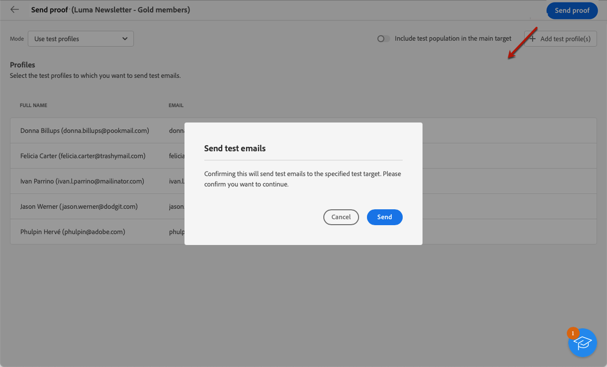

# Envío de entregas de prueba {#send-test-deliveries}

>[!CONTEXTUALHELP]
>id="acw_email_preview_mode"
>title="Modo de vista previa"
>abstract="Obtenga una vista previa y pruebe el mensaje incluyendo la población de prueba en el público destinatario principal."

Una vez definido el contenido del mensaje, puede previsualizarlo y probarlo enviando envíos de prueba a perfiles de prueba. Si ha insertado contenido personalizado, puede comprobar cómo se muestra este en el mensaje con los datos del perfil de prueba.

Para detectar posibles errores en el contenido del mensaje o en la configuración de personalización, envíe mensajes de prueba a perfiles de prueba antes de enviarlos a la audiencia de destino. Se debe enviar un mensaje de prueba cada vez que se realiza un cambio para validar el contenido más reciente. El envío de envíos de prueba (anteriormente conocidos como &quot;pruebas&quot;) es un paso importante para validar la campaña e identificar posibles problemas. Los destinatarios de un mensaje de prueba pueden comprobar varios elementos, como vínculos, vínculos de exclusión, imágenes o páginas espejo, así como detectar cualquier error en la renderización, el contenido, la configuración de personalización y la configuración de envío.

## Simulación del contenido con destinatarios de prueba {#simulate-content-test-deliveries}

>[!CONTEXTUALHELP]
>id="acw_email_preview_option_test_target"
>title="Población de prueba"
>abstract="Seleccione un modo de población de prueba."

Antes de enviar una prueba, asegúrese de definir una audiencia objetivo para la entrega. [Más información](../audience/about-recipients.md)

Para comenzar a probar el contenido del mensaje:

1. Edite el contenido del envío.
1. Haga clic en **[!UICONTROL Simular contenido]** botón.
1. Haga clic en **[!UICONTROL Prueba]** para enviar mensajes de prueba.

   

1. Seleccione los destinatarios de la prueba.

   Según el canal de mensajes, los mensajes de prueba se pueden enviar a los siguientes tipos de destinatarios:

   * Para SMS y correos electrónicos, puede utilizar [perfiles de prueba](#test-profiles), que son destinatarios adicionales específicos de la base de datos. Estos destinatarios se crean en [!DNL Campaign] consola de cliente. Obtenga más información en [Documentación de Campaign v8 (consola de cliente)](https://experienceleague.adobe.com/docs/campaign/campaign-v8/audience/add-profiles/test-profiles.html){target="_blank"}

   * Para SMS y correos electrónicos, también puede utilizar el [sustitución desde destinatario principal](#substitution-profiles) modo, que envía los mensajes de prueba al correo electrónico, la dirección de prueba o el número de teléfono y utiliza datos de personalización de un perfil existente. Esto le permite experimentar el mensaje como lo harían los destinatarios, lo que le ofrece una representación precisa del contenido que recibirá el perfil.

   * Para los mensajes push, puede utilizar [suscriptores](#subscribers), que son suscriptores ficticios añadidos a la base de datos. Se crean en el [!DNL Campaign] consola. Obtenga más información en [Documentación de Campaign v8 (consola de cliente)](https://experienceleague.adobe.com/docs/campaign/campaign-v8/audience/add-profiles/test-profiles.html){target="_blank"}

   A continuación, encontrará la configuración detallada para cada modo.

## Uso de perfiles de prueba {#test-profiles}

>[!CONTEXTUALHELP]
>id="acw_deliveries_simulate_test_mode"
>title="Público destinatario de la prueba"
>abstract="Puede cargar un segundo archivo como &quot;público destinatario de la prueba&quot;, si desea probar el envío antes de enviarlo al público destinatario principal."

>[!CONTEXTUALHELP]
>id="acw_deliveries_simulate_test_upload"
>title="Cargar perfiles"
>abstract="Puede cargar un segundo archivo con perfiles adicionales si desea probar el envío con un conjunto diferente del conjunto utilizado para el público destinatario principal."

>[!CONTEXTUALHELP]
>id="acw_deliveries_simulate_test_sample"
>title="Archivo de plantilla"
>abstract="El formato del archivo debe ser el mismo que el del archivo original. Formatos de archivo compatibles: txt, csv. Tamaño máximo de archivo: 15 MB. Usar la primera línea como encabezado de columna."

>[!CONTEXTUALHELP]
>id="acw_sms_preview_option_app_target"
>title="Incluir perfiles de prueba en la audiencia principal"
>abstract="Active esta opción para enviar también el mensaje final a los destinatarios de la entrega de prueba."

Los perfiles de prueba son direcciones semilla que son destinatarios adicionales en la base de datos. Se pueden crear en la variable [!DNL Adobe Campaign] consola de cliente. A continuación se detallan los pasos para enviar mensajes de prueba a las direcciones semilla.

1. En el contenido de su envío, haga clic en **[!UICONTROL Simular contenido]** y el botón **[!UICONTROL Prueba]** botón.

1. Desde el **[!UICONTROL Modo]** lista desplegable, elija **[!UICONTROL Perfiles de prueba]** para dirigirse a destinatarios ficticios que recibirán el correo electrónico o el SMS de prueba.

   

1. Si ya ha seleccionado perfiles para [previsualización del mensaje](preview-content.md) en la pantalla de simulación de contenido, esos perfiles se preseleccionan como destinatarios de prueba. Puede borrar la selección o agregar destinatarios adicionales mediante el **[!UICONTROL Añadir perfil(es) de prueba]** botón.

   >[!NOTE]
   >
   >Los perfiles de prueba se crean en [!DNL Campaign] consola de cliente en **[!UICONTROL Recursos]** > **[!UICONTROL Campaign Management]** > **[!UICONTROL Direcciones semilla]** carpeta. Obtenga información sobre cómo crear y administrar direcciones semilla en [Documentación de Campaign v8 (consola de cliente)](https://experienceleague.adobe.com/docs/campaign/campaign-v8/audience/add-profiles/test-profiles.html){target="_blank"}.

1. Para enviar también el mensaje final a los destinatarios de la entrega de prueba, seleccione la **[!UICONTROL Incluir la población de prueba en el destinatario principal]** opción.

1. Una vez seleccionados los perfiles de prueba, puede [realizar la entrega de prueba](#send-test).

## Sustituir datos de perfil {#substitution-profiles}

Utilice la sustitución de perfiles para enviar mensajes de prueba a una dirección de correo electrónico o un número de teléfono específicos, mientras se muestran datos de un perfil existente de [!DNL Adobe Campaign] base de datos. Este modo solo se puede seleccionar si se ha definido la audiencia del envío.

Para sustituir los datos de perfil del destinatario principal, siga los pasos a continuación:

1. En el contenido de su envío, haga clic en **[!UICONTROL Simular contenido]** y el botón **[!UICONTROL Prueba]** botón.

1. Desde el **[!UICONTROL Modo]** lista desplegable, elija **[!UICONTROL Sustituir del destinatario principal]** para enviar una prueba a una dirección de correo electrónico o número de teléfono específicos mientras se muestran los datos de un perfil existente.

   >[!CAUTION]
   >
   >Si no ha seleccionado ningún [audiencia](../audience/about-recipients.md) para su envío, la variable **[!UICONTROL Sustituir del destinatario principal]** Esta opción aparecerá atenuada y no podrá seleccionar perfiles de sustitución.

1. Haga clic en **[!UICONTROL Añadir dirección]** y especifique la dirección de correo electrónico o el número de teléfono que recibirá el envío de prueba.

   

   >[!NOTE]
   >
   >Puede introducir cualquier dirección de correo electrónico o número de teléfono. Esto permite enviar envíos de prueba a cualquier destinatario, incluso si no son usuarios de [!DNL Adobe Campaign].

1. Seleccione el perfil del destinatario definido para la entrega que se utilizará como sustituto. También puede permitir que [!DNL Adobe Campaign] seleccione un perfil aleatorio del destinatario. Los datos de perfil del perfil seleccionado se muestran en la entrega de prueba.

1. Confirme el destinatario y repita la operación para añadir tantas direcciones de correo electrónico o números de teléfono como sea necesario.

   

1. Para enviar también el mensaje final a los destinatarios de la entrega de prueba, seleccione la **[!UICONTROL Incluir la población de prueba en el destinatario principal]** opción.

1. Una vez seleccionados los perfiles de sustitución, puede [realizar la entrega de prueba](#send-test).

## Envío de pruebas a suscriptores de la aplicación {#subscribers}

Al diseñar con notificaciones push, las entregas de prueba solo se pueden enviar a los suscriptores de la aplicación. Para seleccionarlos, siga los pasos a continuación.

1. En el contenido de la entrega push, haga clic en **[!UICONTROL Simular contenido]** y el botón **[!UICONTROL Prueba]** botón.

   

1. Si ya ha seleccionado suscriptores a [previsualización de la entrega](preview-content.md) en la pantalla de simulación de contenido, esos perfiles se preseleccionan como suscriptores de prueba.

   Puede borrar su selección y/o añadir suscriptores adicionales usando el botón dedicado.

   

1. Para enviar también la notificación push final a los suscriptores de prueba, seleccione la **[!UICONTROL Incluir la población de prueba en el destinatario principal]** opción.

1. Una vez seleccionados los suscriptores, puede [realizar la entrega de prueba](#send-test).

## Realización del envío de prueba {#send-test}

Para realizar la entrega de prueba a los destinatarios seleccionados, siga los pasos a continuación.

1. Haga clic en **[!UICONTROL Enviar prueba]** botón.

1. Confirme el envío.

   

1. Envíe tantas pruebas como sea necesario hasta que haya finalizado el contenido de su envío.

Una vez finalizado, puede preparar y realizar la entrega al destinatario principal. Descubra cómo en las secciones dedicadas a continuación:

* [Envíe su correo electrónico](../monitor/prepare-send.md)
* [Envío de la notificación push](../push/send-push.md#send-push)
* [Realización de la entrega de SMS](../sms/send-sms.md#send-sms)

## Acceso a envíos de prueba enviados {#access-proofs}

Una vez enviados los envíos de prueba, puede acceder a los registros dedicados desde el **[!UICONTROL Ver registro de prueba]** botón.

Estos registros le permiten acceder a todas las pruebas enviadas para la entrega seleccionado y visualizar estadísticas específicas relacionadas con su entrega. [Obtenga información sobre cómo monitorizar los registros de envío](../monitor/delivery-logs.md)

También puede acceder a las pruebas enviadas desde el [lista de envíos](../msg/gs-messages.md), como cualquier envío.

