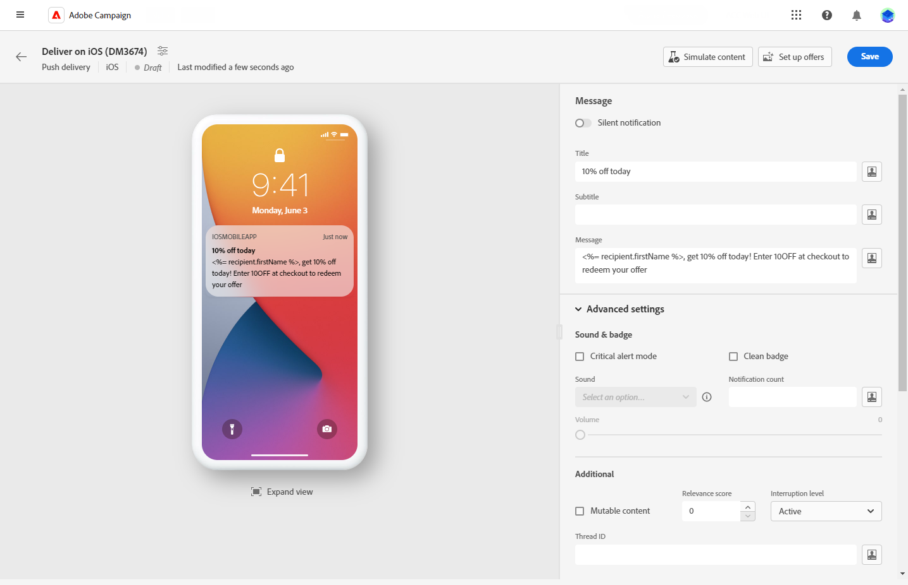

# Diseño de una entrega push {#content-push}

>[!CONTEXTUALHELP]
>id="acw_deliveries_push_android_content"
>title="Contenido push para Android"
>abstract="Defina el contenido push de Android."

>[!CONTEXTUALHELP]
>id="acw_deliveries_push_ios_content"
>title="Contenido push para iOS"
>abstract="Defina el contenido push de iOS."

## Mensaje {#push-message}

>[!BEGINTABS]

>[!TAB Android]

Con Firebase Cloud Messaging, puede elegir entre dos tipos de mensajes:

* El **[!UICONTROL Mensaje de datos]e** es gestionado por la aplicación del cliente. Estos mensajes se envían directamente a la aplicación móvil, que genera y muestra una notificación de Android en el dispositivo. Los mensajes de datos solo contienen las variables de aplicación personalizadas.

  Para definir el contenido, personalizar los datos y añadir contenido dinámico, haga clic en **[!UICONTROL Mensaje]** y utilice el Editor de expresiones. Puede acceder a este editor para personalizar los mensajes en el **[!UICONTROL Variables de aplicación]** , las variables de Aplicación se añaden automáticamente. Estas variables permiten definir el comportamiento de las notificaciones. Por ejemplo, puede configurar una pantalla de aplicación específica para que se muestre cuando el usuario active la notificación.

  

* El **[!UICONTROL Mensaje de notificación]**, gestionado automáticamente por el SDK de FCM. FCM muestra automáticamente el mensaje en los dispositivos de los usuarios en nombre de la aplicación del cliente. Los mensajes de notificación contienen un conjunto predefinido de parámetros y opciones, pero pueden personalizarse aún más con las variables de aplicación personalizadas.

  Para redactar el mensaje, haga clic en el **[!UICONTROL Título]** y **[!UICONTROL Cuerpo]** campos. Utilice el Editor de expresiones para definir contenido, personalizar datos y agregar contenido dinámico.

  Para personalizar aún más la notificación push, puede elegir una imagen para añadirla a su notificación push, el icono de la notificación para mostrar en los dispositivos de sus perfiles y su color.

  

>[!TAB iOS]

Para redactar el mensaje, haga clic en el **[!UICONTROL Título]** y **[!UICONTROL Cuerpo]** campos. Utilice el Editor de expresiones para definir contenido, personalizar datos y agregar contenido dinámico.

Puede añadir un **[!UICONTROL Subtítulo]**, valor del parámetro subtitle de la carga útil de notificación de iOS. Consulte esta sección.

El modo Push silenciosa permite enviar una notificación &quot;silenciosa&quot; a una aplicación móvil. No se avisa al usuario de la llegada de la notificación. Esta se transfiere directamente a la aplicación.

>[!ENDTABS]

## Configuración avanzada {#push-advanced}

>[!BEGINTABS]

>[!TAB Android]

| Parámetro | Descripción |
|---------|---------|
| **[!UICONTROL Sonido]** | configure el sonido para que se reproduzca cuando el dispositivo reciba la notificación. |
| **[!UICONTROL Recuento de notificaciones]** | Configure el número de información nueva no leída que se mostrará directamente en el icono de la aplicación. Esto permite al usuario ver rápidamente el número de notificaciones pendientes. |
| **[!UICONTROL ID de canal]** | Establezca el ID de canal de la notificación. La aplicación debe crear un canal con este ID de canal antes de recibir cualquier notificación. |
| **[!UICONTROL Acción de clic]** | Defina la acción asociada con un clic del usuario en la notificación. Determina el comportamiento cuando el usuario interactúa con la notificación, como abrir una pantalla específica o realizar una acción específica en la aplicación. |
| **[!UICONTROL Etiqueta]** | Establezca un identificador utilizado para reemplazar las notificaciones existentes en el cajón de notificaciones. Esto ayuda a evitar la acumulación de varias notificaciones y garantiza que solo se muestre la notificación relevante más reciente. |
| **[!UICONTROL Prioridad]** | Defina el nivel de prioridad de la notificación, que puede ser predeterminado, mínimo, bajo o alto. El nivel de prioridad determina la importancia y la urgencia de la notificación, lo que influye en cómo se muestra y si puede omitir determinada configuración del sistema. Para más información, consulte la [documentación de FCM](https://firebase.google.com/docs/reference/fcm/rest/v1/projects.messages#notificationpriority). |
| **[!UICONTROL Visibilidad]** | Defina el nivel de visibilidad de la notificación, que puede ser pública, privada o secreta. El nivel de visibilidad determina la cantidad de contenido de la notificación que se muestra en la pantalla de bloqueo y en otras áreas confidenciales. Para obtener más información, consulte la [Documentación de FCM](https://firebase.google.com/docs/reference/fcm/rest/v1/projects.messages#visibility). |
| **[!UICONTROL Adhesivo]** | Cuando se activa, la notificación permanece visible incluso después de que el usuario haga clic en ella.  Si se desactiva, la notificación se descarta automáticamente cuando el usuario interactúa con ella. El comportamiento adhesivo permite que las notificaciones importantes persistan en la pantalla durante períodos más largos. |
| **[!UICONTROL Variables de aplicación]** | Permite definir el comportamiento de las notificaciones. Estas variables son totalmente personalizables y se incluyen como parte de la carga de mensajes que se envía al dispositivo móvil. |

>[!TAB iOS]

| Parámetro | Descripción |
|---------|---------|
| **[!UICONTROL Modo de alerta crítica]** | Active esta opción para agregar sonido a la notificación, incluso cuando el teléfono del usuario esté en modo de enfoque o si el iPhone está silenciado. Esto garantiza que el usuario observe las alertas importantes. |
| **[!UICONTROL Insignia limpia]** | Active esta opción para actualizar el valor del distintivo mostrado en el icono de la aplicación. Garantiza que el distintivo refleje con precisión la cantidad de información nueva no leída. |
| **[!UICONTROL Recuento de notificaciones]** | Establezca un número que se mostrará directamente en el icono de la aplicación, indicando la cantidad de información nueva no leída. Esto proporciona una referencia visual rápida para el usuario. |
| **[!UICONTROL Volumen]** | Volumen de su sonido de 0 a 100. |
| **[!UICONTROL Contenido modificable]** | Active esta opción para permitir que la aplicación móvil descargue contenido multimedia asociado a la notificación. Para obtener más información, consulte la [documentación para desarrolladores de Apple](https://developer.apple.com/library/content/documentation/NetworkingInternet/Conceptual/RemoteNotificationsPG/ModifyingNotifications.html). |
| **[!UICONTROL Puntuación de relevancia]** | Establezca una puntuación de relevancia de 0 a 100 para priorizar el orden de las notificaciones en el resumen de notificaciones. Las puntuaciones más altas indican notificaciones más importantes. |
| **[!UICONTROL Nivel de interrupción]** | <ul> <li>**[!UICONTROL Activo]**: de forma predeterminada, el sistema presenta la notificación inmediatamente, ilumina la pantalla y puede reproducir un sonido. Las notificaciones no rompen los modos de Enfoque.</li><li>**[!UICONTROL Pasivo]**: el sistema añade la notificación a la lista de notificaciones sin iluminar la pantalla ni reproducir un sonido. Las notificaciones no rompen los modos de Enfoque.</li><li>**[!UICONTROL Con distinción de tiempo]**: el sistema presenta la notificación inmediatamente, enciende la pantalla, puede reproducir un sonido y atravesar los modos de Enfoque. Este nivel no requiere un permiso especial de Apple.</li> <li>**[!UICONTROL Crítico]**: el sistema presenta la notificación inmediatamente, enciende la pantalla y evita el interruptor silencioso o los modos de enfoque. Tenga en cuenta que este nivel requiere un permiso especial de Apple.</ul> |
| **[!UICONTROL Thread-id]** | Identificador utilizado para agrupar las notificaciones relacionadas. Las notificaciones con el mismo ID de hilo se organizan como una sola conversación o hilo en la lista de notificaciones. |
| **[!UICONTROL Categoría]** | Especifique el nombre del ID de categoría asociado a la notificación. Esto permite mostrar los botones de acción, lo que permite al usuario realizar varias tareas directamente desde la notificación sin abrir la aplicación. |
| **[!UICONTROL ID de contenido del público destinatario]** | Identificador utilizado para destinar la ventana de aplicación que se reenvía cuando se abre la notificación. |
| **[!UICONTROL Iniciar imagen]** | Especifique el nombre del archivo de imagen de lanzamiento que se mostrará cuando el usuario decida iniciar la aplicación desde la notificación. Se mostrará la imagen seleccionada en lugar de la pantalla de inicio normal de la aplicación. |
| **[!UICONTROL Variables de aplicación]** | Permite definir el comportamiento de las notificaciones. Estas variables son totalmente personalizables y se incluyen como parte de la carga de mensajes que se envía al dispositivo móvil. |

>[!ENDTABS]

<!--Sounds must be included in the application and defined when the service is created. Refer to this section.-->

