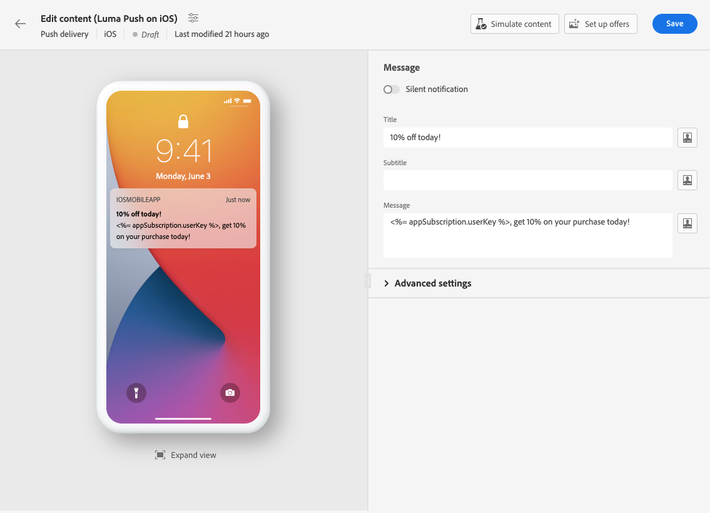

# Creación de un envío de notificación push {#create-push}

>[!CONTEXTUALHELP]
>id="acw_deliveries_push_audience"
>title="Definición de la audiencia Push"
>abstract="Seleccione la mejor audiencia para su mensaje Push."

>[!CONTEXTUALHELP]
>id="acw_push_notification_template"
>title="Plantilla de notificaciones push"
>abstract="Seleccione una plantilla de notificación push para iniciar el envío push."

>[!CONTEXTUALHELP]
>id="acw_deliveries_push_properties"
>title="Propiedades del envío push"
>abstract="Administrar las propiedades del envío Push."

1. Desde la página de inicio **[!UICONTROL Envíos]**, haga clic en **[!UICONTROL Creación de envíos]**.

1. En el **[!UICONTROL Canal]** , elija Notificación push como canal y seleccione una plantilla según el sistema operativo elegido: Android o iOS. [Más información sobre las plantillas](../msg/delivery-template.md)

1. Haga clic en el botón **[!UICONTROL Crear envío]** para confirmar.

   

1. Introduzca una **[!UICONTROL Etiqueta]** para el envío y acceda al menú desplegable **[!UICONTROL Opciones adicionales]**.

   +++Configure la siguiente configuración según sus necesidades.
   * **[!UICONTROL Nombre interno]**: asignar un identificador único al envío.
   * **[!UICONTROL Carpeta]**: almacene el envío en una carpeta específica.
   * **[!UICONTROL Código de envío]**: organice los envíos con su propia convención de nomenclatura.
   * **[!UICONTROL Descripción]**: especifique una descripción para el envío.
   * **[!UICONTROL Naturaleza]**: especifique la naturaleza del correo electrónico con fines de clasificación.
+++

1. Desde el **[!UICONTROL Audiencia]** , seleccione la aplicación que desee utilizar para este envío.

1. Haga clic en el botón **[!UICONTROL Seleccionar audiencia]** para dirigirse a un público destinatario existente o crear el suyo propio. [Más información](../audience/about-audiences.md)

   Tenga en cuenta que, de forma predeterminada, la notificación push se envía a todos los suscriptores de la aplicación.

   

1. Encienda la opción del grupo **[!UICONTROL Habilitar control]** para establecer un grupo de control que mida el impacto de su envío, lo que le permite comparar el comportamiento de la población que recibió el mensaje con el comportamiento de los contactos que no lo hicieron. [Más información](../audience/control-group.md)

1. Clic **[!UICONTROL Editar contenido]** para empezar a diseñar el contenido de la notificación push. [Más información](content-push.md)

   

   Desde esta pantalla, también puede [simular el contenido](../preview-test/preview-test.md) y [configuración de ofertas](../content/offers.md).

1. Para programar su envío a una fecha y hora específicas, active la opción **[!UICONTROL Habilitar programación]**. Después de iniciar el envío, el mensaje se envía automáticamente en la fecha y hora exactas definidas para el destinatario.

   

1. Clic **[!UICONTROL Configuración de la entrega]** para acceder a las opciones avanzadas relacionadas con la plantilla de envíos. [Más información](../advanced-settings/delivery-settings.md)

   
